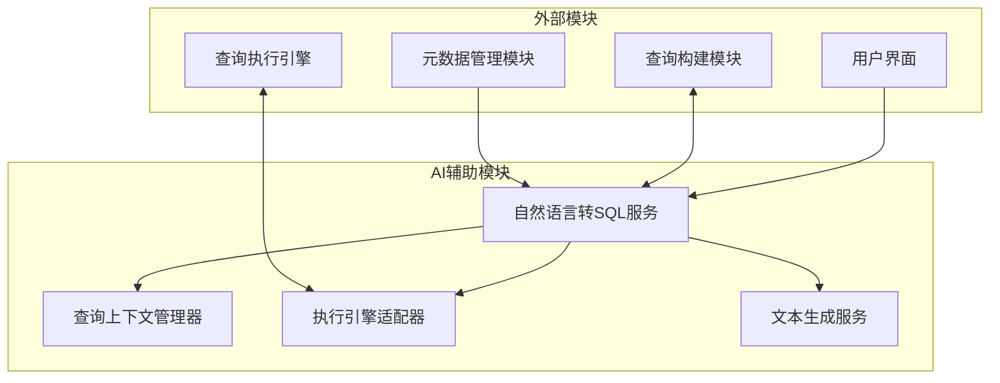
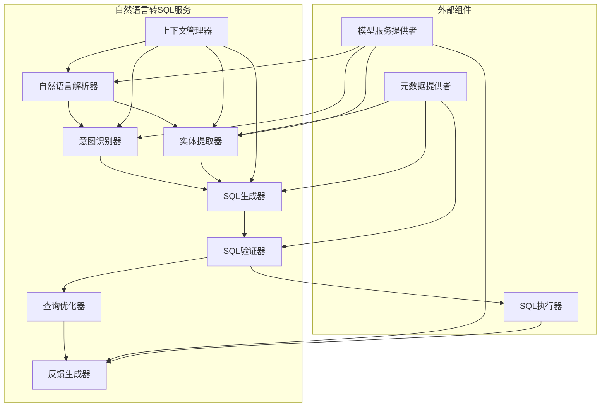
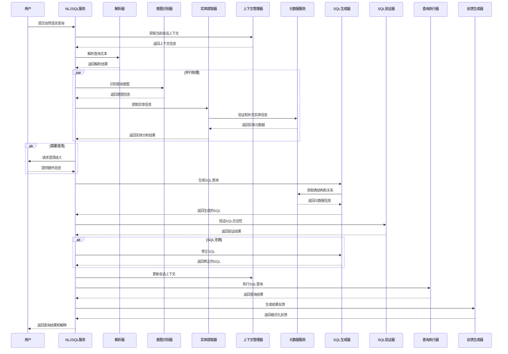

# 自然语言转SQL服务设计

## 1. 组件概述

### 1.1 目的
自然语言转SQL服务(NL2SQL)的目的是解析和理解用户以自然语言表达的数据查询意图，并将其准确转换为可执行的SQL查询语句。该服务使非技术用户能够通过自然交流方式与数据库交互，无需了解SQL语法或数据库结构，大幅降低数据访问门槛，提高数据分析效率。

### 1.2 范围
本组件负责自然语言查询的解析、理解、SQL转换和执行的全流程处理，包括查询意图识别、实体提取、语义理解、SQL生成、SQL优化、执行计划分析以及结果解释等功能。它同时支持简单直接查询和复杂多步骤分析型查询，能够处理各种查询类型并提供智能纠错和建议功能。

### 1.3 与其他组件的关系


## 2. 功能需求

### 2.1 核心功能
- **查询解析与理解**：
  - 自然语言查询的词法和语义分析
  - 查询意图识别（检索、聚合、排序、过滤等）
  - 实体识别（表名、字段名、值、操作符等）
  - 上下文理解和状态维护（支持多轮对话）
  - 歧义识别和处理
- **SQL生成**：
  - 将查询意图转换为结构化SQL
  - 支持SELECT、FROM、WHERE、GROUP BY、ORDER BY、HAVING、JOIN等子句
  - 子查询和复杂表达式支持
  - 多表关联自动识别和处理
  - 支持各种SQL方言（MySQL、PostgreSQL、SQLite等）
- **查询验证与优化**：
  - SQL语法和语义验证
  - 访问权限检查
  - 查询性能预估和优化
  - 执行计划分析
- **交互式反馈**：
  - 查询理解确认
  - 歧义澄清提示
  - 查询改进建议
  - 结果解释和总结
- **辅助功能**：
  - 历史查询记忆和参考
  - 增量查询构建
  - 查询模板学习和应用
  - 领域特定语言适应

### 2.2 非功能需求
- **性能**：
  - 简单查询响应时间 < 1秒
  - 复杂查询响应时间 < 3秒
  - 支持并发处理多个用户查询
- **准确性**：
  - 简单查询正确率目标 > 95%
  - 复杂查询正确率目标 > 85%
  - 错误识别和安全保障 > 99%
- **可扩展性**：
  - 支持新数据源和模式的快速适应
  - 可扩展的模型架构支持能力提升
  - 可定制的领域特定查询模式
- **可用性**：
  - 系统可用性 > 99.9%
  - 优雅降级机制
  - 清晰的错误反馈

## 3. 架构设计

### 3.1 组件架构


### 3.2 处理流程


### 3.3 数据模型

#### 3.3.1 查询意图模型
```typescript
// 查询类型枚举
enum QueryType {
  SELECT,         // 基本检索
  AGGREGATE,      // 聚合统计
  INSERT,         // 数据插入
  UPDATE,         // 数据更新
  DELETE,         // 数据删除
  EXPLAIN,        // 数据解释
  COMPARE,        // 数据比较
  TREND,          // 趋势分析
  UNKNOWN         // 未知类型
}

// 聚合类型枚举
enum AggregationType {
  COUNT,
  SUM,
  AVG,
  MIN,
  MAX,
  GROUP_BY,
  HAVING,
  NONE
}

// 排序方向枚举
enum SortDirection {
  ASC,
  DESC,
  NONE
}

// 查询意图结构
interface QueryIntent {
  type: QueryType;                    // 查询类型
  aggregations: {                     // 聚合操作
    type: AggregationType;            // 聚合类型
    field?: string;                   // 聚合字段
    alias?: string;                   // 聚合结果别名
  }[];
  selections: {                       // 查询字段
    field: string;                    // 字段名
    alias?: string;                   // 字段别名
    function?: string;                // 应用的函数
  }[];
  filters: {                          // 过滤条件
    field: string;                    // 字段名
    operator: string;                 // 操作符
    value: any;                       // 比较值
    logicalOperator?: 'AND' | 'OR';   // 逻辑连接符
    nested?: boolean;                 // 是否嵌套条件
  }[];
  sorts: {                            // 排序条件
    field: string;                    // 排序字段
    direction: SortDirection;         // 排序方向
  }[];
  limit?: number;                     // 结果限制数量
  offset?: number;                    // 结果偏移量
  confidence: number;                 // 意图识别置信度
}
```

#### 3.3.2 实体模型
```typescript
// 实体类型枚举
enum EntityType {
  TABLE,           // 表名
  COLUMN,          // 列名
  VALUE,           // 值
  OPERATOR,        // 操作符
  FUNCTION,        // 函数
  AGGREGATE,       // 聚合函数
  TIME_RANGE,      // 时间范围
  NUMERIC_RANGE,   // 数值范围
  UNKNOWN          // 未知类型
}

// 实体匹配项结构
interface EntityMatch {
  text: string;                    // 原始文本
  type: EntityType;                // 实体类型
  value: string;                   // 标准化值
  startPos: number;                // 文本起始位置
  endPos: number;                  // 文本结束位置
  confidence: number;              // 匹配置信度
  metadata?: {                     // 附加元数据
    tableId?: string;              // 关联表ID
    columnId?: string;             // 关联列ID
    dataType?: string;             // 数据类型
    normalized?: boolean;          // 是否经过标准化
    candidates?: Array<{           // 候选匹配项
      value: string;
      confidence: number;
    }>;
  };
}

// 实体提取结果
interface EntityExtractionResult {
  entities: EntityMatch[];           // 提取的实体列表
  coverage: number;                  // 文本覆盖率
  missingEntityTypes?: EntityType[]; // 可能缺失的实体类型
  ambiguities?: Array<{             // 歧义项列表
    text: string;
    candidates: EntityMatch[];
  }>;
}
```

#### 3.3.3 查询上下文模型
```typescript
// 会话上下文
interface QueryContext {
  sessionId: string;                  // 会话标识
  userId: string;                     // 用户标识
  timestamp: number;                  // 时间戳
  activeDataSources: string[];        // 活动数据源
  history: {                          // 查询历史
    naturalLanguageQuery: string;     // 自然语言查询
    sqlQuery: string;                 // 生成的SQL
    queryIntent: QueryIntent;         // 查询意图
    entities: EntityMatch[];          // 提取的实体
    executionTime: number;            // 执行时间
    resultCount: number;              // 结果数量
    successful: boolean;              // 是否成功
    timestamp: number;                // 查询时间
  }[];
  referencedEntities: {               // 最近引用的实体
    tables: Map<string, number>;      // 表名和引用次数
    columns: Map<string, number>;     // 列名和引用次数
    values: Map<string, number>;      // 值和引用次数
  };
  lastQueryResult?: any;              // 最后一次查询结果
  preferences: {                      // 用户偏好
    maxResults?: number;              // 最大结果数
    preferredVisualizations?: string[]; // 偏好的可视化类型
    language?: string;                // 语言偏好
  };
}
```

#### 3.3.4 SQL生成模型
```typescript
// SQL子句类型
enum ClauseType {
  SELECT,
  FROM,
  WHERE,
  GROUP_BY,
  HAVING,
  ORDER_BY,
  LIMIT,
  OFFSET,
  JOIN
}

// SQL生成配置
interface SQLGenerationConfig {
  dialect: 'MySQL' | 'PostgreSQL' | 'SQLite' | 'OtherSQL'; // SQL方言
  parameterized: boolean;        // 是否使用参数化查询
  includeComments: boolean;      // 是否包含注释
  prettify: boolean;             // 是否美化输出
  supportSubqueries: boolean;    // 是否支持子查询
  quoteIdentifiers: boolean;     // 是否对标识符加引号
  schema?: string;               // 模式名称
}

// SQL生成结果
interface SQLGenerationResult {
  sql: string;                      // 生成的SQL查询
  parameters?: Record<string, any>; // 参数化查询参数
  clauses: Map<ClauseType, string>; // 各子句内容
  tables: string[];                 // 引用的表
  columns: string[];                // 引用的列
  conditions: string[];             // 条件表达式
  warnings?: string[];              // 生成警告
  alternatives?: string[];          // 备选SQL查询
  confidence: number;               // 生成置信度
  explanation?: string;             // SQL解释
}
```

## 4. 详细设计

### 4.1 自然语言解析器

自然语言解析器负责处理输入的自然语言查询，执行预处理、标准化，并提取语义结构，为后续处理奠定基础。

#### 4.1.1 文本预处理
- **清洗与标准化**：
  - 移除多余空格和标点
  - 修正常见拼写错误
  - 统一日期时间格式
  - 处理缩写和同义词
- **句法分析**：
  - 词性标注(POS Tagging)
  - 依存句法分析
  - 命名实体识别(NER)
- **语义结构提取**：
  - 主语-谓语-宾语结构识别
  - 修饰语和限定词分析
  - 短语分组和边界识别

#### 4.1.2 上下文处理
- **指代消解**：
  - 代词解析（"它"、"它们"等）
  - 指代上下文（"前面的"、"那个"等）
  - 时间性指代（"上个月"、"昨天"等）
- **隐含补充**：
  - 省略主语恢复
  - 隐含条件推断
  - 上下文连续性维护

#### 4.1.3 实现策略
```java
public class NaturalLanguageParser {
    private final TokenizerService tokenizer;
    private final POSTaggerService posTagger;
    private final DependencyParserService dependencyParser;
    private final EntityRecognitionService nerService;
    private final ContextManagerService contextManager;
    private final SpellCorrectionService spellCorrector;
    
    // 解析自然语言查询
    public ParsedQuery parse(String query, String sessionId) {
        // 1. 获取会话上下文
        QueryContext context = contextManager.getContext(sessionId);
        
        // 2. 预处理
        String preprocessedQuery = preprocess(query);
        
        // 3. 标记化
        List<Token> tokens = tokenizer.tokenize(preprocessedQuery);
        
        // 4. 词性标注
        List<PosToken> posTokens = posTagger.tag(tokens);
        
        // 5. 依存句法分析
        DependencyTree dependencyTree = dependencyParser.parse(posTokens);
        
        // 6. 命名实体识别
        List<RecognizedEntity> entities = nerService.recognize(posTokens, context);
        
        // 7. 指代消解
        ResolvedQuery resolvedQuery = resolveReferences(
            preprocessedQuery, 
            dependencyTree, 
            entities, 
            context
        );
        
        // 8. 构建语义表示
        SemanticRepresentation semantics = buildSemanticRepresentation(
            resolvedQuery, 
            dependencyTree
        );
        
        return new ParsedQuery(
            preprocessedQuery,
            tokens,
            posTokens,
            dependencyTree,
            entities,
            semantics,
            context
        );
    }
    
    // 文本预处理
    private String preprocess(String query) {
        // 移除多余空格
        String cleaned = query.trim().replaceAll("\\s+", " ");
        
        // 拼写纠正
        cleaned = spellCorrector.correct(cleaned);
        
        // 标准化标点和特殊字符
        cleaned = standardizePunctuation(cleaned);
        
        // 转换常见缩写
        cleaned = expandAbbreviations(cleaned);
        
        return cleaned;
    }
    
    // 指代消解
    private ResolvedQuery resolveReferences(
            String query,
            DependencyTree dependencyTree,
            List<RecognizedEntity> entities,
            QueryContext context) {
        
        // 代词解析
        Map<Integer, String> pronounResolutions = resolvePronounReferences(
            dependencyTree, 
            context
        );
        
        // 定指表达式解析
        Map<Integer, RecognizedEntity> definiteReferences = 
            resolveDefiniteReferences(entities, context);
        
        // 时间性指代解析
        Map<Integer, TemporalReference> temporalReferences = 
            resolveTemporalReferences(query, context);
        
        // 隐含条件识别
        List<ImpliedCondition> impliedConditions = 
            identifyImpliedConditions(dependencyTree, entities, context);
        
        return new ResolvedQuery(
            query,
            pronounResolutions,
            definiteReferences,
            temporalReferences,
            impliedConditions
        );
    }
    
    // 构建语义表示
    private SemanticRepresentation buildSemanticRepresentation(
            ResolvedQuery resolvedQuery,
            DependencyTree dependencyTree) {
        
        // 提取主要语义角色
        List<SemanticRole> roles = extractSemanticRoles(
            dependencyTree, 
            resolvedQuery
        );
        
        // 识别查询模式
        QueryPattern pattern = identifyQueryPattern(roles, dependencyTree);
        
        // 构建句法结构
        SyntacticStructure structure = buildSyntacticStructure(
            dependencyTree, 
            pattern
        );
        
        return new SemanticRepresentation(roles, pattern, structure);
    }
    
    // 其他辅助方法...
}
```

### 4.2 意图识别器

意图识别器负责从解析后的查询中识别用户的查询意图，包括查询类型、操作范围、目标字段和期望结果格式等。

#### 4.2.1 意图分类
- **查询类型识别**：
  - 区分检索、聚合、修改等操作类型
  - 识别分析意图（趋势、比较、关联等）
  - 辅助类意图识别（解释、定义、帮助等）
- **查询模式匹配**：
  - 常见查询模式库
  - 基于模板的模式匹配
  - 查询结构相似度分析
- **意图参数提取**：
  - 目标字段识别
  - 约束条件提取
  - 结果格式偏好

#### 4.2.2 意图置信度评估
- **多特征评分**：
  - 模式匹配度
  - 实体识别清晰度
  - 语义结构完整性
  - 查询上下文一致性
- **歧义检测**：
  - 多重意图可能性分析
  - 缺失关键信息识别
  - 不一致性检测

#### 4.2.3 实现策略
```java
public class IntentRecognizer {
    private final PatternMatchingService patternMatcher;
    private final MLClassifierService mlClassifier;
    private final RuleEngineService ruleEngine;
    private final MetadataService metadataService;
    private final ConfidenceCalculatorService confidenceCalculator;
    
    // 识别查询意图
    public QueryIntent recognizeIntent(
            ParsedQuery parsedQuery, 
            QueryContext context) {
        
        // 1. 特征提取
        Map<String, Object> features = extractFeatures(parsedQuery);
        
        // 2. 模式匹配
        List<PatternMatch> patternMatches = patternMatcher.findMatches(
            parsedQuery.getSemantics(),
            context
        );
        
        // 3. 机器学习分类
        ClassificationResult mlResult = mlClassifier.classify(
            features,
            context.getUserId()
        );
        
        // 4. 规则评估
        RuleEvaluationResult ruleResult = ruleEngine.evaluate(
            parsedQuery,
            patternMatches,
            context
        );
        
        // 5. 整合分类结果
        QueryType primaryType = determinePrimaryType(
            patternMatches, 
            mlResult, 
            ruleResult
        );
        
        // 6. 提取意图参数
        List<SelectionField> selections = extractSelections(
            parsedQuery, 
            primaryType
        );
        
        List<AggregationOperation> aggregations = extractAggregations(
            parsedQuery, 
            primaryType
        );
        
        List<FilterCondition> filters = extractFilters(
            parsedQuery, 
            context
        );
        
        List<SortCriterion> sorts = extractSorts(parsedQuery);
        
        Integer limit = extractLimit(parsedQuery);
        
        // 7. 检查元数据匹配和权限
        validateAgainstMetadata(
            selections, 
            filters, 
            sorts, 
            context
        );
        
        // 8. 构建完整意图
        QueryIntent intent = new QueryIntent(
            primaryType,
            selections,
            aggregations,
            filters,
            sorts,
            limit,
            null // 偏移量先设为null
        );
        
        // 9. 计算置信度
        double confidence = confidenceCalculator.calculateIntentConfidence(
            intent,
            parsedQuery,
            mlResult,
            patternMatches
        );
        
        intent.setConfidence(confidence);
        
        // 10. 检查歧义
        List<Ambiguity> ambiguities = checkForAmbiguities(
            intent,
            parsedQuery,
            context
        );
        
        intent.setAmbiguities(ambiguities);
        
        return intent;
    }
    
    // 提取特征
    private Map<String, Object> extractFeatures(ParsedQuery parsedQuery) {
        Map<String, Object> features = new HashMap<>();
        
        // 提取语法特征
        features.putAll(extractSyntacticFeatures(parsedQuery));
        
        // 提取语义特征
        features.putAll(extractSemanticFeatures(parsedQuery));
        
        // 提取词汇特征
        features.putAll(extractLexicalFeatures(parsedQuery));
        
        // 提取实体特征
        features.putAll(extractEntityFeatures(parsedQuery));
        
        return features;
    }
    
    // 确定主要查询类型
    private QueryType determinePrimaryType(
            List<PatternMatch> patternMatches,
            ClassificationResult mlResult,
            RuleEvaluationResult ruleResult) {
        
        // 整合多种分类结果
        Map<QueryType, Double> typeScores = new EnumMap<>(QueryType.class);
        
        // 添加模式匹配分数
        for (PatternMatch match : patternMatches) {
            typeScores.merge(match.getQueryType(), match.getConfidence(), Double::sum);
        }
        
        // 添加机器学习分类分数
        for (ClassLabel label : mlResult.getLabels()) {
            QueryType type = QueryType.valueOf(label.getName());
            typeScores.merge(type, label.getConfidence(), Double::sum);
        }
        
        // 添加规则评估分数
        for (RuleResult result : ruleResult.getResults()) {
            typeScores.merge(result.getQueryType(), result.getScore(), Double::sum);
        }
        
        // 找出得分最高的类型
        return typeScores.entrySet().stream()
            .max(Map.Entry.comparingByValue())
            .map(Map.Entry::getKey)
            .orElse(QueryType.UNKNOWN);
    }
    
    // 检查歧义
    private List<Ambiguity> checkForAmbiguities(
            QueryIntent intent,
            ParsedQuery parsedQuery,
            QueryContext context) {
        
        List<Ambiguity> ambiguities = new ArrayList<>();
        
        // 检查实体歧义
        checkEntityAmbiguities(parsedQuery, intent, ambiguities);
        
        // 检查意图歧义
        checkIntentAmbiguities(intent, parsedQuery, ambiguities);
        
        // 检查字段引用歧义
        checkFieldReferenceAmbiguities(intent, context, ambiguities);
        
        // 检查缺失必要信息
        checkMissingInformation(intent, ambiguities);
        
        return ambiguities;
    }
    
    // 其他辅助方法...
}
```

### 4.3 实体提取器

实体提取器负责从查询中识别出数据库相关实体（表、列、值等），并将这些实体与元数据信息进行匹配和映射。

#### 4.3.1 实体识别方法
- **基于词典匹配**：
  - 元数据词典构建
  - 模糊匹配算法
  - 同义词和别名扩展
- **上下文感知识别**：
  - 位置和句法线索利用
  - 查询意图关联分析
  - 相邻词关系考量
- **基于规则识别**：
  - 时间值识别规则
  - 数值格式规则
  - 专用命名规则

#### 4.3.2 实体解析与验证
- **标准化与类型转换**：
  - 日期时间格式统一
  - 数值单位转换
  - 文本规范化处理
- **元数据验证**：
  - 表和列存在性验证
  - 数据类型兼容性检查
  - 值域约束检查

#### 4.3.3 实现策略
```java
public class EntityExtractor {
    private final MetadataService metadataService;
    private final DictionaryMatcherService dictionaryMatcher;
    private final PatternMatchingService patternMatcher;
    private final NERService nerService;
    private final FuzzyMatchService fuzzyMatcher;
    private final ValueNormalizerService valueNormalizer;
    
    // 提取实体
    public EntityExtractionResult extractEntities(
            ParsedQuery parsedQuery,
            QueryIntent intent,
            QueryContext context) {
        
        // 1. 初始化结果集
        Set<EntityMatch> extractedEntities = new HashSet<>();
        
        // 2. 基于词典的表和列匹配
        extractedEntities.addAll(extractTableAndColumnEntities(
            parsedQuery,
            context
        ));
        
        // 3. 基于模式的操作符和函数匹配
        extractedEntities.addAll(extractOperatorsAndFunctions(parsedQuery));
        
        // 4. 值实体提取
        extractedEntities.addAll(extractValueEntities(
            parsedQuery,
            extractedEntities,
            context
        ));
        
        // 5. 使用NER补充提取实体
        extractedEntities.addAll(extractNEREntities(parsedQuery));
        
        // 6. 实体歧义检测
        List<EntityAmbiguity> ambiguities = detectAmbiguities(
            extractedEntities,
            parsedQuery
        );
        
        // 7. 实体关联推断
        Map<String, String> entityRelations = inferEntityRelations(
            extractedEntities,
            intent,
            context
        );
        
        // 8. 元数据验证和增强
        enrichWithMetadata(extractedEntities, entityRelations, context);
        
        // 9. 计算文本覆盖率
        double coverage = calculateCoverage(extractedEntities, parsedQuery);
        
        // 10. 检测可能缺失的实体类型
        Set<EntityType> missingEntityTypes = detectMissingEntityTypes(
            extractedEntities,
            intent
        );
        
        return new EntityExtractionResult(
            new ArrayList<>(extractedEntities),
            coverage,
            missingEntityTypes.isEmpty() ? null : missingEntityTypes,
            ambiguities.isEmpty() ? null : ambiguities
        );
    }
    
    // 提取表和列实体
    private List<EntityMatch> extractTableAndColumnEntities(
            ParsedQuery parsedQuery,
            QueryContext context) {
        
        List<EntityMatch> entities = new ArrayList<>();
        
        // 获取可用的表和列元数据
        List<TableMetadata> tables = metadataService.getAccessibleTables(
            context.getUserId(),
            context.getActiveDataSources()
        );
        
        // 构建词典查询
        DictionaryQuery query = buildDictionaryQuery(
            parsedQuery, 
            tables, 
            context
        );
        
        // 执行精确匹配
        List<DictionaryMatch> exactMatches = dictionaryMatcher.findExactMatches(query);
        entities.addAll(convertToEntityMatches(exactMatches, EntityMatchSource.EXACT));
        
        // 执行模糊匹配（针对未匹配的词）
        if (query.hasUnmatchedTokens()) {
            List<DictionaryMatch> fuzzyMatches = dictionaryMatcher.findFuzzyMatches(
                query,
                0.8, // 最小相似度阈值
                true // 使用同义词扩展
            );
            entities.addAll(convertToEntityMatches(fuzzyMatches, EntityMatchSource.FUZZY));
        }
        
        // 整合和过滤匹配结果
        return filterAndRankEntityMatches(entities);
    }
    
    // 提取值实体
    private List<EntityMatch> extractValueEntities(
            ParsedQuery parsedQuery,
            Set<EntityMatch> existingEntities,
            QueryContext context) {
        
        List<EntityMatch> valueEntities = new ArrayList<>();
        
        // 提取可能的值范围
        List<Token> unmatchedTokens = findUnmatchedTokens(
            parsedQuery.getTokens(), 
            existingEntities
        );
        
        // 按类型提取值
        valueEntities.addAll(extractDateTimeValues(unmatchedTokens, parsedQuery));
        valueEntities.addAll(extractNumericValues(unmatchedTokens, parsedQuery));
        valueEntities.addAll(extractStringValues(unmatchedTokens, parsedQuery));
        valueEntities.addAll(extractBooleanValues(unmatchedTokens, parsedQuery));
        valueEntities.addAll(extractRangeValues(unmatchedTokens, parsedQuery));
        valueEntities.addAll(extractEnumValues(unmatchedTokens, existingEntities, context));
        
        // 标准化值
        standardizeValues(valueEntities, existingEntities, context);
        
        return valueEntities;
    }
    
    // 检测实体歧义
    private List<EntityAmbiguity> detectAmbiguities(
            Set<EntityMatch> entities,
            ParsedQuery parsedQuery) {
        
        List<EntityAmbiguity> ambiguities = new ArrayList<>();
        
        // 构建文本位置索引
        Map<Range, List<EntityMatch>> positionIndex = buildPositionIndex(entities);
        
        // 查找文本重叠的实体
        for (Map.Entry<Range, List<EntityMatch>> entry : positionIndex.entrySet()) {
            if (entry.getValue().size() > 1) {
                // 发现重叠实体
                Range range = entry.getKey();
                List<EntityMatch> overlappingEntities = entry.getValue();
                
                // 如果是不同类型的实体重叠或同类型但映射到不同的元数据
                if (hasRealAmbiguity(overlappingEntities)) {
                    String text = extractTextRange(
                        parsedQuery.getPreprocessedQuery(), 
                        range
                    );
                    
                    ambiguities.add(new EntityAmbiguity(
                        text,
                        new ArrayList<>(overlappingEntities)
                    ));
                }
            }
        }
        
        return ambiguities;
    }
    
    // 标准化值
    private void standardizeValues(
            List<EntityMatch> valueEntities,
            Set<EntityMatch> existingEntities,
            QueryContext context) {
        
        // 遍历值实体
        for (EntityMatch entity : valueEntities) {
            if (entity.getType() != EntityType.VALUE) continue;
            
            // 查找相关的列实体
            Optional<EntityMatch> relatedColumn = findRelatedColumnEntity(
                entity, 
                existingEntities, 
                context
            );
            
            if (relatedColumn.isPresent()) {
                // 获取列的数据类型和格式
                String dataType = relatedColumn.get().getMetadata().getDataType();
                
                // 标准化值
                Object normalizedValue = valueNormalizer.normalize(
                    entity.getValue(),
                    dataType,
                    context.getPreferences().getLanguage()
                );
                
                // 更新实体值和元数据
                entity.setValue(normalizedValue);
                entity.getMetadata().setDataType(dataType);
                entity.getMetadata().setNormalized(true);
                entity.getMetadata().setColumnId(
                    relatedColumn.get().getMetadata().getColumnId()
                );
            }
        }
    }
    
    // 其他辅助方法...
}
```

### 4.4 SQL生成器

SQL生成器负责将识别的查询意图和实体转换为有效的SQL查询，确保查询语法正确、性能优化并与数据库方言兼容。

#### 4.4.1 查询结构构建
- **子句生成**：
  - SELECT子句构建
  - FROM子句和表关联逻辑
  - WHERE条件构造
  - GROUP BY和聚合处理
  - ORDER BY排序规则
- **表关系管理**：
  - 显式JOIN条件生成
  - 隐式关联自动推断
  - 多表查询路径优化
- **表达式构建**：
  - 条件表达式格式化
  - 函数调用语法
  - 子查询生成

#### 4.4.2 查询优化和安全
- **SQL注入防护**：
  - 参数化查询生成
  - 标识符和值的安全转义
  - 输入验证机制
- **查询优化**：
  - 消除冗余条件
  - 简化复杂表达式
  - JOIN顺序优化
  - 谓词下推

#### 4.4.3 实现策略
```java
public class SQLGenerator {
    private final SQLDialectProvider dialectProvider;
    private final MetadataService metadataService;
    private final TableRelationshipService relationshipService;
    private final JoinPathFinderService joinPathFinder;
    private final SQLFormatterService formatter;
    
    // 生成SQL查询
    public SQLGenerationResult generateSQL(
            QueryIntent intent,
            EntityExtractionResult entities,
            QueryContext context,
            SQLGenerationConfig config) {
        
        // 1. 获取SQL方言提供者
        SQLDialect dialect = dialectProvider.getDialect(config.getDialect());
        
        // 2. 初始化各子句生成器
        SelectClauseBuilder selectBuilder = new SelectClauseBuilder(dialect);
        FromClauseBuilder fromBuilder = new FromClauseBuilder(dialect);
        WhereClauseBuilder whereBuilder = new WhereClauseBuilder(dialect, config);
        GroupByClauseBuilder groupByBuilder = new GroupByClauseBuilder(dialect);
        HavingClauseBuilder havingBuilder = new HavingClauseBuilder(dialect, config);
        OrderByClauseBuilder orderByBuilder = new OrderByClauseBuilder(dialect);
        LimitOffsetClauseBuilder limitOffsetBuilder = new LimitOffsetClauseBuilder(dialect);
        
        // 3. 确定查询涉及的表
        Set<TableMetadata> involvedTables = determineInvolvedTables(
            intent, 
            entities, 
            context
        );
        
        // 4. 确定表之间的关联路径
        JoinGraph joinGraph = buildJoinGraph(
            involvedTables,
            intent,
            context
        );
        
        // 5. 生成各子句
        String selectClause = selectBuilder.build(intent, entities);
        String fromClause = fromBuilder.build(joinGraph);
        String whereClause = whereBuilder.build(intent, entities, context);
        String groupByClause = groupByBuilder.build(intent, entities);
        String havingClause = havingBuilder.build(intent, entities, context);
        String orderByClause = orderByBuilder.build(intent, entities);
        String limitOffsetClause = limitOffsetBuilder.build(intent);
        
        // 6. 组装完整SQL
        StringBuilder sqlBuilder = new StringBuilder();
        sqlBuilder.append("SELECT ").append(selectClause).append("\n");
        sqlBuilder.append("FROM ").append(fromClause).append("\n");
        
        if (!whereClause.isEmpty()) {
            sqlBuilder.append("WHERE ").append(whereClause).append("\n");
        }
        
        if (!groupByClause.isEmpty()) {
            sqlBuilder.append("GROUP BY ").append(groupByClause).append("\n");
        }
        
        if (!havingClause.isEmpty()) {
            sqlBuilder.append("HAVING ").append(havingClause).append("\n");
        }
        
        if (!orderByClause.isEmpty()) {
            sqlBuilder.append("ORDER BY ").append(orderByClause).append("\n");
        }
        
        if (!limitOffsetClause.isEmpty()) {
            sqlBuilder.append(limitOffsetClause).append("\n");
        }
        
        String rawSql = sqlBuilder.toString();
        
        // 7. 格式化最终SQL
        String formattedSql = formatter.format(
            rawSql, 
            config.isPrettify()
        );
        
        // 8. 收集查询元数据
        Map<ClauseType, String> clauses = new EnumMap<>(ClauseType.class);
        clauses.put(ClauseType.SELECT, selectClause);
        clauses.put(ClauseType.FROM, fromClause);
        clauses.put(ClauseType.WHERE, whereClause);
        clauses.put(ClauseType.GROUP_BY, groupByClause);
        clauses.put(ClauseType.HAVING, havingClause);
        clauses.put(ClauseType.ORDER_BY, orderByClause);
        clauses.put(ClauseType.LIMIT, limitOffsetClause);
        
        List<String> tableNames = joinGraph.getTables().stream()
            .map(TableMetadata::getName)
            .collect(Collectors.toList());
        
        List<String> columnNames = collectReferencedColumns(intent, entities);
        List<String> conditions = extractConditions(whereClause, havingClause);
        
        // 9. 构造返回结果
        return new SQLGenerationResult(
            formattedSql,
            whereBuilder.getParameters(), // 如果使用参数化查询
            clauses,
            tableNames,
            columnNames,
            conditions,
            new ArrayList<>(), // 警告信息
            new ArrayList<>(), // 备选查询
            calculateConfidence(intent, entities, joinGraph),
            generateExplanation(intent, joinGraph, formattedSql, dialect)
        );
    }
    
    // 确定涉及的表
    private Set<TableMetadata> determineInvolvedTables(
            QueryIntent intent,
            EntityExtractionResult entities,
            QueryContext context) {
        
        Set<TableMetadata> tables = new HashSet<>();
        
        // 从实体中提取明确提到的表
        for (EntityMatch entity : entities.getEntities()) {
            if (entity.getType() == EntityType.TABLE) {
                String tableId = entity.getMetadata().getTableId();
                if (tableId != null) {
                    TableMetadata table = metadataService.getTableById(tableId);
                    if (table != null) {
                        tables.add(table);
                    }
                }
            }
        }
        
        // 从提到的列中推断表
        for (EntityMatch entity : entities.getEntities()) {
            if (entity.getType() == EntityType.COLUMN) {
                String tableId = entity.getMetadata().getTableId();
                if (tableId != null) {
                    TableMetadata table = metadataService.getTableById(tableId);
                    if (table != null) {
                        tables.add(table);
                    }
                }
            }
        }
        
        // 如果没有明确的表，从上下文和偏好中推断
        if (tables.isEmpty()) {
            tables.addAll(inferTablesFromContext(context, intent));
        }
        
        return tables;
    }
    
    // 构建表连接图
    private JoinGraph buildJoinGraph(
            Set<TableMetadata> tables,
            QueryIntent intent,
            QueryContext context) {
        
        // 创建连接图
        JoinGraph graph = new JoinGraph();
        
        // 如果只有一个表，不需要连接
        if (tables.size() <= 1) {
            tables.forEach(graph::addTable);
            return graph;
        }
        
        // 收集必须包含的表
        Set<TableMetadata> requiredTables = new HashSet<>(tables);
        
        // 找出最优的连接路径
        JoinPath optimizedPath = joinPathFinder.findOptimalJoinPath(
            requiredTables,
            context
        );
        
        // 应用连接路径到图
        for (JoinEdge edge : optimizedPath.getEdges()) {
            graph.addTable(edge.getSourceTable());
            graph.addTable(edge.getTargetTable());
            graph.addJoin(edge);
        }
        
        // 确保所有必要的表都被包含
        for (TableMetadata table : requiredTables) {
            if (!graph.containsTable(table)) {
                graph.addTable(table);
                // 尝试连接到最近的表
                findAndAddBestJoin(graph, table, optimizedPath);
            }
        }
        
        return graph;
    }
    
    // 找到并添加最佳连接
    private void findAndAddBestJoin(
            JoinGraph graph, 
            TableMetadata isolatedTable,
            JoinPath existingPath) {
        
        Optional<JoinEdge> bestEdge = relationshipService
            .findBestJoinWithExistingTable(
                isolatedTable,
                graph.getTables(),
                0.7 // 最小置信度阈值
            );
        
        if (bestEdge.isPresent()) {
            graph.addJoin(bestEdge.get());
        } else {
            // 无法找到合适的连接，添加警告
            graph.addIsolatedTable(isolatedTable);
        }
    }
    
    // 其他辅助方法...
}
```

### 4.5 SQL验证器

SQL验证器负责检验生成的SQL查询，确保其语法正确、语义有效，并符合安全和性能标准。

#### 4.5.1 验证类型
- **语法验证**：
  - SQL解析和语法检查
  - 标识符和关键字验证
  - 参数数量和类型检查
- **语义验证**：
  - 表和列存在性验证
  - 类型兼容性检查
  - 权限检查
  - 约束满足性验证
- **安全验证**：
  - SQL注入风险检测
  - 敏感操作识别
  - 资源限制检查

#### 4.5.2 执行计划分析
- **性能评估**：
  - 索引使用情况
  - 扫描方式分析
  - 连接策略评估
- **优化建议**：
  - 索引使用建议
  - 查询重写建议
  - 参数调整建议

#### 4.5.3 实现策略
```java
public class SQLValidator {
    private final SQLParserService parser;
    private final MetadataService metadataService;
    private final SecurityService securityService;
    private final PermissionService permissionService;
    private final ExecutionPlanService executionPlanService;
    
    // 验证SQL查询
    public ValidationResult validateSQL(
            String sql,
            Map<String, Object> parameters,
            QueryContext context,
            SQLGenerationConfig config) {
        
        List<ValidationIssue> issues = new ArrayList<>();
        
        try {
            // 1. 语法验证
            SyntaxValidationResult syntaxResult = validateSyntax(sql, config.getDialect());
            issues.addAll(syntaxResult.getIssues());
            
            // 语法错误时不继续验证
            if (syntaxResult.hasCriticalErrors()) {
                return new ValidationResult(false, issues, null);
            }
            
            // 2. 获取解析后的查询对象
            ParsedSQLQuery parsedQuery = syntaxResult.getParsedQuery();
            
            // 3. 元数据验证
            MetadataValidationResult metaResult = validateMetadata(
                parsedQuery, 
                context
            );
            issues.addAll(metaResult.getIssues());
            
            // 4. 权限验证
            PermissionValidationResult permResult = validatePermissions(
                parsedQuery, 
                context
            );
            issues.addAll(permResult.getIssues());
            
            // 5. 安全验证
            SecurityValidationResult secResult = validateSecurity(
                sql, 
                parameters, 
                parsedQuery, 
                context
            );
            issues.addAll(secResult.getIssues());
            
            // 6. 执行计划分析
            ExecutionPlanResult planResult = null;
            if (!hasCriticalIssues(issues) && config.isAnalyzeExecutionPlan()) {
                planResult = analyzeExecutionPlan(sql, parameters, context);
                issues.addAll(planResult.getIssues());
            }
            
            // 7. 检查是否通过验证
            boolean isValid = !hasCriticalIssues(issues);
            
            return new ValidationResult(isValid, issues, planResult);
            
        } catch (Exception e) {
            // 处理验证过程中的异常
            issues.add(new ValidationIssue(
                "UNEXPECTED_ERROR",
                "验证过程中发生异常: " + e.getMessage(),
                "检查SQL语法或系统配置",
                ValidationSeverity.CRITICAL
            ));
            
            return new ValidationResult(false, issues, null);
        }
    }
    
    // 语法验证
    private SyntaxValidationResult validateSyntax(String sql, String dialectName) {
        List<ValidationIssue> issues = new ArrayList<>();
        
        try {
            // 解析SQL
            ParsedSQLQuery parsedQuery = parser.parse(sql, dialectName);
            
            // 检查SQL类型是否为SELECT
            if (!parsedQuery.isSelectQuery()) {
                issues.add(new ValidationIssue(
                    "UNSUPPORTED_QUERY_TYPE",
                    "仅支持SELECT查询",
                    "确保生成的是SELECT查询",
                    ValidationSeverity.CRITICAL
                ));
            }
            
            // 检查语法规则
            List<SyntaxError> syntaxErrors = parser.validateSyntax(parsedQuery);
            
            for (SyntaxError error : syntaxErrors) {
                issues.add(new ValidationIssue(
                    "SYNTAX_ERROR",
                    error.getMessage(),
                    error.getSuggestion(),
                    ValidationSeverity.CRITICAL
                ));
            }
            
            return new SyntaxValidationResult(
                issues.isEmpty(),
                issues,
                parsedQuery
            );
            
        } catch (Exception e) {
            // 解析异常
            issues.add(new ValidationIssue(
                "PARSE_ERROR",
                "SQL解析错误: " + e.getMessage(),
                "检查SQL语法",
                ValidationSeverity.CRITICAL
            ));
            
            return new SyntaxValidationResult(false, issues, null);
        }
    }
    
    // 元数据验证
    private MetadataValidationResult validateMetadata(
            ParsedSQLQuery parsedQuery,
            QueryContext context) {
        
        List<ValidationIssue> issues = new ArrayList<>();
        
        // 验证表存在性
        for (TableReference tableRef : parsedQuery.getTableReferences()) {
            boolean tableExists = metadataService.tableExists(
                tableRef.getSchema(),
                tableRef.getName(),
                context.getActiveDataSources()
            );
            
            if (!tableExists) {
                issues.add(new ValidationIssue(
                    "TABLE_NOT_FOUND",
                    "表不存在: " + tableRef.getFullName(),
                    "检查表名拼写或确认表是否存在",
                    ValidationSeverity.CRITICAL
                ));
            }
        }
        
        // 验证列存在性
        for (ColumnReference colRef : parsedQuery.getColumnReferences()) {
            boolean columnExists;
            
            if (colRef.getTableName() != null) {
                // 指定表的列
                columnExists = metadataService.columnExists(
                    colRef.getTableName(),
                    colRef.getName(),
                    context.getActiveDataSources()
                );
                
                if (!columnExists) {
                    issues.add(new ValidationIssue(
                        "COLUMN_NOT_FOUND",
                        "列不存在: " + colRef.getFullName(),
                        "检查列名拼写或确认列是否存在于指定表中",
                        ValidationSeverity.CRITICAL
                    ));
                }
            } else {
                // 不明确指定表的列
                List<TableColumnPair> possibleColumns = metadataService.findPossibleColumns(
                    colRef.getName(),
                    parsedQuery.getTableReferences(),
                    context.getActiveDataSources()
                );
                
                if (possibleColumns.isEmpty()) {
                    issues.add(new ValidationIssue(
                        "COLUMN_NOT_FOUND",
                        "列不存在: " + colRef.getName(),
                        "检查列名拼写或确认列是否存在于查询的表中",
                        ValidationSeverity.CRITICAL
                    ));
                } else if (possibleColumns.size() > 1) {
                    issues.add(new ValidationIssue(
                        "AMBIGUOUS_COLUMN",
                        "列名模糊: " + colRef.getName() + " 存在于多个表中",
                        "使用表名限定列 (table.column)",
                        ValidationSeverity.CRITICAL
                    ));
                }
            }
        }
        
        // 验证类型兼容性
        List<TypeCompatibilityIssue> typeIssues = 
            validateTypeCompatibility(parsedQuery);
        
        for (TypeCompatibilityIssue issue : typeIssues) {
            issues.add(new ValidationIssue(
                "TYPE_INCOMPATIBILITY",
                issue.getMessage(),
                issue.getSuggestion(),
                ValidationSeverity.ERROR
            ));
        }
        
        return new MetadataValidationResult(
            !hasCriticalIssues(issues),
            issues
        );
    }
    
    // 权限验证
    private PermissionValidationResult validatePermissions(
            ParsedSQLQuery parsedQuery,
            QueryContext context) {
        
        List<ValidationIssue> issues = new ArrayList<>();
        
        // 验证表访问权限
        for (TableReference tableRef : parsedQuery.getTableReferences()) {
            boolean hasAccess = permissionService.hasTableAccess(
                context.getUserId(),
                tableRef.getSchema(),
                tableRef.getName(),
                AccessType.SELECT
            );
            
            if (!hasAccess) {
                issues.add(new ValidationIssue(
                    "TABLE_ACCESS_DENIED",
                    "没有访问表的权限: " + tableRef.getFullName(),
                    "请联系管理员获取访问权限",
                    ValidationSeverity.CRITICAL
                ));
            }
        }
        
        // 验证列访问权限
        for (ColumnReference colRef : parsedQuery.getColumnReferences()) {
            if (colRef.getTableName() != null) {
                boolean hasAccess = permissionService.hasColumnAccess(
                    context.getUserId(),
                    colRef.getTableName(),
                    colRef.getName(),
                    AccessType.SELECT
                );
                
                if (!hasAccess) {
                    issues.add(new ValidationIssue(
                        "COLUMN_ACCESS_DENIED",
                        "没有访问列的权限: " + colRef.getFullName(),
                        "请联系管理员获取访问权限",
                        ValidationSeverity.CRITICAL
                    ));
                }
            }
        }
        
        return new PermissionValidationResult(
            !hasCriticalIssues(issues),
            issues
        );
    }
    
    // 安全验证
    private SecurityValidationResult validateSecurity(
            String sql,
            Map<String, Object> parameters,
            ParsedSQLQuery parsedQuery,
            QueryContext context) {
        
        List<ValidationIssue> issues = new ArrayList<>();
        
        // 检查SQL注入风险
        List<SQLInjectionVulnerability> vulnerabilities = 
            securityService.checkSQLInjection(sql, parameters);
        
        for (SQLInjectionVulnerability vuln : vulnerabilities) {
            issues.add(new ValidationIssue(
                "SQL_INJECTION_RISK",
                vuln.getDescription(),
                vuln.getRemediation(),
                ValidationSeverity.CRITICAL
            ));
        }
        
        // 检查资源限制
        ResourceLimitCheck limitCheck = securityService.checkResourceLimits(
            parsedQuery,
            context
        );
        
        if (!limitCheck.isWithinLimits()) {
            issues.add(new ValidationIssue(
                "RESOURCE_LIMIT_EXCEEDED",
                limitCheck.getMessage(),
                limitCheck.getSuggestion(),
                ValidationSeverity.WARNING
            ));
        }
        
        // 检查敏感数据访问
        List<SensitiveDataAccess> sensitiveAccesses = 
            securityService.checkSensitiveDataAccess(
                parsedQuery,
                context.getUserId()
            );
        
        for (SensitiveDataAccess access : sensitiveAccesses) {
            issues.add(new ValidationIssue(
                "SENSITIVE_DATA_ACCESS",
                access.getMessage(),
                access.getRecommendation(),
                ValidationSeverity.WARNING
            ));
        }
        
        return new SecurityValidationResult(
            !hasCriticalIssues(issues),
            issues
        );
    }
    
    // 执行计划分析
    private ExecutionPlanResult analyzeExecutionPlan(
            String sql,
            Map<String, Object> parameters,
            QueryContext context) {
        
        try {
            // 获取执行计划
            ExecutionPlan plan = executionPlanService.getExecutionPlan(
                sql,
                parameters,
                context.getActiveDataSources().get(0) // 主数据源
            );
            
            // 分析执行计划
            List<PlanIssue> planIssues = executionPlanService.analyzePlan(plan);
            
            // 转换为验证问题
            List<ValidationIssue> validationIssues = convertPlanIssues(planIssues);
            
            // 提取优化建议
            List<OptimizationSuggestion> suggestions = 
                executionPlanService.getSuggestions(plan);
            
            return new ExecutionPlanResult(
                plan,
                validationIssues,
                suggestions
            );
            
        } catch (Exception e) {
            // 执行计划分析失败
            List<ValidationIssue> issues = new ArrayList<>();
            issues.add(new ValidationIssue(
                "EXECUTION_PLAN_ERROR",
                "无法分析执行计划: " + e.getMessage(),
                "这可能不影响查询执行，但可能表明性能问题",
                ValidationSeverity.WARNING
            ));
            
            return new ExecutionPlanResult(
                null,
                issues,
                Collections.emptyList()
            );
        }
    }
    
    // 检查是否有严重问题
    private boolean hasCriticalIssues(List<ValidationIssue> issues) {
        return issues.stream()
            .anyMatch(issue -> issue.getSeverity() == ValidationSeverity.CRITICAL);
    }
    
    // 其他辅助方法...
}
```

### 4.6 查询优化器

查询优化器负责分析和改进生成的SQL查询，以提高查询效率、减少资源消耗并确保结果的正确性。

#### 4.6.1 优化策略
- **语法优化**：
  - 冗余条件消除
  - 等价表达式替换
  - 子查询优化
  - JOIN简化
- **性能优化**：
  - 索引利用评估
  - JOIN顺序调整
  - 谓词优化
  - 限制条件下推
- **执行计划优化**：
  - 执行计划分析
  - 替代执行路径评估
  - 统计信息利用

#### 4.6.2 实现策略
```java
public class QueryOptimizer {
    private final SQLParserService parser;
    private final SQLRewriterService rewriter;
    private final ExecutionPlanService planService;
    private final MetadataService metadataService;
    private final OptimizationRuleEngine ruleEngine;
    
    // 优化SQL查询
    public OptimizationResult optimizeQuery(
            String sql,
            Map<String, Object> parameters,
            QueryContext context,
            OptimizationConfig config) {
        
        // 1. 解析SQL
        ParsedSQLQuery parsedQuery = parser.parse(sql, config.getDialect());
        
        // 2. 收集优化所需元数据
        OptimizationMetadata metadata = collectOptimizationMetadata(
            parsedQuery,
            context
        );
        
        // 3. 应用规则引擎进行优化
        List<Transformation> transformations = ruleEngine.applyRules(
            parsedQuery,
            metadata,
            config
        );
        
        // 4. 如果有改进，生成优化后的SQL
        String optimizedSql = sql;
        if (!transformations.isEmpty()) {
            optimizedSql = rewriter.applyTransformations(
                sql,
                transformations,
                config.getDialect()
            );
        }
        
        // 5. 分析优化前后的执行计划
        ExecutionPlanComparison planComparison = null;
        if (config.isCompareExecutionPlans() && !optimizedSql.equals(sql)) {
            ExecutionPlan originalPlan = planService.getExecutionPlan(
                sql,
                parameters,
                context.getActiveDataSources().get(0)
            );
            
            ExecutionPlan optimizedPlan = planService.getExecutionPlan(
                optimizedSql,
                parameters,
                context.getActiveDataSources().get(0)
            );
            
            planComparison = planService.comparePlans(originalPlan, optimizedPlan);
        }
        
        // 6. 构建优化结果
        OptimizationResult result = new OptimizationResult(
            sql,
            optimizedSql,
            transformations,
            planComparison,
            !sql.equals(optimizedSql)
        );
        
        // 7. 添加优化说明
        if (result.isOptimized()) {
            result.setExplanations(generateExplanations(transformations));
        }
        
        return result;
    }
    
    // 收集优化所需元数据
    private OptimizationMetadata collectOptimizationMetadata(
            ParsedSQLQuery parsedQuery,
            QueryContext context) {
        
        // 收集表信息
        List<TableMetadata> tables = new ArrayList<>();
        for (TableReference tableRef : parsedQuery.getTableReferences()) {
            TableMetadata metadata = metadataService.getTableMetadata(
                tableRef.getSchema(),
                tableRef.getName(),
                context.getActiveDataSources()
            );
            
            if (metadata != null) {
                tables.add(metadata);
            }
        }
        
        // 收集索引信息
        Map<String, List<IndexMetadata>> indexMap = new HashMap<>();
        for (TableMetadata table : tables) {
            List<IndexMetadata> indices = metadataService.getTableIndices(
                table.getSchemaName(),
                table.getName(),
                context.getActiveDataSources()
            );
            
            indexMap.put(table.getName(), indices);
        }
        
        // 收集统计信息
        Map<String, TableStatistics> statsMap = new HashMap<>();
        for (TableMetadata table : tables) {
            TableStatistics stats = metadataService.getTableStatistics(
                table.getSchemaName(),
                table.getName(),
                context.getActiveDataSources()
            );
            
            statsMap.put(table.getName(), stats);
        }
        
        // 收集关系信息
        List<RelationshipMetadata> relationships = metadataService.getRelationships(
            tables,
            context.getActiveDataSources()
        );
        
        return new OptimizationMetadata(
            tables,
            indexMap,
            statsMap,
            relationships
        );
    }
    
    // 生成优化说明
    private List<String> generateExplanations(List<Transformation> transformations) {
        List<String> explanations = new ArrayList<>();
        
        for (Transformation t : transformations) {
            switch (t.getType()) {
                case REMOVE_REDUNDANT_CONDITION:
                    explanations.add("移除了冗余条件: " + t.getOriginal());
                    break;
                    
                case SIMPLIFY_EXPRESSION:
                    explanations.add("简化了表达式: " + t.getOriginal() + " 为 " + t.getTransformed());
                    break;
                    
                case REORDER_JOIN:
                    explanations.add("重新排序JOIN以优化性能");
                    break;
                    
                case PUSH_DOWN_PREDICATE:
                    explanations.add("将过滤条件下推以提前减少数据量");
                    break;
                    
                case REPLACE_SUBQUERY:
                    explanations.add("替换子查询为更高效的形式");
                    break;
                    
                case USE_INDEX_HINT:
                    explanations.add("添加索引提示以使用最优索引");
                    break;
                    
                case LIMIT_OPTIMIZATION:
                    explanations.add("优化LIMIT操作以减少处理的数据量");
                    break;
                    
                default:
                    explanations.add("应用了查询优化规则");
            }
        }
        
        return explanations;
    }
    
    // 其他辅助方法...
}
```

### 4.7 反馈生成器

反馈生成器负责处理查询结果和执行信息，生成用户友好的反馈，包括结果解释、错误说明和改进建议。

#### 4.7.1 结果解释
- **摘要生成**：
  - 结果集统计信息
  - 关键数据点提取
  - 趋势和模式识别
- **可视化建议**：
  - 数据特性分析
  - 适合的图表类型推荐
  - 关键维度建议
- **自然语言描述**：
  - 查询结果的自然语言表述
  - 关键发现的强调
  - 上下文相关解释

#### 4.7.2 错误和建议处理
- **错误解释**：
  - 技术错误转为用户友好描述
  - 错误原因分析
  - 解决步骤建议
- **查询改进建议**：
  - 基于执行计划的建议
  - 基于结果的优化建议
  - 相关查询推荐

#### 4.7.3 实现策略
```java
public class FeedbackGenerator {
    private final ResultAnalyzerService resultAnalyzer;
    private final NLGService naturalLanguageGenerator;
    private final VisualizationRecommenderService vizRecommender;
    private final ErrorExplainerService errorExplainer;
    private final SuggestionEngine suggestionEngine;
    
    // 生成查询反馈
    public QueryFeedback generateFeedback(
            QueryRequest request,
            QueryResult result,
            QueryContext context) {
        
        if (result.isSuccessful()) {
            return generateSuccessFeedback(request, result, context);
        } else {
            return generateErrorFeedback(request, result, context);
        }
    }
    
    // 生成成功查询的反馈
    private QueryFeedback generateSuccessFeedback(
            QueryRequest request,
            QueryResult result,
            QueryContext context) {
        
        // 1. 分析结果集
        ResultAnalysis analysis = resultAnalyzer.analyze(
            result.getData(),
            request.getIntent(),
            request.getEntities()
        );
        
        // 2. 生成结果摘要
        String summary = naturalLanguageGenerator.generateResultSummary(
            analysis,
            context.getPreferences().getLanguage()
        );
        
        // 3. 提取关键发现
        List<Insight> insights = analysis.getInsights();
        
        // 4. 生成可视化建议
        List<VisualizationRecommendation> vizRecommendations = 
            vizRecommender.recommend(
                result.getData(),
                analysis,
                context.getPreferences().getPreferredVisualizations()
            );
        
        // 5. 生成相关查询建议
        List<RelatedQuerySuggestion> relatedQueries = 
            suggestionEngine.generateRelatedQueries(
                request,
                result,
                context
            );
        
        // 6. 收集性能信息
        PerformanceInfo performanceInfo = new PerformanceInfo(
            result.getExecutionTime(),
            result.getRowCount(),
            result.getExecutionPlan()
        );
        
        // 构建成功反馈
        return QueryFeedback.createSuccessFeedback(
            summary,
            insights,
            vizRecommendations,
            relatedQueries,
            performanceInfo
        );
    }
    
    // 生成错误查询的反馈
    private QueryFeedback generateErrorFeedback(
            QueryRequest request,
            QueryResult result,
            QueryContext context) {
        
        // 1. 分析错误
        ErrorAnalysis errorAnalysis = errorExplainer.analyzeError(
            result.getError(),
            request.getSql(),
            request.getParameters()
        );
        
        // 2. 生成用户友好错误描述
        String userFriendlyError = errorExplainer.generateUserFriendlyMessage(
            errorAnalysis,
            context.getPreferences().getLanguage()
        );
        
        // 3. 生成纠正建议
        List<CorrectionSuggestion> corrections = errorExplainer.generateCorrectionSuggestions(
            errorAnalysis,
            request,
            context
        );
        
        // 4. 生成替代查询建议
        List<AlternativeQuerySuggestion> alternatives = 
            suggestionEngine.generateAlternatives(
                request,
                errorAnalysis,
                context
            );
        
        // 构建错误反馈
        return QueryFeedback.createErrorFeedback(
            userFriendlyError,
            errorAnalysis.getErrorType(),
            errorAnalysis.getErrorLocation(),
            corrections,
            alternatives
        );
    }
    
    // 生成结果解释
    public String explainResult(
            QueryResult result,
            QueryIntent intent,
            QueryContext context) {
        
        // 1. 提取结果特征
        ResultFeatures features = resultAnalyzer.extractFeatures(result.getData());
        
        // 2. 识别关键数据点
        List<DataPoint> keyPoints = resultAnalyzer.identifyKeyPoints(
            result.getData(),
            intent
        );
        
        // 3. 识别数据模式
        List<Pattern> patterns = resultAnalyzer.identifyPatterns(result.getData());
        
        // 4. 生成自然语言解释
        return naturalLanguageGenerator.generateExplanation(
            features,
            keyPoints,
            patterns,
            intent,
            context.getPreferences().getLanguage()
        );
    }
    
    // 生成执行计划解释
    public String explainExecutionPlan(
            ExecutionPlan plan,
            QueryContext context) {
        
        // 分析执行计划
        PlanAnalysis analysis = resultAnalyzer.analyzePlan(plan);
        
        // 生成自然语言解释
        return naturalLanguageGenerator.generatePlanExplanation(
            analysis,
            context.getPreferences().getLanguage()
        );
    }
    
    // 其他辅助方法...
}
```

### 4.8 上下文管理器

上下文管理器负责维护查询会话的状态和上下文，支持多轮对话和交互式查询，处理指代消解和会话延续性。

#### 4.8.1 会话管理
- **会话创建与维护**：
  - 会话初始化和配置
  - 会话状态保存和恢复
  - 会话超时和清理
- **用户偏好管理**：
  - 用户特定设置存储
  - 查询习惯学习和应用
  - 个性化参数管理

#### 4.8.2 上下文处理
- **查询历史跟踪**：
  - 历史查询记录
  - 结果集缓存
  - 意图和实体持续性
- **指代处理**：
  - 实体引用记录
  - 代词和指示词解析
  - 隐含对象恢复

#### 4.8.3 实现策略
```java
public class ContextManager {
    private final SessionStore sessionStore;
    private final UserPreferenceService preferenceService;
    private final ReferenceTrackerService referenceTracker;
    private final SessionCleanupService cleanupService;
    
    // 创建或获取会话上下文
    public QueryContext getOrCreateContext(
            String sessionId,
            String userId) {
        
        // 1. 尝试获取现有会话
        QueryContext existingContext = sessionStore.getSession(sessionId);
        
        if (existingContext != null) {
            // 更新访问时间
            existingContext.setLastAccessTime(System.currentTimeMillis());
            sessionStore.updateSession(existingContext);
            return existingContext;
        }
        
        // 2. 创建新会话上下文
        QueryContext newContext = createNewContext(sessionId, userId);
        sessionStore.saveSession(newContext);
        
        return newContext;
    }
    
    // 创建新的会话上下文
    private QueryContext createNewContext(String sessionId, String userId) {
        // 加载用户偏好
        UserPreferences preferences = preferenceService.getUserPreferences(userId);
        
        // 初始化数据源（使用用户的默认数据源）
        List<String> activeSources = preferenceService.getDefaultDataSources(userId);
        
        // 创建上下文对象
        return new QueryContext(
            sessionId,
            userId,
            System.currentTimeMillis(),
            activeSources,
            new ArrayList<>(), // 空的查询历史
            new EntityReferenceMap(), // 空的实体引用映射
            null, // 无最后查询结果
            preferences
        );
    }
    
    // 更新查询历史
    public void addQueryToHistory(
            QueryContext context,
            String naturalLanguageQuery,
            String sqlQuery,
            QueryIntent intent,
            List<EntityMatch> entities,
            QueryResult result) {
        
        // 创建历史记录项
        QueryHistoryItem historyItem = new QueryHistoryItem(
            naturalLanguageQuery,
            sqlQuery,
            intent,
            entities,
            result.getExecutionTime(),
            result.getRowCount(),
            result.isSuccessful(),
            System.currentTimeMillis()
        );
        
        // 添加到历史记录
        context.getHistory().add(historyItem);
        
        // 如果历史记录过长，移除最旧的记录
        if (context.getHistory().size() > 50) { // 最多保留50条记录
            context.getHistory().remove(0);
        }
        
        // 更新最后查询结果
        context.setLastQueryResult(result.isSuccessful() ? result.getData() : null);
        
        // 更新引用实体
        updateReferencedEntities(context, entities);
        
        // 保存更新后的上下文
        sessionStore.updateSession(context);
    }
    
    // 更新引用实体
    private void updateReferencedEntities(
            QueryContext context,
            List<EntityMatch> entities) {
        
        // 提取各类型实体
        for (EntityMatch entity : entities) {
            switch (entity.getType()) {
                case TABLE:
                    String tableName = entity.getValue().toString();
                    referenceTracker.trackTableReference(
                        context.getReferencedEntities(),
                        tableName
                    );
                    break;
                    
                case COLUMN:
                    String columnName = entity.getValue().toString();
                    referenceTracker.trackColumnReference(
                        context.getReferencedEntities(),
                        columnName
                    );
                    break;
                    
                case VALUE:
                    String value = entity.getValue().toString();
                    referenceTracker.trackValueReference(
                        context.getReferencedEntities(),
                        value
                    );
                    break;
                    
                default:
                    // 其他类型实体不跟踪
            }
        }
    }
    
    // 解析指代
    public ResolvedReferences resolveReferences(
            String query,
            QueryContext context) {
        
        // 1. 查找代词和指示词
        List<ReferenceToken> references = referenceTracker.identifyReferences(query);
        
        if (references.isEmpty()) {
            return new ResolvedReferences(query, Collections.emptyMap());
        }
        
        // 2. 解析每个引用
        Map<ReferenceToken, EntityReference> resolutions = new HashMap<>();
        
        for (ReferenceToken token : references) {
            Optional<EntityReference> resolution = resolveReference(
                token,
                context
            );
            
            resolution.ifPresent(ref -> resolutions.put(token, ref));
        }
        
        // 3. 替换引用为具体实体
        String resolvedQuery = replaceReferences(query, resolutions);
        
        return new ResolvedReferences(resolvedQuery, resolutions);
    }
    
    // 解析单个引用
    private Optional<EntityReference> resolveReference(
            ReferenceToken token,
            QueryContext context) {
        
        // 检查会话历史是否为空
        if (context.getHistory().isEmpty()) {
            return Optional.empty();
        }
        
        switch (token.getType()) {
            case PRONOUN:
                return resolveByPronounType(token, context);
                
            case DEMONSTRATIVE:
                return resolveByPosition(token, context);
                
            case TEMPORAL:
                return resolveByTimeReference(token, context);
                
            default:
                return Optional.empty();
        }
    }
    
    // 清理过期会话
    public void cleanupSessions(long maxSessionAgeMs) {
        cleanupService.cleanupExpiredSessions(maxSessionAgeMs);
    }
    
    // 其他辅助方法...
}
```

## 5. 接口设计

### 5.0 接口演进

#### 5.0.1 版本 1.1 (2025-03-19)
- **更改**: 添加了新的`convert`方法到`NLToSqlConverter`接口，以支持更灵活的调用方式，同时保持向后兼容性。
- **理由**: 原始的`convert(NLQueryRequest request)`方法在某些情况下不够灵活，例如当调用者已经拥有自然语言查询和数据源ID时，不需要构建完整的`NLQueryRequest`对象。新的`convert`方法允许直接传入这些参数。
- **兼容性**: 通过使用Java的`default`关键字为新方法提供默认实现，确保了现有的实现类不需要修改即可兼容新的接口。默认实现会将新的方法调用委托给原始的`convert(NLQueryRequest request)`方法。

### 5.1 REST API

#### 5.1.1 自然语言查询API
```
POST /api/v1/ai/nl-query
```
请求体:
```json
{
  "query": "显示上个月销售额前10的产品",
  "sessionId": "session-123456",
  "options": {
    "includeExplanation": true,
    "maxResults": 100,
    "dialect": "MySQL",
    "timeout": 10000
  },
  "dataSources": ["sales_db"]
}
```
响应体:
```json
{
  "success": true,
  "result": {
    "data": [
      {"product_id": 101, "product_name": "高级商务笔记本", "sales_amount": 158000},
      {"product_id": 205, "product_name": "无线降噪耳机", "sales_amount": 145200},
      // ...更多行
    ],
    "columns": [
      {"name": "product_id", "type": "INTEGER", "label": "产品ID"},
      {"name": "product_name", "type": "STRING", "label": "产品名称"},
      {"name": "sales_amount", "type": "DECIMAL", "label": "销售额"}
    ],
    "sql": "SELECT p.id AS product_id, p.name AS product_name, SUM(s.amount) AS sales_amount\nFROM products p\nJOIN sales s ON p.id = s.product_id\nWHERE s.sale_date BETWEEN DATE_SUB(CURRENT_DATE, INTERVAL 1 MONTH) AND CURRENT_DATE\nGROUP BY p.id, p.name\nORDER BY sales_amount DESC\nLIMIT 10",
    "rowCount": 10,
    "executionTime": 254,
    "hasMore": false
  },
  "explanation": {
    "summary": "这个查询显示了上个月销售额最高的10个产品的销售业绩。高级商务笔记本是销售冠军，销售额达到¥158,000，其次是无线降噪耳机，销售额¥145,200。",
    "insights": [
      {"type": "TOP_VALUE", "description": "高级商务笔记本的销售额最高，达¥158,000"},
      {"type": "TREND", "description": "电子产品类占据了前10名中的6个位置"}
    ],
    "visualizationSuggestions": [
      {"type": "BAR_CHART", "title": "上月销售额前10产品", "reason": "适合比较不同产品的销售额"}
    ]
  },
  "intent": {
    "type": "AGGREGATE",
    "aggregations": [{"type": "SUM", "field": "sales.amount"}],
    "filters": [{"field": "sale_date", "operator": "BETWEEN", "timeRange": "LAST_MONTH"}],
    "sorts": [{"field": "sales_amount", "direction": "DESC"}],
    "limit": 10,
    "confidence": 0.95
  }
}
```

#### 5.1.2 SQL解释API
```
POST /api/v1/ai/explain-sql
```
请求体:
```json
{
  "sql": "SELECT department, AVG(salary) as avg_salary FROM employees GROUP BY department HAVING AVG(salary) > 5000 ORDER BY avg_salary DESC",
  "sessionId": "session-123456",
  "options": {
    "detailLevel": "detailed",
    "explainPlan": true
  }
}
```
响应体:
```json
{
  "success": true,
  "explanation": {
    "summary": "此查询计算每个部门的平均工资，仅显示平均工资超过5000的部门，并按平均工资从高到低排序。",
    "steps": [
      {"operation": "GROUP BY", "description": "首先，将员工按部门分组"},
      {"operation": "AVG", "description": "然后，计算每个部门的平均工资"},
      {"operation": "HAVING", "description": "接着，筛选出平均工资大于5000的部门"},
      {"operation": "ORDER BY", "description": "最后，按平均工资降序排列结果"}
    ],
    "intentDescription": "此查询意图分析不同部门的薪资水平，找出高薪部门"
  },
  "executionPlan": {
    "planDescription": "查询将执行以下步骤：1) 扫描employees表, 2) 按department分组并计算AVG(salary), 3) 应用HAVING过滤, 4) 排序",
    "estimatedCost": 12.5,
    "estimatedRowCount": 8
  }
}
```

#### 5.1.3 查询澄清API
```
POST /api/v1/ai/clarify-query
```
请求体:
```json
{
  "query": "显示销售情况",
  "sessionId": "session-123456",
  "options": {
    "maxSuggestions": 3
  }
}
```
响应体:
```json
{
  "success": true,
  "needsClarification": true,
  "ambiguities": [
    {
      "type": "VAGUE_INTENT",
      "description": "您的查询比较宽泛，请提供更多细节",
      "suggestions": [
        "显示本月每日销售额",
        "显示各产品类别的销售情况",
        "显示各销售区域的业绩比较"
      ]
    },
    {
      "type": "MISSING_TIME_RANGE",
      "description": "缺少时间范围",
      "suggestions": [
        "显示本月销售情况",
        "显示上季度销售情况",
        "显示今年到目前为止的销售情况"
      ]
    }
  ],
  "clarificationQuestion": "您想查看哪个时间段、哪个维度的销售情况？例如各产品、各区域或各销售人员的销售数据。"
}
```

### 5.2 内部服务接口

#### 5.2.1 NL2SQL处理服务
```typescript
interface NL2SQLService {
  /**
   * 处理自然语言查询并生成SQL
   * @param request 查询请求
   * @returns 处理结果
   */
  processQuery(request: QueryRequest): Promise<QueryResponse>;

  /**
    * 转换自然语言查询为SQL
    * @param request 包含自然语言查询的请求对象
    * @returns 转换结果，包含生成的SQL
    */
  convert(request: NLQueryRequest): SqlConversionResult;

  /**
    * 转换自然语言查询为SQL（兼容性方法）
    * @param naturalLanguageQuery 自然语言查询
    * @param dataSourceId 数据源ID
    * @returns 生成的SQL
    */
  convert(naturalLanguageQuery: string, dataSourceId: Long): string;

  /**
    * 转换自然语言查询为SQL（兼容性方法，带上下文）
    * @param naturalLanguageQuery 自然语言查询
    * @param dataSourceId 数据源ID
    * @param context 查询上下文
    * @returns 生成的SQL
    */
  convert(naturalLanguageQuery: string, dataSourceId: Long, context: QueryContext): string;
  
  /**
   * 验证和解释SQL查询
   * @param sql SQL查询语句
   * @param params 查询参数
   * @param context 上下文信息
   * @returns SQL解释
   */
  explainSQL(
    sql: string,
    params?: Record<string, any>,
    context?: QueryContext
  ): Promise<SQLExplanation>;
  
  /**
   * 处理查询澄清请求
   * @param query 需要澄清的查询
   * @param context 上下文信息
   * @returns 澄清结果
   */
  clarifyQuery(
    query: string,
    context: QueryContext
  ): Promise<ClarificationResult>;
  
  /**
   * 获取查询建议
   * @param partialQuery 部分查询
   * @param context 上下文信息
   * @returns 查询建议
   */
  getSuggestions(
    partialQuery: string,
    context: QueryContext
  ): Promise<QuerySuggestions>;
}
```

#### 5.2.2 上下文管理服务
```typescript
interface ContextManagerService {
  /**
   * 获取或创建会话上下文
   * @param sessionId 会话ID
   * @param userId 用户ID
   * @returns 会话上下文
   */
  getOrCreateContext(
    sessionId: string,
    userId: string
  ): Promise<QueryContext>;
  
  /**
   * 更新会话上下文
   * @param context 更新的上下文
   * @returns 更新结果
   */
  updateContext(context: QueryContext): Promise<boolean>;
  
  /**
   * 合并查询历史到上下文
   * @param sessionId 会话ID
   * @param historyItem 历史项
   * @returns 更新后的上下文
   */
  addToHistory(
    sessionId: string,
    historyItem: QueryHistoryItem
  ): Promise<QueryContext>;
  
  /**
   * 重置会话上下文
   * @param sessionId 会话ID
   * @returns 重置结果
   */
  resetContext(sessionId: string): Promise<boolean>;
}
```

## 6. 技术选型

### 6.1 核心NLP技术
- **自然语言处理**：
  - 主选方案: Hugging Face Transformers / SpaCy
  - 优势: 强大的语言理解能力、丰富的预训练模型、活跃的社区支持
- **意图识别**：
  - 主选方案: BERT / RoBERTa fine-tuned models
  - 备选方案: FastText + 规则引擎
- **实体识别**：
  - 主选方案: Named Entity Recognition (NER) + 自定义实体检测器
  - 备选方案: 正则表达式 + 词典匹配

### 6.2 SQL处理
- **SQL解析与生成**：
  - 主选方案: JSqlParser + 自定义生成器
  - 备选方案: ANTLR生成的SQL解析器
- **SQL优化**：
  - 主选方案: 基于规则的优化引擎 + 执行计划分析
  - 考量: 数据库特定优化器集成

### 6.3 上下文管理
- **会话存储**：
  - 主选方案: Redis (具有过期策略)
  - 备选方案: MongoDB (适用于复杂会话状态)
- **状态管理**：
  - 主选方案: 事件溯源模式
  - 考量: 状态恢复和持久化需求

### 6.4 开发框架
- **后端框架**: Spring Boot
- **API层**: RESTful API with Swagger
- **并发处理**: CompletableFuture / Spring WebFlux
- **测试框架**: JUnit, Mockito

## 7. 安全考量

### 7.1 SQL注入防护
- 参数化查询强制实施
- 用户输入严格验证和过滤
- 预防性转义和编码
- 权限控制和最小权限原则

### 7.2 数据访问控制
- 基于用户角色的查询限制
- 敏感字段过滤和掩码
- 数据访问审计
- 数据泄露检测机制

### 7.3 查询限制
- 资源消耗限制（执行时间、结果集大小）
- 查询复杂度检查
- 速率限制和防滥用措施
- 超时和取消机制

## 8. 测试策略

### 8.1 单元测试
- NLP组件测试
- SQL生成和解析测试
- 验证和优化逻辑测试
- 上下文管理测试

### 8.2 集成测试
- 端到端查询流程测试
- 多轮对话测试
- 边缘情况处理测试
- 性能和负载测试

### 8.3 预训练数据集
- 标准SQL基准查询集
- 领域特定查询语料库
- 多轮对话测试集
- 回归测试基准集

## 9. 性能优化

### 9.1 缓存策略
- 解析结果缓存
- 元数据缓存
- 结果集部分缓存
- 执行计划缓存

### 9.2 并行处理
- 查询解析和意图识别并行化
- 多种生成方案并行评估
- 后台优化和分析
- 资源限制动态调整

### 9.3 资源管理
- 查询超时机制
- 结果集分页和流式处理
- 内存使用优化
- 异步处理长时间运行查询

## 10. 未来扩展

### 10.1 功能扩展
- **高级语义理解**：
  - 复杂逻辑表达式理解
  - 假设性查询支持
  - 多步骤推理查询
- **多模态交互**：
  - 自然语言+图表交互
  - 声音输入支持
  - 代码和自然语言混合
- **深度个性化**：
  - 用户行为和偏好学习
  - 查询风格适应
  - 领域知识累积

### 10.2 技术演进
- 大语言模型微调和集成
- 联邦查询跨数据源支持
- 持续学习框架
- 查询语言扩展到NoSQL和图数据库
