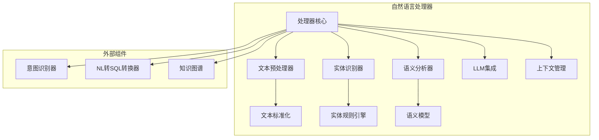
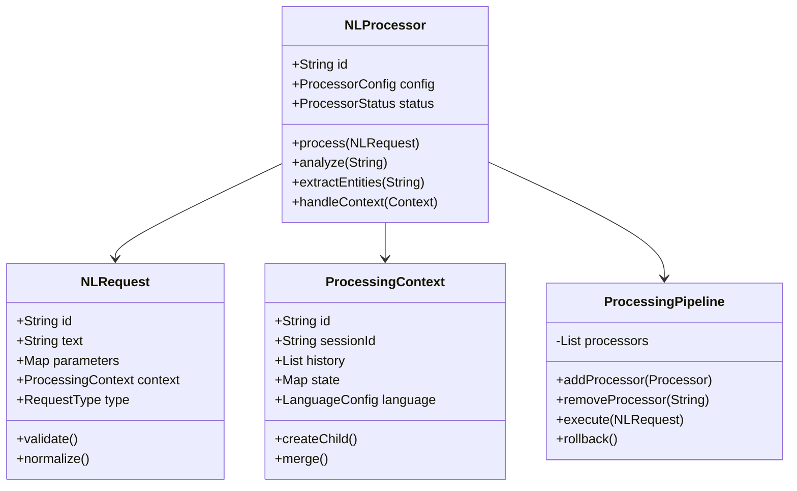
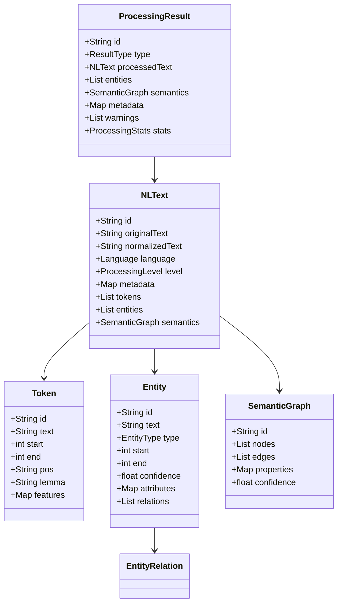
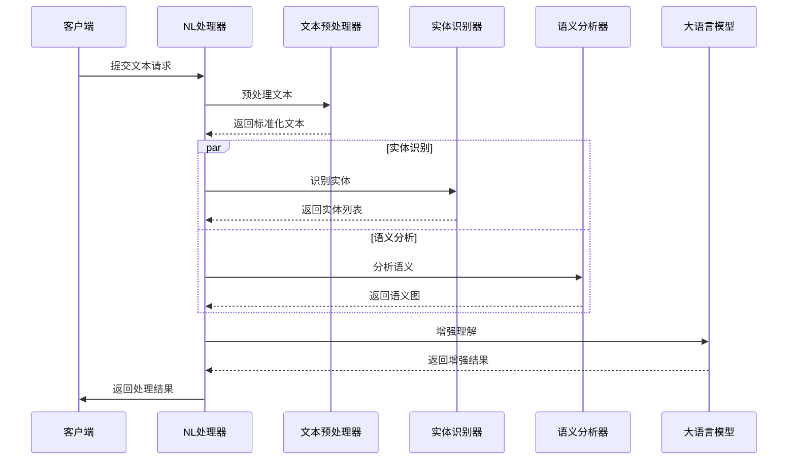
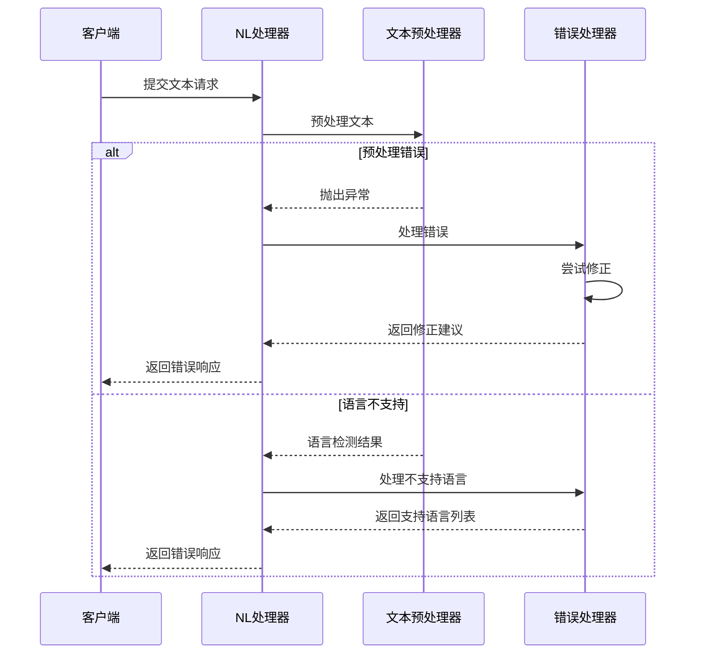

# 自然语言处理器设计文档

## 1. 概述

### 1.1 目的
本文档详细描述自然语言处理器的设计、架构和实现细节。该组件是AI辅助模块的核心入口组件，负责解析和理解用户的自然语言输入。

### 1.2 范围
本文档涵盖自然语言处理器的核心功能、接口、内部实现、数据流和与其他组件的交互。包括语言解析、实体识别、语义分析等方面。

### 1.3 组件定位
自然语言处理器是DataScope系统中AI辅助模块的基础组件，为系统提供自然语言理解能力。

## 2. 架构设计

### 2.1 组件架构


### 2.2 核心类设计


## 3. 功能详细设计

### 3.1 文本处理
- 文本规范化
- 语言检测
- 分词处理
- 拼写检查
- 语法分析
- 依存关系分析

### 3.2 实体识别
- 命名实体识别
- 自定义实体识别
- 实体链接
- 实体关系提取
- 属性识别
- 实体消歧

### 3.3 语义分析
- 语义角色标注
- 语义依存分析
- 语义相似度计算
- 主题提取
- 情感分析
- 语义向量化

## 4. 接口设计

### 4.1 外部接口
| 接口名称 | 类型 | 用途 | 参数 | 返回值 | 异常 |
|--------|------|-----|------|-------|------|
| processText | REST | 处理自然语言文本 | NLRequest | NLResponse | ProcessingException |
| analyzeSemantics | REST | 语义分析 | String text | SemanticResult | AnalysisException |
| extractEntities | REST | 实体提取 | String text | List<Entity> | ExtractionException |
| getContext | REST | 获取处理上下文 | String id | ProcessingContext | ContextException |
| updateContext | REST | 更新处理上下文 | String id, Context | void | ContextException |

### 4.2 内部接口
```java
public interface NLProcessorService {
    NLResponse process(NLRequest request);
    SemanticResult analyze(String text);
    List<Entity> extractEntities(String text);
    ProcessingContext getContext(String id);
    void updateContext(String id, Context context);
}

public interface TextPreprocessor {
    String normalize(String text);
    String tokenize(String text);
    List<String> segment(String text);
    String correct(String text);
}

public interface SemanticAnalyzer {
    SemanticGraph analyze(String text);
    double calculateSimilarity(String text1, String text2);
    List<Topic> extractTopics(String text);
    SentimentResult analyzeSentiment(String text);
}
```

### 4.3 数据模型


## 5. 处理流程

### 5.1 文本处理流程


### 5.2 错误处理流程


## 6. 性能考量

### 6.1 性能指标
| 指标 | 目标值 | 测试方法 |
|-----|-------|---------|
| 文本处理时间 | <100ms | 压力测试 |
| 实体识别时间 | <200ms | 压力测试 |
| 语义分析时间 | <300ms | 压力测试 |
| LLM调用时间 | <1s | 压力测试 |
| 并发处理能力 | >100TPS | 压力测试 |
| 内存占用 | <2GB | 监控系统 |

### 6.2 优化策略
- 文本处理并行化
- 模型量化优化
- 缓存机制
- 批量处理
- 增量处理
- 模型预热

## 7. 安全考量

### 7.1 安全风险
- 敏感信息泄露
- 模型注入攻击
- 资源耗尽
- 数据污染
- 隐私泄露

### 7.2 安全措施
- 输入验证和过滤
- 敏感信息检测
- 资源限制
- 数据脱敏
- 访问控制

## 8. 扩展性设计

### 8.1 扩展点
- 语言支持扩展
- 实体类型扩展
- 分析器扩展
- 模型扩展
- 预处理器扩展

### 8.2 升级策略
- 模型版本管理
- 向后兼容
- 平滑升级
- 降级策略
- 灰度发布

## 9. 依赖关系

### 9.1 内部依赖
- 意图识别器
- NL转SQL转换器
- 知识图谱
- 上下文管理器
- 大语言模型集成

### 9.2 外部依赖
- 语言模型服务
- 向量数据库
- 缓存服务
- 监控系统

## 10. 测试策略

### 10.1 测试场景
- 文本处理测试
- 实体识别测试
- 语义分析测试
- 多语言支持测试
- 性能压力测试
- 安全测试

### 10.2 测试用例
```java
@Test
public void testTextProcessing() {
    NLRequest request = new NLRequest();
    request.setText("查询最近一个月的销售数据");
    request.setLanguage(Language.CHINESE);
    
    NLResponse response = processor.process(request);
    assertNotNull(response);
    assertTrue(response.getEntities().size() > 0);
}

@Test
public void testEntityExtraction() {
    String text = "查询上海地区2024年第一季度的销售数据";
    List<Entity> entities = processor.extractEntities(text);
    
    assertTrue(entities.stream()
        .anyMatch(e -> e.getType() == EntityType.LOCATION && e.getText().equals("上海")));
    assertTrue(entities.stream()
        .anyMatch(e -> e.getType() == EntityType.TIME && e.getText().contains("2024")));
}
```

## 11. 部署考量

### 11.1 部署要求
- JDK 17+
- GPU支持（推荐）
- 大内存配置
- 高性能存储
- 网络带宽保证
- 监控系统集成

### 11.2 配置项
```yaml
nlp:
  processor:
    language:
      default: zh-CN
      supported: [zh-CN, en-US]
    models:
      path: /models
      cache-size: 2GB
    llm:
      endpoint: http://llm-service:8080
      timeout: 5000
      max-tokens: 2048
    preprocessing:
      batch-size: 100
      thread-pool-size: 10
    monitoring:
      enabled: true
      metrics-interval: 60000
```

## 12. 附录

### 12.1 术语表
- NLP：自然语言处理
- Entity：实体，文本中的关键信息单元
- Semantic Analysis：语义分析，理解文本的含义
- Token：分词单元，文本的基本处理单位
- LLM：大语言模型，用于增强文本理解

### 12.2 参考文档
- [AI辅助模块概览](./overview.md)
- [意图识别器设计文档](./intent-recognition-design.md)
- [NL转SQL转换器设计文档](./nl2sql-converter-design.md)
- [知识图谱设计文档](./knowledge-graph-design.md)