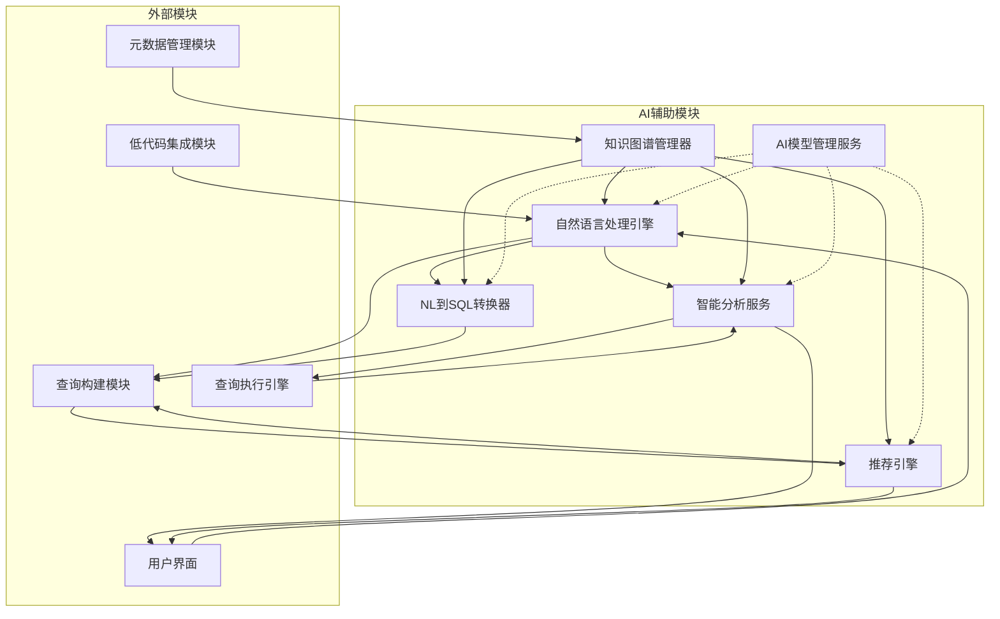
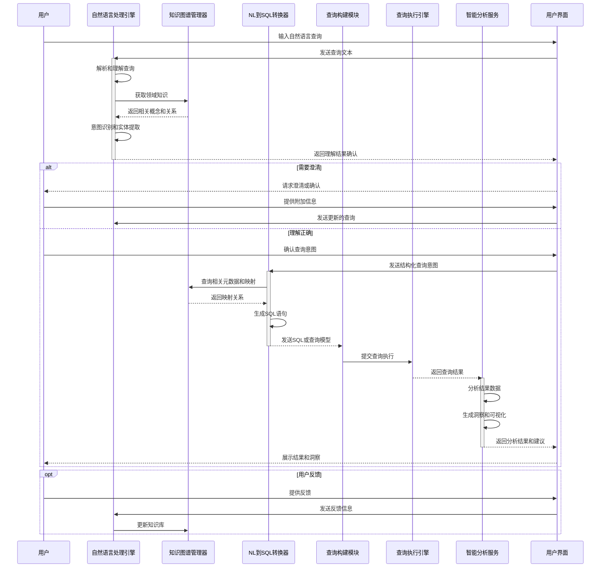

# AI辅助模块概述

## 1. 模块简介

### 1.1 目的
AI辅助模块旨在为系统提供智能分析和决策支持能力，通过自然语言处理、机器学习和知识图谱等技术，增强用户与数据的交互体验，简化复杂数据分析流程，并提供智能化的数据洞察和操作建议。

### 1.2 范围
AI辅助模块涵盖自然语言到SQL转换、智能数据分析、查询优化建议、异常检测、自动化报告生成和个性化推荐等功能，作为系统的智能层，赋能各个模块的高级功能，并为用户提供更直观、高效的数据探索和分析体验。

### 1.3 核心价值
- 降低数据分析的技术门槛
- 加速数据探索和洞察发现
- 提高查询构建和执行效率
- 增强数据关系理解和表达
- 实现智能化数据问答体验
- 提供自适应学习和持续优化
- 支持决策辅助和预测分析
- 简化复杂数据操作流程

## 2. 核心功能

### 2.1 自然语言理解与处理
- 自然语言查询解析
- 领域特定语义理解
- 意图识别和实体抽取
- 上下文管理和对话流
- 查询澄清和反馈循环
- 多语言支持与本地化

### 2.2 自然语言到SQL转换
- 语义解析和映射
- SQL模板生成和填充
- 复杂查询组装
- 查询验证和修正
- 上下文感知的查询构建
- 逐步细化的查询精确化

### 2.3 智能数据分析
- 自动数据探索和摘要
- 异常检测和原因分析
- 趋势识别和预测
- 相关性分析和发现
- 自动化报告生成
- 可视化推荐和构建

### 2.4 个性化推荐
- 查询建议和自动完成
- 相关数据集推荐
- 分析路径建议
- 个性化仪表板推荐
- 用户行为学习和适应
- 协作过滤和内容推荐

### 2.5 知识管理与学习
- 领域知识库构建
- 查询模式学习
- 用户反馈收集和利用
- 持续模型改进和更新
- 知识图谱构建和应用
- 元数据智能增强

## 3. 核心组件

### 3.1 [自然语言处理引擎](./nlp-engine-design.md)
自然语言处理引擎负责解析和理解用户的自然语言输入，识别查询意图、提取关键实体和关系，支持上下文理解和多轮对话，为后续的SQL生成和数据分析提供语义基础。

### 3.2 [NL到SQL转换器](./nl-to-sql-converter-design.md)
NL到SQL转换器将处理后的自然语言查询转换为结构化SQL语句，通过语义映射、模板匹配和规则推理，构建有效的SQL查询，并提供查询验证和优化建议。

### 3.3 [智能分析服务](./intelligent-analysis-service-design.md)
智能分析服务提供自动化的数据分析能力，包括数据探索、异常检测、趋势分析和相关性发现，生成洞察报告和可视化建议，帮助用户快速理解数据。

### 3.4 [推荐引擎](./recommendation-engine-design.md)
推荐引擎基于用户行为、数据特征和历史模式，提供个性化的查询建议、数据集推荐和分析路径建议，提高用户工作效率和发现价值。

### 3.5 [知识图谱管理器](./knowledge-graph-manager-design.md)
知识图谱管理器构建和维护系统的领域知识库，包括数据关系、业务概念和查询模式，为其他AI组件提供结构化知识支持和推理基础。

### 3.6 [AI模型管理服务](./ai-model-management-design.md)
AI模型管理服务负责AI模型的部署、版本控制、监控和更新，支持模型的在线学习和适应，确保AI能力的可靠性和持续优化。

## 4. 架构设计

### 4.1 模块架构

### 4.2 数据流和处理流程

## 5. 关键技术

### 5.1 自然语言处理技术
- 语义解析和理解
- 命名实体识别(NER)
- 句法和依存分析
- 上下文感知的意图识别
- 语义向量表示
- 文本嵌入和语义匹配

### 5.2 机器学习与深度学习
- 序列到序列模型
- 大规模语言模型应用
- 监督和半监督学习
- 迁移学习和少样本学习
- 强化学习和人类反馈
- 特征工程和自动特征学习

### 5.3 知识图谱与语义技术
- 本体设计和构建
- 实体关系抽取
- 知识推理和查询
- 语义标注和富化
- 知识融合和对齐
- 图嵌入和图神经网络

### 5.4 智能分析技术
- 描述性统计分析
- 时间序列分析
- 聚类和分类算法
- 回归和预测模型
- 异常检测算法
- 规则挖掘和关联分析

## 6. 与其他模块的关系

### 6.1 与查询构建模块的关系
- 提供自然语言到查询模型的转换
- 生成查询建议和改进方案
- 共享查询模板和模式库
- 融合用户意图与查询构建
- 协助复杂查询设计

### 6.2 与元数据管理模块的关系
- 获取元数据构建知识图谱
- 提供智能元数据标注建议
- 发现和验证数据关系
- 增强元数据语义信息
- 共享业务术语和概念映射

### 6.3 与查询执行引擎的关系
- 提供查询优化建议
- 接收查询结果进行分析
- 预测查询性能和资源需求
- 建议查询缓存和预计算策略
- 协助诊断查询执行问题

### 6.4 与低代码集成模块的关系
- 提供智能组件推荐
- 支持自然语言配置和操作
- 协助数据绑定和页面构建
- 提供自动化工作流建议
- 实现智能表单和交互设计

## 7. 技术选型与实现考量

### 7.1 NLP和机器学习框架
- Hugging Face Transformers (预训练模型)
- PyTorch/TensorFlow (深度学习)
- spaCy/NLTK (NLP处理)
- Scikit-learn (传统机器学习)
- LangChain (大模型应用框架)
- Ray (分布式训练和推理)

### 7.2 知识图谱技术
- Neo4j (图数据库)
- Apache Jena (RDF框架)
- GraphQL (图查询语言)
- Elasticsearch (搜索和语义匹配)
- DGL/PyG (图神经网络)
- SPARQL (语义查询)

### 7.3 分析和推荐
- Pandas/NumPy (数据处理)
- Apache Spark MLlib (大规模机器学习)
- Prophet/StatsModels (时间序列)
- Surprise/Implicit (推荐系统)
- LIME/SHAP (可解释AI)
- MLeap/ONNX (模型部署)

### 7.4 服务架构
- FastAPI/Flask (微服务API)
- gRPC/Thrift (高性能RPC)
- Redis/Memcached (缓存)
- Kafka/RabbitMQ (事件流)
- MLflow/Kubeflow (ML操作)
- Docker/Kubernetes (容器化部署)

## 8. 安全与合规

### 8.1 AI伦理与公平性
- 模型偏见检测和缓解
- 公平性指标监控
- 多样性和包容性考量
- 结果可解释性设计
- 人类监督和干预机制
- 伦理审查流程

### 8.2 数据隐私与安全
- 隐私保护模型训练
- 联邦学习与分布式训练
- 个人身份信息(PII)处理
- 数据匿名化和脱敏
- 同态加密与安全计算
- 模型和数据访问控制

### 8.3 合规考量
- AI治理框架
- 监管合规文档
- 模型审计和认证
- 版本控制和追溯
- 数据治理集成
- 决策记录和责任分配

## 9. 扩展性设计

### 9.1 扩展点
- 自定义语言模型集成
- 领域特定知识扩展
- 专业分析算法插件
- 自定义推荐策略
- 外部AI服务连接器
- 可视化渲染扩展

### 9.2 适配策略
- 多语言适配框架
- 行业特定词汇适配
- 查询风格个性化
- 多模型并行支持
- 渐进增强能力设计
- 插件化模型管理

## 10. 性能与可靠性

### 10.1 性能目标
- 自然语言解析响应 < 1秒
- SQL生成响应 < 2秒
- 数据分析处理 < 5秒
- 推荐响应时间 < 200ms
- 批量操作吞吐量 > 100/分钟
- 支持并发用户数 > 500

### 10.2 可靠性保障
- 模型降级策略
- 多模型冗余设计
- 服务健康监控
- AI结果验证机制
- 失效重试和恢复
- 性能基准测试

### 10.3 资源管理
- 资源自动伸缩
- 模型缓存策略
- 计算负载均衡
- 批处理优化
- GPU/TPU优化使用
- 内存使用优化

## 11. 未来发展

### 11.1 短期路线图
- 增强自然语言理解准确性
- 扩展支持更多SQL复杂性
- 改进结果解释和可视化
- 优化模型性能和资源使用
- 增强领域适应性和定制化

### 11.2 长期规划
- 多模态查询理解(文本、语音、图像)
- 深度知识推理和因果分析
- 主动学习和自适应优化
- 端到端自动化分析流程
- 跨语言和跨数据源智能集成
- 认知搜索和语义理解增强