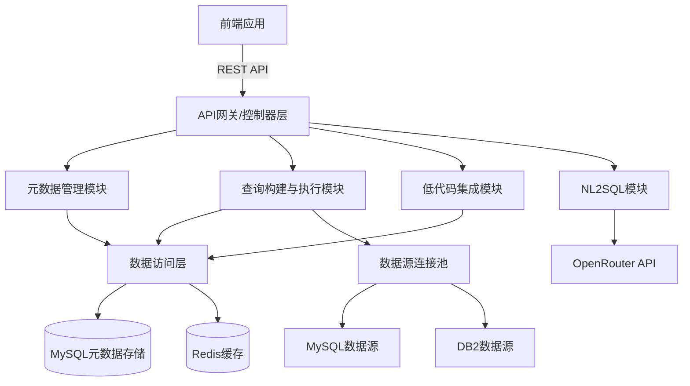
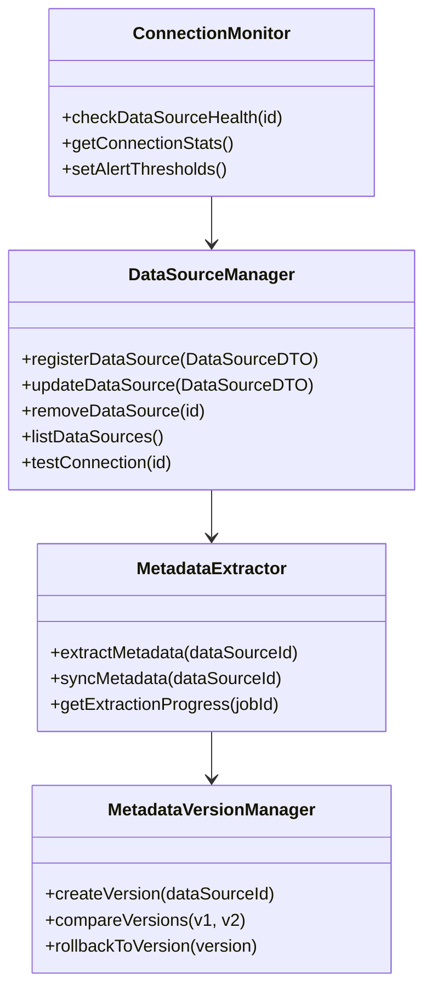
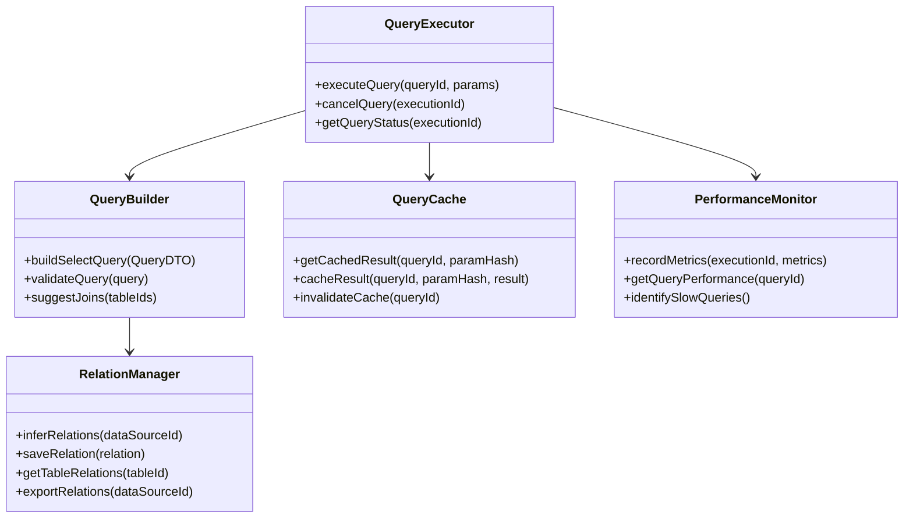
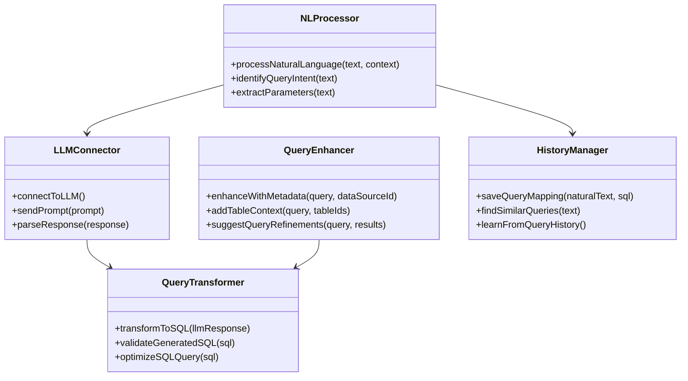
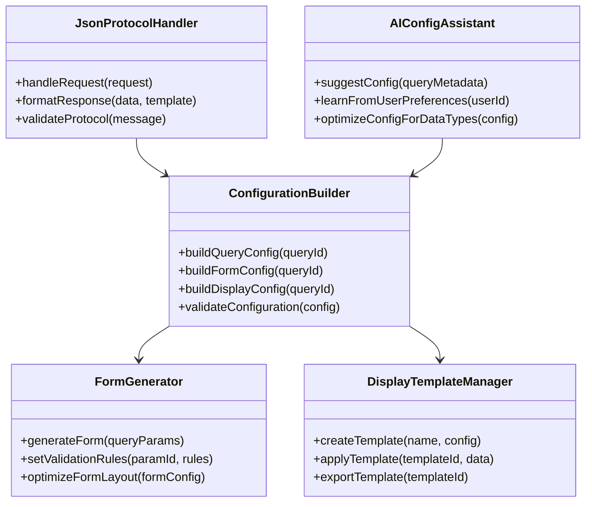
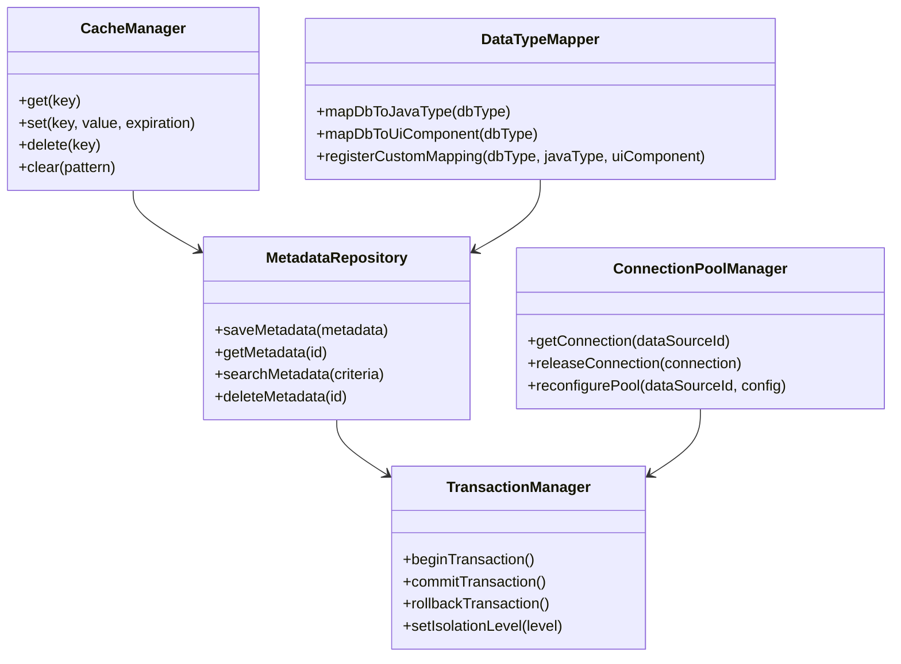
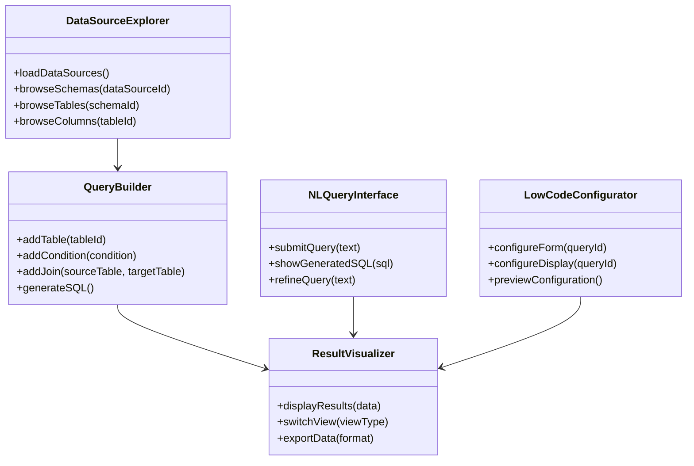
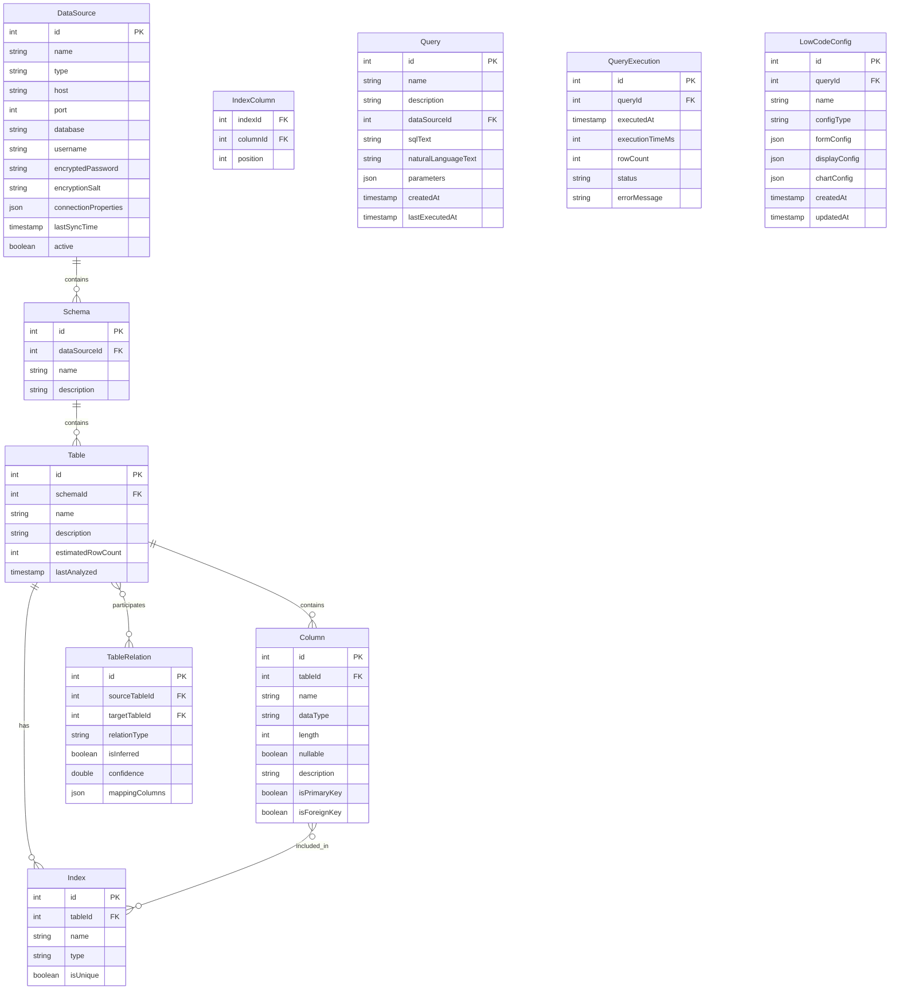
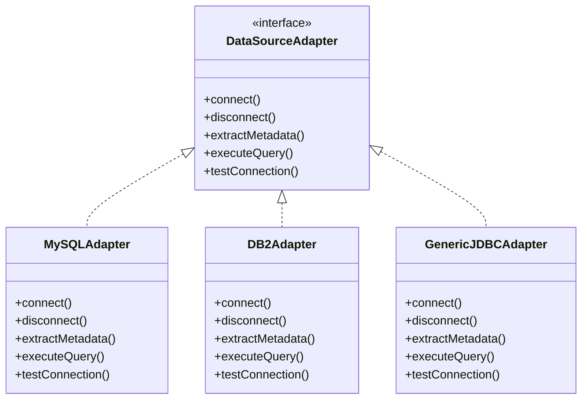

# 数据管理与查询系统 - 架构设计

本文档描述了数据管理与查询系统的架构设计，包括系统整体架构、组件设计、数据模型以及关键技术选择。

## 1. 系统架构概述

### 1.1 架构风格

系统采用**前后端分离的模块化架构**，该架构结合了单体应用的部署简便性和微服务的模块化优势。



### 1.2 技术栈选择

基于需求和现有技术栈，系统采用以下技术：

- **后端**:
  - Java 17+
  - Spring Boot 3.x
  - MyBatis 3.x
  - Maven
  - MySQL (系统数据存储)
  - Redis (缓存)
  - OpenRouter API (自然语言处理)

- **前端**:
  - HTML5
  - Tailwind CSS
  - JavaScript/TypeScript
  - Vue.js 3 (组件框架)
  - ECharts (数据可视化)
  - Font Awesome (图标)
  - Axios (API通信)

### 1.3 系统边界与集成点

- **系统边界**:
  - 管理数据源元数据（不同步实际数据）
  - 执行数据查询（在源数据库执行）
  - 提供低代码平台集成接口

- **集成点**:
  - MySQL和DB2数据库连接
  - OpenRouter LLM API
  - 低代码平台JSON交互协议
  - 组织认证系统

## 2. 核心组件设计

### 2.1 元数据管理模块

**职责**：管理所有数据源的元数据信息

**主要组件**:
- `DataSourceManager`: 数据源连接管理
- `MetadataExtractor`: 元数据抽取引擎
- `MetadataVersionManager`: 元数据版本控制
- `ConnectionMonitor`: 数据源健康监控



### 2.2 查询构建与执行模块

**职责**：构建、优化和执行数据库查询

**主要组件**:
- `QueryBuilder`: SQL查询构建器
- `QueryExecutor`: 查询执行引擎
- `QueryCache`: 查询结果缓存
- `RelationManager`: 表关系管理
- `PerformanceMonitor`: 查询性能监控



### 2.3 NL2SQL模块

**职责**：将自然语言转换为SQL查询

**主要组件**:
- `NLProcessor`: 自然语言处理
- `LLMConnector`: OpenRouter API连接器
- `QueryTransformer`: 将LLM响应转换为结构化查询
- `QueryEnhancer`: 通过元数据增强查询上下文
- `HistoryManager`: 管理历史查询和优化提示



### 2.4 低代码集成模块

**职责**：与低代码平台交互，提供数据服务

**主要组件**:
- `ConfigurationBuilder`: 配置生成器
- `JsonProtocolHandler`: JSON协议处理器
- `FormGenerator`: 表单生成器
- `DisplayTemplateManager`: 显示模板管理
- `AIConfigAssistant`: AI辅助配置生成



### 2.5 数据访问层

**职责**：统一管理系统数据访问

**主要组件**:
- `MetadataRepository`: 元数据存储访问
- `CacheManager`: Redis缓存管理
- `ConnectionPoolManager`: 数据源连接池管理
- `TransactionManager`: 事务管理
- `DataTypeMapper`: 数据类型映射



### 2.6 前端应用

**职责**：提供用户界面和交互

**主要组件**:
- `DataSourceExplorer`: 数据源浏览组件
- `QueryBuilder`: 可视化查询构建器
- `NLQueryInterface`: 自然语言查询界面
- `ResultVisualizer`: 查询结果可视化
- `LowCodeConfigurator`: 低代码配置界面



## 3. 数据模型设计

### 3.1 核心实体关系图



### 3.2 数据库表结构

#### 数据源管理相关表

| 表名 | 描述 |
|------|------|
| data_source | 存储数据源连接信息 |
| schema | 存储数据库模式信息 |
| table_info | 存储表信息 |
| column_info | 存储列信息 |
| index_info | 存储索引信息 |
| index_column | 存储索引列映射 |
| table_relation | 存储表关系 |
| metadata_version | 存储元数据版本信息 |

#### 查询管理相关表

| 表名 | 描述 |
|------|------|
| query | 存储查询定义 |
| query_parameter | 存储查询参数定义 |
| query_execution | 存储查询执行记录 |
| nl_query_mapping | 存储自然语言与SQL映射 |
| query_favorite | 存储用户收藏的查询 |
| query_history | 存储用户查询历史 |

#### 低代码集成相关表

| 表名 | 描述 |
|------|------|
| lowcode_config | 存储低代码配置信息 |
| display_template | 存储显示模板 |
| form_config | 存储表单配置 |
| user_preference | 存储用户偏好设置 |
| api_version | 存储API版本信息 |
| api_usage_stat | 存储API使用统计 |

## 4. 接口设计

### 4.1 API端点设计

#### 数据源管理API

```
POST /api/datasources         # 创建新数据源
GET /api/datasources          # 获取所有数据源
GET /api/datasources/{id}     # 获取特定数据源
PUT /api/datasources/{id}     # 更新数据源
DELETE /api/datasources/{id}  # 删除数据源
GET /api/datasources/{id}/metadata  # 获取数据源元数据
POST /api/datasources/{id}/test     # 测试数据源连接
```

#### 查询API

```
POST /api/queries                 # 创建SQL查询
POST /api/queries/natural-language # 创建自然语言查询
GET /api/queries/{id}             # 获取查询
PUT /api/queries/{id}             # 更新查询
DELETE /api/queries/{id}          # 删除查询
POST /api/queries/{id}/execute    # 执行查询
GET /api/queries/history          # 获取查询历史
POST /api/queries/{id}/favorite   # 收藏查询
GET /api/queries/favorites        # 获取收藏查询
```

#### 表关系API

```
GET /api/relations                # 获取所有表关系
POST /api/relations               # 创建表关系
GET /api/relations/{id}           # 获取特定表关系
PUT /api/relations/{id}           # 更新表关系
DELETE /api/relations/{id}        # 删除表关系
GET /api/relations/infer          # 自动推断表关系
POST /api/relations/export        # 导出表关系
POST /api/relations/import        # 导入表关系
```

#### 低代码集成API

```
POST /api/lowcode/config          # 创建低代码配置
GET /api/lowcode/config/{id}      # 获取配置
PUT /api/lowcode/config/{id}      # 更新配置
DELETE /api/lowcode/config/{id}   # 删除配置
POST /api/lowcode/render          # 根据配置渲染数据
GET /api/lowcode/templates        # 获取可用模板
POST /api/lowcode/ai-suggestion   # 获取AI建议的配置
```

#### 数据查询API

```
POST /api/data/{queryId}          # 查询数据(v1)
POST /api/v{version}/data/{queryId} # 带版本的查询
GET /api/data/export/{queryId}    # 导出数据
```

### 4.2 JSON交互协议

低代码平台交互协议示例：

```json
{
  "version": "1.0",
  "queryId": "query123",
  "config": {
    "form": {
      "layout": "standard",
      "fields": [
        {
          "id": "param1",
          "type": "text",
          "label": "客户名称",
          "required": true,
          "validation": {
            "maxLength": 50
          }
        },
        {
          "id": "param2",
          "type": "date",
          "label": "订单日期",
          "required": false
        }
      ]
    },
    "display": {
      "type": "table",
      "columns": [
        {
          "field": "customer_name",
          "header": "客户名称",
          "width": 200,
          "sortable": true
        },
        {
          "field": "order_date",
          "header": "订单日期",
          "width": 150,
          "format": "yyyy-MM-dd"
        },
        {
          "field": "order_amount",
          "header": "订单金额",
          "width": 150,
          "format": "¥{value}",
          "align": "right"
        }
      ],
      "operations": [
        {
          "type": "button",
          "label": "查看详情",
          "action": "view",
          "icon": "eye"
        },
        {
          "type": "button",
          "label": "编辑",
          "action": "edit",
          "icon": "pencil"
        }
      ]
    }
  }
}
```

## 5. 缓存策略

### 5.1 缓存层次

系统采用多层缓存策略：

1. **前端缓存**:
   - LocalStorage/SessionStorage 缓存用户偏好和常用数据
   - 组件内存缓存减少重复渲染

2. **应用层缓存**:
   - Redis缓存查询结果
   - Redis缓存元数据信息
   - 本地内存缓存常用配置

3. **数据库层缓存**:
   - 利用数据库自身查询缓存
   - 执行计划缓存

### 5.2 缓存策略

| 缓存内容 | 缓存位置 | 过期策略 | 刷新机制 |
|---------|---------|---------|---------|
| 元数据结构 | Redis | 24小时 | 元数据更新时主动刷新 |
| 查询结果 | Redis | 可配置(默认10分钟) | 查询参数变化或主动刷新 |
| 表关系 | Redis | 24小时 | 关系变更时刷新 |
| 用户偏好 | Redis | 7天 | 用户修改时刷新 |
| 查询历史 | MySQL | 不过期 | - |
| 配置模板 | Redis | 1小时 | 模板变更时刷新 |

## 6. 安全设计

### 6.1 数据源凭证加密

- 使用AES-256加密算法
- 每个密码单独加盐
- 加密密钥安全存储（不在配置文件中明文存储）
- 定期轮换加密密钥

### 6.2 查询安全

- 查询参数绑定防止SQL注入
- 查询超时机制（默认30秒）
- 查询频率限制
- 敏感数据列掩码处理

### 6.3 API安全

- 请求验证和消息签名
- 频率限制和流量控制
- 版本管理确保兼容性
- API密钥管理

## 7. 性能优化

### 7.1 查询优化

- 定期收集统计信息优化查询
- 智能查询拆分处理大数据量
- 支持异步查询模式
- 查询指标监控和优化建议

### 7.2 系统优化

- 数据库索引优化
- 连接池管理
- 缓存预热机制
- 大查询结果分页处理

### 7.3 资源限制

- 查询资源配额管理
- 用户级别的频率限制
- 数据导出量限制(最大50000条)
- 长时间查询自动熔断

## 8. 扩展性设计

### 8.1 数据源适配器

系统采用适配器模式支持多种数据源：



### 8.2 UI组件映射框架

数据类型与UI组件的映射关系：

| 数据库类型 | Java类型 | UI组件 | 验证规则 |
|-----------|---------|--------|---------|
| VARCHAR, CHAR | String | 文本框 | maxLength |
| TEXT, CLOB | String | 文本域 | - |
| INT, SMALLINT | Integer | 数字输入框 | min, max |
| BIGINT | Long | 数字输入框 | min, max |
| DECIMAL, NUMERIC | BigDecimal | 数字输入框 | min, max, precision |
| DATE | LocalDate | 日期选择器 | minDate, maxDate |
| TIME | LocalTime | 时间选择器 | - |
| TIMESTAMP, DATETIME | LocalDateTime | 日期时间选择器 | - |
| BOOLEAN, BIT | Boolean | 开关/复选框 | - |
| ENUM | String | 下拉选择框 | enumValues |
| BLOB, BINARY | byte[] | 文件上传 | maxSize, fileTypes |

### 8.3 插件系统设计

系统支持通过插件扩展功能：

1. **数据源插件**: 添加新的数据库类型支持
2. **可视化插件**: 扩展数据可视化方式
3. **UI组件插件**: 自定义UI组件类型
4. **导出插件**: 支持更多导出格式
5. **AI增强插件**: 扩展AI辅助功能

## 9. 部署架构

### 9.1 本地部署架构

```mermaid
graph TD
    A[客户端浏览器] --> B[Web服务器/负载均衡]
    B --> C[应用服务器]
    C --> D[MySQL系统数据库]
    C --> E[Redis缓存服务器]
    C --> F[外部数据源]
    C --> G[OpenRouter API]
    H[低代码平台] --> C
## 系统功能模块关系图

```mermaid
graph LR
    A[数据源管理] --> B(元数据管理)
    A --> C(数据源配置)
    B --> D{数据源}
    C --> D
    E[智能数据发现和查询] --> F(SQL查询构建)
    E --> G(自然语言查询)
    F --> D
    G --> D
    H[低代码集成] --> I(查询结果配置)
    H --> J(查询条件表单)
    I --> E
    J --> E
    K[API和服务集成] --> L(REST API)
    K --> M(数据导出)
    L --> E
    M --> E
    N[安全和性能] --> O(数据源凭证加密)
    N --> P(SQL注入防护)
    O --> A
    P --> E
```
```

### 9.2 部署要求

- **硬件要求**:
  - CPU: 4核+ (推荐8核)
  - 内存: 8GB+ (推荐16GB)
  - 存储: 100GB+ SSD
  - 网络: 千兆网络连接

- **软件要求**:
  - JDK 17+
  - MySQL 8.0+
  - Redis 6.0+
  - Nginx/Apache (可选，用于反向代理)
  - Docker (可选，用于容器化部署)

### 9.3 容器化部署

系统支持使用Docker和Docker Compose进行容器化部署，包括以下容器：

1. 应用服务容器
2. MySQL数据库容器
3. Redis缓存容器
4. Nginx反向代理容器

## 10. 后续扩展规划

1. **多租户支持**: 扩展系统支持多租户隔离
2. **高级权限控制**: 细粒度的数据访问控制
3. **数据质量检测**: 添加数据质量评估功能
4. **更多数据源支持**: 扩展支持NoSQL和大数据源
5. **ETL集成**: 与ETL工具集成支持数据转换
6. **更多AI功能**: 扩展AI辅助分析能力