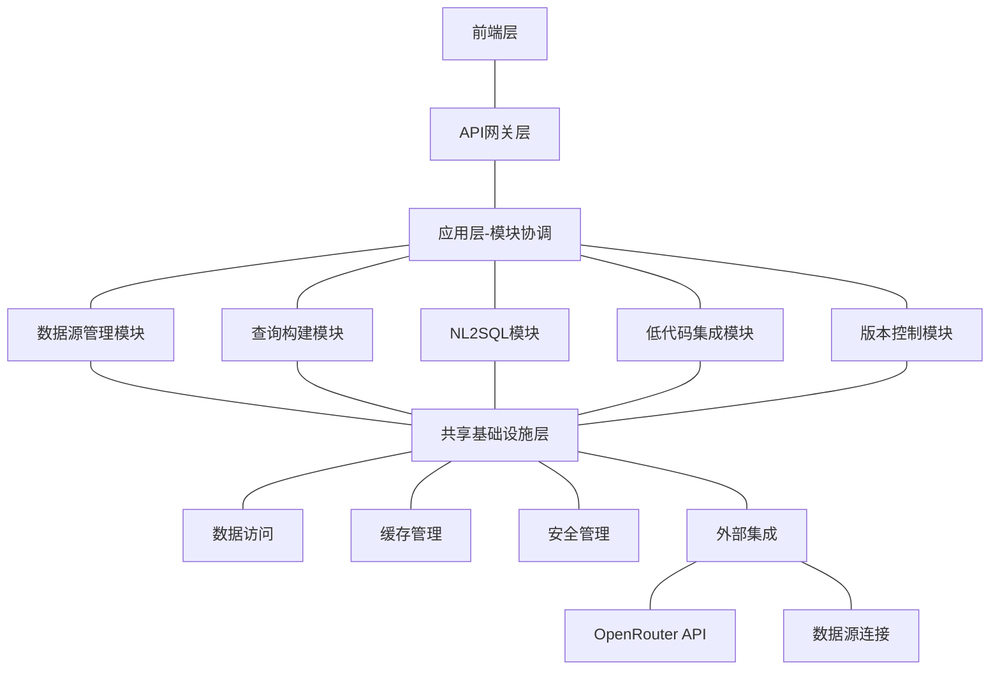
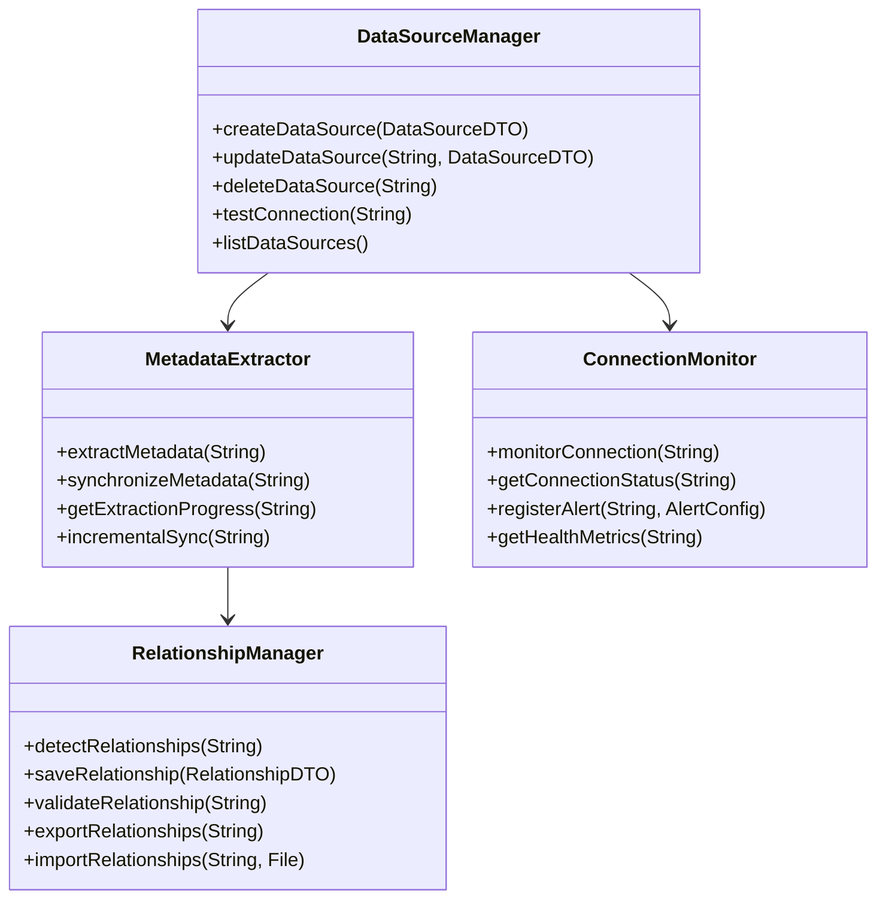
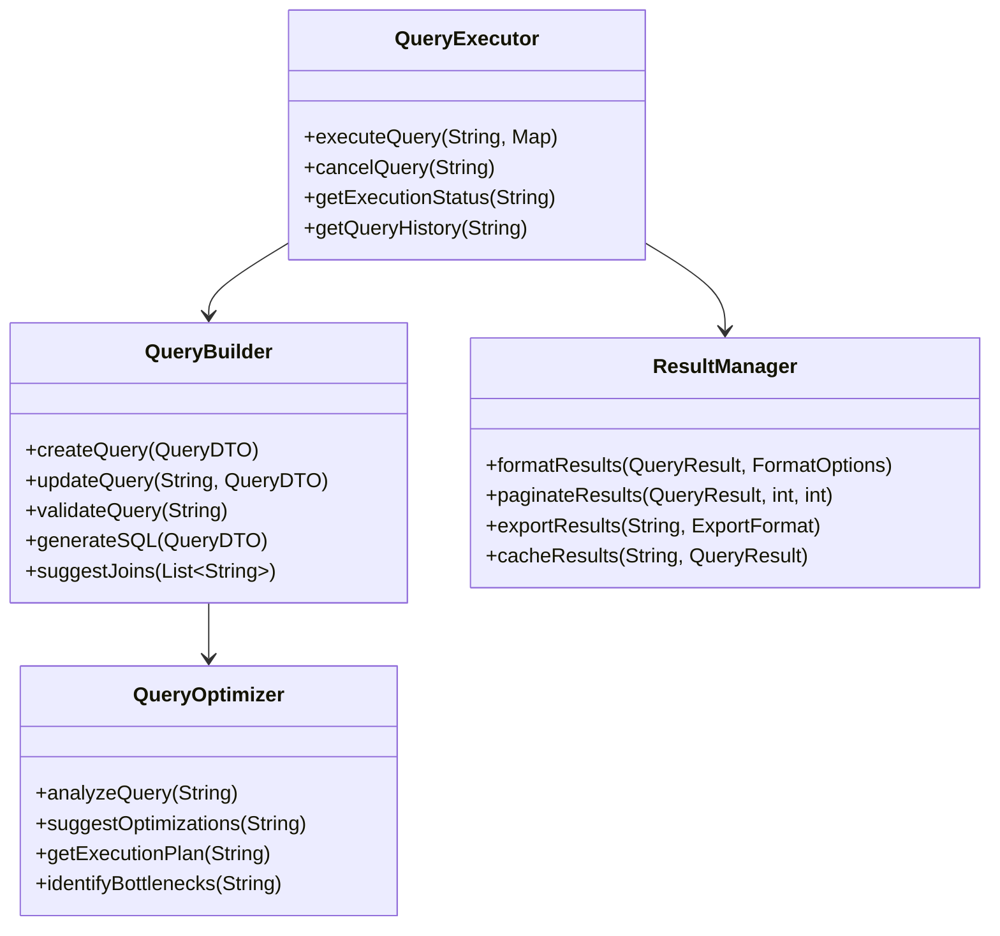
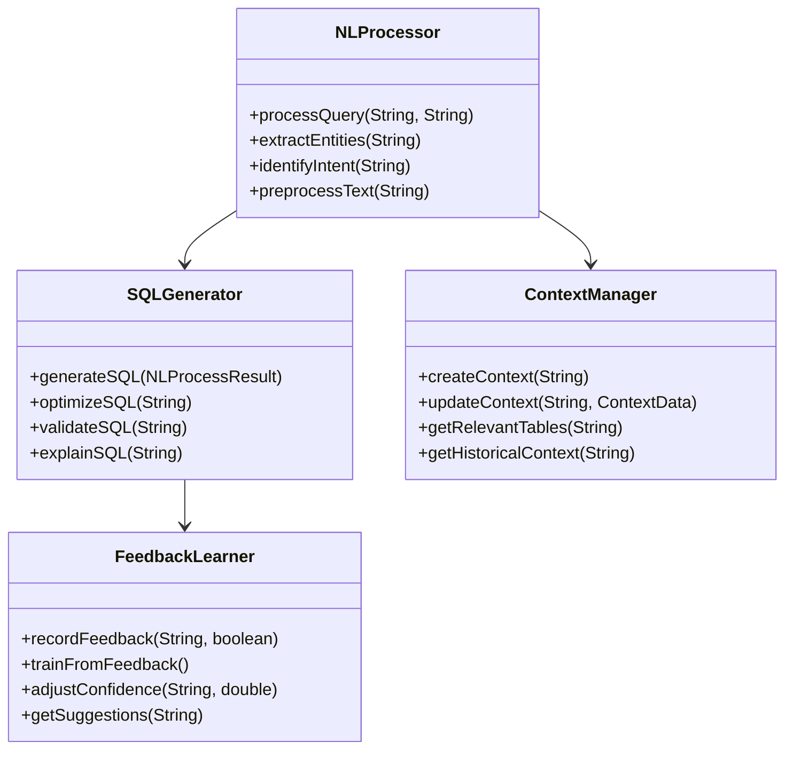
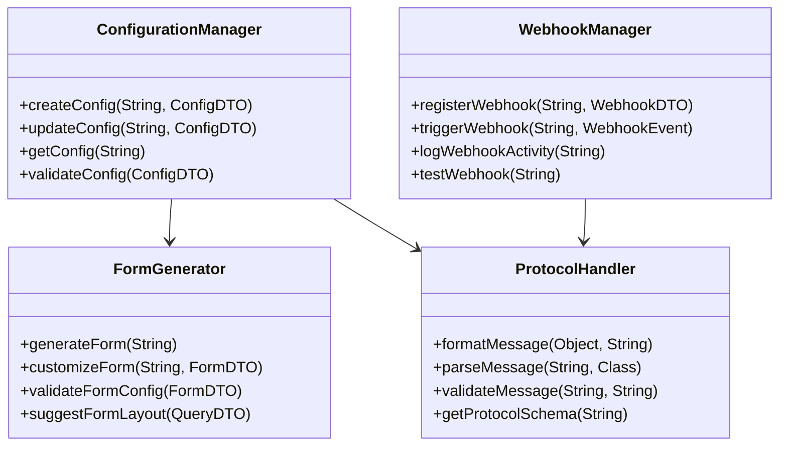
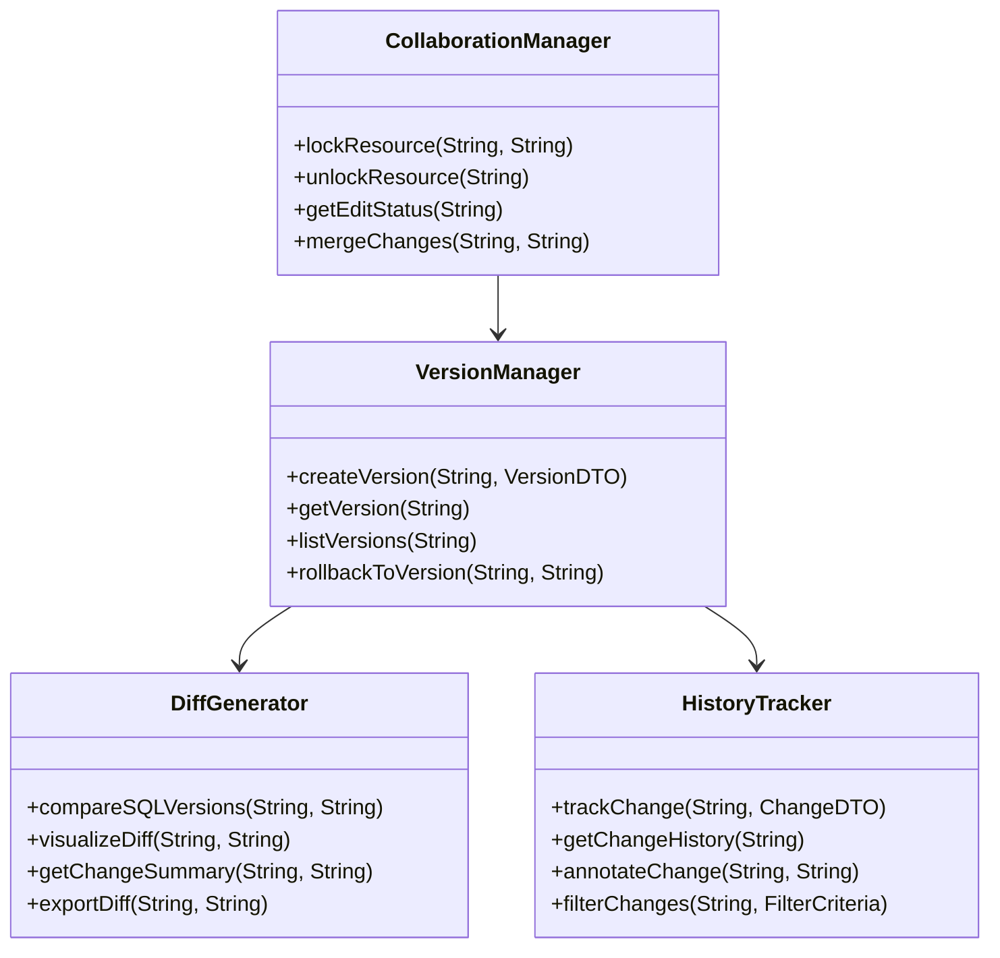
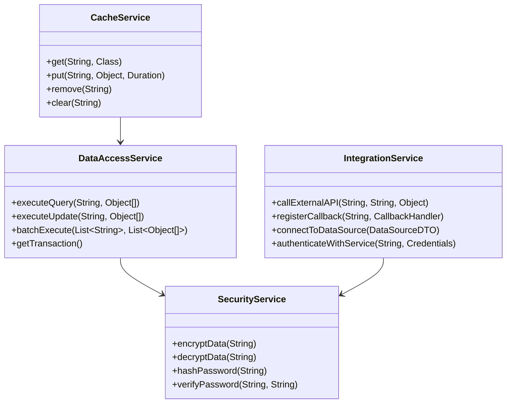
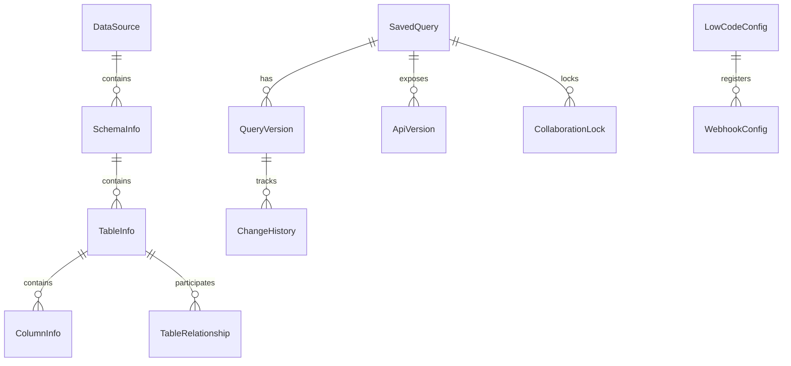

# DataScope系统 - 架构设计

本文档描述了DataScope全面数据管理和查询系统的架构设计，包括系统架构、组件设计、数据模型设计以及关键技术决策。

## 1. 系统架构概述

### 1.1 架构风格

DataScope系统采用**模块化单体架构**，在现有DDD四层架构的基础上扩展和优化，以实现高内聚低耦合的设计。



### 1.2 系统边界与集成点

- **系统边界**:
  - 管理多数据源的元数据（不复制实际数据）
  - 执行数据查询并返回结果
  - 提供低代码平台集成接口
  - 提供自然语言到SQL的转换
  - 提供查询版本控制和协作功能

- **集成点**:
  - MySQL和DB2数据库连接
  - OpenRouter LLM API
  - Redis缓存服务
  - 低代码平台（通过JSON协议和Webhook）
  - 外部认证系统（用户身份验证）

## 2. 核心模块设计

### 2.1 数据源管理模块

**职责**：管理数据源连接、元数据提取与同步，数据源健康监控，表关系管理。

**主要组件**:
- `DataSourceManager`: 数据源连接管理
- `MetadataExtractor`: 元数据抽取引擎
- `ConnectionMonitor`: 数据源健康监控
- `RelationshipManager`: 表关系管理



### 2.2 查询构建模块

**职责**：SQL查询构建、查询执行、结果管理、查询优化和分析。

**主要组件**:
- `QueryBuilder`: SQL查询构建
- `QueryExecutor`: 查询执行
- `QueryOptimizer`: 查询优化
- `ResultManager`: 结果管理



### 2.3 NL2SQL模块

**职责**：自然语言处理、SQL生成与优化、学习与改进。

**主要组件**:
- `NLProcessor`: 自然语言处理
- `SQLGenerator`: SQL生成
- `ContextManager`: 上下文管理
- `FeedbackLearner`: 反馈学习



### 2.4 低代码集成模块

**职责**：查询结果配置、表单生成、JSON协议处理、Webhook管理。

**主要组件**:
- `ConfigurationManager`: 配置管理
- `FormGenerator`: 表单生成
- `WebhookManager`: Webhook管理
- `ProtocolHandler`: 协议处理



### 2.5 版本控制模块

**职责**：SQL查询版本管理、API版本控制、变更历史管理。

**主要组件**:
- `VersionManager`: 版本管理
- `DiffGenerator`: 差异比较
- `HistoryTracker`: 历史追踪
- `CollaborationManager`: 协作管理



### 2.6 共享基础设施层

**职责**：为所有模块提供共享服务，包括数据访问、缓存、安全和外部集成。

**主要组件**:
- `DataAccessService`: 数据访问服务
- `CacheService`: 缓存服务
- `SecurityService`: 安全服务
- `IntegrationService`: 外部集成服务



## 3. 数据模型设计

### 3.1 核心实体关系

DataScope系统将与现有领域模型集成，并新增以下实体：

1. **QueryVersion**: 查询版本
2. **ApiVersion**: API版本
3. **WebhookConfig**: Webhook配置
4. **CollaborationLock**: 协作锁
5. **ChangeHistory**: 变更历史



### 3.2 数据库表设计

#### 查询版本表 (tbl_query_version)

| 字段名 | 类型 | 说明 | 约束 |
|--------|------|------|------|
| id | VARCHAR(36) | 版本ID | PK |
| query_id | VARCHAR(36) | 查询ID | FK -> tbl_saved_query.id |
| version_name | VARCHAR(100) | 版本名称 | NOT NULL |
| version_number | INT | 版本号 | NOT NULL |
| sql_text | TEXT | SQL文本 | NOT NULL |
| parameters | JSON | 参数定义 | |
| description | TEXT | 版本描述 | |
| created_at | TIMESTAMP | 创建时间 | NOT NULL |
| created_by | VARCHAR(50) | 创建人 | NOT NULL |
| nonce | VARCHAR(50) | 乐观锁版本号 | NOT NULL |

索引:
- u_idx_query_version_query_id_version_number (query_id, version_number) UNIQUE
- idx_query_version_query_id (query_id)

#### API版本表 (tbl_api_version)

| 字段名 | 类型 | 说明 | 约束 |
|--------|------|------|------|
| id | VARCHAR(36) | API版本ID | PK |
| query_id | VARCHAR(36) | 查询ID | FK -> tbl_saved_query.id |
| version | VARCHAR(20) | 版本号 | NOT NULL |
| is_active | BOOLEAN | 是否激活 | DEFAULT true |
| api_path | VARCHAR(200) | API路径 | NOT NULL |
| created_at | TIMESTAMP | 创建时间 | NOT NULL |
| created_by | VARCHAR(50) | 创建人 | NOT NULL |
| nonce | VARCHAR(50) | 乐观锁版本号 | NOT NULL |

索引:
- u_idx_api_version_query_id_version (query_id, version) UNIQUE
- idx_api_version_query_id (query_id)

#### Webhook配置表 (tbl_webhook_config)

| 字段名 | 类型 | 说明 | 约束 |
|--------|------|------|------|
| id | VARCHAR(36) | 配置ID | PK |
| config_id | VARCHAR(36) | 低代码配置ID | FK -> tbl_lowcode_config.id |
| endpoint_url | VARCHAR(500) | 端点URL | NOT NULL |
| secret_key | VARCHAR(100) | 密钥 | NOT NULL |
| event_types | JSON | 事件类型 | NOT NULL |
| active | BOOLEAN | 是否激活 | DEFAULT true |
| created_at | TIMESTAMP | 创建时间 | NOT NULL |
| created_by | VARCHAR(50) | 创建人 | NOT NULL |
| nonce | VARCHAR(50) | 乐观锁版本号 | NOT NULL |

索引:
- idx_webhook_config_config_id (config_id)

#### 协作锁表 (tbl_collaboration_lock)

| 字段名 | 类型 | 说明 | 约束 |
|--------|------|------|------|
| id | VARCHAR(36) | 锁ID | PK |
| resource_id | VARCHAR(36) | 资源ID | NOT NULL |
| resource_type | VARCHAR(50) | 资源类型 | NOT NULL |
| locked_by | VARCHAR(50) | 锁定用户 | NOT NULL |
| locked_at | TIMESTAMP | 锁定时间 | NOT NULL |
| expires_at | TIMESTAMP | 过期时间 | NOT NULL |
| nonce | VARCHAR(50) | 乐观锁版本号 | NOT NULL |

索引:
- u_idx_collaboration_lock_resource (resource_id, resource_type) UNIQUE
- idx_collaboration_lock_expires_at (expires_at)

#### 变更历史表 (tbl_change_history)

| 字段名 | 类型 | 说明 | 约束 |
|--------|------|------|------|
| id | VARCHAR(36) | 历史ID | PK |
| resource_id | VARCHAR(36) | 资源ID | NOT NULL |
| resource_type | VARCHAR(50) | 资源类型 | NOT NULL |
| change_type | VARCHAR(20) | 变更类型 | NOT NULL |
| before_value | TEXT | 变更前值 | |
| after_value | TEXT | 变更后值 | |
| comment | TEXT | 变更说明 | |
| created_at | TIMESTAMP | 创建时间 | NOT NULL |
| created_by | VARCHAR(50) | 创建人 | NOT NULL |

索引:
- idx_change_history_resource (resource_id, resource_type)
- idx_change_history_created_at (created_at)

## 4. 接口设计

### 4.1 API端点设计

#### 数据源管理API

```
GET /api/datasources                      # 获取所有数据源
POST /api/datasources                     # 创建数据源
GET /api/datasources/{id}                 # 获取单个数据源
PUT /api/datasources/{id}                 # 更新数据源
DELETE /api/datasources/{id}              # 删除数据源
POST /api/datasources/{id}/test           # 测试数据源连接
POST /api/datasources/{id}/sync           # 同步数据源元数据
GET /api/datasources/{id}/sync/{jobId}    # 获取同步任务状态
GET /api/datasources/{id}/health          # 获取数据源健康状态
```

#### 元数据API

```
GET /api/metadata/datasources/{id}/schemas        # 获取数据源的所有模式
GET /api/metadata/schemas/{id}/tables             # 获取模式的所有表
GET /api/metadata/tables/{id}/columns             # 获取表的所有列
GET /api/metadata/tables/{id}/indexes             # 获取表的所有索引
GET /api/metadata/tables/{id}/sample              # 获取表的样本数据
POST /api/metadata/tables/relationship            # 创建表关系
GET /api/metadata/tables/relationship/{id}        # 获取表关系
PUT /api/metadata/tables/relationship/{id}        # 更新表关系
DELETE /api/metadata/tables/relationship/{id}     # 删除表关系
POST /api/metadata/tables/relationship/detect     # 自动检测表关系
```

#### 查询API

```
POST /api/queries                         # 创建查询
GET /api/queries                          # 获取所有查询
GET /api/queries/{id}                     # 获取单个查询
PUT /api/queries/{id}                     # 更新查询
DELETE /api/queries/{id}                  # 删除查询
POST /api/queries/{id}/execute            # 执行查询
GET /api/queries/{id}/history             # 获取查询历史
GET /api/queries/{id}/analyze             # 分析查询
```

#### 自然语言查询API

```
POST /api/nl/query                        # 执行自然语言查询
POST /api/nl/suggest                      # 获取查询建议
POST /api/nl/feedback                     # 提交查询反馈
GET /api/nl/history                       # 获取查询历史
```

#### 低代码集成API

```
POST /api/lowcode/configs                 # 创建低代码配置
GET /api/lowcode/configs                  # 获取所有配置
GET /api/lowcode/configs/{id}             # 获取单个配置
PUT /api/lowcode/configs/{id}             # 更新配置
DELETE /api/lowcode/configs/{id}          # 删除配置
POST /api/lowcode/webhooks                # 注册Webhook
GET /api/lowcode/webhooks                 # 获取Webhook列表
DELETE /api/lowcode/webhooks/{id}         # 删除Webhook
POST /api/lowcode/webhooks/{id}/test      # 测试Webhook
```

#### 版本控制API

```
POST /api/versions/queries/{queryId}               # 创建查询版本
GET /api/versions/queries/{queryId}                # 获取查询所有版本
GET /api/versions/queries/{queryId}/{versionId}    # 获取特定版本
POST /api/versions/queries/{queryId}/rollback      # 回滚到特定版本
GET /api/versions/queries/{queryId}/diff           # 比较版本差异
POST /api/versions/apis/{queryId}                  # 创建API版本
GET /api/versions/apis/{queryId}                   # 获取API所有版本
PUT /api/versions/apis/{queryId}/{versionId}       # 更新API版本
```

#### 协作API

```
POST /api/collaboration/lock/{resourceType}/{resourceId}    # 锁定资源
DELETE /api/collaboration/lock/{resourceType}/{resourceId}  # 释放锁
GET /api/collaboration/status/{resourceType}/{resourceId}   # 获取编辑状态
GET /api/collaboration/history/{resourceType}/{resourceId}  # 获取变更历史
```

### 4.2 组件接口设计

各模块通过定义明确的接口与其他模块交互，确保模块间低耦合高内聚：

#### 数据源管理接口

```java
public interface DataSourceService {
    DataSource createDataSource(DataSourceDTO dto);
    DataSource getDataSource(String id);
    List<DataSource> getAllDataSources();
    DataSource updateDataSource(String id, DataSourceDTO dto);
    void deleteDataSource(String id);
    ConnectionTestResult testConnection(String id);
    MetadataSyncJob synchronizeMetadata(String id);
    MetadataSyncJob getSyncJob(String jobId);
    HealthStatus getHealthStatus(String id);
}

public interface MetadataService {
    List<SchemaInfo> getSchemas(String dataSourceId);
    List<TableInfo> getTables(String schemaId);
    List<ColumnInfo> getColumns(String tableId);
    List<IndexInfo> getIndexes(String tableId);
    List<Object[]> getSampleData(String tableId, int limit);
    TableRelationship createRelationship(RelationshipDTO dto);
    List<TableRelationship> detectRelationships(String dataSourceId, double confidenceThreshold);
}
```

#### 查询构建接口

```java
public interface QueryService {
    SavedQuery createQuery(QueryDTO dto);
    SavedQuery getQuery(String id);
    List<SavedQuery> getAllQueries(QueryFilter filter);
    SavedQuery updateQuery(String id, QueryDTO dto);
    void deleteQuery(String id);
    QueryResult executeQuery(String id, Map<String, Object> parameters);
    List<QueryExecution> getQueryHistory(String id);
    QueryAnalysis analyzeQuery(String id);
}
```

#### 自然语言查询接口

```java
public interface NLQueryService {
    NLQueryResult processNaturalLanguageQuery(String dataSourceId, String naturalLanguage);
    List<String> suggestRefinements(String dataSourceId, String naturalLanguage);
    void submitFeedback(String queryId, boolean isAccepted, String feedback);
    List<NLQueryHistory> getQueryHistory(String userId);
}
```

#### 低代码集成接口

```java
public interface LowCodeService {
    LowCodeConfig createConfig(String queryId, LowCodeConfigDTO dto);
    LowCodeConfig getConfig(String id);
    List<LowCodeConfig> getAllConfigs(ConfigFilter filter);
    LowCodeConfig updateConfig(String id, LowCodeConfigDTO dto);
    void deleteConfig(String id);
    WebhookConfig registerWebhook(WebhookDTO dto);
    List<WebhookConfig> getWebhooks(String configId);
    void deleteWebhook(String id);
    WebhookTestResult testWebhook(String id);
}
```

#### 版本控制接口

```java
public interface VersionControlService {
    QueryVersion createQueryVersion(String queryId, VersionDTO dto);
    List<QueryVersion> getQueryVersions(String queryId);
    QueryVersion getQueryVersion(String queryId, String versionId);
    SavedQuery rollbackToVersion(String queryId, String versionId);
    DiffResult compareVersions(String versionId1, String versionId2);
    ApiVersion createApiVersion(String queryId, ApiVersionDTO dto);
    List<ApiVersion> getApiVersions(String queryId);
    ApiVersion updateApiVersion(String queryId, String versionId, ApiVersionDTO dto);
}
```

#### 协作接口

```java
public interface CollaborationService {
    CollaborationLock lockResource(String resourceType, String resourceId, String userId);
    void unlockResource(String resourceType, String resourceId, String userId);
    CollaborationStatus getEditStatus(String resourceType, String resourceId);
    List<ChangeHistory> getChangeHistory(String resourceType, String resourceId);
}
```

## 5. 缓存策略

### 5.1 缓存层次

系统采用多层缓存策略：

1. **应用层缓存**:
   - 元数据缓存：缓存数据库结构信息
   - 查询结果缓存：缓存频繁执行的查询结果
   - 查询分析缓存：缓存查询分析和执行计划
   - 配置缓存：缓存低代码配置信息

2. **Redis缓存**:
   - 分布式缓存支持水平扩展
   - 用于集群环境下的数据共享
   - 支持缓存过期和淘汰策略

### 5.2 缓存策略表

| 缓存类型 | 缓存键模式 | 过期时间 | 刷新策略 | 实现方式 |
|---------|-----------|---------|----------|---------|
| 元数据缓存 | metadata:{dataSourceId}:{objectType} | 24小时 | 元数据同步时刷新 | Redis |
| 表关系缓存 | relation:{dataSourceId} | 24小时 | 关系更新时刷新 | Redis |
| 查询结果缓存 | query:result:{queryId}:{paramHash} | 可配置(默认10分钟) | 按需刷新，数据变更时失效 | Redis |
| 查询分析缓存 | query:analysis:{queryId} | 1小时 | 查询更新时刷新 | Redis |
| 低代码配置缓存 | lowcode:config:{configId} | 1小时 | 配置更新时刷新 | Redis |
| 常用查询缓存 | query:frequent:{userId} | 7天 | 查询频率变化时更新 | Redis |
| 用户偏好缓存 | user:preference:{userId} | 30天 | 用户修改时更新 | Redis |

## 6. 安全设计

### 6.1 数据源凭证加密

- 使用AES-256加密算法保护数据源密码
- 每个密码使用单独的随机盐值
- 加密密钥安全存储，不在配置文件中明文保存
- 定期轮换加密密钥
- 敏感信息在传输过程中使用TLS加密

### 6.2 查询安全

- 使用参数化查询防止SQL注入
- 设置查询超时限制（默认30秒）
- 实施按用户的查询频率限制（每分钟10次）
- 为包含敏感数据的列实施数据掩码机制
- 对敏感操作记录审计日志

### 6.3 API安全

- 针对REST API实施JWT认证
- 对Webhook实施签名验证
- 按客户端IP实施请求频率限制
- API访问权限的细粒度控制
- API密钥生命周期管理
- 对系统API调用实施审计

## 7. 性能优化

### 7.1 查询优化

- 实现查询执行计划分析
- 自动识别并优化低效查询
- 对大型查询结果实施分页处理
- 缓存频繁执行的查询结果
- 异步执行长时间运行的查询

### 7.2 系统优化

- 使用连接池管理数据源连接
- 针对API响应实施压缩
- 实施请求合并减少数据库调用
- 非阻塞I/O提高并发处理能力
- 后台任务队列处理资源密集型操作

### 7.3 资源限制

- 按用户的查询资源配额
- 单次查询结果大小限制
- 数据导出记录数限制（最大50,000条）
- 长时间运行查询的自动取消
- 系统资源使用监控和报警

## 8. 部署架构

### 8.1 部署方案

系统支持两种部署方案：

1. **单节点部署**:
   - 适用于中小规模场景
   - 所有组件部署在单个服务器上
   - 简化部署和维护

2. **集群部署**:
   - 适用于大规模高可用场景
   - 应用服务器水平扩展
   - Redis集群提供分布式缓存
   - MySQL主从复制提供数据库高可用

### 8.2 容器化部署

系统提供Docker容器化部署支持：

```
# Docker Compose配置示例
version: '3'
services:
  app:
    image: datascope/app:latest
    depends_on:
      - mysql
      - redis
    ports:
      - "8080:8080"
    environment:
      - SPRING_PROFILES_ACTIVE=prod
      - MYSQL_HOST=mysql
      - REDIS_HOST=redis
      - JAVA_OPTS=-Xmx2g

  mysql:
    image: mysql:8.0
    ports:
      - "3306:3306"
    volumes:
      - mysql-data:/var/lib/mysql
    environment:
      - MYSQL_ROOT_PASSWORD=root
      - MYSQL_DATABASE=datascope

  redis:
    image: redis:6.0
    ports:
      - "6379:6379"
    volumes:
      - redis-data:/data

volumes:
  mysql-data:
  redis-data:
```

### 8.3 Kubernetes配置

系统提供Kubernetes部署支持，包括：

- 应用部署清单
- 服务和入口配置
- 持久化存储配置
- 配置映射和密钥
- 水平自动缩放

## 9. 监控与运维

### 9.1 监控指标

系统收集以下关键指标：

- 接口响应时间和吞吐量
- 数据源连接状态和性能
- 查询执行时间和资源消耗
- 缓存命中率和使用情况
- JVM内存和GC状态
- 系统资源利用率（CPU、内存、磁盘IO）

### 9.2 运维功能

- 支持配置热更新
- 提供系统健康检查端点
- 支持日志级别动态调整
- 定期数据备份与恢复
- 系统性能指标导出
- 支持灰度发布和回滚