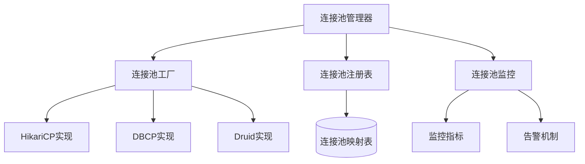
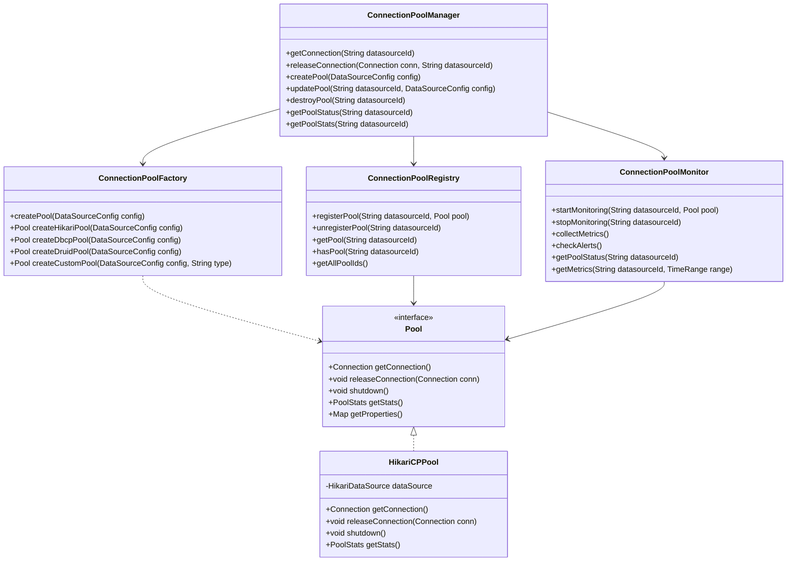
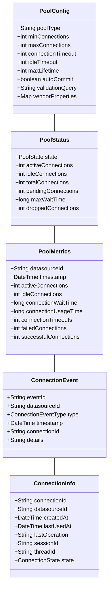
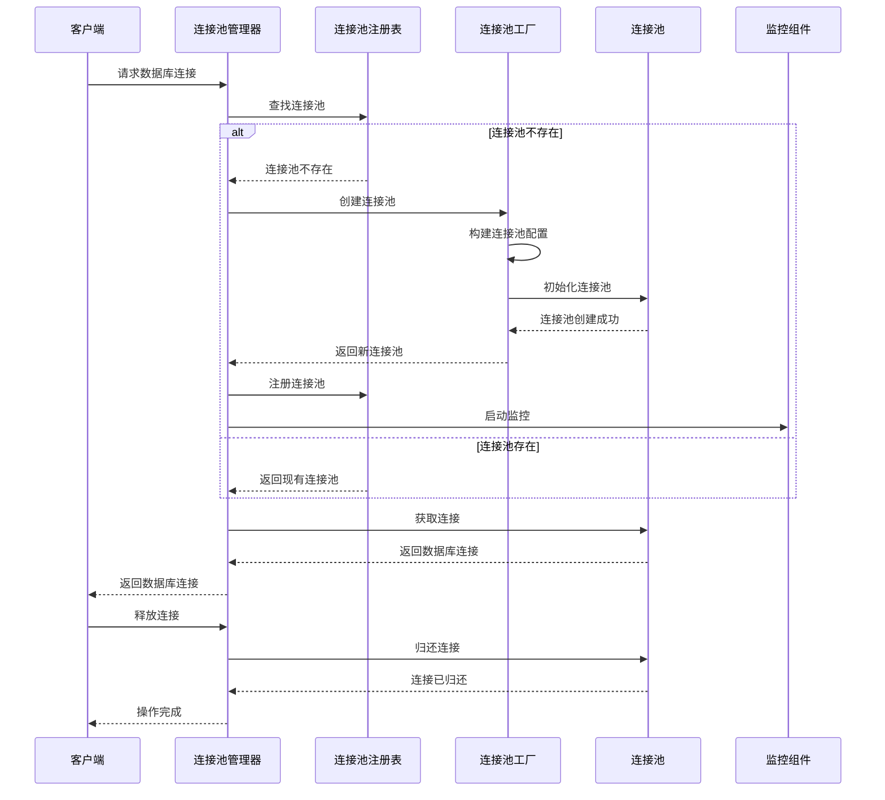

# 连接池管理设计文档

## 1. 概述

### 1.1 目的
本文档详细描述连接池管理组件的设计、架构和实现细节。

### 1.2 范围
本文档涵盖连接池管理组件的核心功能、接口、内部实现、数据流和与其他组件的交互。

### 1.3 组件定位
连接池管理组件是数据源管理模块的关键部分，负责管理数据库连接资源，通过连接池技术提高系统对数据源访问的效率和稳定性。该组件为所有需要数据库连接的服务提供连接获取、释放和管理功能。

## 2. 架构设计

### 2.1 组件架构

### 2.2 核心类设计

## 3. 功能详细设计

### 3.1 连接池初始化和配置
- 动态连接池创建和初始化
- 连接池参数配置与优化
- 连接池类型自动选择
- 默认配置优化
- 连接测试与验证配置

### 3.2 连接获取和管理
- 连接请求队列管理
- 连接获取超时处理
- 连接有效性验证
- 连接使用状态追踪
- 长时间运行连接处理

### 3.3 连接池监控与统计
- 实时连接使用情况监控
- 连接池性能统计
- 连接泄漏检测
- 连接使用模式分析
- 连接池健康度评估

### 3.4 动态调整与优化
- 连接池大小自动调整
- 基于负载的参数优化
- 空闲连接回收策略
- 连接使用分布优化
- 连接池资源均衡

## 4. 接口设计

### 4.1 外部接口
| 接口名称 | 类型 | 用途 | 参数 | 返回值 | 异常 |
|--------|------|-----|------|-------|------|
| getConnectionPool | 内部API | 获取已配置的连接池 | datasourceId: 数据源ID | Pool对象 | 连接池不存在异常 |
| getConnection | 内部API | 获取数据库连接 | datasourceId: 数据源ID | Connection对象 | 连接获取失败异常 |
| releaseConnection | 内部API | 释放数据库连接 | conn: 连接对象, datasourceId: 数据源ID | 无 | 连接释放异常 |
| createConnectionPool | 内部API | 创建新连接池 | config: 数据源配置 | Pool对象 | 连接池创建失败异常 |
| updateConnectionPool | 内部API | 更新连接池配置 | datasourceId: 数据源ID, config: 新配置 | Pool对象 | 连接池更新异常 |
| destroyConnectionPool | 内部API | 销毁连接池 | datasourceId: 数据源ID | 操作结果 | 连接池销毁异常 |
| getPoolMetrics | REST/内部API | 获取连接池监控指标 | datasourceId: 数据源ID, timeRange: 时间范围 | 监控数据 | 数据源不存在异常 |

### 4.2 内部接口
- `ConnectionPoolManager`: 提供连接池管理的核心功能
- `ConnectionPoolFactory`: 负责创建不同类型的连接池
- `ConnectionPoolRegistry`: 维护注册的连接池映射
- `ConnectionPoolMonitor`: 提供连接池监控功能
- `Pool`: 连接池实现的通用接口
- `PoolDataSource`: 数据源接口的自定义实现

### 4.3 数据模型

## 5. 处理流程

### 5.1 主要流程

### 5.2 异常流程
- 连接池创建失败处理流程
- 连接获取超时处理流程
- 连接失效/断开处理流程
- 连接池资源耗尽处理流程
- 连接泄漏处理流程

## 6. 性能考量

### 6.1 性能指标
| 指标 | 目标值 | 测试方法 |
|-----|-------|---------|
| 连接获取时间 | <10ms | 性能测试 |
| 连接池初始化时间 | <1s | 性能测试 |
| 最大并发连接数 | 根据数据源配置 | 压力测试 |
| 连接利用率 | >80% | 监控系统 |
| 等待队列大小 | <10 | 监控系统 |

### 6.2 优化策略
- 连接预热
- 空闲连接有效性验证优化
- 连接获取策略优化
- 连接回收策略优化
- 连接请求排队优化
- 连接使用时间限制

## 7. 安全考量

### 7.1 安全风险
- SQL注入
- 连接信息泄露
- 权限提升
- 资源耗尽攻击
- 未关闭连接导致资源泄漏

### 7.2 安全措施
- 准备语句(PreparedStatement)使用
- 连接权限最小化
- 连接使用超时限制
- 连接泄漏检测
- 连接参数验证和过滤
- 连接异常监控和告警

## 8. 扩展性设计

### 8.1 扩展点
- 支持新的连接池实现
- 自定义连接获取和释放策略
- 自定义连接监控指标
- 自定义连接验证机制
- 连接包装器扩展

### 8.2 升级策略
- 无停机连接池切换
- 平滑的连接池参数调整
- 连接池实现版本升级策略
- 向后兼容性保证
- 分阶段连接迁移

## 9. 依赖关系

### 9.1 内部依赖
- 数据源配置管理: 提供连接池所需配置
- 驱动适配器管理: 提供数据库驱动
- 事件总线: 发布连接池事件
- 监控服务: 收集连接池指标

### 9.2 外部依赖
- HikariCP: 高性能连接池实现
- Apache DBCP2: 备选连接池实现
- Alibaba Druid: 备选连接池实现
- SLF4J: 日志系统
- Micrometer: 指标收集

## 10. 测试策略

### 10.1 测试场景
- 连接池创建和初始化测试
- 连接获取和释放功能测试
- 连接池配置参数测试
- 连接有效性验证测试
- 高并发连接请求测试
- 连接泄漏检测测试
- 监控指标准确性测试

### 10.2 测试用例
- 创建不同类型连接池
- 正常和异常连接获取场景
- 连接池参数边界测试
- 连接中断恢复测试
- 并发获取多个连接
- 模拟连接泄漏场景
- 验证监控指标收集

## 11. 部署考量

### 11.1 部署要求
- Java 17或更高版本
- 足够的内存用于连接池
- 适当的网络配置(超时、缓冲区)
- 数据库连接数限制配置
- 操作系统文件描述符限制调整

### 11.2 配置项
- 连接池类型选择
- 连接池大小配置
- 连接超时参数
- 验证查询设置
- 监控和告警配置
- 连接泄漏检测配置

## 12. 附录

### 12.1 术语表
- **连接池**: 管理和重用数据库连接的技术
- **活跃连接**: 当前正在使用的数据库连接
- **空闲连接**: 已创建但未使用的数据库连接
- **连接获取超时**: 等待获取连接的最长时间
- **验证查询**: 用于验证连接有效性的SQL查询

### 12.2 参考文档
- HikariCP文档和最佳实践
- JDBC连接池规范
- 数据库厂商连接管理建议
- 《Effective Database Connection Pooling》
- 系统性能优化指南