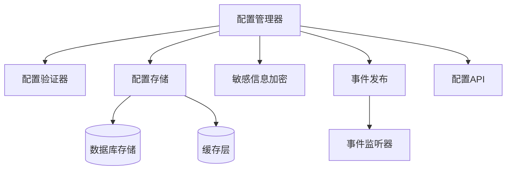
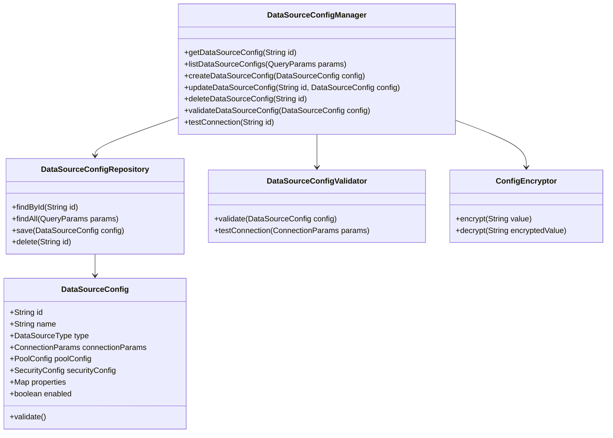
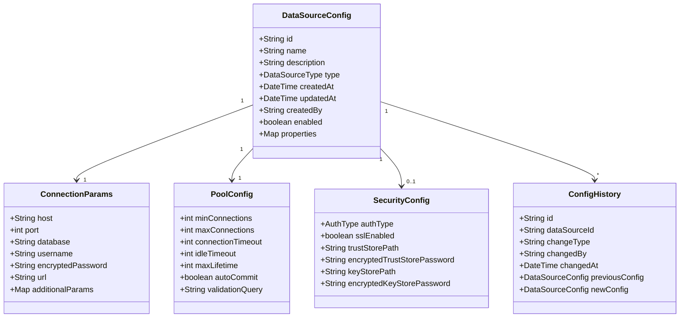
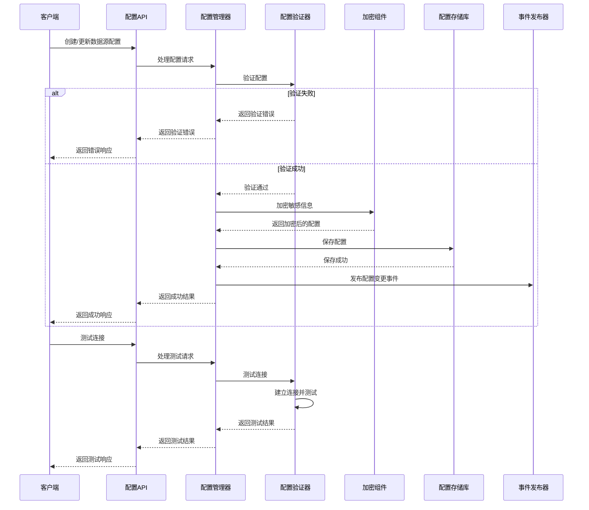

# 数据源配置管理设计文档

## 1. 概述

### 1.1 目的
本文档详细描述数据源配置管理组件的设计、架构和实现细节。

### 1.2 范围
本文档涵盖数据源配置管理组件的核心功能、接口、内部实现、数据流和与其他组件的交互。

### 1.3 组件定位
数据源配置管理组件是数据源管理模块的核心组件，负责管理系统中所有数据源的配置信息，包括连接参数、身份验证信息、连接池配置等。它为其他组件提供数据源配置的统一访问和管理能力。

## 2. 架构设计

### 2.1 组件架构

### 2.2 核心类设计

## 3. 功能详细设计

### 3.1 数据源配置管理
- 实现数据源配置的CRUD操作
- 配置数据的验证和格式化
- 配置版本管理
- 配置更新通知机制
- 配置历史记录和回滚

### 3.2 敏感信息加密
- 密码和访问凭证的加密存储
- 密钥管理和轮换
- 与系统安全机制集成
- 访问控制和审计

### 3.3 配置验证和测试
- 配置完整性检查
- 数据类型和格式验证
- 连接参数验证
- 连接测试功能
- 验证错误的详细反馈

### 3.4 配置模板管理
- 预定义配置模板
- 模板基础配置创建
- 模板导入和导出
- 模板版本管理

## 4. 接口设计

### 4.1 外部接口
| 接口名称 | 类型 | 用途 | 参数 | 返回值 | 异常 |
|--------|------|-----|------|-------|------|
| getDataSourceConfig | REST/内部API | 获取数据源配置 | id: 数据源ID | DataSourceConfig对象 | 数据源不存在异常 |
| listDataSourceConfigs | REST/内部API | 获取数据源配置列表 | 查询参数(分页、过滤) | DataSourceConfig列表 | 参数无效异常 |
| createDataSourceConfig | REST/内部API | 创建新数据源配置 | DataSourceConfig对象 | 创建的DataSourceConfig对象 | 验证失败异常 |
| updateDataSourceConfig | REST/内部API | 更新数据源配置 | id: 数据源ID, DataSourceConfig对象 | 更新后的DataSourceConfig对象 | 数据源不存在异常, 验证失败异常 |
| deleteDataSourceConfig | REST/内部API | 删除数据源配置 | id: 数据源ID | 删除结果 | 数据源不存在异常, 数据源使用中异常 |
| testConnection | REST/内部API | 测试数据源连接 | id: 数据源ID 或 ConnectionParams对象 | 连接测试结果 | 连接失败异常 |

### 4.2 内部接口
- `DataSourceConfigManager`: 提供数据源配置的核心管理功能
- `DataSourceConfigRepository`: 负责数据源配置的持久化操作
- `DataSourceConfigValidator`: 提供配置验证和连接测试功能
- `ConfigEncryptor`: 处理敏感信息加密
- `DataSourceEventPublisher`: 发布数据源配置变更事件

### 4.3 数据模型

## 5. 处理流程

### 5.1 主要流程

### 5.2 异常流程
- 数据源配置不存在处理流程
- 无效配置参数处理流程
- 连接测试失败处理流程
- 数据源正在使用中的删除处理流程
- 配置保存冲突处理流程

## 6. 性能考量

### 6.1 性能指标
| 指标 | 目标值 | 测试方法 |
|-----|-------|---------|
| 配置加载时间 | <50ms | 性能测试 |
| 配置保存时间 | <100ms | 性能测试 |
| 并发配置访问 | 支持1000TPS | 压力测试 |
| 配置缓存命中率 | >95% | 监控系统 |

### 6.2 优化策略
- 配置缓存机制
- 延迟加载非核心配置
- 批量操作优化
- 配置数据分级存储
- 只保存变更的配置字段

## 7. 安全考量

### 7.1 安全风险
- 敏感连接信息泄露
- 未授权的配置访问
- 配置注入攻击
- 配置信息篡改
- 密钥管理风险

### 7.2 安全措施
- 敏感信息加密存储
- 基于角色的访问控制
- 配置操作审计日志
- 输入验证和过滤
- 密钥轮换策略
- 安全的配置传输（TLS）

## 8. 扩展性设计

### 8.1 扩展点
- 自定义数据源类型支持
- 自定义配置属性
- 自定义验证规则
- 事件监听器扩展
- 存储策略扩展

### 8.2 升级策略
- 配置版本兼容性
- 配置迁移工具
- 渐进式配置结构变更
- 配置向后兼容性保证
- 配置升级通知机制

## 9. 依赖关系

### 9.1 内部依赖
- 连接池管理组件: 提供连接池配置
- 驱动适配器管理: 提供驱动相关配置
- 安全管理组件: 提供认证与授权配置
- 事件总线: 发布配置变更事件

### 9.2 外部依赖
- 数据库系统: 存储配置信息
- 缓存系统: 缓存配置数据
- 加密服务: 敏感信息加密
- 审计系统: 记录配置变更

## 10. 测试策略

### 10.1 测试场景
- 基本CRUD操作测试
- 配置验证规则测试
- 敏感信息加密解密测试
- 连接测试功能验证
- 配置事件通知测试
- 配置并发访问测试
- 配置历史记录测试

### 10.2 测试用例
- 创建各类型数据源配置
- 无效配置的验证测试
- 配置更新冲突测试
- 删除使用中的数据源测试
- 敏感信息加密正确性测试
- 连接测试成功与失败场景
- 配置历史回滚测试

## 11. 部署考量

### 11.1 部署要求
- Java 17或更高版本
- 关系型数据库(MySQL/PostgreSQL)
- 分布式缓存支持(Redis)
- 密钥管理系统
- 足够的存储空间用于配置历史

### 11.2 配置项
- 数据库连接配置
- 缓存服务配置
- 加密密钥配置
- 配置历史保留策略
- 配置事件通知策略
- 性能相关参数调整

## 12. 附录

### 12.1 术语表
- **数据源配置**: 连接到特定数据源所需的所有参数
- **连接参数**: 建立数据库连接的基本参数
- **连接池配置**: 控制连接池行为的参数
- **安全配置**: 与数据源安全相关的配置
- **配置模板**: 预定义的配置样例

### 12.2 参考文档
- JDBC API规范
- 各数据库厂商连接参数文档
- 系统安全架构文档
- 配置管理最佳实践指南