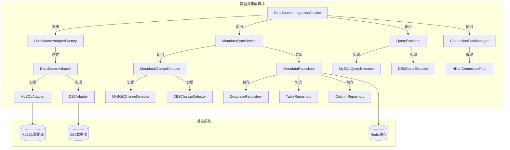

# DataScope数据源集成模块技术方案

## 1. 概述

DataScope数据源集成模块负责实现与多种数据库系统（初始支持MySQL和DB2）的连接、元数据提取、查询执行和增量同步功能。本文档详细描述该模块的技术实现方案、架构设计和关键算法。

## 2. 整体架构

### 2.1 模块架构图



### 2.2 核心组件职责

1. **DataSourceIntegrationService**: 集成服务入口，协调各组件工作
2. **DataSourceAdapterFactory**: 工厂类，负责创建适合特定数据库类型的适配器
3. **DataSourceAdapter**: 适配器接口，定义与数据源交互的通用方法
4. **MetadataSyncService**: 负责元数据同步流程控制
5. **MetadataChangeDetector**: 检测数据源元数据变更
6. **QueryExecutor**: 负责SQL查询执行和结果处理
7. **ConnectionPoolManager**: 管理数据库连接池

## 3. 数据源适配器设计

### 3.1 适配器接口

```java
public interface DataSourceAdapter {
    // 测试连接
    ConnectionTestResult testConnection(DataSourceConnectionDetails connectionDetails);
    
    // 获取数据库列表
    List<DatabaseMetadata> getDatabases(DataSource dataSource);
    
    // 获取指定数据库的表列表
    List<TableMetadata> getTables(DataSource dataSource, String databaseName);
    
    // 获取指定表的列信息
    List<ColumnMetadata> getColumns(DataSource dataSource, String databaseName, String tableName);
    
    // 执行查询
    QueryResult executeQuery(DataSource dataSource, String sql, Map<String, Object> parameters, 
                            int maxRows, int timeout);
    
    // 获取查询执行计划
    QueryExecutionPlan getQueryExecutionPlan(DataSource dataSource, String sql);
    
    // 获取数据库对象详细元数据
    ObjectMetadata getObjectMetadata(DataSource dataSource, String objectType, 
                                    String databaseName, String objectName);
    
    // 判断适配器是否支持指定的数据源类型
    boolean supports(DataSourceType dataSourceType);
}
```

### 3.2 MySQL适配器实现

```java
@Component
public class MySQLAdapter implements DataSourceAdapter {
    
    private final JdbcTemplate jdbcTemplate;
    private final HikariConfig hikariConfig;
    private final ConnectionPoolManager connectionPoolManager;
    
    // 构造函数注入依赖...
    
    @Override
    public boolean supports(DataSourceType dataSourceType) {
        return DataSourceType.MYSQL.equals(dataSourceType);
    }
    
    @Override
    public ConnectionTestResult testConnection(DataSourceConnectionDetails connectionDetails) {
        try {
            // 创建临时连接验证配置
            String url = String.format("jdbc:mysql://%s:%d/%s?useSSL=false&serverTimezone=UTC",
                connectionDetails.getHost(), connectionDetails.getPort(), connectionDetails.getDatabaseName());
                
            try (Connection conn = DriverManager.getConnection(
                    url, connectionDetails.getUsername(), connectionDetails.getPassword())) {
                
                // 验证连接是否有效
                if (conn.isValid(5)) {  // 5秒超时
                    return new ConnectionTestResult(true, "Connection successful");
                } else {
                    return new ConnectionTestResult(false, "Connection established but not valid");
                }
            }
        } catch (SQLException e) {
            return new ConnectionTestResult(false, "Connection failed: " + e.getMessage());
        }
    }
    
    @Override
    public List<DatabaseMetadata> getDatabases(DataSource dataSource) {
        String sql = "SELECT SCHEMA_NAME, DEFAULT_CHARACTER_SET_NAME, DEFAULT_COLLATION_NAME, " +
                    "CATALOG_NAME, SCHEMA_COMMENT FROM information_schema.SCHEMATA " +
                    "WHERE SCHEMA_NAME NOT IN ('information_schema','mysql','performance_schema','sys')";
        
        try (Connection conn = getConnection(dataSource)) {
            try (PreparedStatement stmt = conn.prepareStatement(sql);
                ResultSet rs = stmt.executeQuery()) {
                
                List<DatabaseMetadata> databases = new ArrayList<>();
                while (rs.next()) {
                    DatabaseMetadata db = new DatabaseMetadata();
                    db.setName(rs.getString("SCHEMA_NAME"));
                    db.setCharacterSet(rs.getString("DEFAULT_CHARACTER_SET_NAME"));
                    db.setCollation(rs.getString("DEFAULT_COLLATION_NAME"));
                    db.setCatalog(rs.getString("CATALOG_NAME"));
                    db.setComment(rs.getString("SCHEMA_COMMENT"));
                    databases.add(db);
                }
                return databases;
            }
        } catch (SQLException e) {
            throw new DataSourceException("Failed to get databases from MySQL", e);
        }
    }
    
    @Override
    public List<TableMetadata> getTables(DataSource dataSource, String databaseName) {
        String sql = "SELECT TABLE_NAME, TABLE_TYPE, ENGINE, TABLE_ROWS, " +
                    "CREATE_TIME, UPDATE_TIME, TABLE_COMMENT " +
                    "FROM information_schema.TABLES " +
                    "WHERE TABLE_SCHEMA = ?";
        
        try (Connection conn = getConnection(dataSource)) {
            try (PreparedStatement stmt = conn.prepareStatement(sql)) {
                stmt.setString(1, databaseName);
                
                try (ResultSet rs = stmt.executeQuery()) {
                    List<TableMetadata> tables = new ArrayList<>();
                    while (rs.next()) {
                        TableMetadata table = new TableMetadata();
                        table.setName(rs.getString("TABLE_NAME"));
                        table.setType(rs.getString("TABLE_TYPE"));
                        table.setEngine(rs.getString("ENGINE"));
                        table.setRowCount(rs.getLong("TABLE_ROWS"));
                        table.setCreateTime(rs.getTimestamp("CREATE_TIME"));
                        table.setUpdateTime(rs.getTimestamp("UPDATE_TIME"));
                        table.setComment(rs.getString("TABLE_COMMENT"));
                        tables.add(table);
                    }
                    return tables;
                }
            }
        } catch (SQLException e) {
            throw new DataSourceException("Failed to get tables from MySQL database: " + databaseName, e);
        }
    }
    
    @Override
    public List<ColumnMetadata> getColumns(DataSource dataSource, String databaseName, String tableName) {
        String sql = "SELECT COLUMN_NAME, DATA_TYPE, CHARACTER_MAXIMUM_LENGTH, " +
                    "NUMERIC_PRECISION, NUMERIC_SCALE, IS_NULLABLE, COLUMN_KEY, " +
                    "EXTRA, COLUMN_DEFAULT, COLUMN_COMMENT " +
                    "FROM information_schema.COLUMNS " +
                    "WHERE TABLE_SCHEMA = ? AND TABLE_NAME = ? " +
                    "ORDER BY ORDINAL_POSITION";
        
        try (Connection conn = getConnection(dataSource)) {
            try (PreparedStatement stmt = conn.prepareStatement(sql)) {
                stmt.setString(1, databaseName);
                stmt.setString(2, tableName);
                
                try (ResultSet rs = stmt.executeQuery()) {
                    List<ColumnMetadata> columns = new ArrayList<>();
                    while (rs.next()) {
                        ColumnMetadata column = new ColumnMetadata();
                        column.setName(rs.getString("COLUMN_NAME"));
                        column.setDataType(rs.getString("DATA_TYPE"));
                        column.setMaxLength(rs.getInt("CHARACTER_MAXIMUM_LENGTH"));
                        column.setPrecision(rs.getInt("NUMERIC_PRECISION"));
                        column.setScale(rs.getInt("NUMERIC_SCALE"));
                        column.setNullable("YES".equalsIgnoreCase(rs.getString("IS_NULLABLE")));
                        column.setPrimaryKey("PRI".equals(rs.getString("COLUMN_KEY")));
                        column.setAutoIncrement(rs.getString("EXTRA").contains("auto_increment"));
                        column.setDefaultValue(rs.getString("COLUMN_DEFAULT"));
                        column.setComment(rs.getString("COLUMN_COMMENT"));
                        columns.add(column);
                    }
                    return columns;
                }
            }
        } catch (SQLException e) {
            throw new DataSourceException(
                "Failed to get columns from MySQL table: " + databaseName + "." + tableName, e);
        }
    }
    
    @Override
    public QueryResult executeQuery(DataSource dataSource, String sql, 
                                  Map<String, Object> parameters, int maxRows, int timeout) {
        long startTime = System.currentTimeMillis();
        
        try (Connection conn = getConnection(dataSource)) {
            // 设置查询超时
            conn.setNetworkTimeout(Executors.newSingleThreadExecutor(), timeout * 1000);
            
            try (PreparedStatement stmt = conn.prepareStatement(sql)) {
                // 设置最大行数
                if (maxRows > 0) {
                    stmt.setMaxRows(maxRows);
                }
                
                // 设置参数
                if (parameters != null) {
                    int paramIndex = 1;
                    for (Map.Entry<String, Object> entry : parameters.entrySet()) {
                        stmt.setObject(paramIndex++, entry.getValue());
                    }
                }
                
                // 执行查询
                boolean hasResultSet = stmt.execute();
                
                if (hasResultSet) {
                    try (ResultSet rs = stmt.getResultSet()) {
                        // 处理结果集
                        ResultSetMetaData rsmd = rs.getMetaData();
                        int columnCount = rsmd.getColumnCount();
                        
                        // 构建列元数据
                        List<QueryResultColumn> columns = new ArrayList<>();
                        for (int i = 1; i <= columnCount; i++) {
                            QueryResultColumn column = new QueryResultColumn();
                            column.setName(rsmd.getColumnName(i));
                            column.setLabel(rsmd.getColumnLabel(i));
                            column.setTypeName(rsmd.getColumnTypeName(i));
                            column.setType(rsmd.getColumnType(i));
                            columns.add(column);
                        }
                        
                        // 提取数据行
                        List<Map<String, Object>> rows = new ArrayList<>();
                        while (rs.next() && rows.size() < maxRows) {
                            Map<String, Object> row = new LinkedHashMap<>();
                            for (int i = 1; i <= columnCount; i++) {
                                row.put(rsmd.getColumnLabel(i), rs.getObject(i));
                            }
                            rows.add(row);
                        }
                        
                        long executionTime = System.currentTimeMillis() - startTime;
                        
                        return new QueryResult(columns, rows, executionTime, true, null);
                    }
                } else {
                    // 处理更新结果
                    int updateCount = stmt.getUpdateCount();
                    long executionTime = System.currentTimeMillis() - startTime;
                    
                    return new QueryResult(null, null, executionTime, true, updateCount);
                }
            }
        } catch (SQLException e) {
            long executionTime = System.currentTimeMillis() - startTime;
            return new QueryResult(null, null, executionTime, false, 
                new SQLError(e.getErrorCode(), e.getMessage(), e.getSQLState()));
        } catch (Exception e) {
            long executionTime = System.currentTimeMillis() - startTime;
            return new QueryResult(null, null, executionTime, false, 
                new SQLError(0, e.getMessage(), ""));
        }
    }
    
    private Connection getConnection(DataSource dataSource) throws SQLException {
        // 获取或创建连接池
        HikariDataSource hikariDataSource = connectionPoolManager.getConnectionPool(dataSource);
        if (hikariDataSource == null) {
            throw new DataSourceException("Connection pool not found for data source: " + dataSource.getId());
        }
        
        return hikariDataSource.getConnection();
    }
    
    // 其他方法实现...
}
```

### 3.3 DB2适配器实现

```java
@Component
public class DB2Adapter implements DataSourceAdapter {

    private final ConnectionPoolManager connectionPoolManager;
    
    // 构造函数注入依赖...
    
    @Override
    public boolean supports(DataSourceType dataSourceType) {
        return DataSourceType.DB2.equals(dataSourceType);
    }
    
    @Override
    public ConnectionTestResult testConnection(DataSourceConnectionDetails connectionDetails) {
        try {
            // DB2 JDBC URL格式
            String url = String.format("jdbc:db2://%s:%d/%s",
                connectionDetails.getHost(), connectionDetails.getPort(), connectionDetails.getDatabaseName());
                
            try (Connection conn = DriverManager.getConnection(
                    url, connectionDetails.getUsername(), connectionDetails.getPassword())) {
                
                if (conn.isValid(5)) {  // 5秒超时
                    return new ConnectionTestResult(true, "Connection successful");
                } else {
                    return new ConnectionTestResult(false, "Connection established but not valid");
                }
            }
        } catch (SQLException e) {
            return new ConnectionTestResult(false, "Connection failed: " + e.getMessage());
        }
    }
    
    @Override
    public List<DatabaseMetadata> getDatabases(DataSource dataSource) {
        // DB2在连接级别通常只有一个数据库，获取模式列表替代
        String sql = "SELECT SCHEMANAME, OWNER, CREATE_TIME, DEFINER " +
                    "FROM SYSCAT.SCHEMATA " +
                    "WHERE SCHEMANAME NOT LIKE 'SYS%' AND SCHEMANAME NOT IN ('NULLID', 'SQLJ')";
        
        try (Connection conn = getConnection(dataSource)) {
            try (PreparedStatement stmt = conn.prepareStatement(sql);
                ResultSet rs = stmt.executeQuery()) {
                
                List<DatabaseMetadata> schemas = new ArrayList<>();
                while (rs.next()) {
                    DatabaseMetadata schema = new DatabaseMetadata();
                    schema.setName(rs.getString("SCHEMANAME"));
                    schema.setOwner(rs.getString("OWNER"));
                    schema.setCreateTime(rs.getTimestamp("CREATE_TIME"));
                    schema.setDefiner(rs.getString("DEFINER"));
                    schemas.add(schema);
                }
                return schemas;
            }
        } catch (SQLException e) {
            throw new DataSourceException("Failed to get schemas from DB2", e);
        }
    }
    
    @Override
    public List<TableMetadata> getTables(DataSource dataSource, String schemaName) {
        String sql = "SELECT TABNAME, TYPE, STATUS, CREATE_TIME, ALTER_TIME, " +
                    "STATS_TIME, TBSPACE, CARD, REMARKS " +
                    "FROM SYSCAT.TABLES " +
                    "WHERE TABSCHEMA = ? AND TYPE IN ('T', 'V') " +   // 表和视图
                    "ORDER BY TABNAME";
        
        try (Connection conn = getConnection(dataSource)) {
            try (PreparedStatement stmt = conn.prepareStatement(sql)) {
                stmt.setString(1, schemaName);
                
                try (ResultSet rs = stmt.executeQuery()) {
                    List<TableMetadata> tables = new ArrayList<>();
                    while (rs.next()) {
                        TableMetadata table = new TableMetadata();
                        table.setName(rs.getString("TABNAME"));
                        // 转换DB2特有的类型标识
                        String type = rs.getString("TYPE");
                        table.setType("T".equals(type) ? "TABLE" : "V".equals(type) ? "VIEW" : type);
                        table.setStatus(rs.getString("STATUS"));
                        table.setCreateTime(rs.getTimestamp("CREATE_TIME"));
                        table.setUpdateTime(rs.getTimestamp("ALTER_TIME"));
                        table.setStatsTime(rs.getTimestamp("STATS_TIME"));
                        table.setTablespace(rs.getString("TBSPACE"));
                        table.setRowCount(rs.getLong("CARD"));
                        table.setComment(rs.getString("REMARKS"));
                        tables.add(table);
                    }
                    return tables;
                }
            }
        } catch (SQLException e) {
            throw new DataSourceException("Failed to get tables from DB2 schema: " + schemaName, e);
        }
    }
    
    @Override
    public List<ColumnMetadata> getColumns(DataSource dataSource, String schemaName, String tableName) {
        String sql = "SELECT COLNAME, TYPENAME, LENGTH, SCALE, " +
                    "NULLS, KEYSEQ, IDENTITY, DEFAULT, REMARKS, COLNO " +
                    "FROM SYSCAT.COLUMNS " +
                    "WHERE TABSCHEMA = ? AND TABNAME = ? " +
                    "ORDER BY COLNO";
        
        try (Connection conn = getConnection(dataSource)) {
            try (PreparedStatement stmt = conn.prepareStatement(sql)) {
                stmt.setString(1, schemaName);
                stmt.setString(2, tableName);
                
                try (ResultSet rs = stmt.executeQuery()) {
                    List<ColumnMetadata> columns = new ArrayList<>();
                    while (rs.next()) {
                        ColumnMetadata column = new ColumnMetadata();
                        column.setName(rs.getString("COLNAME"));
                        column.setDataType(rs.getString("TYPENAME"));
                        column.setMaxLength(rs.getInt("LENGTH"));
                        column.setScale(rs.getInt("SCALE"));
                        column.setNullable("Y".equals(rs.getString("NULLS")));
                        
                        // 判断是否主键（KEYSEQ > 0表示主键的一部分）
                        int keySeq = rs.getInt("KEYSEQ");
                        column.setPrimaryKey(keySeq > 0);
                        column.setKeySequence(keySeq);
                        
                        // 是否自增列
                        column.setAutoIncrement("Y".equals(rs.getString("IDENTITY")));
                        column.setDefaultValue(rs.getString("DEFAULT"));
                        column.setComment(rs.getString("REMARKS"));
                        column.setOrdinalPosition(rs.getInt("COLNO"));
                        columns.add(column);
                    }
                    return columns;
                }
            }
        } catch (SQLException e) {
            throw new DataSourceException(
                "Failed to get columns from DB2 table: " + schemaName + "." + tableName, e);
        }
    }
    
    @Override
    public QueryResult executeQuery(DataSource dataSource, String sql, 
                                 Map<String, Object> parameters, int maxRows, int timeout) {
        // 实现类似MySQL适配器，但处理DB2特有的错误码和结果集类型
        // ...
    }
    
    @Override
    public QueryExecutionPlan getQueryExecutionPlan(DataSource dataSource, String sql) {
        // DB2专用的EXPLAIN语法
        String explainSql = "EXPLAIN PLAN FOR " + sql;
        
        try (Connection conn = getConnection(dataSource)) {
            // 准备EXPLAIN表
            try (Statement stmt = conn.createStatement()) {
                // 执行EXPLAIN
                stmt.execute(explainSql);
                
                // 查询EXPLAIN结果
                String querySql = "SELECT * FROM EXPLAIN_STATEMENT ORDER BY EXPLAIN_TIME DESC FETCH FIRST ROW ONLY";
                try (ResultSet rs = stmt.executeQuery(querySql)) {
                    if (rs.next()) {
                        QueryExecutionPlan plan = new QueryExecutionPlan();
                        plan.setExplainTime(rs.getTimestamp("EXPLAIN_TIME"));
                        plan.setSourceName(rs.getString("SOURCE_NAME"));
                        plan.setSource(rs.getString("SOURCE"));
                        plan.setQueryText(sql);
                        
                        // 获取详细计划
                        String detailSql = "SELECT * FROM EXPLAIN_OPERATOR WHERE EXPLAIN_TIME = ? ORDER BY OPERATOR_ID";
                        try (PreparedStatement pstmt = conn.prepareStatement(detailSql)) {
                            pstmt.setTimestamp(1, plan.getExplainTime());
                            try (ResultSet detailRs = pstmt.executeQuery()) {
                                List<QueryPlanNode> nodes = new ArrayList<>();
                                while (detailRs.next()) {
                                    QueryPlanNode node = new QueryPlanNode();
                                    node.setOperatorId(detailRs.getInt("OPERATOR_ID"));
                                    node.setOperatorType(detailRs.getString("OPERATOR_TYPE"));
                                    node.setTotalCost(detailRs.getDouble("TOTAL_COST"));
                                    node.setIoCost(detailRs.getDouble("IO_COST"));
                                    node.setCpuCost(detailRs.getDouble("CPU_COST"));
                                    node.setFirstRowCost(detailRs.getDouble("FIRST_ROW_COST"));
                                    node.setCardinality(detailRs.getDouble("CARDINALITY"));
                                    nodes.add(node);
                                }
                                plan.setNodes(nodes);
                            }
                        }
                        return plan;
                    }
                }
            }
        } catch (SQLException e) {
            throw new DataSourceException("Failed to get query execution plan from DB2", e);
        }
        
        return null;
    }
    
    private Connection getConnection(DataSource dataSource) throws SQLException {
        // 获取或创建连接池
        HikariDataSource hikariDataSource = connectionPoolManager.getConnectionPool(dataSource);
        if (hikariDataSource == null) {
            throw new DataSourceException("Connection pool not found for data source: " + dataSource.getId());
        }
        
        return hikariDataSource.getConnection();
    }
    
    // 其他方法实现...
}
```

### 3.4 适配器工厂

```java
@Component
public class DataSourceAdapterFactory {
    
    private final List<DataSourceAdapter> adapters;
    
    @Autowired
    public DataSourceAdapterFactory(List<DataSourceAdapter> adapters) {
        this.adapters = adapters;
    }
    
    public DataSourceAdapter getAdapter(DataSourceType dataSourceType) {
        return adapters.stream()
            .filter(adapter -> adapter.supports(dataSourceType))
            .findFirst()
            .orElseThrow(() -> new UnsupportedDataSourceTypeException(dataSourceType));
    }
}
```

## 4. 连接池管理

### 4.1 连接池配置与管理

```java
@Component
public class ConnectionPoolManager {
    
    private static final Logger log = LoggerFactory.getLogger(ConnectionPoolManager.class);
    
    // 使用ConcurrentHashMap存储数据源ID与连接池的映射
    private final ConcurrentHashMap<UUID, HikariDataSource> connectionPools = new ConcurrentHashMap<>();
    
    // 连接池配置属性
    @Value("${datasource.pool.maximumPoolSize:10}")
    private int maximumPoolSize;
    
    @Value("${datasource.pool.minimumIdle:2}")
    private int minimumIdle;
    
    @Value("${datasource.pool.idleTimeout:600000}")
    private long idleTimeout;
    
    @Value("${datasource.pool.maxLifetime:1800000}")
    private long maxLifetime;
    
    @Value("${datasource.pool.connectionTimeout:30000}")
    private long connectionTimeout;
    
    @Value("${datasource.pool.leakDetectionThreshold:60000}")
    private long leakDetectionThreshold;
    
    /**
     * 获取数据源的连接池，如果不存在则创建
     */
    public synchronized HikariDataSource getConnectionPool(DataSource dataSource) {
        return connectionPools.computeIfAbsent(dataSource.getId(), id -> createConnectionPool(dataSource));
    }
    
    /**
     * 关闭指定数据源的连接池
     */
    public void closeConnectionPool(UUID dataSourceId) {
        HikariDataSource ds = connectionPools.remove(dataSourceId);
        if (ds != null && !ds.isClosed()) {
            ds.close();
            log.info("Closed connection pool for data source: {}", dataSourceId);
        }
    }
    
    /**
     * 关闭所有连接池
     */
    @PreDestroy
    public void closeAllPools() {
        connectionPools.forEach((id, ds) -> {
            if (!ds.isClosed()) {
                ds.close();
                log.info("Closed connection pool for data source: {}", id);
            }
        });
        connectionPools.clear();
    }
    
    /**
     * 创建新的连接池
     */
    private HikariDataSource createConnectionPool(DataSource dataSource) {
        DataSourceConnectionDetails connectionDetails = dataSource.getConnectionDetails();
        
        HikariConfig config = new HikariConfig();
        
        // 设置连接池名称
        config.setPoolName("hikari-" + dataSource.getId());
        
        // 根据数据源类型设置JDBC URL和驱动类
        if (DataSourceType.MYSQL.equals(dataSource.getType())) {
            config.setJdbcUrl(String.format("jdbc:mysql://%s:%d/%s?useSSL=false&serverTimezone=UTC",
                connectionDetails.getHost(), connectionDetails.getPort(), connectionDetails.getDatabaseName()));
            config.setDriverClassName("com.mysql.cj.jdbc.Driver");
        } else if (DataSourceType.DB2.equals(dataSource.getType())) {
            config.setJdbcUrl(String.format("jdbc:db2://%s:%d/%s",
                connectionDetails.getHost(), connectionDetails.getPort(), connectionDetails.getDatabaseName()));
            config.setDriverClassName("com.ibm.db2.jcc.DB2Driver");
        } else {
            throw new UnsupportedDataSourceTypeException(dataSource.getType());
        }
        
        // 设置用户名和密码
        config.setUsername(connectionDetails.getUsername());
        config.setPassword(connectionDetails.getPassword());
        
        // 设置连接池参数
        config.setMaximumPoolSize(maximumPoolSize);
        config.setMinimumIdle(minimumIdle);
        config.setIdleTimeout(idleTimeout);
        config.setMaxLifetime(maxLifetime);
        config.setConnectionTimeout(connectionTimeout);
        config.setLeakDetectionThreshold(leakDetectionThreshold);
        
        // 设置连接测试查询
        if (DataSourceType.MYSQL.equals(dataSource.getType())) {
            config.setConnectionTestQuery("SELECT 1");
        } else if (DataSourceType.DB2.equals(dataSource.getType())) {
            config.setConnectionTestQuery("SELECT 1 FROM SYSIBM.SYSDUMMY1");
        }
        
        // 配置JMX监控
        config.setRegisterMbeans(true);
        
        // 创建连接池
        HikariDataSource hikariDataSource = new HikariDataSource(config);
        
        log.info("Created connection pool for data source: {}", dataSource.getId());
        
        return hikariDataSource;
    }
    
    /**
     * 获取连接池状态
     */
    public ConnectionPoolStatus getPoolStatus(UUID dataSourceId) {
        HikariDataSource ds = connectionPools.get(dataSourceId);
        if (ds == null || ds.isClosed()) {
            return null;
        }
        
        ConnectionPoolStatus status = new ConnectionPoolStatus();
        status.setDataSourceId(dataSourceId);
        status.setActiveConnections(ds.getHikariPoolMXBean().getActiveConnections());
        status.setIdleConnections(ds.getHikariPoolMXBean().getIdleConnections());
        status.setTotalConnections(ds.getHikariPoolMXBean().getTotalConnections());
        status.setThreadsAwaitingConnection(ds.getHikariPoolMXBean().getThreadsAwaitingConnection());
        status.setPoolName(ds.getHikariPoolMXBean().getPoolName());
        
        return status;
    }
    
    /**
     * 动态调整连接池大小
     */
    public void adjustPoolSize(UUID dataSourceId, int maximumPoolSize, int minimumIdle) {
        HikariDataSource ds = connectionPools.get(dataSourceId);
        if (ds == null || ds.isClosed()) {
            throw new IllegalStateException("Connection pool not found or closed: " + dataSourceId);
        }
        
        HikariConfigMXBean configBean = ds.getHikariConfigMXBean();
        configBean.setMaximumPoolSize(maximumPoolSize);
        configBean.setMinimumIdle(minimumIdle);
        
        log.info("Adjusted pool size for data source: {}, maxPoolSize: {}, minIdle: {}",
            dataSourceId, maximumPoolSize, minimumIdle);
    }
}
```

## 5. 元数据同步设计

### 5.1 元数据变更检测

```java
public interface MetadataChangeDetector {
    /**
     * 检测自上次同步后的元数据变更
     * @param dataSource 数据源信息
     * @param lastSyncTime 上次同步时间
     * @return 变更信息列表
     */
    List<MetadataChangeInfo> detectChanges(DataSource dataSource, Timestamp lastSyncTime);
    
    /**
     * 判断检测器是否支持指定的数据源类型
     */
    boolean supports(DataSourceType dataSourceType);
}
```

### 5.2 MySQL变更检测实现

```java
@Component
public class MySQLMetadataChangeDetector implements MetadataChangeDetector {

    private final ConnectionPoolManager connectionPoolManager;
    
    @Autowired
    public MySQLMetadataChangeDetector(ConnectionPoolManager connectionPoolManager) {
        this.connectionPoolManager = connectionPoolManager;
    }
    
    @Override
    public boolean supports(DataSourceType dataSourceType) {
        return DataSourceType.MYSQL.equals(dataSourceType);
    }
    
    @Override
    public List<MetadataChangeInfo> detectChanges(DataSource dataSource, Timestamp lastSyncTime) {
        // 如果是首次同步，返回空列表
        if (lastSyncTime == null) {
            return Collections.emptyList();
        }
        
        List<MetadataChangeInfo> changes = new ArrayList<>();
        
        try (Connection conn = connectionPoolManager.getConnectionPool(dataSource).getConnection()) {
            // 检测表变更
            detectTableChanges(conn, lastSyncTime, changes);
            
            // 检测视图变更
            detectViewChanges(conn, lastSyncTime, changes);
            
            // 检测索引变更
            detectIndexChanges(conn, lastSyncTime, changes);
        } catch (SQLException e) {
            throw new DataSourceException("Failed to detect metadata changes for MySQL", e);
        }
        
        return changes;
    }
    
    private void detectTableChanges(Connection conn, Timestamp lastSyncTime, List<MetadataChangeInfo> changes) 
            throws SQLException {
        String sql = """
            SELECT 
                table_schema AS schemaName,
                table_name AS tableName,
                'TABLE' AS objectType,
                create_time AS createTime,
                update_time AS updateTime,
                CASE 
                    WHEN create_time > ? THEN 'CREATED'
                    ELSE 'MODIFIED'
                END AS changeType
            FROM information_schema.tables
            WHERE table_type = 'BASE TABLE'
              AND (create_time > ? OR update_time > ?)
              AND table_schema NOT IN ('mysql', 'information_schema', 'performance_schema', 'sys')
            ORDER BY table_schema, table_name
        """;
        
        try (PreparedStatement stmt = conn.prepareStatement(sql)) {
            stmt.setTimestamp(1, lastSyncTime);
            stmt.setTimestamp(2, lastSyncTime);
            stmt.setTimestamp(3, lastSyncTime);
            
            try (ResultSet rs = stmt.executeQuery()) {
                while (rs.next()) {
                    MetadataChangeInfo change = new MetadataChangeInfo();
                    change.setSchemaName(rs.getString("schemaName"));
                    change.setObjectName(rs.getString("tableName"));
                    change.setObjectType(rs.getString("objectType"));
                    change.setCreateTime(rs.getTimestamp("createTime"));
                    change.setUpdateTime(rs.getTimestamp("updateTime"));
                    change.setChangeType(rs.getString("changeType"));
                    changes.add(change);
                }
            }
        }
    }
    
    private void detectViewChanges(Connection conn, Timestamp lastSyncTime, List<MetadataChangeInfo> changes) 
            throws SQLException {
        String sql = """
            SELECT 
                table_schema AS schemaName,
                table_name AS tableName,
                'VIEW' AS objectType,
                create_time AS createTime,
                update_time AS updateTime,
                CASE 
                    WHEN create_time > ? THEN 'CREATED'
                    ELSE 'MODIFIED'
                END AS changeType
            FROM information_schema.tables
            WHERE table_type = 'VIEW'
              AND (create_time > ? OR update_time > ?)
              AND table_schema NOT IN ('mysql', 'information_schema', 'performance_schema', 'sys')
            ORDER BY table_schema, table_name
        """;
        
        try (PreparedStatement stmt = conn.prepareStatement(sql)) {
            stmt.setTimestamp(1, lastSyncTime);
            stmt.setTimestamp(2, lastSyncTime);
            stmt.setTimestamp(3, lastSyncTime);
            
            try (ResultSet rs = stmt.executeQuery()) {
                while (rs.next()) {
                    MetadataChangeInfo change = new MetadataChangeInfo();
                    change.setSchemaName(rs.getString("schemaName"));
                    change.setObjectName(rs.getString("tableName"));
                    change.setObjectType(rs.getString("objectType"));
                    change.setCreateTime(rs.getTimestamp("createTime"));
                    change.setUpdateTime(rs.getTimestamp("updateTime"));
                    change.setChangeType(rs.getString("changeType"));
                    changes.add(change);
                }
            }
        }
    }
    
    private void detectIndexChanges(Connection conn, Timestamp lastSyncTime, List<MetadataChangeInfo> changes) 
            throws SQLException {
        // 由于information_schema中没有索引创建/修改时间
        // 我们通过关联表的更新时间来推断索引变化
        String sql = """
            SELECT DISTINCT
                s.table_schema AS schemaName,
                s.table_name AS tableName,
                'INDEX' AS objectType,
                s.index_name AS indexName,
                t.create_time AS createTime,
                t.update_time AS updateTime,
                'UNKNOWN' AS changeType
            FROM information_schema.statistics s
            JOIN information_schema.tables t 
              ON s.table_schema = t.table_schema AND s.table_name = t.table_name
            WHERE t.update_time > ?
              AND t.table_schema NOT IN ('mysql', 'information_schema', 'performance_schema', 'sys')
            ORDER BY s.table_schema, s.table_name, s.index_name
        """;
        
        try (PreparedStatement stmt = conn.prepareStatement(sql)) {
            stmt.setTimestamp(1, lastSyncTime);
            
            try (ResultSet rs = stmt.executeQuery()) {
                while (rs.next()) {
                    MetadataChangeInfo change = new MetadataChangeInfo();
                    change.setSchemaName(rs.getString("schemaName"));
                    change.setObjectName(rs.getString("indexName"));
                    change.setParentObjectName(rs.getString("tableName"));
                    change.setObjectType(rs.getString("objectType"));
                    change.setCreateTime(rs.getTimestamp("createTime"));
                    change.setUpdateTime(rs.getTimestamp("updateTime"));
                    change.setChangeType(rs.getString("changeType"));
                    changes.add(change);
                }
            }
        }
    }
}
```

### 5.3 DB2变更检测实现

```java
@Component
public class DB2MetadataChangeDetector implements MetadataChangeDetector {

    private final ConnectionPoolManager connectionPoolManager;
    
    @Autowired
    public DB2MetadataChangeDetector(ConnectionPoolManager connectionPoolManager) {
        this.connectionPoolManager = connectionPoolManager;
    }
    
    @Override
    public boolean supports(DataSourceType dataSourceType) {
        return DataSourceType.DB2.equals(dataSourceType);
    }
    
    @Override
    public List<MetadataChangeInfo> detectChanges(DataSource dataSource, Timestamp lastSyncTime) {
        // 如果是首次同步，返回空列表
        if (lastSyncTime == null) {
            return Collections.emptyList();
        }
        
        List<MetadataChangeInfo> changes = new ArrayList<>();
        
        try (Connection conn = connectionPoolManager.getConnectionPool(dataSource).getConnection()) {
            // 检测表变更
            detectTableChanges(conn, lastSyncTime, changes);
            
            // 检测视图变更
            detectViewChanges(conn, lastSyncTime, changes);
            
            // 检测索引变更
            detectIndexChanges(conn, lastSyncTime, changes);
        } catch (SQLException e) {
            throw new DataSourceException("Failed to detect metadata changes for DB2", e);
        }
        
        return changes;
    }
    
    private void detectTableChanges(Connection conn, Timestamp lastSyncTime, List<MetadataChangeInfo> changes) 
            throws SQLException {
        // DB2中表的变更信息在SYSCAT.TABLES中
        String sql = """
            SELECT 
                TABSCHEMA AS schemaName,
                TABNAME AS tableName,
                'TABLE' AS objectType,
                CREATE_TIME AS createTime,
                ALTER_TIME AS updateTime,
                CASE 
                    WHEN CREATE_TIME > ? THEN 'CREATED'
                    ELSE 'MODIFIED'
                END AS changeType
            FROM SYSCAT.TABLES
            WHERE TYPE = 'T'
              AND (CREATE_TIME > ? OR ALTER_TIME > ?)
              AND TABSCHEMA NOT LIKE 'SYS%'
            ORDER BY TABSCHEMA, TABNAME
        """;
        
        try (PreparedStatement stmt = conn.prepareStatement(sql)) {
            stmt.setTimestamp(1, lastSyncTime);
            stmt.setTimestamp(2, lastSyncTime);
            stmt.setTimestamp(3, lastSyncTime);
            
            try (ResultSet rs = stmt.executeQuery()) {
                while (rs.next()) {
                    MetadataChangeInfo change = new MetadataChangeInfo();
                    change.setSchemaName(rs.getString("schemaName"));
                    change.setObjectName(rs.getString("tableName"));
                    change.setObjectType(rs.getString("objectType"));
                    change.setCreateTime(rs.getTimestamp("createTime"));
                    change.setUpdateTime(rs.getTimestamp("updateTime"));
                    change.setChangeType(rs.getString("changeType"));
                    changes.add(change);
                }
            }
        }
    }
    
    private void detectViewChanges(Connection conn, Timestamp lastSyncTime, List<MetadataChangeInfo> changes) 
            throws SQLException {
        // DB2中视图的变更信息也在SYSCAT.TABLES中
        String sql = """
            SELECT 
                TABSCHEMA AS schemaName,
                TABNAME AS tableName,
                'VIEW' AS objectType,
                CREATE_TIME AS createTime,
                ALTER_TIME AS updateTime,
                CASE 
                    WHEN CREATE_TIME > ? THEN 'CREATED'
                    ELSE 'MODIFIED'
                END AS changeType
            FROM SYSCAT.TABLES
            WHERE TYPE = 'V'
              AND (CREATE_TIME > ? OR ALTER_TIME > ?)
              AND TABSCHEMA NOT LIKE 'SYS%'
            ORDER BY TABSCHEMA, TABNAME
        """;
        
        try (PreparedStatement stmt = conn.prepareStatement(sql)) {
            stmt.setTimestamp(1, lastSyncTime);
            stmt.setTimestamp(2, lastSyncTime);
            stmt.setTimestamp(3, lastSyncTime);
            
            try (ResultSet rs = stmt.executeQuery()) {
                while (rs.next()) {
                    MetadataChangeInfo change = new MetadataChangeInfo();
                    change.setSchemaName(rs.getString("schemaName"));
                    change.setObjectName(rs.getString("tableName"));
                    change.setObjectType(rs.getString("objectType"));
                    change.setCreateTime(rs.getTimestamp("createTime"));
                    change.setUpdateTime(rs.getTimestamp("updateTime"));
                    change.setChangeType(rs.getString("changeType"));
                    changes.add(change);
                }
            }
        }
    }
    
    private void detectIndexChanges(Connection conn, Timestamp lastSyncTime, List<MetadataChangeInfo> changes) 
            throws SQLException {
        // DB2中索引的变更信息在SYSCAT.INDEXES中
        String sql = """
            SELECT 
                INDSCHEMA AS schemaName,
                INDNAME AS indexName,
                TABSCHEMA AS tableSchema,
                TABNAME AS tableName,
                'INDEX' AS objectType,
                CREATE_TIME AS createTime,
                STATS_TIME AS updateTime,
                CASE 
                    WHEN CREATE_TIME > ? THEN 'CREATED'
                    ELSE 'MODIFIED'
                END AS changeType
            FROM SYSCAT.INDEXES
            WHERE (CREATE_TIME > ? OR STATS_TIME > ?)
              AND INDSCHEMA NOT LIKE 'SYS%'
            ORDER BY INDSCHEMA, INDNAME
        """;
        
        try (PreparedStatement stmt = conn.prepareStatement(sql)) {
            stmt.setTimestamp(1, lastSyncTime);
            stmt.setTimestamp(2, lastSyncTime);
            stmt.setTimestamp(3, lastSyncTime);
            
            try (ResultSet rs = stmt.executeQuery()) {
                while (rs.next()) {
                    MetadataChangeInfo change = new MetadataChangeInfo();
                    change.setSchemaName(rs.getString("schemaName"));
                    change.setObjectName(rs.getString("indexName"));
                    change.setParentObjectName(rs.getString("tableName"));
                    change.setParentObjectSchema(rs.getString("tableSchema"));
                    change.setObjectType(rs.getString("objectType"));
                    change.setCreateTime(rs.getTimestamp("createTime"));
                    change.setUpdateTime(rs.getTimestamp("updateTime"));
                    change.setChangeType(rs.getString("changeType"));
                    changes.add(change);
                }
            }
        }
    }
}
```

### 5.4 增量同步核心服务

```java
@Service
@Transactional
public class MetadataSyncServiceImpl implements MetadataSyncService {

    private static final Logger log = LoggerFactory.getLogger(MetadataSyncServiceImpl.class);
    
    private final DataSourceRepository dataSourceRepository;
    private final DatabaseRepository databaseRepository;
    private final TableRepository tableRepository;
    private final ColumnRepository columnRepository;
    private final MetadataSyncLogRepository syncLogRepository;
    private final MetadataChangeRecordRepository changeRecordRepository;
    private final DataSourceAdapterFactory adapterFactory;
    private final ApplicationEventPublisher eventPublisher;
    private final List<MetadataChangeDetector> detectors;
    
    @Autowired
    public MetadataSyncServiceImpl(DataSourceRepository dataSourceRepository,
                                 DatabaseRepository databaseRepository,
                                 TableRepository tableRepository,
                                 ColumnRepository columnRepository,
                                 MetadataSyncLogRepository syncLogRepository,
                                 MetadataChangeRecordRepository changeRecordRepository,
                                 DataSourceAdapterFactory adapterFactory,
                                 ApplicationEventPublisher eventPublisher,
                                 List<MetadataChangeDetector> detectors) {
        this.dataSourceRepository = dataSourceRepository;
        this.databaseRepository = databaseRepository;
        this.tableRepository = tableRepository;
        this.columnRepository = columnRepository;
        this.syncLogRepository = syncLogRepository;
        this.changeRecordRepository = changeRecordRepository;
        this.adapterFactory = adapterFactory;
        this.eventPublisher = eventPublisher;
        this.detectors = detectors;
    }
    
    @Override
    public SyncResult synchronizeFull(UUID dataSourceId) {
        log.info("Starting full metadata synchronization for data source: {}", dataSourceId);
        
        // 查找数据源
        DataSource dataSource = dataSourceRepository.findById(dataSourceId)
            .orElseThrow(() -> new DataSourceNotFoundException(dataSourceId));
        
        // 开始记录同步日志
        MetadataSyncLog syncLog = new MetadataSyncLog();
        syncLog.setDataSourceId(dataSourceId);
        syncLog.setSyncStartTime(new Timestamp(System.currentTimeMillis()));
        syncLog.setSyncType(SyncType.FULL);
        syncLog.setStatus(SyncStatus.SYNCING);
        syncLog = syncLogRepository.save(syncLog);
        
        // 更新数据源同步状态
        dataSource.setSyncStatus(SyncStatus.SYNCING);
        dataSourceRepository.save(dataSource);
        
        SyncResult result = new SyncResult();
        
        try {
            // 获取适配器
            DataSourceAdapter adapter = adapterFactory.getAdapter(dataSource.getType());
            
            // 获取所有数据库/模式
            List<DatabaseMetadata> databases = adapter.getDatabases(dataSource);
            
            // 处理每个数据库
            for (DatabaseMetadata dbMetadata : databases) {
                processDatabaseFull(dataSource, adapter, dbMetadata, result, syncLog.getId());
            }
            
            // 更新同步结果
            syncLog.setSyncEndTime(new Timestamp(System.currentTimeMillis()));
            syncLog.setStatus(SyncStatus.SYNCED);
            syncLog.setAddedCount(result.getAddedCount());
            syncLog.setUpdatedCount(result.getUpdatedCount());
            syncLog.setDeletedCount(result.getDeletedCount());
            syncLogRepository.save(syncLog);
            
            // 更新数据源同步状态
            dataSource.setSyncStatus(SyncStatus.SYNCED);
            dataSource.setLastSyncTime(syncLog.getSyncEndTime());
            dataSourceRepository.save(dataSource);
            
            // 发布同步完成事件
            eventPublisher.publishEvent(new MetadataSyncCompletedEvent(
                dataSource.getId(), result.getAddedCount(), result.getUpdatedCount(), result.getDeletedCount()));
            
            log.info("Full metadata synchronization completed for data source: {}", dataSourceId);
            
            return result;
        } catch (Exception e) {
            log.error("Failed to synchronize metadata for data source: {}", dataSourceId, e);
            
            // 更新同步日志
            syncLog.setSyncEndTime(new Timestamp(System.currentTimeMillis()));
            syncLog.setStatus(SyncStatus.FAILED);
            syncLog.setErrorMessage(e.getMessage());
            syncLogRepository.save(syncLog);
            
            // 更新数据源同步状态
            dataSource.setSyncStatus(SyncStatus.FAILED);
            dataSource.setLastSyncError(e.getMessage());
            dataSourceRepository.save(dataSource);
            
            throw new MetadataSyncException("Failed to synchronize metadata: " + e.getMessage(), e);
        }
    }
    
    @Override
    public SyncResult synchronizeIncrementally(UUID dataSourceId) {
        log.info("Starting incremental metadata synchronization for data source: {}", dataSourceId);
        
        // 查找数据源
        DataSource dataSource = dataSourceRepository.findById(dataSourceId)
            .orElseThrow(() -> new DataSourceNotFoundException(dataSourceId));
        
        // 获取上次同步时间
        Timestamp lastSyncTime = dataSource.getLastSyncTime();
        if (lastSyncTime == null) {
            // 如果没有同步记录，执行全量同步
            log.info("No previous sync record found, performing full sync for data source: {}", dataSourceId);
            return synchronizeFull(dataSourceId);
        }
        
        // 开始记录同步日志
        MetadataSyncLog syncLog = new MetadataSyncLog();
        syncLog.setDataSourceId(dataSourceId);
        syncLog.setSyncStartTime(new Timestamp(System.currentTimeMillis()));
        syncLog.setSyncType(SyncType.INCREMENTAL);
        syncLog.setStatus(SyncStatus.SYNCING);
        syncLog = syncLogRepository.save(syncLog);
        
        // 更新数据源同步状态
        dataSource.setSyncStatus(SyncStatus.SYNCING);
        dataSourceRepository.save(dataSource);
        
        SyncResult result = new SyncResult();
        
        try {
            // 获取变更检测器
            MetadataChangeDetector detector = detectors.stream()
                .filter(d -> d.supports(dataSource.getType()))
                .findFirst()
                .orElseThrow(() -> new UnsupportedDataSourceTypeException(dataSource.getType()));
            
            // 检测变更
            List<MetadataChangeInfo> changes = detector.detectChanges(dataSource, lastSyncTime);
            log.info("Detected {} metadata changes for data source: {}", changes.size(), dataSourceId);
            
            if (changes.isEmpty()) {
                // 没有变更，直接更新同步记录
                syncLog.setSyncEndTime(new Timestamp(System.currentTimeMillis()));
                syncLog.setStatus(SyncStatus.SYNCED);
                syncLog.setAddedCount(0);
                syncLog.setUpdatedCount(0);
                syncLog.setDeletedCount(0);
                syncLogRepository.save(syncLog);
                
                // 更新数据源同步状态
                dataSource.setSyncStatus(SyncStatus.SYNCED);
                dataSource.setLastSyncTime(syncLog.getSyncEndTime());
                dataSourceRepository.save(dataSource);
                
                log.info("No changes found, incremental sync completed for data source: {}", dataSourceId);
                
                return result;
            }
            
            // 获取适配器
            DataSourceAdapter adapter = adapterFactory.getAdapter(dataSource.getType());
            
            // 按照数据库/模式分组变更
            Map<String, List<MetadataChangeInfo>> changesBySchema = changes.stream()
                .collect(Collectors.groupingBy(MetadataChangeInfo::getSchemaName));
            
            // 处理每个数据库的变更
            for (Map.Entry<String, List<MetadataChangeInfo>> entry : changesBySchema.entrySet()) {
                String schemaName = entry.getKey();
                List<MetadataChangeInfo> schemaChanges = entry.getValue();
                
                processDatabaseChanges(dataSource, adapter, schemaName, schemaChanges, result, syncLog.getId());
            }
            
            // 更新同步结果
            syncLog.setSyncEndTime(new Timestamp(System.currentTimeMillis()));
            syncLog.setStatus(SyncStatus.SYNCED);
            syncLog.setAddedCount(result.getAddedCount());
            syncLog.setUpdatedCount(result.getUpdatedCount());
            syncLog.setDeletedCount(result.getDeletedCount());
            syncLogRepository.save(syncLog);
            
            // 更新数据源同步状态
            dataSource.setSyncStatus(SyncStatus.SYNCED);
            dataSource.setLastSyncTime(syncLog.getSyncEndTime());
            dataSourceRepository.save(dataSource);
            
            // 发布同步完成事件
            eventPublisher.publishEvent(new MetadataSyncCompletedEvent(
                dataSource.getId(), result.getAddedCount(), result.getUpdatedCount(), result.getDeletedCount()));
            
            log.info("Incremental metadata synchronization completed for data source: {}", dataSourceId);
            
            return result;
        } catch (Exception e) {
            log.error("Failed to synchronize metadata incrementally for data source: {}", dataSourceId, e);
            
            // 更新同步日志
            syncLog.setSyncEndTime(new Timestamp(System.currentTimeMillis()));
            syncLog.setStatus(SyncStatus.FAILED);
            syncLog.setErrorMessage(e.getMessage());
            syncLogRepository.save(syncLog);
            
            // 更新数据源同步状态
            dataSource.setSyncStatus(SyncStatus.FAILED);
            dataSource.setLastSyncError(e.getMessage());
            dataSourceRepository.save(dataSource);
            
            throw new MetadataSyncException("Failed to synchronize metadata incrementally: " + e.getMessage(), e);
        }
    }
    
    // 全量同步时处理单个数据库
    private void processDatabaseFull(DataSource dataSource, DataSourceAdapter adapter, 
                                DatabaseMetadata dbMetadata, SyncResult result, UUID syncLogId) {
        log.debug("Processing database: {} for full sync", dbMetadata.getName());
        
        // 查找或创建数据库记录
        Database database = databaseRepository.findByDataSourceIdAndName(dataSource.getId(), dbMetadata.getName())
            .orElse(new Database());
        
        boolean isNewDatabase = database.getId() == null;
        
        // 更新数据库信息
        if (isNewDatabase) {
            database.setDataSourceId(dataSource.getId());
            database.setName(dbMetadata.getName());
        }
        
        database.setCharacterSet(dbMetadata.getCharacterSet());
        database.setCollation(dbMetadata.getCollation());
        database.setVersion(dbMetadata.getVersion());
        database = databaseRepository.save(database);
        
        if (isNewDatabase) {
            result.incrementAddedCount();
            
            // 记录变更
            recordChange(syncLogId, "DATABASE", database.getName(), null, 
                        dataSource.getId().toString(), "ADDED", null);
        } else {
            result.incrementUpdatedCount();
            
            // 记录变更
            recordChange(syncLogId, "DATABASE", database.getName(), null, 
                        dataSource.getId().toString(), "UPDATED", null);
        }
        
        // 获取所有表
        List<TableMetadata> tables = adapter.getTables(dataSource, dbMetadata.getName());
        
        // 获取现有表
        Set<String> existingTableNames = tableRepository.findByDatabaseId(database.getId()).stream()
            .map(Table::getName)
            .collect(Collectors.toSet());
        
        // 处理表
        Set<String> processedTables = new HashSet<>();
        
        for (TableMetadata tableMetadata : tables) {
            processTableFull(dataSource, adapter, database, tableMetadata, result, syncLogId);
            processedTables.add(tableMetadata.getName());
        }
        
        // 删除不存在的表
        for (String tableName : existingTableNames) {
            if (!processedTables.contains(tableName)) {
                Table table = tableRepository.findByDatabaseIdAndName(database.getId(), tableName)
                    .orElse(null);
                
                if (table != null) {
                    // 删除相关列
                    List<Column> columns = columnRepository.findByTableId(table.getId());
                    columnRepository.deleteAll(columns);
                    
                    // 删除表
                    tableRepository.delete(table);
                    
                    result.incrementDeletedCount();
                    
                    // 记录变更
                    recordChange(syncLogId, "TABLE", tableName, null, database.getId().toString(), 
                                "DELETED", null);
                }
            }
        }
    }
    
    // 全量同步时处理单个表
    private void processTableFull(DataSource dataSource, DataSourceAdapter adapter, 
                            Database database, TableMetadata tableMetadata, SyncResult result, UUID syncLogId) {
        log.debug("Processing table: {}.{} for full sync", database.getName(), tableMetadata.getName());
        
        // 查找或创建表记录
        Table table = tableRepository.findByDatabaseIdAndName(database.getId(), tableMetadata.getName())
            .orElse(new Table());
        
        boolean isNewTable = table.getId() == null;
        
        // 更新表信息
        if (isNewTable) {
            table.setDatabaseId(database.getId());
            table.setName(tableMetadata.getName());
        }
        
        table.setTableType(tableMetadata.getType());
        table.setDescription(tableMetadata.getComment());
        table.setRecordCount(tableMetadata.getRowCount());
        table = tableRepository.save(table);
        
        if (isNewTable) {
            result.incrementAddedCount();
            
            // 记录变更
            recordChange(syncLogId, "TABLE", table.getName(), null, database.getId().toString(), 
                        "ADDED", null);
        } else {
            result.incrementUpdatedCount();
            
            // 记录变更
            recordChange(syncLogId, "TABLE", table.getName(), null, database.getId().toString(), 
                        "UPDATED", null);
        }
        
        // 获取所有列
        List<ColumnMetadata> columns = adapter.getColumns(dataSource, database.getName(), tableMetadata.getName());
        
        // 获取现有列
        Set<String> existingColumnNames = columnRepository.findByTableId(table.getId()).stream()
            .map(Column::getName)
            .collect(Collectors.toSet());
        
        // 处理列
        Set<String> processedColumns = new HashSet<>();
        
        for (ColumnMetadata columnMetadata : columns) {
            processColumnFull(table, columnMetadata, result, syncLogId);
            processedColumns.add(columnMetadata.getName());
        }
        
        // 删除不存在的列
        for (String columnName : existingColumnNames) {
            if (!processedColumns.contains(columnName)) {
                Column column = columnRepository.findByTableIdAndName(table.getId(), columnName)
                    .orElse(null);
                
                if (column != null) {
                    columnRepository.delete(column);
                    result.incrementDeletedCount();
                    
                    // 记录变更
                    recordChange(syncLogId, "COLUMN", columnName, null, table.getId().toString(), 
                                "DELETED", null);
                }
            }
        }
    }
    
    // 全量同步时处理单个列
    private void processColumnFull(Table table, ColumnMetadata columnMetadata, SyncResult result, UUID syncLogId) {
        log.debug("Processing column: {}.{} for full sync", table.getName(), columnMetadata.getName());
        
        // 查找或创建列记录
        Column column = columnRepository.findByTableIdAndName(table.getId(), columnMetadata.getName())
            .orElse(new Column());
        
        boolean isNewColumn = column.getId() == null;
        
        // 更新列信息
        if (isNewColumn) {
            column.setTableId(table.getId());
            column.setName(columnMetadata.getName());
        }
        
        column.setDataType(columnMetadata.getDataType());
        column.setLength(columnMetadata.getMaxLength());
        column.setPrecision(columnMetadata.getPrecision());
        column.setScale(columnMetadata.getScale());
        column.setNullable(columnMetadata.isNullable());
        column.setPrimaryKey(columnMetadata.isPrimaryKey());
        column.setDefaultValue(columnMetadata.getDefaultValue());
        column.setDescription(columnMetadata.getComment());
        column = columnRepository.save(column);
        
        if (isNewColumn) {
            result.incrementAddedCount();
            
            // 记录变更
            recordChange(syncLogId, "COLUMN", column.getName(), table.getName(), table.getId().toString(), 
                        "ADDED", null);
        } else {
            result.incrementUpdatedCount();
            
            // 记录变更
            Map<String, Object> changes = new HashMap<>();
            changes.put("dataType", column.getDataType());
            changes.put("length", column.getLength());
            changes.put("nullable", column.isNullable());
            
            // 记录变更
            recordChange(syncLogId, "COLUMN", column.getName(), table.getName(), table.getId().toString(), 
                        "UPDATED", new ObjectMapper().writeValueAsString(changes));
        }
    }
    
    // 增量同步时处理数据库变更
    private void processDatabaseChanges(DataSource dataSource, DataSourceAdapter adapter, 
                                    String schemaName, List<MetadataChangeInfo> changes, 
                                    SyncResult result, UUID syncLogId) {
        log.debug("Processing incremental changes for database: {}", schemaName);
        
        // 查找或创建数据库记录
        Database database = databaseRepository.findByDataSourceIdAndName(dataSource.getId(), schemaName)
            .orElse(null);
        
        if (database == null) {
            // 获取数据库元数据
            List<DatabaseMetadata> databases = adapter.getDatabases(dataSource);
            DatabaseMetadata dbMetadata = databases.stream()
                .filter(db -> db.getName().equals(schemaName))
                .findFirst()
                .orElse(null);
            
            if (dbMetadata != null) {
                database = new Database();
                database.setDataSourceId(dataSource.getId());
                database.setName(schemaName);
                database.setCharacterSet(dbMetadata.getCharacterSet());
                database.setCollation(dbMetadata.getCollation());
                database.setVersion(dbMetadata.getVersion());
                database = databaseRepository.save(database);
                
                result.incrementAddedCount();
                
                // 记录变更
                recordChange(syncLogId, "DATABASE", database.getName(), null, 
                            dataSource.getId().toString(), "ADDED", null);
            } else {
                throw new MetadataNotFoundException("Database not found: " + schemaName);
            }
        }
        
        // 处理表级变更
        List<MetadataChangeInfo> tableChanges = changes.stream()
            .filter(c -> "TABLE".equals(c.getObjectType()) || "VIEW".equals(c.getObjectType()))
            .collect(Collectors.toList());
        
        for (MetadataChangeInfo change : tableChanges) {
            processTableChange(dataSource, adapter, database, change, result, syncLogId);
        }
        
        // 处理索引级变更
        List<MetadataChangeInfo> indexChanges = changes.stream()
            .filter(c -> "INDEX".equals(c.getObjectType()))
            .collect(Collectors.toList());
        
        for (MetadataChangeInfo change : indexChanges) {
            // 索引变更通常与表变更关联，这里不单独处理
            log.debug("Index change detected: {}.{}", change.getSchemaName(), change.getObjectName());
        }
    }
    
    // 处理表变更
    private void processTableChange(DataSource dataSource, DataSourceAdapter adapter, 
                               Database database, MetadataChangeInfo change, 
                               SyncResult result, UUID syncLogId) {
        log.debug("Processing table change: {}.{}, type: {}", 
                change.getSchemaName(), change.getObjectName(), change.getChangeType());
        
        if ("CREATED".equals(change.getChangeType())) {
            // 新建表
            TableMetadata tableMetadata = adapter.getTableMetadata(
                dataSource, change.getSchemaName(), change.getObjectName());
            
            if (tableMetadata != null) {
                Table table = new Table();
                table.setDatabaseId(database.getId());
                table.setName(change.getObjectName());
                table.setTableType(tableMetadata.getType());
                table.setDescription(tableMetadata.getComment());
                table.setRecordCount(tableMetadata.getRowCount());
                table = tableRepository.save(table);
                
                result.incrementAddedCount();
                
                // 记录变更
                recordChange(syncLogId, change.getObjectType(), table.getName(), null, 
                            database.getId().toString(), "ADDED", null);
                
                // 处理列
                List<ColumnMetadata> columns = adapter.getColumns(
                    dataSource, change.getSchemaName(), change.getObjectName());
                
                for (ColumnMetadata columnMetadata : columns) {
                    processColumnFull(table, columnMetadata, result, syncLogId);
                }
            }
        } else if ("MODIFIED".equals(change.getChangeType())) {
            // 修改表
            Table table = tableRepository.findByDatabaseIdAndName(database.getId(), change.getObjectName())
                .orElse(null);
            
            if (table != null) {
                // 获取最新表元数据
                TableMetadata tableMetadata = adapter.getTableMetadata(
                    dataSource, change.getSchemaName(), change.getObjectName());
                
                if (tableMetadata != null) {
                    // 更新表信息
                    table.setTableType(tableMetadata.getType());
                    table.setDescription(tableMetadata.getComment());
                    table.setRecordCount(tableMetadata.getRowCount());
                    table = tableRepository.save(table);
                    
                    result.incrementUpdatedCount();
                    
                    // 记录变更
                    recordChange(syncLogId, change.getObjectType(), table.getName(), null, 
                                database.getId().toString(), "UPDATED", null);
                    
                    // 处理列变更
                    syncColumns(dataSource, adapter, database, table, change, result, syncLogId);
                }
            } else {
                // 表不存在，创建新表
                TableMetadata tableMetadata = adapter.getTableMetadata(
                    dataSource, change.getSchemaName(), change.getObjectName());
                
                if (tableMetadata != null) {
                    Table newTable = new Table();
                    newTable.setDatabaseId(database.getId());
                    newTable.setName(change.getObjectName());
                    newTable.setTableType(tableMetadata.getType());
                    newTable.setDescription(tableMetadata.getComment());
                    newTable.setRecordCount(tableMetadata.getRowCount());
                    newTable = tableRepository.save(newTable);
                    
                    result.incrementAddedCount();
                    
                    // 记录变更
                    recordChange(syncLogId, change.getObjectType(), newTable.getName(), null, 
                                database.getId().toString(), "ADDED", null);
                    
                    // 处理列
                    List<ColumnMetadata> columns = adapter.getColumns(
                        dataSource, change.getSchemaName(), change.getObjectName());
                    
                    for (ColumnMetadata columnMetadata : columns) {
                        processColumnFull(newTable, columnMetadata, result, syncLogId);
                    }
                }
            }
        }
    }
    
    // 同步列变更
    private void syncColumns(DataSource dataSource, DataSourceAdapter adapter, 
                        Database database, Table table, MetadataChangeInfo change, 
                        SyncResult result, UUID syncLogId) {
        log.debug("Syncing columns for table: {}.{}", database.getName(), table.getName());
        
        // 获取最新列元数据
        List<ColumnMetadata> columns = adapter.getColumns(
            dataSource, change.getSchemaName(), change.getObjectName());
        
        // 获取现有列
        List<Column> existingColumns = columnRepository.findByTableId(table.getId());
        Map<String, Column> existingColumnMap = existingColumns.stream()
            .collect(Collectors.toMap(Column::getName, c -> c));
        
        // 处理增删改列
