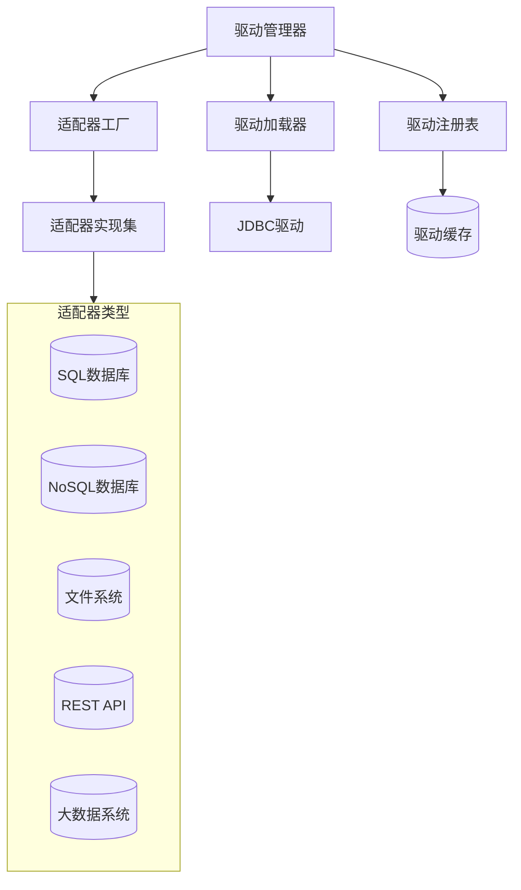
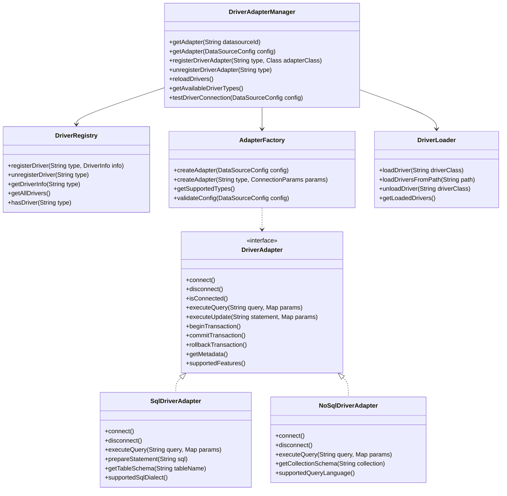
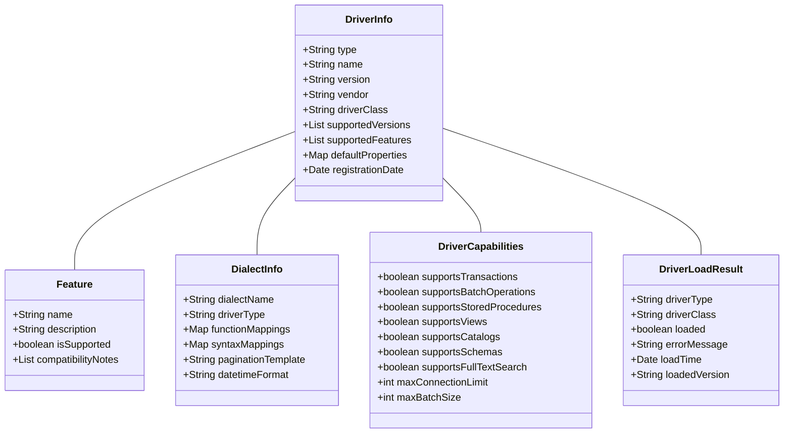
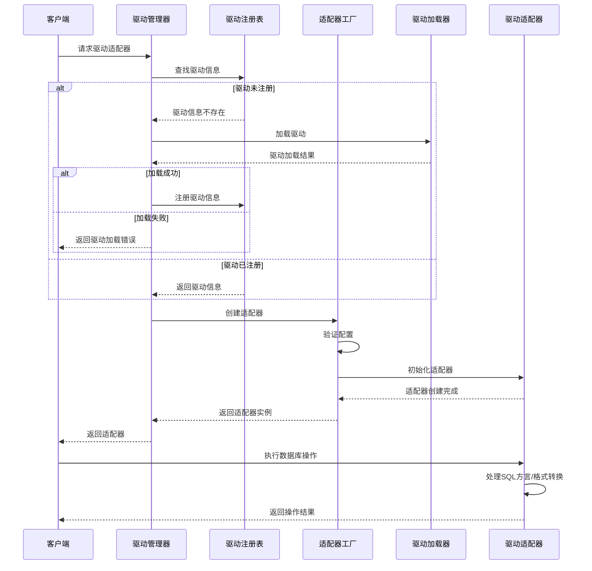

# 驱动适配器管理设计文档

## 1. 概述

### 1.1 目的
本文档详细描述驱动适配器管理组件的设计、架构和实现细节。

### 1.2 范围
本文档涵盖驱动适配器管理组件的核心功能、接口、内部实现、数据流和与其他组件的交互。

### 1.3 组件定位
驱动适配器管理组件是数据源管理模块的核心组件，负责管理各种数据库驱动和适配器，为系统提供统一的数据访问接口。它屏蔽了不同数据库系统的差异，提供可扩展的驱动注册和管理机制。

## 2. 架构设计

### 2.1 组件架构

### 2.2 核心类设计

## 3. 功能详细设计

### 3.1 驱动注册与发现
- 驱动自动发现机制
- 驱动注册接口
- 驱动元数据收集
- 驱动版本管理
- 驱动兼容性检查

### 3.2 适配器创建与管理
- 动态适配器创建
- 适配器类型映射
- 适配器池化管理
- 适配器状态监控
- 适配器生命周期管理

### 3.3 SQL方言转换
- SQL方言识别
- 通用SQL到特定方言转换
- 函数映射处理
- 语法差异处理
- 分页语法适配

### 3.4 扩展点机制
- 自定义驱动集成
- 自定义适配器实现
- 特性扩展机制
- 插件式驱动加载
- 自定义方言转换器

## 4. 接口设计

### 4.1 外部接口
| 接口名称 | 类型 | 用途 | 参数 | 返回值 | 异常 |
|--------|------|-----|------|-------|------|
| getDriverAdapter | 内部API | 获取数据源驱动适配器 | datasourceId: 数据源ID | DriverAdapter对象 | 适配器不存在异常 |
| createDriverAdapter | 内部API | 创建数据源驱动适配器 | config: 数据源配置 | DriverAdapter对象 | 适配器创建失败异常 |
| registerDriverType | 内部API | 注册新的驱动类型 | type: 驱动类型, class: 适配器类, info: 驱动信息 | 注册结果 | 驱动注册异常 |
| getSupportedDriverTypes | REST/内部API | 获取支持的驱动类型列表 | 无 | 驱动类型列表 | 无 |
| getDriverFeatures | REST/内部API | 获取驱动支持的特性 | type: 驱动类型 | 特性列表 | 驱动类型不存在异常 |
| testDriverConnection | REST/内部API | 测试驱动连接 | config: 数据源配置 | 连接测试结果 | 连接测试失败异常 |

### 4.2 内部接口
- `DriverAdapterManager`: 提供驱动适配器管理的核心功能
- `DriverRegistry`: 管理已注册的驱动信息
- `AdapterFactory`: 负责创建不同类型的适配器
- `DriverLoader`: 负责加载和管理驱动类
- `DriverAdapter`: 所有适配器实现的通用接口
- `SqlDialectTranslator`: 提供SQL方言转换功能

### 4.3 数据模型

## 5. 处理流程

### 5.1 主要流程

### 5.2 异常流程
- 驱动加载失败处理流程
- 适配器创建失败处理流程
- 不兼容的驱动版本处理流程
- 方言转换异常处理流程
- 驱动功能不支持处理流程

## 6. 性能考量

### 6.1 性能指标
| 指标 | 目标值 | 测试方法 |
|-----|-------|---------|
| 适配器创建时间 | <100ms | 性能测试 |
| SQL转换开销 | <5ms | 性能测试 |
| 适配器缓存命中率 | >90% | 监控系统 |
| 驱动加载时间 | <2s | 性能测试 |
| 并发适配器使用 | 支持500TPS | 压力测试 |

### 6.2 优化策略
- 适配器实例缓存
- 驱动类加载优化
- SQL解析和转换优化
- 预编译语句缓存
- 批量操作优化
- 异步操作支持

## 7. 安全考量

### 7.1 安全风险
- 不安全的驱动代码执行
- SQL注入风险
- 驱动权限过大
- 敏感信息泄露
- 第三方驱动安全问题

### 7.2 安全措施
- 驱动加载安全策略
- 驱动代码签名验证
- 参数化查询强制实施
- 驱动隔离执行
- 驱动访问权限控制
- 驱动操作审计

## 8. 扩展性设计

### 8.1 扩展点
- 新数据库类型支持
- 自定义适配器实现
- SQL方言转换器扩展
- 驱动特性检测扩展
- 第三方驱动集成

### 8.2 升级策略
- 驱动版本兼容性维护
- 适配器接口向后兼容
- 平滑的驱动升级机制
- 多版本驱动共存支持
- 驱动功能渐进式增强

## 9. 依赖关系

### 9.1 内部依赖
- 数据源配置管理: 提供驱动配置
- 连接池管理: 使用驱动建立连接
- 事件总线: 发布驱动事件
- 监控服务: 收集驱动性能指标
- 安全管理: 提供访问控制

### 9.2 外部依赖
- JDBC驱动: MySQL, PostgreSQL, Oracle等
- NoSQL驱动: MongoDB, Cassandra等
- 大数据驱动: Hadoop, Spark等
- 文件系统驱动: S3, HDFS等
- API客户端库: REST, GraphQL等

## 10. 测试策略

### 10.1 测试场景
- 各类型驱动加载和注册
- 适配器创建和管理功能
- SQL方言转换功能
- 驱动特性检测功能
- 高并发适配器使用
- 驱动升级和兼容性
- 异常处理和恢复

### 10.2 测试用例
- 注册和获取各种类型驱动
- 创建适配器并执行查询
- 转换复杂SQL至不同方言
- 测试驱动功能边界
- 并发创建和使用适配器
- 模拟驱动加载失败场景
- 测试驱动安全限制

## 11. 部署考量

### 11.1 部署要求
- Java 17或更高版本
- 各数据库的JDBC驱动和客户端库
- 足够的驱动加载类路径空间
- 适当的安全策略配置
- 驱动隔离的类加载机制

### 11.2 配置项
- 驱动加载路径配置
- 驱动自动发现设置
- 适配器缓存策略
- SQL方言映射配置
- 驱动安全策略配置
- 性能优化参数

## 12. 附录

### 12.1 术语表
- **驱动适配器**: 提供统一接口的数据库访问组件
- **驱动类**: 实际连接数据库的底层代码
- **SQL方言**: 特定数据库系统的SQL语法变体
- **JDBC**: Java数据库连接API
- **方言转换**: 将通用SQL转换为特定数据库方言

### 12.2 参考文档
- JDBC 4.3规范
- 各数据库厂商JDBC驱动文档
- SQL标准规范
- 适配器设计模式最佳实践
- 数据库连接安全指南