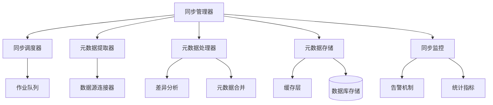
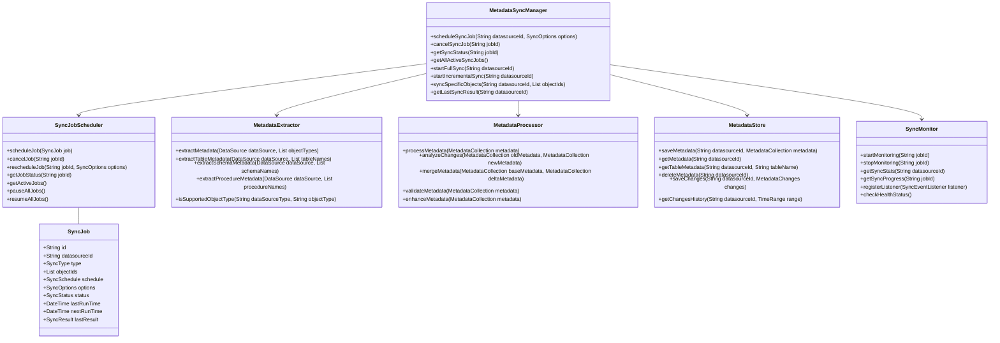
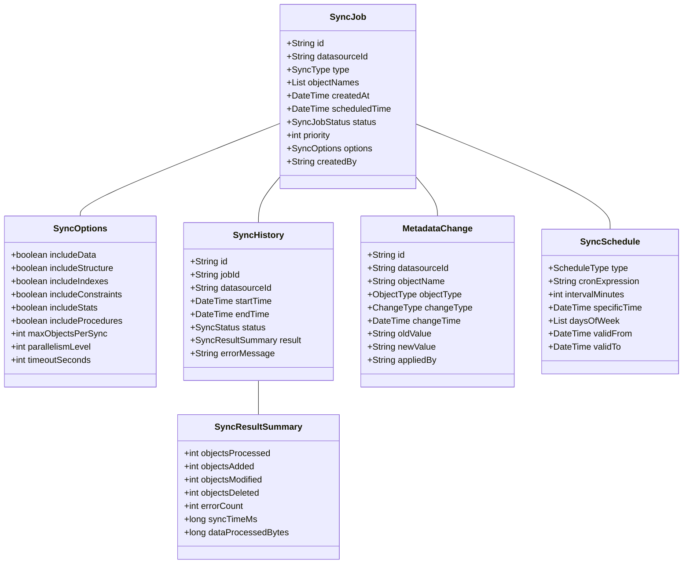
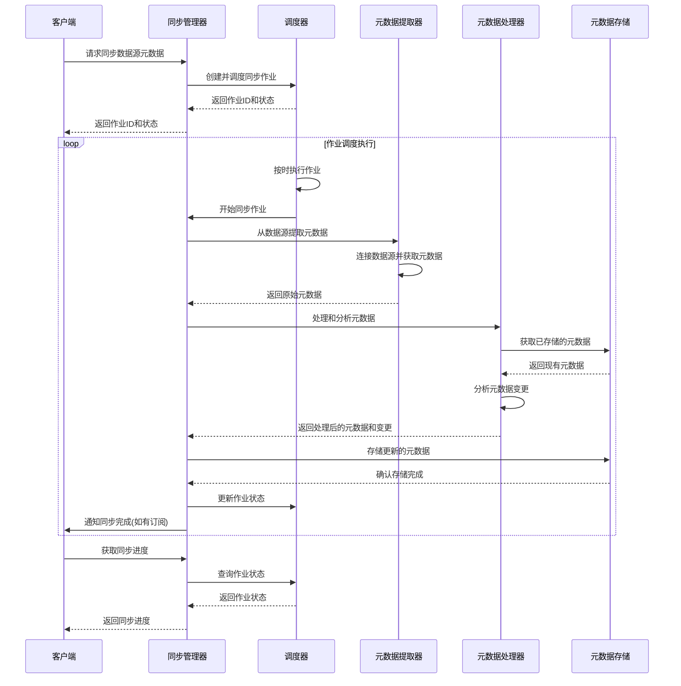

# 元数据同步设计文档

## 1. 概述

### 1.1 目的
本文档详细描述元数据同步组件的设计、架构和实现细节。

### 1.2 范围
本文档涵盖元数据同步组件的核心功能、接口、内部实现、数据流和与其他组件的交互。

### 1.3 组件定位
元数据同步组件是数据源管理模块的关键组件，负责从各种数据源中提取、同步和维护元数据信息，确保系统中的元数据与实际数据源保持一致。该组件是元数据管理的基础，为查询构建、数据探索等功能提供必要的元数据支持。

## 2. 架构设计

### 2.1 组件架构

### 2.2 核心类设计

## 3. 功能详细设计

### 3.1 同步作业管理
- 全量同步作业调度
- 增量同步作业调度
- 定期同步计划设置
- 手动触发同步
- 特定对象选择性同步
- 同步作业优先级管理
- 同步作业状态跟踪

### 3.2 元数据提取
- 表结构元数据提取
- 视图元数据提取
- 存储过程和函数元数据提取
- 约束和索引元数据提取
- 关系和外键元数据提取
- 数据类型映射
- 注释和描述提取

### 3.3 差异分析和处理
- 元数据变更检测
- 架构变更分类
- 元数据冲突解决
- 自动合并策略
- 变更历史记录
- 变更通知机制
- 变更回滚支持

### 3.4 同步监控和管理
- 同步进度跟踪
- 同步性能统计
- 错误监控和告警
- 同步日志记录
- 状态仪表板
- 资源使用监控
- 自动恢复机制

## 4. 接口设计

### 4.1 外部接口
| 接口名称 | 类型 | 用途 | 参数 | 返回值 | 异常 |
|--------|------|-----|------|-------|------|
| scheduleSyncJob | REST/内部API | 调度同步作业 | datasourceId: 数据源ID, options: 同步选项 | 作业ID | 调度失败异常 |
| getSyncStatus | REST/内部API | 获取同步状态 | jobId: 作业ID | 同步状态 | 作业不存在异常 |
| startFullSync | REST/内部API | 立即开始全量同步 | datasourceId: 数据源ID | 作业ID | 同步启动失败异常 |
| startIncrementalSync | REST/内部API | 立即开始增量同步 | datasourceId: 数据源ID | 作业ID | 同步启动失败异常 |
| cancelSyncJob | REST/内部API | 取消同步作业 | jobId: 作业ID | 取消结果 | 作业不存在异常, 作业无法取消异常 |
| getLastSyncResult | REST/内部API | 获取最后同步结果 | datasourceId: 数据源ID | 同步结果 | 数据源不存在异常 |
| getSyncProgress | REST/内部API | 获取同步进度 | jobId: 作业ID | 同步进度 | 作业不存在异常 |

### 4.2 内部接口
- `MetadataSyncManager`: 提供元数据同步的核心管理功能
- `SyncJobScheduler`: 负责同步作业的调度
- `MetadataExtractor`: 从数据源提取元数据
- `MetadataProcessor`: 处理和分析元数据
- `MetadataStore`: 管理元数据的存储和检索
- `SyncMonitor`: 监控同步作业执行

### 4.3 数据模型

## 5. 处理流程

### 5.1 主要流程

### 5.2 异常流程
- 连接数据源失败处理流程
- 元数据提取错误处理流程
- 元数据合并冲突处理流程
- 存储失败处理流程
- 同步超时处理流程
- 调度失败恢复流程

## 6. 性能考量

### 6.1 性能指标
| 指标 | 目标值 | 测试方法 |
|-----|-------|---------|
| 小型数据库全量同步时间 | <30s | 性能测试 |
| 大型数据库全量同步时间 | <10min | 性能测试 |
| 增量同步时间 | <10s | 性能测试 |
| 单表元数据同步时间 | <1s | 性能测试 |
| 并发同步作业数 | 支持10个 | 压力测试 |
| 元数据查询响应时间 | <50ms | 性能测试 |

### 6.2 优化策略
- 增量同步算法优化
- 并行元数据提取
- 批量处理优化
- 元数据缓存机制
- 按需同步策略
- 同步作业优化调度
- 资源使用限制

## 7. 安全考量

### 7.1 安全风险
- 敏感元数据泄露
- 未授权同步触发
- 元数据操作越权
- 同步过程资源耗尽
- 元数据修改未审计

### 7.2 安全措施
- 元数据访问控制
- 同步操作授权
- 敏感元数据过滤
- 资源使用限制
- 同步操作审计
- 安全传输加密
- 元数据备份机制

## 8. 扩展性设计

### 8.1 扩展点
- 支持新数据源类型
- 自定义元数据提取器
- 自定义同步策略
- 自定义处理流程
- 元数据增强插件
- 通知机制扩展

### 8.2 升级策略
- 平滑升级流程
- 向后兼容性保证
- 元数据格式版本控制
- 同步插件热插拔
- 增量功能部署
- 无缝元数据迁移

## 9. 依赖关系

### 9.1 内部依赖
- 数据源配置管理: 提供数据源连接信息
- 驱动适配器管理: 提供数据库访问能力
- 连接池管理: 提供数据库连接
- 元数据存储服务: 提供元数据持久化
- 事件总线: 提供事件通知机制

### 9.2 外部依赖
- 数据库系统: 元数据的源和目标
- 调度服务: 定时任务调度
- 缓存系统: 元数据缓存
- 消息队列: 异步处理和通知
- 监控系统: 同步状态监控

## 10. 测试策略

### 10.1 测试场景
- 各种数据源类型同步测试
- 不同规模数据库同步测试
- 增量同步准确性测试
- 元数据冲突解决测试
- 同步失败恢复测试
- 并发同步测试
- 长时间运行测试
- 性能和负载测试

### 10.2 测试用例
- 全量同步各类数据库对象
- 模拟数据库架构变更后同步
- 同步作业中断和恢复
- 手动和自动同步触发
- 不同类型元数据变更检测
- 大规模表和视图同步
- 元数据一致性验证

## 11. 部署考量

### 11.1 部署要求
- Java 17或更高版本
- 足够的内存用于元数据处理
- 高性能存储系统
- 分布式调度框架支持
- 数据库连接配置
- 网络访问权限

### 11.2 配置项
- 同步调度策略配置
- 元数据过滤规则
- 同步重试和超时配置
- 并行处理参数
- 告警和通知设置
- 资源限制配置
- 缓存策略设置

## 12. 附录

### 12.1 术语表
- **元数据**: 描述数据结构、关系和特性的数据
- **全量同步**: 完整同步所有元数据
- **增量同步**: 只同步变更的元数据
- **元数据提取器**: 从数据源提取元数据的组件
- **同步作业**: 元数据同步的调度单位

### 12.2 参考文档
- 数据库系统元数据API规范
- JDBC元数据接口文档
- 元数据标准规范
- 数据目录最佳实践
- 分布式同步算法参考
