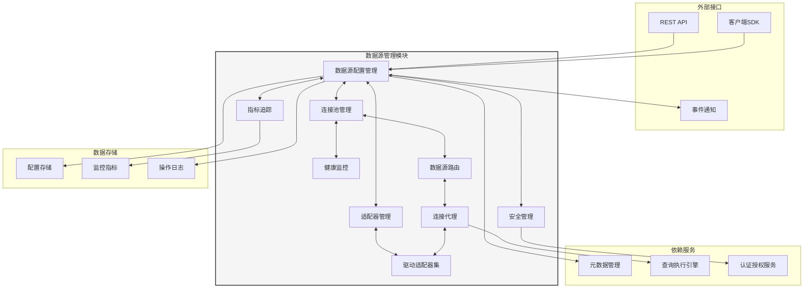
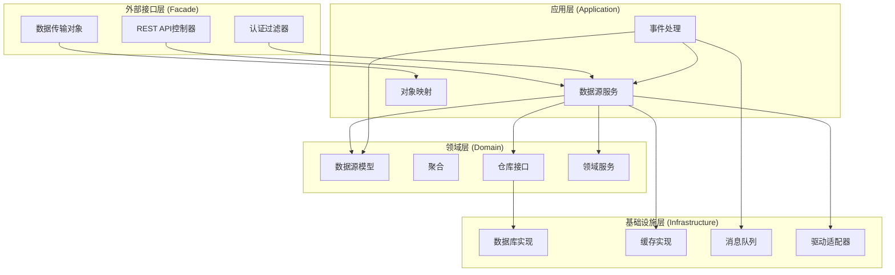
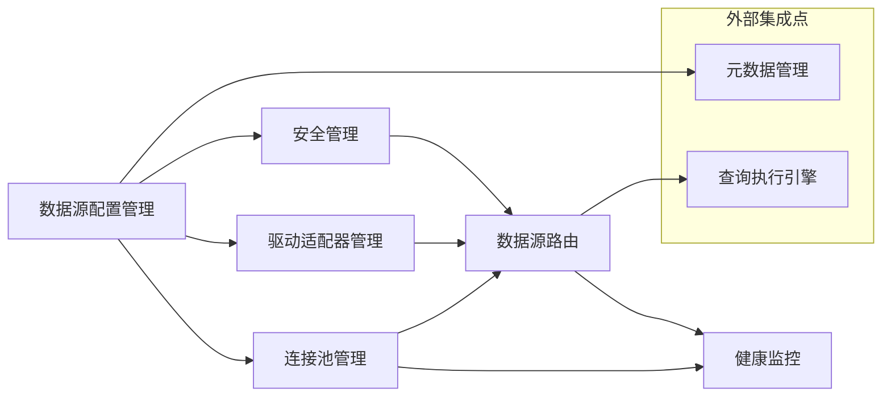
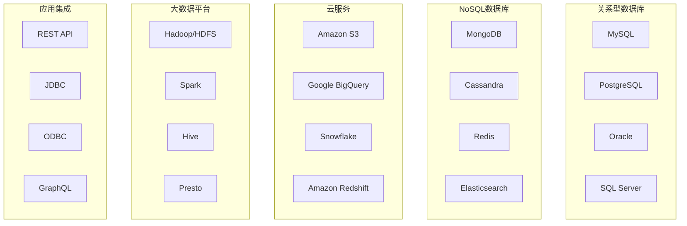
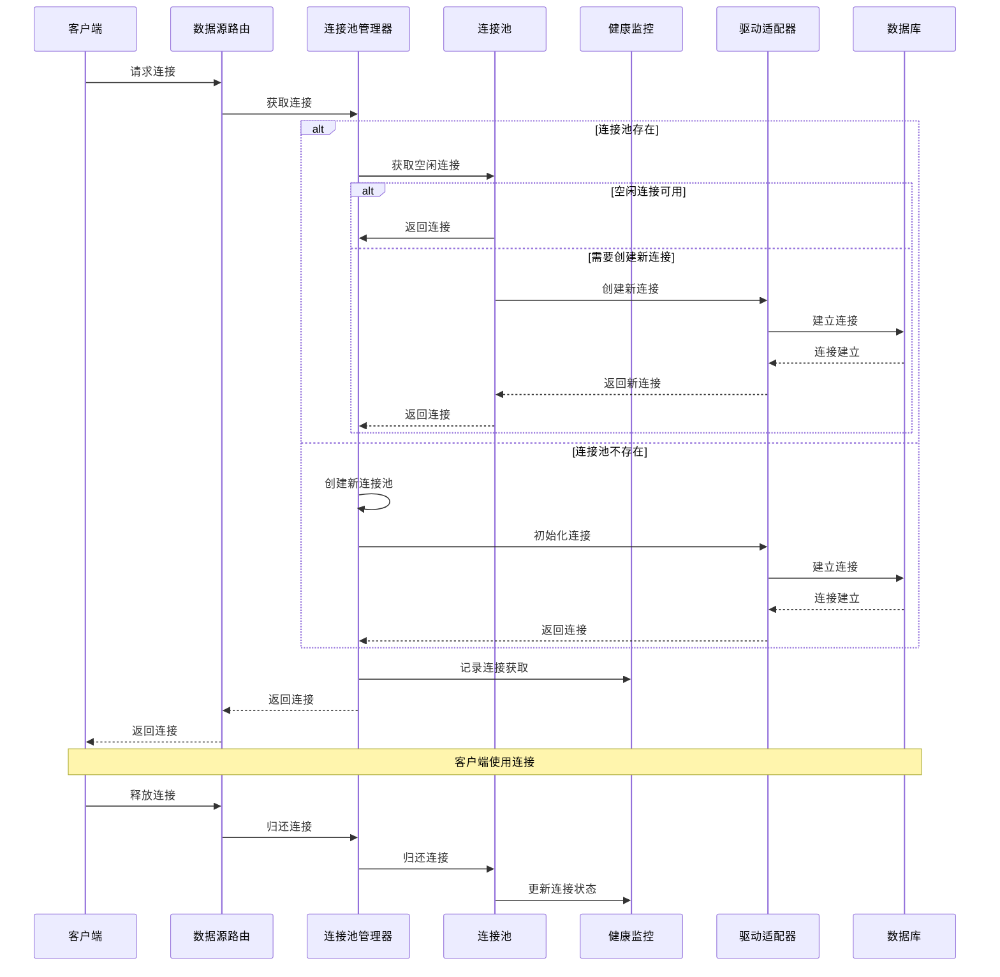
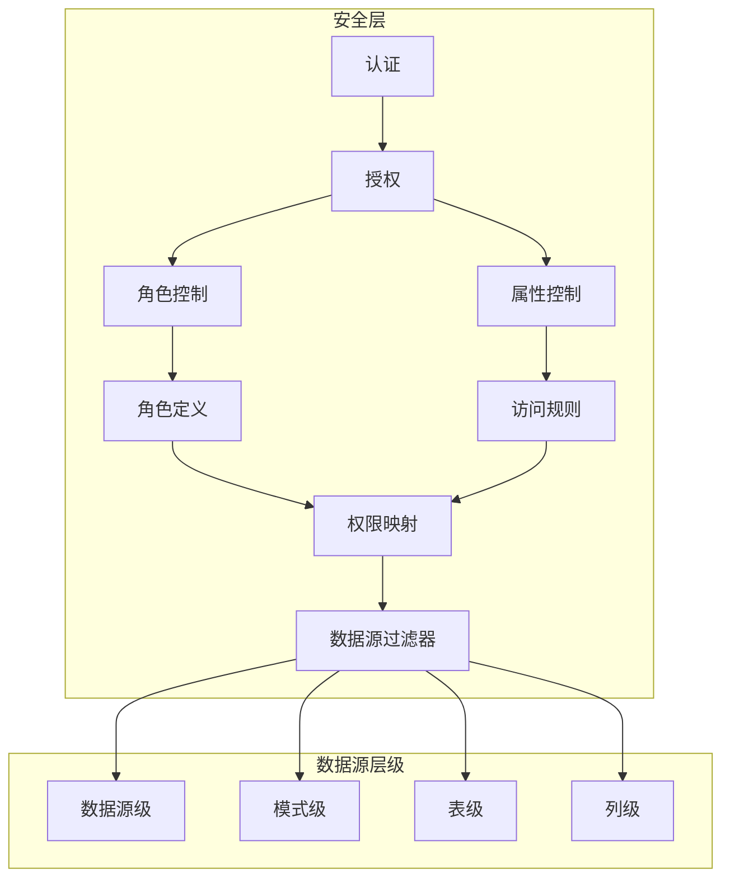
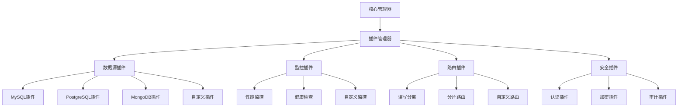
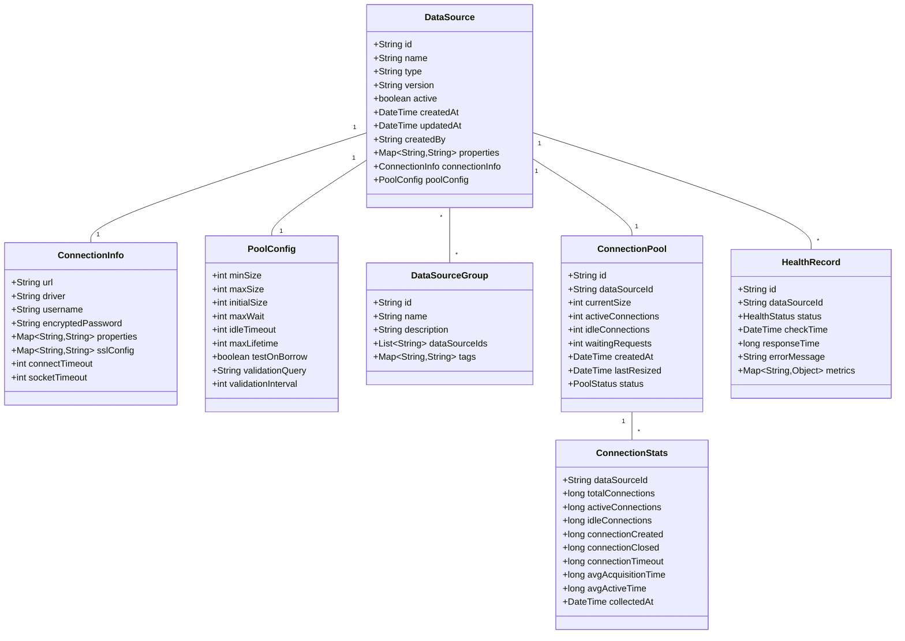

# DataScope数据源管理模块 - 系统总览

本文档提供DataScope数据源管理模块的整体架构、核心组件和设计理念的全面概述，是实施和开发的顶层指南。

## 1. 模块目标

数据源管理模块旨在实现以下目标：

- 提供统一的数据源接入和管理能力
- 支持多种类型数据源的配置和连接
- 实现数据源连接的高可用和负载均衡
- 确保数据源连接的安全性和稳定性
- 优化数据源访问性能和资源利用
- 提供全面的数据源监控和诊断能力
- 支持数据源元数据的自动采集和同步
- 实现数据源访问权限的细粒度控制
- 为上层应用提供简洁、统一的数据访问接口

## 2. 系统架构

### 2.1 整体架构

### 2.2 分层架构

数据源管理模块采用DDD架构设计，分为以下层次：

## 3. 核心组件

DataScope数据源管理模块由六个核心组件组成，每个组件负责特定的功能：

### 3.1 数据源配置管理

数据源配置管理负责处理数据源的创建、更新、删除和查询操作，维护数据源的配置信息。

**主要功能**：
- 数据源CRUD操作
- 数据源类型管理
- 配置验证和加密
- 版本控制和历史记录
- 数据源分组和标签

**详细设计**：[数据源配置管理设计文档](./datasource-configuration-design.md)

### 3.2 连接池管理

连接池管理负责创建和维护数据源连接池，优化连接的获取、使用和释放过程。

**主要功能**：
- 连接池创建和配置
- 连接生命周期管理
- 连接验证和清理
- 连接池监控和统计
- 动态调整和优化

**详细设计**：[连接池管理设计文档](./connection-pool-design.md)

### 3.3 驱动适配器管理

驱动适配器管理负责集成和管理各种数据源驱动，提供统一的驱动接口和功能适配。

**主要功能**：
- 驱动注册和加载
- 接口适配和统一
- 驱动版本管理
- 特性兼容处理
- 驱动隔离和沙箱

**详细设计**：[驱动适配器管理设计文档](./driver-adapter-design.md)

### 3.4 数据源路由

数据源路由负责根据查询上下文和负载情况，将请求路由到合适的数据源实例。

**主要功能**：
- 读写分离路由
- 分片路由策略
- 负载均衡
- 故障转移
- 路由规则管理

**详细设计**：[数据源路由设计文档](./datasource-routing-design.md)

### 3.5 健康监控

健康监控负责跟踪和分析数据源的可用性、性能和健康状况，及时发现和报告问题。

**主要功能**：
- 连接可用性检测
- 性能指标收集
- 健康状态评估
- 告警和通知
- 问题诊断支持

**详细设计**：[健康监控设计文档](./health-monitoring-design.md)

### 3.6 安全管理

安全管理负责保护数据源访问安全，实现认证、授权和审计功能。

**主要功能**：
- 访问认证
- 权限授权
- 凭证管理
- 操作审计
- 数据加密

**详细设计**：[安全管理设计文档](./security-management-design.md)

## 4. 组件间关系

六个核心组件之间的关系和协作方式：

### 4.1 协作场景

1. **数据源配置和连接流程**：
   - 用户通过配置管理创建数据源
   - 安全管理处理凭证和权限
   - 驱动适配器管理加载适当驱动
   - 连接池管理创建连接池
   - 健康监控开始监控连接
   - 数据源就绪并可用于请求

2. **查询执行路由流程**：
   - 查询执行引擎提交查询请求
   - 数据源路由根据查询类型和目标选择数据源
   - 安全管理验证访问权限
   - 连接池管理提供可用连接
   - 执行查询并返回结果
   - 健康监控记录性能指标

3. **故障处理流程**：
   - 健康监控检测到数据源问题
   - 通知连接池管理和数据源路由
   - 连接池管理标记不健康连接
   - 数据源路由启动故障转移
   - 请求路由到备用数据源
   - 配置管理更新数据源状态

## 5. 技术实现

### 5.1 数据源类型支持

数据源管理模块支持多种类型的数据源：

### 5.2 连接池实现

## 6. 安全架构

### 6.1 数据源安全控制

### 6.2 数据安全

- 数据源凭证加密存储
- 传输层加密（TLS/SSL）
- 数据访问审计日志
- 敏感数据标记和保护
- 数据源访问令牌轮换
- 最小权限原则实施

## 7. 性能优化策略

- **连接池优化**：连接复用和动态调整连接池大小
- **预连接和懒连接**：按需建立连接，避免资源浪费
- **连接验证优化**：智能验证机制减少验证开销
- **语句缓存**：缓存常用查询语句和预处理语句
- **分析型/事务型分离**：针对不同查询类型的专用连接
- **批处理优化**：批量操作减少网络往返
- **连接亲和性**：保持查询与数据源的亲和关系
- **异步连接管理**：非阻塞连接处理提高吞吐量

## 8. 扩展性设计

### 8.1 插件架构

### 8.2 扩展点

数据源管理模块提供以下关键扩展点：

1. **数据源适配器扩展**
   - 新数据源类型的驱动适配
   - 自定义连接管理逻辑
   - 特定数据源优化策略

2. **路由策略扩展**
   - 自定义路由算法
   - 业务规则路由
   - 动态路由策略

3. **监控指标扩展**
   - 自定义监控指标
   - 特定数据库健康检查
   - 性能分析插件

4. **安全机制扩展**
   - 自定义认证方式
   - 访问控制策略
   - 数据加密方案

## 9. 监控与管理

### 9.1 监控指标

数据源管理模块收集和提供以下关键监控指标：

- **连接池指标**：活动连接数、空闲连接数、等待连接数
- **性能指标**：连接获取时间、查询响应时间、吞吐量
- **健康指标**：可用性、错误率、连接失败率
- **资源指标**：内存使用、CPU利用率、网络I/O
- **操作指标**：CRUD操作次数、事务数、长时间运行查询

### 9.2 管理功能

系统管理功能包括：

- 数据源配置和状态管理
- 连接池参数动态调整
- 数据源在线/离线切换
- 状态监控和问题诊断
- 日志查看和分析
- 性能报告和趋势分析

## 10. 数据模型

### 10.1 核心数据模型

## 11. API接口

数据源管理模块提供RESTful API接口，支持数据源管理、监控和操作：

1. **数据源管理API**：
   - 数据源创建、读取、更新、删除
   - 数据源类型查询
   - 数据源测试连接
   - 数据源分组管理
   - 数据源批量操作

2. **连接管理API**：
   - 连接池状态查询
   - 连接池配置调整
   - 连接池重置
   - 连接统计数据获取
   - 活动连接查看

3. **监控和诊断API**：
   - 健康状态查询
   - 性能指标获取
   - 历史趋势数据
   - 问题诊断
   - 运行状况报告

4. **操作API**：
   - 数据源启用/禁用
   - 缓存清理
   - 连接池刷新
   - 紧急断开连接
   - 系统参数调整

## 12. 实施路线图

数据源管理模块的实施计划分为以下阶段：

### 12.1 阶段一：基础框架与核心功能（2周）
- 设计和实现数据源配置管理
- 开发基础连接池功能
- 实现主要数据库驱动适配器
- 创建REST API接口
- 实现基础安全控制

### 12.2 阶段二：高级连接管理（2周）
- 增强连接池管理能力
- 开发动态调整机制
- 实现数据源路由功能
- 增强安全管理控制
- 开发基础监控功能

### 12.3 阶段三：监控与优化（1周）
- 完善健康监控系统
- 实现性能分析功能
- 开发问题诊断工具
- 增强连接池优化策略
- 实现高级路由功能

### 12.4 阶段四：扩展支持（2周）
- 开发更多数据源类型适配器
- 实现插件扩展框架
- 开发自定义路由策略
- 增强监控和告警功能
- 完善文档和示例

### 12.5 阶段五：整合与优化（1周）
- 与其他模块集成
- 性能优化和压力测试
- 系统稳定性增强
- 安全审计和加固
- 最终质量保证和上线准备

## 13. 总结

DataScope数据源管理模块提供统一、安全、高效的数据源管理能力，支持多种类型数据源的集成和访问。通过六个核心组件的协同工作，系统能够满足企业对数据源接入、管理和监控的需求。

本设计考虑了系统的性能、安全性、扩展性和可维护性，提供了清晰的实施路线和最佳实践指南，为开发团队提供了实现参考。