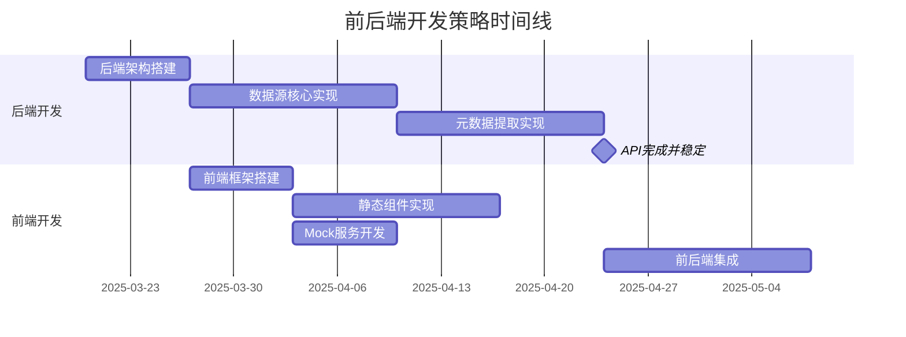
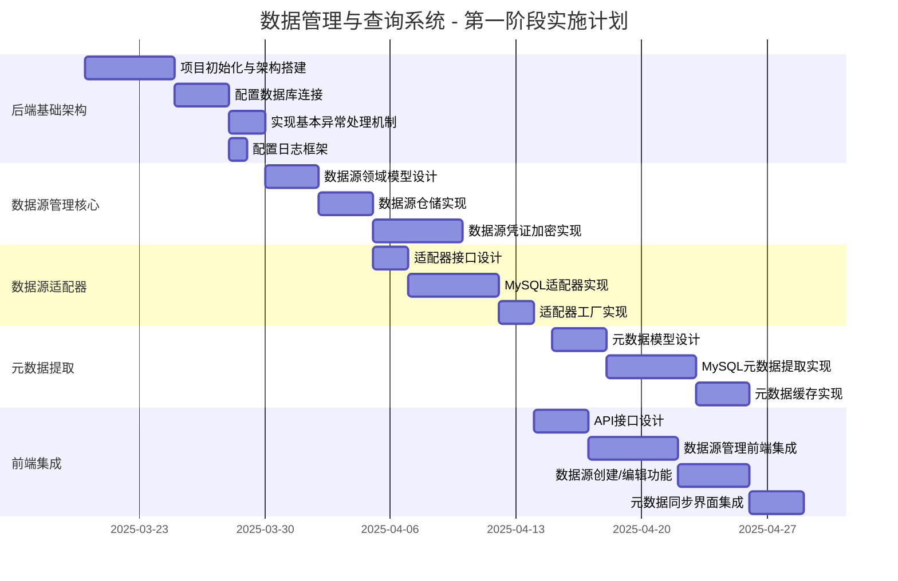

# 数据管理与查询系统 - 开发实施计划

## 前后端开发策略

基于项目特点和已有信息，我建议**先实现后端核心功能，然后进行前端集成**，原因如下：

1. **功能依赖性**：前端功能高度依赖后端API的稳定性和完整性，特别是数据源管理、元数据提取等核心功能
   
2. **风险控制**：核心后端功能（如数据源适配器、元数据提取、安全加密机制）包含较多技术风险点，应优先攻克

3. **接口稳定性**：提前完成后端API设计并实现核心功能后，可以提供稳定的API契约，减少后期接口变更导致的前端返工

4. **并行开发准备**：后端核心功能开发的同时，前端团队可以：
   - 搭建前端项目框架
   - 基于已完成的UI原型和API文档实现静态页面和组件
   - 开发Mock服务以模拟后端API响应

## 团队分工建议

根据项目计划中的资源需求（3名后端、2名前端、2名测试），建议以下分工：

### 后端团队分工

1. **后端开发者A（架构师兼开发者）**：
   - 负责项目整体架构设计
   - 实现核心框架和公共组件
   - 负责安全框架和数据源凭证加密实现
   - 技术决策把关和代码审查

2. **后端开发者B（数据源与适配器专家）**：
   - 实现数据源域模型和服务
   - 开发适配器框架和MySQL适配器
   - 实现数据源连接池管理
   - 后期负责DB2适配器开发

3. **后端开发者C（元数据与API专家）**：
   - 实现元数据提取和管理
   - 负责API层设计和实现
   - 实现缓存策略
   - 负责API文档生成

### 前端团队分工

1. **前端开发者A（前端架构师）**：
   - 负责前端项目架构
   - 实现状态管理和API调用框架
   - 设计组件库和公共样式
   - 负责数据源管理和数据浏览页面

2. **前端开发者B（UI/UX专家）**：
   - 实现UI组件和布局
   - 负责查询构建器页面
   - 实现数据可视化组件
   - 负责前端单元测试

### 测试团队分工

1. **测试工程师A（API测试专家）**：
   - 设计API测试用例
   - 实现自动化API测试
   - 负责核心功能测试
   - 执行性能测试

2. **测试工程师B（UI测试专家）**：
   - 设计UI测试用例
   - 实现UI自动化测试
   - 执行集成测试
   - 负责用户体验测试

## 协作与沟通机制

1. **Sprint计划与评审**
   - 两周一次Sprint计划会议
   - 明确每个Sprint的交付目标

2. **每日站会**
   - 前后端团队共同参与
   - 解决跨团队阻塞问题

3. **接口协议早期确定**
   - 在后端实现前完成API设计文档
   - 前端参与API设计评审

4. **DevOps支持**
   - 搭建自动化构建和部署流程
   - 实现API自动测试

5. **文档与知识共享**
   - 使用Confluence维护项目文档
   - 定期技术分享会议

## 第一阶段开发实施计划

根据项目总体规划，第一阶段应专注于基础架构与数据源管理的实施。以下是具体的开发实施建议：

### 1. 后端基础架构实现

**优先级：高**

1. **项目初始化与架构搭建**
   - 创建Spring Boot Maven项目
   - 配置项目结构，实现DDD四层架构（domain、application、infrastructure、facade）
   - 设置基础配置文件

2. **数据访问层设计**
   - 配置MySQL连接（系统数据库）
   - 配置MyBatis映射
   - 创建数据库迁移脚本（使用Flyway或Liquibase）

3. **安全框架实现**
   - 实现AES-256加密工具类
   - 设计密钥管理策略
   - 实现数据源凭证加密

4. **公共组件开发**
   - 异常处理框架
   - 日志记录机制
   - 缓存管理（Redis配置）

### 2. 数据源管理模块

**优先级：高**

1. **数据源域模型实现**
   - 设计`DataSource`领域模型
   - 实现数据源值对象和实体
   - 设计数据源仓储接口

2. **数据源适配器框架**
   - 设计适配器接口
   - 实现MySQL适配器
   - 实现适配器工厂

3. **数据源服务层**
   - 实现数据源注册服务
   - 实现数据源测试连接功能
   - 实现数据源管理服务

4. **元数据提取功能**
   - 实现元数据模型
   - 实现MySQL元数据提取
   - 实现元数据缓存策略
   - 支持增量更新机制

### 3. API层设计与实现

**优先级：中**

1. **RESTful API设计**
   - 设计数据源管理API
   - 设计元数据访问API
   - 实现API版本控制

2. **API接口实现**

3. **API文档生成**
   - 配置Springdoc-OpenAPI
   - 编写API注释

### 4. 前端开发准备

**优先级：中**

1. **前端项目骨架搭建**
   - 创建Vue 3项目结构
   - 配置Tailwind CSS和基础组件库
   - 实现路由和状态管理
   - 设计通用布局组件

2. **静态页面实现**
   - 基于原型实现静态页面组件
   - 开发Mock服务
   - 实现基础UI组件库

### 5. 数据库设计实现

**优先级：高**

## 关键里程碑设定

1. **后端核心完成** - 第5周结束
   - 数据源管理功能可用
   - 元数据提取完成
   - API文档生成
   
2. **前端基础框架** - 第5周结束
   - 组件库搭建完成
   - 静态页面实现
   - Mock服务可用

3. **前后端集成完成** - 第8周结束
   - 数据源管理页面功能可用
   - 元数据浏览功能可用
   - 基本查询功能可用

## 关键决策与建议

1. **优先实现MySQL适配器**
   - 优先完成MySQL适配器，并确保架构设计的灵活性
   - DB2适配器在架构验证后再实现，分配有经验的开发人员负责

2. **凭证安全管理**
   - 实现独立的密钥管理服务，避免在配置文件中存储敏感信息
   - 考虑使用Spring Vault或集成外部密钥管理系统

3. **元数据管理策略**
   - 设计元数据增量更新机制，避免全量同步带来的性能问题
   - 实现元数据缓存策略，提高查询性能

4. **前端开发建议**
   - 优先使用第三方组件库，减少自定义组件开发时间
   - 实现状态管理和API调用