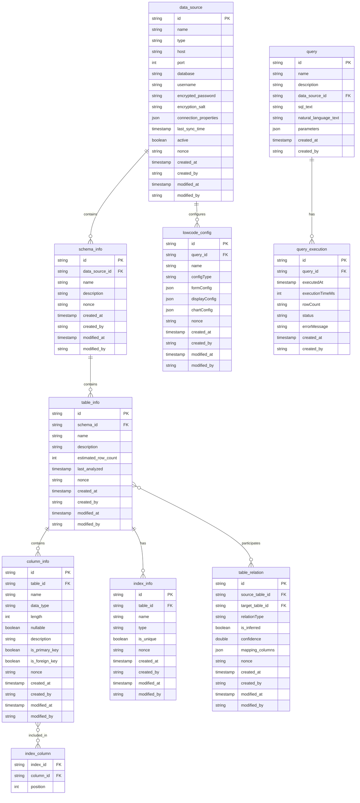

# 数据管理与查询系统 - 领域模型设计

## 1. 概述

本文档详细描述了数据管理与查询系统的领域模型，包括核心实体、属性、关系以及关键业务规则。

## 2. 核心实体

### 2.1 DataSource (数据源)

*   中文名称：数据源
*   英文名称：DataSource
*   业务描述：代表一个外部数据源，例如 MySQL 或 DB2 数据库。
*   属性：
    *   `id` (VARCHAR(36), PK): 数据源ID，主键，UUID
        *   数据库字段名: `id`
        *   类属性名: `id`
    *   `name` (VARCHAR): 数据源名称，中文名称：数据源名称，约束条件：不能为空
        *   数据库字段名: `name`
        *   类属性名: `name`
    *   `type` (VARCHAR, Enum: MySQL, DB2): 数据源类型，中文名称：数据源类型，枚举值：MySQL, DB2，约束条件：不能为空
        *   数据库字段名: `type`
        *   类属性名: `type`
    *   `host` (VARCHAR): 主机地址，中文名称：主机地址，约束条件：不能为空
        *   数据库字段名: `host`
        *   类属性名: `host`
    *   `port` (INT): 端口号，中文名称：端口号，约束条件：不能为空，默认值：3306
        *   数据库字段名: `port`
        *   类属性名: `port`
    *   `database` (VARCHAR): 数据库名称，中文名称：数据库名称，约束条件：不能为空
        *   数据库字段名: `database`
        *   类属性名: `database`
    *   `username` (VARCHAR): 用户名，中文名称：用户名，约束条件：不能为空
        *   数据库字段名: `username`
        *   类属性名: `username`
    *   `encrypted_password` (VARCHAR): 加密后的密码，中文名称：加密密码，约束条件：不能为空
        *   数据库字段名: `encrypted_password`
        *   类属性名: `encryptedPassword`
    *   `encryption_salt` (VARCHAR): 加密盐值，中文名称：加密盐值，约束条件：不能为空
        *   数据库字段名: `encryption_salt`
        *   类属性名: `encryptionSalt`
    *   `connection_properties` (JSON): 连接属性，中文名称：连接属性，说明：JSON格式的连接配置
        *   数据库字段名: `connection_properties`
        *   类属性名: `connectionProperties`
    *   `last_sync_time` (TIMESTAMP): 最后同步时间，中文名称：最后同步时间
        *   数据库字段名: `last_sync_time`
        *   类属性名: `lastSyncTime`
    *   `active` (BOOLEAN): 是否启用，中文名称：是否启用，默认值：true
        *   数据库字段名: `active`
        *   类属性名: `active`
    *   `nonce` (VARCHAR): 乐观锁版本号
        *   数据库字段名: `nonce`
        *   类属性名: `nonce`
    *   `created_at` (TIMESTAMP): 创建时间
        *   数据库字段名: `created_at`
        *   类属性名: `createdAt`
    *   `created_by` (VARCHAR): 创建人
        *   数据库字段名: `created_by`
        *   类属性名: `createdBy`
    *   `modified_at` (TIMESTAMP): 最后修改时间
        *   数据库字段名: `modified_at`
        *   类属性名: `modifiedAt`
    *   `modified_by` (VARCHAR): 最后修改人
        *   数据库字段名: `modified_by`
        *   类属性名: `modifiedBy`
*   关系：
    *   一个数据源包含多个 SchemaInfo (1:N)

### 2.2 SchemaInfo (模式信息)

*   中文名称：模式信息
*   英文名称：SchemaInfo
*   业务描述：代表数据库中的一个模式（Schema）。
*   属性：
    *   `id` (VARCHAR(36), PK): 模式ID，主键，UUID
        *   数据库字段名: `id`
        *   类属性名: `id`
    *   `data_source_id` (VARCHAR(36), FK): 数据源ID，外键，关联 DataSource.id，约束条件：不能为空
        *   数据库字段名: `data_source_id`
        *   类属性名: `dataSourceId`
    *   `name` (VARCHAR): 模式名称，中文名称：模式名称，约束条件：不能为空
        *   数据库字段名: `name`
        *   类属性名: `name`
    *   `description` (VARCHAR): 模式描述，中文名称：模式描述
        *   数据库字段名: `description`
        *   类属性名: `description`
    *   `nonce` (VARCHAR): 乐观锁版本号
        *   数据库字段名: `nonce`
        *   类属性名: `nonce`
    *   `created_at` (TIMESTAMP): 创建时间
        *   数据库字段名: `created_at`
        *   类属性名: `createdAt`
    *   `created_by` (VARCHAR): 创建人
        *   数据库字段名: `created_by`
        *   类属性名: `createdBy`
    *   `modified_at` (TIMESTAMP): 最后修改时间
        *   数据库字段名: `modified_at`
        *   类属性名: `modifiedAt`
    *   `modified_by` (VARCHAR): 最后修改人
        *   数据库字段名: `modified_by`
        *   类属性名: `modifiedBy`
*   关系：
    *   一个 SchemaInfo 包含多个 TableInfo (1:N)

### 2.3 TableInfo (表信息)

*   中文名称：表信息
*   英文名称：TableInfo
*   业务描述：代表数据库中的一张表。
*   属性：
    *   `id` (VARCHAR(36), PK): 表ID，主键，UUID
        *   数据库字段名: `id`
        *   类属性名: `id`
    *   `schema_id` (VARCHAR(36), FK): 模式ID，外键，关联 SchemaInfo.id，约束条件：不能为空
        *   数据库字段名: `schema_id`
        *   类属性名: `schemaId`
    *   `name` (VARCHAR): 表名称，中文名称：表名称，约束条件：不能为空
        *   数据库字段名: `name`
        *   类属性名: `name`
    *   `description` (VARCHAR): 表描述，中文名称：表描述
        *   数据库字段名: `description`
        *   类属性名: `description`
    *   `estimated_row_count` (INT): 估计行数，中文名称：估计行数
        *   数据库字段名: `estimated_row_count`
        *   类属性名: `estimatedRowCount`
    *   `last_analyzed` (TIMESTAMP): 最后分析时间，中文名称：最后分析时间
        *   数据库字段名: `last_analyzed`
        *   类属性名: `lastAnalyzed`
    *   `nonce` (VARCHAR): 乐观锁版本号
        *   数据库字段名: `nonce`
        *   类属性名: `nonce`
    *   `created_at` (TIMESTAMP): 创建时间
        *   数据库字段名: `created_at`
        *   类属性名: `createdAt`
    *   `created_by` (VARCHAR): 创建人
        *   数据库字段名: `created_by`
        *   类属性名: `createdBy`
    *   `modified_at` (TIMESTAMP): 最后修改时间
        *   数据库字段名: `modified_at`
        *   类属性名: `modifiedAt`
    *   `modified_by` (VARCHAR): 最后修改人
        *   数据库字段名: `modified_by`
        *   类属性名: `modifiedBy`
*   关系：
    *   一个 TableInfo 包含多个 ColumnInfo (1:N)
    *   一个 TableInfo 拥有多个 IndexInfo (1:N)
    *   一个 TableInfo 参与多个 TableRelation (1:N, N:1)

### 2.4 ColumnInfo (列信息)

*   中文名称：列信息
*   英文名称：ColumnInfo
*   业务描述：代表数据库表中的一列。
*   属性：
    *   `id` (VARCHAR(36), PK): 列ID，主键，UUID
        *   数据库字段名: `id`
        *   类属性名: `id`
    *   `table_id` (VARCHAR(36), FK): 表ID，外键，关联 TableInfo.id，约束条件：不能为空
        *   数据库字段名: `table_id`
        *   类属性名: `tableId`
    *   `name` (VARCHAR): 列名称，中文名称：列名称，约束条件：不能为空
        *   数据库字段名: `name`
        *   类属性名: `name`
    *   `data_type` (VARCHAR): 数据类型，中文名称：数据类型，约束条件：不能为空
        *   数据库字段名: `data_type`
        *   类属性名: `dataType`
    *   `length` (INT): 长度，中文名称：长度
        *   数据库字段名: `length`
        *   类属性名: `length`
    *   `nullable` (BOOLEAN): 是否允许为空，中文名称：是否允许为空，默认值：true
        *   数据库字段名: `nullable`
        *   类属性名: `nullable`
    *   `description` (VARCHAR): 列描述，中文名称：列描述
        *   数据库字段名: `description`
        *   类属性名: `description`
    *   `is_primary_key` (BOOLEAN): 是否为主键，中文名称：是否为主键，默认值：false
        *   数据库字段名: `is_primary_key`
        *   类属性名: `isPrimaryKey`
    *   `is_foreign_key` (BOOLEAN): 是否为外键，中文名称：是否为外键，默认值：false
        *   数据库字段名: `is_foreign_key`
        *   类属性名: `isForeignKey`
    *   `nonce` (VARCHAR): 乐观锁版本号
        *   数据库字段名: `nonce`
        *   类属性名: `nonce`
    *   `created_at` (TIMESTAMP): 创建时间
        *   数据库字段名: `created_at`
        *   类属性名: `createdAt`
    *   `created_by` (VARCHAR): 创建人
        *   数据库字段名: `created_by`
        *   类属性名: `createdBy`
    *   `modified_at` (TIMESTAMP): 最后修改时间
        *   数据库字段名: `modified_at`
        *   类属性名: `modifiedAt`
    *   `modified_by` (VARCHAR): 最后修改人
        *   数据库字段名: `modified_by`
        *   类属性名: `modifiedBy`

### 2.5 IndexInfo (索引信息)

*   中文名称：索引信息
*   英文名称：IndexInfo
*   业务描述：代表数据库表上的一个索引。
*   属性：
    *   `id` (VARCHAR(36), PK): 索引ID，主键，UUID
        *   数据库字段名: `id`
        *   类属性名: `id`
    *   `table_id` (VARCHAR(36), FK): 表ID，外键，关联 TableInfo.id，约束条件：不能为空
        *   数据库字段名: `table_id`
        *   类属性名: `tableId`
    *   `name` (VARCHAR): 索引名称，中文名称：索引名称，约束条件：不能为空
        *   数据库字段名: `name`
        *   类属性名: `name`
    *   `type` (VARCHAR): 索引类型，中文名称：索引类型
        *   数据库字段名: `type`
        *   类属性名: `type`
    *   `is_unique` (BOOLEAN): 是否唯一索引，中文名称：是否唯一索引，默认值：false
        *   数据库字段名: `is_unique`
        *   类属性名: `isUnique`
    *   `nonce` (VARCHAR): 乐观锁版本号
        *   数据库字段名: `nonce`
        *   类属性名: `nonce`
    *   `created_at` (TIMESTAMP): 创建时间
        *   数据库字段名: `created_at`
        *   类属性名: `createdAt`
    *   `created_by` (VARCHAR): 创建人
        *   数据库字段名: `created_by`
        *   类属性名: `createdBy`
    *   `modified_at` (TIMESTAMP): 最后修改时间
        *   数据库字段名: `modified_at`
        *   类属性名: `modifiedAt`
    *   `modified_by` (VARCHAR): 最后修改人
        *   数据库字段名: `modified_by`
        *   类属性名: `modifiedBy`

### 2.6 IndexColumn (索引列)

*   中文名称：索引列
*   英文名称：IndexColumn
*   业务描述：代表索引中的一列。
*   属性：
    *   `index_id` (VARCHAR(36), FK): 索引ID，外键，关联 IndexInfo.id，约束条件：不能为空
        *   数据库字段名: `index_id`
        *   类属性名: `indexId`
    *   `column_id` (VARCHAR(36), FK): 列ID，外键，关联 ColumnInfo.id，约束条件：不能为空
        *   数据库字段名: `column_id`
        *   类属性名: `columnId`
    *   `position` (INT): 索引位置，中文名称：索引位置
        *   数据库字段名: `position`
        *   类属性名: `position`

### 2.7 TableRelation (表关系)

*   中文名称：表关系
*   英文名称：TableRelation
*   业务描述：代表数据库表之间的关系。
*   属性：
    *   `id` (VARCHAR(36), PK): 关系ID，主键，UUID
        *   数据库字段名: `id`
        *   类属性名: `id`
    *   `source_table_id` (VARCHAR(36), FK): 源表ID，外键，关联 TableInfo.id，约束条件：不能为空
        *   数据库字段名: `source_table_id`
        *   类属性名: `sourceTableId`
    *   `target_table_id` (VARCHAR(36), FK): 目标表ID，外键，关联 TableInfo.id，约束条件：不能为空
        *   数据库字段名: `target_table_id`
        *   类属性名: `targetTableId`
    *   `relation_type` (VARCHAR): 关系类型，中文名称：关系类型，枚举值：OneToOne, OneToMany, ManyToMany
        *   数据库字段名: `relation_type`
        *   类属性名: `relationType`
    *   `is_inferred` (BOOLEAN): 是否为推断关系，中文名称：是否为推断关系，默认值：false
        *   数据库字段名: `is_inferred`
        *   类属性名: `isInferred`
    *   `confidence` (DOUBLE): 置信度，中文名称：置信度，取值范围：0-1
        *   数据库字段名: `confidence`
        *   类属性名: `confidence`
    *   `mapping_columns` (JSON): 映射列，中文名称：映射列，说明：JSON格式的映射关系
        *   数据库字段名: `mapping_columns`
        *   类属性名: `mappingColumns`
    *   `nonce` (VARCHAR): 乐观锁版本号
        *   数据库字段名: `nonce`
        *   类属性名: `nonce`
    *   `created_at` (TIMESTAMP): 创建时间
        *   数据库字段名: `created_at`
        *   类属性名: `createdAt`
    *   `created_by` (VARCHAR): 创建人
        *   数据库字段名: `created_by`
        *   类属性名: `createdBy`
    *   `modified_at` (TIMESTAMP): 最后修改时间
        *   数据库字段名: `modified_at`
        *   类属性名: `modifiedAt`
    *   `modified_by` (VARCHAR): 最后修改人
        *   数据库字段名: `modified_by`
        *   类属性名: `modifiedBy`

### 2.8 SavedQuery (保存的查询)

*   中文名称：保存的查询
*   英文名称：SavedQuery
*   业务描述：代表用户保存的查询语句。
*   属性：
    *   `id` (VARCHAR(36), PK): 查询ID，主键，UUID
        *   数据库字段名: `id`
        *   类属性名: `id`
    *   `name` (VARCHAR): 查询名称，中文名称：查询名称，约束条件：不能为空
        *   数据库字段名: `name`
        *   类属性名: `name`
    *   `description` (VARCHAR): 查询描述，中文名称：查询描述
        *   数据库字段名: `description`
        *   类属性名: `description`
    *   `data_source_id` (VARCHAR(36), FK): 数据源ID，外键，关联 DataSource.id，约束条件：不能为空
        *   数据库字段名: `data_source_id`
        *   类属性名: `dataSourceId`
    *   `sql_text` (TEXT): SQL语句，中文名称：SQL语句
        *   数据库字段名: `sql_text`
        *   类属性名: `sqlText`
    *   `natural_language_text` (TEXT): 自然语言描述，中文名称：自然语言描述
        *   数据库字段名: `natural_language_text`
        *   类属性名: `naturalLanguageText`
    *   `parameters` (JSON): 参数，中文名称：参数，说明：JSON格式的参数列表
        *   数据库字段名: `parameters`
        *   类属性名: `parameters`
    *   `created_at` (TIMESTAMP): 创建时间，中文名称：创建时间
        *   数据库字段名: `created_at`
        *   类属性名: `createdAt`
    *   `created_by` (VARCHAR): 创建人，中文名称：创建人
        *   数据库字段名: `created_by`
        *   类属性名: `createdBy`

### 2.9 QueryExecution (查询执行)

*   中文名称：查询执行
*   英文名称：QueryExecution
*   业务描述：代表查询的一次执行记录。
*   属性：
    *   `id` (VARCHAR(36), PK): 执行ID，主键，UUID
        *   数据库字段名: `id`
        *   类属性名: `id`
    *   `query_id` (VARCHAR(36), FK): 查询ID，外键，关联 SavedQuery.id，约束条件：不能为空
        *   数据库字段名: `query_id`
        *   类属性名: `queryId`
    *   `executed_at` (TIMESTAMP): 执行时间，中文名称：执行时间
        *   数据库字段名: `executed_at`
        *   类属性名: `executedAt`
    *   `execution_time_ms` (INT): 执行时间（毫秒），中文名称：执行时间（毫秒）
        *   数据库字段名: `execution_time_ms`
        *   类属性名: `executionTimeMs`
    *   `row_count` (INT): 结果行数，中文名称：结果行数
        *   数据库字段名: `row_count`
        *   类属性名: `rowCount`
    *   `status` (VARCHAR): 状态，中文名称：状态，枚举值：Pending, Running, Completed, Failed, Cancelled
        *   数据库字段名: `status`
        *   类属性名: `status`
    *   `created_at` (TIMESTAMP): 创建时间，中文名称：创建时间
        *   数据库字段名: `created_at`
        *   类属性名: `createdAt`
    *   `created_by` (VARCHAR): 创建人，中文名称：创建人
        *   数据库字段名: `created_by`
        *   类属性名: `createdBy`
    *   `error_message` (TEXT): 错误信息，中文名称：错误信息
		*   数据库字段名: `error_message`
		*   类属性名: `errorMessage`

### 2.10 LowCodeConfig (低代码配置)

*   中文名称：低代码配置
*   英文名称：LowCodeConfig
*   业务描述：代表低代码平台的配置信息。
*   属性：
    *   `id` (VARCHAR(36), PK): 配置ID，主键，UUID
        *   数据库字段名: `id`
        *   类属性名: `id`
    *   `query_id` (VARCHAR(36), FK): 查询ID，外键，关联 SavedQuery.id，约束条件：不能为空
        *   数据库字段名: `query_id`
        *   类属性名: `queryId`
    *   `name` (VARCHAR): 配置名称，中文名称：配置名称，约束条件：不能为空
        *   数据库字段名: `name`
        *   类属性名: `name`
    *   `config_type` (VARCHAR): 配置类型，中文名称：配置类型
        *   数据库字段名: `config_type`
        *   类属性名: `configType`
    *   `form_config` (JSON): 表单配置，中文名称：表单配置，说明：JSON格式的表单配置
        *   数据库字段名: `form_config`
        *   类属性名: `formConfig`
    *   `display_config` (JSON): 显示配置，中文名称：显示配置，说明：JSON格式的显示配置
        *   数据库字段名: `display_config`
        *   类属性名: `displayConfig`
    *   `chart_config` (JSON): 图表配置，中文名称：图表配置，说明：JSON格式的图表配置
        *   数据库字段名: `chart_config`
        *   类属性名: `chartConfig`
    *   `nonce` (VARCHAR): 乐观锁版本号
        *   数据库字段名: `nonce`
        *   类属性名: `nonce`
    *   `created_at` (TIMESTAMP): 创建时间
        *   数据库字段名: `created_at`
        *   类属性名: `createdAt`
    *   `created_by` (VARCHAR): 创建人
        *   数据库字段名: `created_by`
        *   类属性名: `createdBy`
    *   `modified_at` (TIMESTAMP): 最后修改时间
        *   数据库字段名: `modified_at`
        *   类属性名: `modifiedAt`
    *   `modified_by` (VARCHAR): 最后修改人
        *   数据库字段名: `modified_by`
        *   类属性名: `modifiedBy`

## 3. 实体关系图 (ER Diagram)

## 4. 关键业务规则和约束

*   数据源凭证必须加密存储。
*   用户查询必须经过权限验证。
*   系统需要防止SQL注入攻击。
*   需要对查询执行进行资源限制，例如超时时间。
*   需要对敏感数据进行脱敏处理。
*   表名采用 `tbl` 前缀
*   唯一索引采用 `u_idx` 前缀
*   其他索引采用 `idx` 前缀
*   为实现数据在不同环境间平滑的导出导入，主键id采用uuid并在编码时注意唯一性检查
*   所有数据库字段的命名采用“小写字母”，连字符为半角下划线；所有类属性的命名采用驼峰命名法