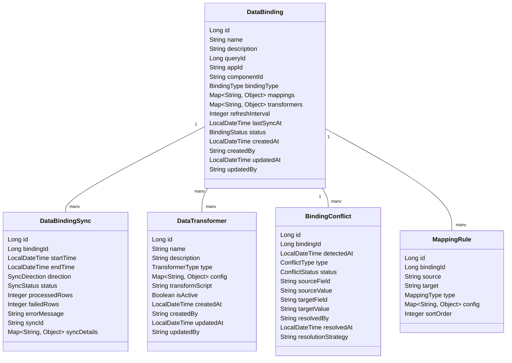
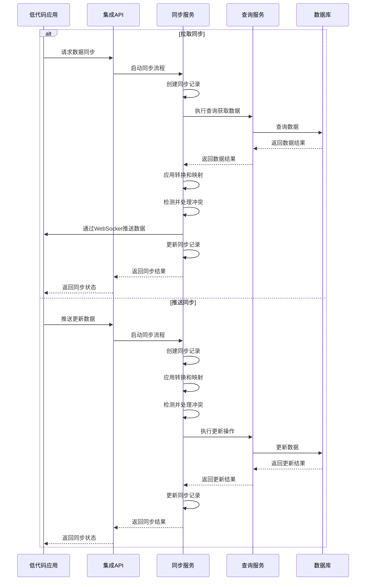
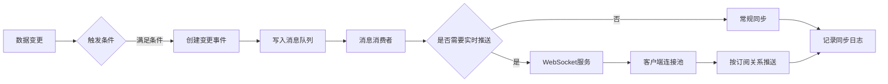

# 低代码集成模块 - 数据绑定与同步详细设计

本文档详细描述DataScope低代码集成模块中数据绑定与同步功能的设计，包括数据模型、服务接口、同步机制和冲突解决策略等。

## 1. 设计目标

数据绑定与同步功能旨在实现以下目标：

- 提供DataScope数据与低代码平台组件的无缝集成机制
- 支持单向和双向数据绑定方式
- 实现实时或准实时的数据同步
- 提供灵活的数据转换和映射机制
- 支持冲突检测和解决策略
- 确保数据一致性和完整性
- 优化性能和资源利用

## 2. 数据模型设计

### 2.1 核心实体关系



### 2.2 枚举类型

```java
public enum BindingType {
    ONE_WAY_PULL,  // 单向从DataScope拉取数据到组件
    ONE_WAY_PUSH,  // 单向从组件推送数据到DataScope
    TWO_WAY        // 双向同步
}

public enum BindingStatus {
    ACTIVE,        // 活跃状态
    INACTIVE,      // 未激活状态
    ERROR,         // 错误状态
    SUSPENDED      // 已暂停状态
}

public enum SyncDirection {
    PULL,          // 从DataScope拉取数据
    PUSH,          // 向DataScope推送数据
    BIDIRECTIONAL  // 双向同步
}

public enum SyncStatus {
    IN_PROGRESS,   // 同步进行中
    COMPLETED,     // 同步已完成
    FAILED,        // 同步失败
    PARTIAL,       // 部分成功
    CANCELLED      // 同步已取消
}

public enum TransformerType {
    MAP,           // 映射转换
    FORMAT,        // 格式转换
    CALCULATE,     // 计算转换
    VALIDATE,      // 验证转换
    AGGREGATE,     // 聚合转换
    CUSTOM         // 自定义转换
}

public enum ConflictType {
    VALUE_CONFLICT,    // 值冲突
    TYPE_CONFLICT,     // 类型冲突
    CONSTRAINT_VIOLATION, // 约束冲突
    MISSING_REQUIRED,  // 缺少必须值
    MODIFICATION_CONFLICT // 修改冲突
}

public enum ConflictStatus {
    DETECTED,      // 已检测到
    RESOLVED,      // 已解决
    IGNORED,       // 已忽略
    PENDING        // 等待解决
}

public enum MappingType {
    FIELD,         // 字段映射
    EXPRESSION,    // 表达式映射
    NESTED,        // 嵌套映射
    COLLECTION     // 集合映射
}
```

### 2.3 数据库表结构

```sql
-- 数据绑定
CREATE TABLE data_binding (
    id BIGSERIAL PRIMARY KEY,
    name VARCHAR(255) NOT NULL,
    description TEXT,
    query_id BIGINT NOT NULL REFERENCES saved_query(id),
    app_id VARCHAR(100) NOT NULL,
    component_id VARCHAR(100) NOT NULL,
    binding_type VARCHAR(20) NOT NULL,
    mappings JSONB NOT NULL,
    transformers JSONB,
    refresh_interval INTEGER,
    last_sync_at TIMESTAMP,
    status VARCHAR(20) NOT NULL,
    created_at TIMESTAMP NOT NULL,
    created_by VARCHAR(100) NOT NULL,
    updated_at TIMESTAMP NOT NULL,
    updated_by VARCHAR(100) NOT NULL,
    UNIQUE(app_id, component_id)
);

-- 数据绑定同步记录
CREATE TABLE data_binding_sync (
    id BIGSERIAL PRIMARY KEY,
    binding_id BIGINT NOT NULL REFERENCES data_binding(id),
    start_time TIMESTAMP NOT NULL,
    end_time TIMESTAMP,
    direction VARCHAR(20) NOT NULL,
    status VARCHAR(20) NOT NULL,
    processed_rows INTEGER,
    failed_rows INTEGER,
    error_message TEXT,
    sync_id VARCHAR(100) NOT NULL,
    sync_details JSONB
);

-- 数据转换器
CREATE TABLE data_transformer (
    id BIGSERIAL PRIMARY KEY,
    name VARCHAR(255) NOT NULL,
    description TEXT,
    type VARCHAR(20) NOT NULL,
    config JSONB NOT NULL,
    transform_script TEXT,
    is_active BOOLEAN NOT NULL DEFAULT TRUE,
    created_at TIMESTAMP NOT NULL,
    created_by VARCHAR(100) NOT NULL,
    updated_at TIMESTAMP NOT NULL,
    updated_by VARCHAR(100) NOT NULL
);

-- 数据绑定和转换器关联
CREATE TABLE binding_transformer_mapping (
    binding_id BIGINT NOT NULL REFERENCES data_binding(id),
    transformer_id BIGINT NOT NULL REFERENCES data_transformer(id),
    sort_order INTEGER NOT NULL,
    config JSONB,
    PRIMARY KEY (binding_id, transformer_id)
);

-- 绑定冲突记录
CREATE TABLE binding_conflict (
    id BIGSERIAL PRIMARY KEY,
    binding_id BIGINT NOT NULL REFERENCES data_binding(id),
    detected_at TIMESTAMP NOT NULL,
    type VARCHAR(30) NOT NULL,
    status VARCHAR(20) NOT NULL,
    source_field VARCHAR(255),
    source_value TEXT,
    target_field VARCHAR(255),
    target_value TEXT,
    resolved_by VARCHAR(100),
    resolved_at TIMESTAMP,
    resolution_strategy VARCHAR(50)
);

-- 映射规则
CREATE TABLE mapping_rule (
    id BIGSERIAL PRIMARY KEY,
    binding_id BIGINT NOT NULL REFERENCES data_binding(id),
    source VARCHAR(255) NOT NULL,
    target VARCHAR(255) NOT NULL,
    type VARCHAR(20) NOT NULL,
    config JSONB,
    sort_order INTEGER NOT NULL,
    UNIQUE(binding_id, source, target)
);
```

## 3. 服务接口设计

### 3.1 数据绑定管理服务

```java
/**
 * 数据绑定管理服务接口
 * 管理数据绑定配置和同步记录
 */
public interface DataBindingService {
    
    /**
     * 创建数据绑定
     * @param binding 绑定信息
     * @return 创建的绑定
     */
    DataBinding createBinding(DataBindingDTO binding);
    
    /**
     * 更新数据绑定
     * @param id 绑定ID
     * @param binding 更新的绑定信息
     * @return 更新后的绑定
     */
    DataBinding updateBinding(Long id, DataBindingDTO binding);
    
    /**
     * 获取数据绑定
     * @param id 绑定ID
     * @return 绑定信息
     */
    Optional<DataBinding> getBinding(Long id);
    
    /**
     * 获取数据绑定列表
     * @param filter 过滤条件
     * @param pageable 分页信息
     * @return 绑定列表
     */
    Page<DataBinding> getBindings(BindingFilter filter, Pageable pageable);
    
    /**
     * 删除数据绑定
     * @param id 绑定ID
     */
    void deleteBinding(Long id);
    
    /**
     * 获取应用绑定
     * @param appId 应用ID
     * @return 绑定列表
     */
    List<DataBinding> getAppBindings(String appId);
    
    /**
     * 获取组件绑定
     * @param appId 应用ID
     * @param componentId 组件ID
     * @return 绑定信息
     */
    Optional<DataBinding> getComponentBinding(String appId, String componentId);
    
    /**
     * 激活绑定
     * @param id 绑定ID
     * @return 更新后的绑定
     */
    DataBinding activateBinding(Long id);
    
    /**
     * 停用绑定
     * @param id 绑定ID
     * @return 更新后的绑定
     */
    DataBinding deactivateBinding(Long id);
    
    /**
     * 获取同步历史
     * @param bindingId 绑定ID
     * @param pageable 分页信息
     * @return 同步历史
     */
    Page<DataBindingSync> getSyncHistory(Long bindingId, Pageable pageable);
    
    /**
     * 获取冲突列表
     * @param bindingId 绑定ID
     * @param status 冲突状态
     * @param pageable 分页信息
     * @return 冲突列表
     */
    Page<BindingConflict> getConflicts(Long bindingId, ConflictStatus status, Pageable pageable);
    
    /**
     * 解决冲突
     * @param conflictId 冲突ID
     * @param resolution 解决方案
     * @return 更新后的冲突
     */
    BindingConflict resolveConflict(Long conflictId, ConflictResolutionDTO resolution);
}
```

### 3.2 数据同步服务

```java
/**
 * 数据同步服务接口
 * 处理数据同步和转换
 */
public interface DataSyncService {
    
    /**
     * 手动执行同步
     * @param bindingId 绑定ID
     * @param direction 同步方向
     * @param options 同步选项
     * @return 同步结果
     */
    DataBindingSync performSync(Long bindingId, SyncDirection direction, SyncOptions options);
    
    /**
     * 取消同步
     * @param syncId 同步ID
     * @return 取消结果
     */
    boolean cancelSync(String syncId);
    
    /**
     * 检查同步状态
     * @param syncId 同步ID
     * @return 同步状态
     */
    SyncStatus checkSyncStatus(String syncId);
    
    /**
     * 从源获取数据
     * @param binding 绑定信息
     * @param parameters 查询参数
     * @return 源数据
     */
    SourceData fetchSourceData(DataBinding binding, Map<String, Object> parameters);
    
    /**
     * 向目标推送数据
     * @param binding 绑定信息
     * @param data 数据
     * @return 推送结果
     */
    PushResult pushTargetData(DataBinding binding, List<Map<String, Object>> data);
    
    /**
     * 应用转换器
     * @param binding 绑定信息
     * @param data 源数据
     * @return 转换后的数据
     */
    List<Map<String, Object>> applyTransformers(DataBinding binding, List<Map<String, Object>> data);
    
    /**
     * 应用映射规则
     * @param binding 绑定信息
     * @param data 源数据
     * @return 映射后的数据
     */
    List<Map<String, Object>> applyMappings(DataBinding binding, List<Map<String, Object>> data);
    
    /**
     * 检测数据冲突
     * @param binding 绑定信息
     * @param sourceData 源数据
     * @param targetData 目标数据
     * @return 检测到的冲突
     */
    List<BindingConflict> detectConflicts(DataBinding binding, List<Map<String, Object>> sourceData, List<Map<String, Object>> targetData);
    
    /**
     * 应用冲突解决策略
     * @param binding 绑定信息
     * @param conflicts 冲突列表
     * @param strategy 解决策略
     * @return 解决后的数据
     */
    List<Map<String, Object>> applyConflictResolution(DataBinding binding, List<BindingConflict> conflicts, ConflictResolutionStrategy strategy);
}
```

### 3.3 数据转换服务

```java
/**
 * 数据转换服务接口
 * 管理和应用数据转换器
 */
public interface DataTransformerService {
    
    /**
     * 创建转换器
     * @param transformer 转换器信息
     * @return 创建的转换器
     */
    DataTransformer createTransformer(DataTransformerDTO transformer);
    
    /**
     * 更新转换器
     * @param id 转换器ID
     * @param transformer 更新的转换器信息
     * @return 更新后的转换器
     */
    DataTransformer updateTransformer(Long id, DataTransformerDTO transformer);
    
    /**
     * 获取转换器
     * @param id 转换器ID
     * @return 转换器信息
     */
    Optional<DataTransformer> getTransformer(Long id);
    
    /**
     * 获取转换器列表
     * @param type 转换器类型
     * @param pageable 分页信息
     * @return 转换器列表
     */
    Page<DataTransformer> getTransformers(TransformerType type, Pageable pageable);
    
    /**
     * 删除转换器
     * @param id 转换器ID
     */
    void deleteTransformer(Long id);
    
    /**
     * 应用转换器
     * @param transformer 转换器
     * @param value 源值
     * @param context 上下文信息
     * @return 转换后的值
     */
    Object applyTransformation(DataTransformer transformer, Object value, Map<String, Object> context);
    
    /**
     * 验证转换器
     * @param transformer 转换器
     * @return 验证结果
     */
    ValidationResult validateTransformer(DataTransformer transformer);
    
    /**
     * 获取绑定的转换器
     * @param bindingId 绑定ID
     * @return 转换器列表
     */
    List<DataTransformer> getBindingTransformers(Long bindingId);
    
    /**
     * 添加转换器到绑定
     * @param bindingId 绑定ID
     * @param transformerId 转换器ID
     * @param config 配置
     * @param sortOrder 排序顺序
     * @return 更新后的绑定
     */
    DataBinding addTransformerToBinding(Long bindingId, Long transformerId, Map<String, Object> config, Integer sortOrder);
    
    /**
     * 移除转换器从绑定
     * @param bindingId 绑定ID
     * @param transformerId 转换器ID
     * @return 更新后的绑定
     */
    DataBinding removeTransformerFromBinding(Long bindingId, Long transformerId);
}
```

## 4. 数据同步机制

### 4.1 同步触发方式

系统支持以下同步触发方式：

1. **定时同步**：按照配置的时间间隔定期执行同步
2. **事件触发同步**：响应特定事件（如数据更新、查询执行）触发同步
3. **手动同步**：用户手动触发的同步操作
4. **级联同步**：一个同步操作触发相关绑定的同步

### 4.2 同步流程



### 4.3 实时同步机制

对于实时性要求高的场景，系统采用WebSocket技术实现数据实时推送：



WebSocket连接与会话管理：

```java
@Service
public class WebSocketSyncService {
    
    @Autowired
    private SimpMessagingTemplate messagingTemplate;
    
    /**
     * 推送数据给特定应用
     * @param appId 应用ID
     * @param payload 数据负载
     */
    public void pushToApp(String appId, Object payload) {
        messagingTemplate.convertAndSend("/topic/app/" + appId, payload);
    }
    
    /**
     * 推送数据给特定组件
     * @param appId 应用ID
     * @param componentId 组件ID
     * @param payload 数据负载
     */
    public void pushToComponent(String appId, String componentId, Object payload) {
        messagingTemplate.convertAndSend("/topic/component/" + appId + "/" + componentId, payload);
    }
    
    /**
     * 推送数据给特定用户
     * @param userId 用户ID
     * @param payload 数据负载
     */
    public void pushToUser(String userId, Object payload) {
        messagingTemplate.convertAndSendToUser(userId, "/queue/updates", payload);
    }
}
```

## 5. 数据映射与转换

### 5.1 字段映射机制

系统支持以下字段映射机制：

1. **直接映射**：源字段直接映射到目标字段
2. **表达式映射**：使用表达式计算目标值
3. **嵌套映射**：处理嵌套对象结构
4. **集合映射**：处理数组和集合类型
5. **动态映射**：根据条件动态确定映射关系

```json
// 映射配置示例
{
  "mappings": [
    {
      "source": "user_id",
      "target": "id",
      "type": "FIELD"
    },
    {
      "source": "concat(first_name, ' ', last_name)",
      "target": "fullName",
      "type": "EXPRESSION"
    },
    {
      "source": "address",
      "target": "contactInfo.address",
      "type": "NESTED"
    },
    {
      "source": "orders[]",
      "target": "transactions[]",
      "type": "COLLECTION",
      "config": {
        "itemMappings": [
          {"source": "order_id", "target": "id"},
          {"source": "amount", "target": "value"}
        ]
      }
    }
  ]
}
```

### 5.2 数据转换器类型

系统内置以下转换器类型：

1. **映射转换器**：值映射转换（如状态代码到文本描述）
2. **格式转换器**：处理日期、数字等格式化
3. **计算转换器**：执行数学计算和函数运算
4. **验证转换器**：数据验证和清洗
5. **聚合转换器**：汇总和统计计算
6. **自定义转换器**：支持脚本和自定义逻辑

```json
// 转换器配置示例
{
  "transformers": [
    {
      "type": "MAP",
      "field": "status",
      "config": {
        "mappings": {
          "A": "活跃",
          "I": "非活跃",
          "P": "待处理",
          "D": "已禁用"
        },
        "defaultValue": "未知"
      }
    },
    {
      "type": "FORMAT",
      "field": "createdAt",
      "config": {
        "format": "yyyy-MM-dd HH:mm",
        "timezone": "Asia/Shanghai"
      }
    },
    {
      "type": "CALCULATE",
      "field": "totalPrice",
      "config": {
        "expression": "price * quantity * (1 - discount/100)",
        "resultType": "decimal",
        "precision": 2
      }
    },
    {
      "type": "VALIDATE",
      "field": "email",
      "config": {
        "rules": [
          {"type": "required", "message": "邮箱不能为空"},
          {"type": "email", "message": "邮箱格式不正确"}
        ]
      }
    },
    {
      "type": "AGGREGATE",
      "field": "orderItems",
      "config": {
        "operations": [
          {"type": "sum", "field": "price", "as": "totalAmount"},
          {"type": "count", "as": "itemCount"}
        ]
      }
    },
    {
      "type": "CUSTOM",
      "field": "*",
      "config": {
        "script": "function transform(data) { /* 转换逻辑 */ return data; }"
      }
    }
  ]
}
```

### 5.3 转换器实现机制

系统采用责任链模式实现转换器链：

```java
public class TransformerChain {
    
    private List<DataTransformer> transformers;
    
    public TransformerChain(List<DataTransformer> transformers) {
        this.transformers = transformers.stream()
            .sorted(Comparator.comparing(t -> t.getSortOrder()))
            .collect(Collectors.toList());
    }
    
    public Map<String, Object> transform(Map<String, Object> data) {
        Map<String, Object> result = new HashMap<>(data);
        Map<String, Object> context = new HashMap<>();
        
        for (DataTransformer transformer : transformers) {
            String field = transformer.getField();
            
            // 处理通配符或指定字段
            if ("*".equals(field)) {
                result = transformAll(transformer, result, context);
            } else {
                Object value = result.get(field);
                if (value != null) {
                    Object transformed = transformValue(transformer, value, context);
                    result.put(field, transformed);
                }
            }
            
            // 更新上下文
            context.put("currentData", result);
        }
        
        return result;
    }
    
    private Object transformValue(DataTransformer transformer, Object value, Map<String, Object> context) {
        // 根据转换器类型调用相应的转换逻辑
        switch (transformer.getType()) {
            case MAP:
                return mapValue(transformer, value);
            case FORMAT:
                return formatValue(transformer, value);
            case CALCULATE:
                return calculateValue(transformer, value, context);
            case VALIDATE:
                return validateValue(transformer, value);
            case AGGREGATE:
                return aggregateValue(transformer, value);
            case CUSTOM:
                return customTransform(transformer, value, context);
            default:
                return value;
        }
    }
    
    // 具体转换方法的实现...
    
    private Map<String, Object> transformAll(DataTransformer transformer, Map<String, Object> data, Map<String, Object> context) {
        // 全局转换的实现
        if (transformer.getType() == TransformerType.CUSTOM) {
            return customTransformAll(transformer, data, context);
        }
        return data;
    }
}
```

## 6. 冲突检测与解决

### 6.1 冲突类型

系统识别以下类型的数据冲突：

1. **值冲突**：同一字段在源和目标具有不同的值
2. **类型冲突**：字段类型不匹配
3. **约束冲突**：违反数据约束（如唯一性）
4. **缺失必要字段**：缺少必须的字段
5. **并发修改冲突**：同一数据被并发修改

### 6.2 冲突检测算法

```java
public class ConflictDetector {
    
    /**
     * 检测源数据和目标数据之间的冲突
     * @param binding 数据绑定
     * @param sourceData 源数据
     * @param targetData 目标数据
     * @return 冲突列表
     */
    public List<BindingConflict> detectConflicts(DataBinding binding, List<Map<String, Object>> sourceData, List<Map<String, Object>> targetData) {
        List<BindingConflict> conflicts = new ArrayList<>();
        
        // 构建目标数据索引
        Map<Object, Map<String, Object>> targetIndex = buildIndex(targetData, binding.getKeyField());
        
        // 检查每条源数据
        for (Map<String, Object> source : sourceData) {
            Object keyValue = source.get(binding.getKeyField());
            if (keyValue == null) {
                continue; // 跳过无主键的记录
            }
            
            Map<String, Object> target = targetIndex.get(keyValue);
            if (target == null) {
                // 目标不存在此记录，无冲突
                continue;
            }
            
            // 检查每个映射字段的冲突
            for (MappingRule mapping : binding.getMappingRules()) {
                String sourceField = mapping.getSource();
                String targetField = mapping.getTarget();
                
                Object sourceValue = getNestedValue(source, sourceField);
                Object targetValue = getNestedValue(target, targetField);
                
                // 值冲突检测
                if (sourceValue != null && targetValue != null && !isEqual(sourceValue, targetValue)) {
                    conflicts.add(createValueConflict(binding, keyValue, sourceField, sourceValue, targetField, targetValue));
                }
                
                // 类型冲突检测
                if (sourceValue != null && targetValue != null && !isSameType(sourceValue, targetValue)) {
                    conflicts.add(createTypeConflict(binding, keyValue, sourceField, sourceValue, targetField, targetValue));
                }
            }
            
            // 检查修改时间戳冲突
            if (binding.getTimestampField() != null) {
                Object sourceTimestamp = source.get(binding.getTimestampField());
                Object targetTimestamp = target.get(binding.getTimestampField());
                
                if (sourceTimestamp != null && targetTimestamp != null) {
                    // 比较时间戳判断冲突
                    if (isTimestampConflict(sourceTimestamp, targetTimestamp)) {
                        conflicts.add(createModificationConflict(binding, keyValue, sourceTimestamp, targetTimestamp));
                    }
                }
            }
        }
        
        return conflicts;
    }
    
    /**
     * 构建数据索引
     * @param data 数据集合
     * @param keyField 索引字段
     * @return 索引映射
     */
    private Map<Object, Map<String, Object>> buildIndex(List<Map<String, Object>> data, String keyField) {
        Map<Object, Map<String, Object>> index = new HashMap<>();
        
        for (Map<String, Object> item : data) {
            Object keyValue = item.get(keyField);
            if (keyValue != null) {
                index.put(keyValue, item);
            }
        }
        
        return index;
    }
    
    /**
     * 获取嵌套属性值
     * @param data 数据对象
     * @param path 属性路径
     * @return 属性值
     */
    private Object getNestedValue(Map<String, Object> data, String path) {
        // 实现嵌套路径查找
        String[] parts = path.split("\\.");
        Object current = data;
        
        for (String part : parts) {
            if (current instanceof Map) {
                current = ((Map<?, ?>) current).get(part);
            } else {
                return null;
            }
        }
        
        return current;
    }
    
    // 其他辅助方法...
}
```

### 6.3 冲突解决策略

系统支持以下冲突解决策略：

1. **源优先**：使用源数据覆盖目标数据
2. **目标优先**：保持目标数据不变
3. **最新时间戳优先**：基于时间戳选择最新的数据
4. **合并策略**：合并源和目标的数据（适用于组合字段）
5. **自定义解决函数**：使用自定义逻辑解决冲突
6. **手动解决**：将冲突标记为待人工解决

```java
public class ConflictResolver {
    
    /**
     * 解决冲突
     * @param binding 数据绑定
     * @param conflicts 冲突列表
     * @param strategy 解决策略
     * @param sourceData 源数据
     * @param targetData 目标数据
     * @return 解决后的数据
     */
    public ResolvedData resolveConflicts(DataBinding binding, List<BindingConflict> conflicts, ConflictResolutionStrategy strategy, List<Map<String, Object>> sourceData, List<Map<String, Object>> targetData) {
        // 构建源和目标数据索引
        Map<Object, Map<String, Object>> sourceIndex = buildIndex(sourceData, binding.getKeyField());
        Map<Object, Map<String, Object>> targetIndex = buildIndex(targetData, binding.getKeyField());
        
        // 创建解决后的数据集合
        List<Map<String, Object>> resolvedData = new ArrayList<>(targetData);
        List<BindingConflict> resolvedConflicts = new ArrayList<>();
        List<BindingConflict> pendingConflicts = new ArrayList<>();
        
        // 按策略处理每个冲突
        for (BindingConflict conflict : conflicts) {
            Object keyValue = conflict.getKeyValue();
            Map<String, Object> source = sourceIndex.get(keyValue);
            Map<String, Object> target = targetIndex.get(keyValue);
            
            if (source == null || target == null) {
                pendingConflicts.add(conflict);
                continue;
            }
            
            boolean resolved = false;
            
            switch (strategy) {
                case SOURCE_WINS:
                    resolved = resolveWithSourceWins(conflict, source, target, resolvedData);
                    break;
                case TARGET_WINS:
                    resolved = resolveWithTargetWins(conflict, source, target, resolvedData);
                    break;
                case LATEST_WINS:
                    resolved = resolveWithLatestWins(conflict, source, target, binding.getTimestampField(), resolvedData);
                    break;
                case MERGE:
                    resolved = resolveWithMerge(conflict, source, target, resolvedData);
                    break;
                case CUSTOM:
                    resolved = resolveWithCustomLogic(binding, conflict, source, target, resolvedData);
                    break;
                case MANUAL:
                    pendingConflicts.add(conflict);
                    resolved = false;
                    break;
            }
            
            if (resolved) {
                // 更新冲突状态
                conflict.setStatus(ConflictStatus.RESOLVED);
                conflict.setResolutionStrategy(strategy.name());
                conflict.setResolvedAt(LocalDateTime.now());
                resolvedConflicts.add(conflict);
            } else {
                pendingConflicts.add(conflict);
            }
        }
        
        return new ResolvedData(resolvedData, resolvedConflicts, pendingConflicts);
    }
    
    // 具体解决策略的实现方法...
}
```

## 7. API接口设计

### 7.1 数据绑定API

```
# 数据绑定管理API
GET    /api/v1/lowcode/bindings                     # 获取绑定列表
POST   /api/v1/lowcode/bindings                     # 创建绑定
GET    /api/v1/lowcode/bindings/{id}                # 获取绑定详情
PUT    /api/v1/lowcode/bindings/{id}                # 更新绑定
DELETE /api/v1/lowcode/bindings/{id}                # 删除绑定
GET    /api/v1/lowcode/apps/{appId}/bindings        # 获取应用绑定
GET    /api/v1/lowcode/apps/{appId}/components/{componentId}/binding # 获取组件绑定
POST   /api/v1/lowcode/bindings/{id}/activate       # 激活绑定
POST   /api/v1/lowcode/bindings/{id}/deactivate     # 停用绑定
```

### 7.2 同步管理API

```
# 同步管理API
POST   /api/v1/lowcode/bindings/{id}/sync           # 执行同步
GET    /api/v1/lowcode/bindings/{id}/sync-history   # 获取同步历史
GET    /api/v1/lowcode/syncs/{id}                   # 获取同步详情
POST   /api/v1/lowcode/syncs/{id}/cancel            # 取消同步
GET    /api/v1/lowcode/bindings/{id}/conflicts      # 获取冲突列表
POST   /api/v1/lowcode/conflicts/{id}/resolve       # 解决冲突
```

### 7.3 转换器管理API

```
# 转换器管理API
GET    /api/v1/lowcode/transformers                 # 获取转换器列表
POST   /api/v1/lowcode/transformers                 # 创建转换器
GET    /api/v1/lowcode/transformers/{id}            # 获取转换器详情
PUT    /api/v1/lowcode/transformers/{id}            # 更新转换器
DELETE /api/v1/lowcode/transformers/{id}            # 删除转换器
POST   /api/v1/lowcode/transformers/{id}/validate   # 验证转换器
GET    /api/v1/lowcode/bindings/{id}/transformers   # 获取绑定的转换器
POST   /api/v1/lowcode/bindings/{id}/transformers   # 添加转换器到绑定
DELETE /api/v1/lowcode/bindings/{id}/transformers/{transformerId} # 移除转换器从绑定
```

### 7.4 WebSocket API

```
# WebSocket连接
CONNECT /ws/lowcode                                 # 建立WebSocket连接

# WebSocket订阅主题
SUBSCRIBE /topic/app/{appId}                        # 订阅应用更新
SUBSCRIBE /topic/component/{appId}/{componentId}    # 订阅组件更新
SUBSCRIBE /user/queue/updates                       # 订阅用户特定更新
```

## 8. 安全考虑

### 8.1 访问控制

1. **资源级权限**：
   - 绑定创建、修改、删除需要管理权限
   - 绑定查看可授予普通用户
   - 同步操作可单独授权

2. **数据过滤**：
   - 支持基于角色的数据过滤
   - 敏感字段可配置隐藏或脱敏

3. **审计日志**：
   - 记录所有绑定操作
   - 跟踪数据变更来源

### 8.2 数据安全

1. **数据验证**：
   - 进行严格的数据类型和格式验证
   - 防止注入和恶意数据

2. **传输安全**：
   - WebSocket连接使用WSS（安全WebSocket）
   - 所有API使用HTTPS

3. **数据脱敏**：
   - 支持敏感字段自动脱敏
   - 配置灵活的敏感数据处理规则

## 9. 性能优化

### 9.1 同步性能优化

1. **批量处理**：
   - 大数据量使用批量处理
   - 动态调整批次大小

2. **增量同步**：
   - 使用时间戳或版本标记实现增量同步
   - 减少数据传输量

3. **并行处理**：
   - 使用多线程并行处理数据转换
   - 提高大数据量处理性能

### 9.2 缓存策略

1. **数据缓存**：
   - 缓存频繁访问的数据
   - 使用TTL控制缓存生命周期

2. **转换结果缓存**：
   - 缓存转换器结果
   - 避免重复计算

3. **无效缓存策略**：
   - 数据变更时自动无效相关缓存
   - 支持手动刷新缓存

## 10. 监控与管理

### 10.1 监控指标

系统应收集以下关键指标：

- **同步性能**：同步耗时、成功率、数据量
- **冲突统计**：冲突率、解决方式分布
- **资源使用**：CPU、内存、网络IO
- **错误率**：不同类型错误的发生频率
- **用户活动**：绑定和同步操作频率

### 10.2 告警机制

配置以下告警：

- 高冲突率告警
- 同步失败告警
- 性能下降告警
- 资源使用过高告警

### 10.3 管理控制台

提供以下管理功能：

- 绑定状态和历史可视化
- 冲突检测和解决界面
- 性能监控仪表板
- 同步日志查看和分析

## 11. 测试策略

### 11.1 单元测试

关键测试点：
- 数据转换逻辑
- 映射规则应用
- 冲突检测算法
- 冲突解决策略

### 11.2 集成测试

关键测试点：
- 数据绑定完整流程
- 同步过程端到端测试
- WebSocket实时推送
- 异常处理和恢复机制

### 11.3 性能测试

关键测试点：
- 大数据量同步性能
- 高并发同步场景
- 复杂转换器性能
- 长时间运行稳定性

## 12. 实施路线图

### 12.1 阶段一：基本功能

- 实现数据绑定基本模型
- 支持单向数据同步
- 简单的字段映射
- 基本冲突检测

### 12.2 阶段二：增强功能

- 实现双向数据同步
- 支持高级数据转换
- 完善冲突解决机制
- 实时同步支持

### 12.3 阶段三：优化与扩展

- 性能优化和缓存策略
- 增强监控和告警
- 高级转换器和自定义脚本
- 拓展集成能力

## 13. 客户端SDK

### 13.1 JavaScript客户端库

提供JavaScript客户端库，支持以下功能：

- 绑定配置和管理
- 数据同步操作
- WebSocket连接管理
- 冲突处理UI组件

```javascript
// 客户端库使用示例
const dataBinding = new DataScopeBinding({
  apiUrl: 'https://api.datascope.com/v1',
  wsUrl: 'wss://api.datascope.com/ws/lowcode',
  apiKey: 'your-api-key'
});

// 初始化组件绑定
await dataBinding.init('app123', 'table001');

// 监听数据更新
dataBinding.onDataUpdate((data) => {
  // 更新UI
  updateTable(data);
});

// 推送数据更新
await dataBinding.pushUpdate([
  { id: 1, name: '张三', status: 'active' },
  { id: 2, name: '李四', status: 'inactive' }
]);

// 处理冲突
dataBinding.onConflict((conflicts) => {
  // 显示冲突解决UI
  showConflictResolver(conflicts, async (resolution) => {
    await dataBinding.resolveConflicts(resolution);
  });
});
```

### 13.2 React集成组件

为React开发者提供专用组件：

```jsx
// React组件示例
import { DataBindingProvider, useDataBinding } from 'datascope-react';

// 应用根组件
function App() {
  return (
    <DataBindingProvider 
      apiUrl="https://api.datascope.com/v1"
      wsUrl="wss://api.datascope.com/ws/lowcode"
      apiKey="your-api-key"
    >
      <Dashboard />
    </DataBindingProvider>
  );
}

// 使用数据绑定的组件
function UserTable() {
  const { data, loading, error, sync, pushUpdate } = useDataBinding('app123', 'user-table');
  
  if (loading) return <Loading />;
  if (error) return <Error message={error} />;
  
  return (
    <div>
      <Table data={data} onChange={(changes) => pushUpdate(changes)} />
      <Button onClick={() => sync()}>手动同步</Button>
    </div>
  );
}
```

## 14. 未来扩展

1. **AI辅助绑定**：
   - 自动推荐字段映射
   - 智能冲突解决建议
   - 优化同步策略

2. **高级数据流**：
   - 支持多阶段数据处理流
   - 图形化数据流设计器
   - 条件分支和路由

3. **跨应用集成**：
   - 支持跨应用数据共享
   - 复杂业务流程协同
   - 集中式数据管理

## 15. 总结

数据绑定与同步功能是DataScope低代码集成模块的核心组件，实现DataScope数据与低代码组件的双向绑定和同步。本设计文档详细描述了数据模型、服务接口、同步机制、映射与转换、冲突解决等核心功能，为开发团队提供了清晰的实施路线图和指导。

通过灵活的映射机制、丰富的转换器、可靠的冲突解决策略和优化的同步性能，系统能够满足低代码平台与DataScope系统的无缝集成需求，提供良好的用户体验和开发效率。