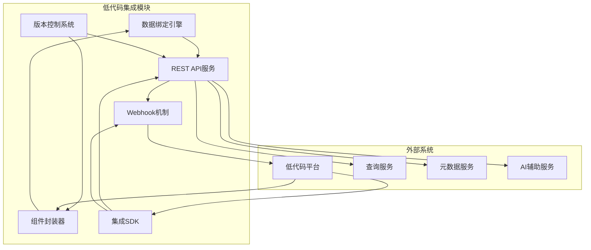
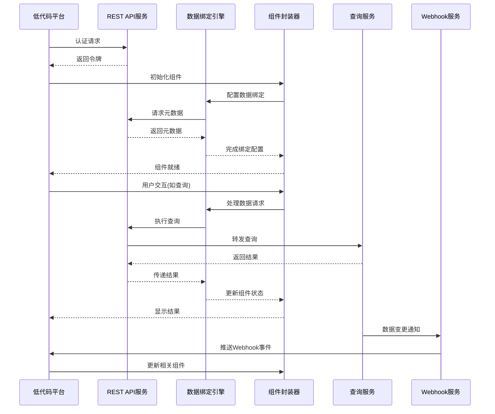

# 低代码集成模块概述

## 1. 模块简介

### 1.1 目的
低代码集成模块旨在提供标准化、灵活且安全的接口机制，使系统能够无缝集成到各种低代码开发平台，让用户可以在低代码应用中直接利用数据查询、分析和可视化能力，而无需复杂的编码。

### 1.2 范围
低代码集成模块包括数据绑定引擎、组件封装器、事件处理器、版本控制系统和集成API等核心组件，覆盖从API设计到UI组件集成的全流程。

### 1.3 核心价值
- 降低系统集成门槛，提高开发效率
- 实现数据分析能力的模块化复用
- 标准化数据访问和操作接口
- 保障跨平台一致性体验
- 使非开发人员能够构建数据驱动应用

## 2. 核心功能

### 2.1 标准化集成接口
- RESTful API接口设计
- 数据服务契约定义
- 批量和实时数据访问
- 认证和授权机制
- 错误处理和状态管理

### 2.2 组件封装与注册
- 查询构建器组件封装
- 数据可视化组件封装
- 表单与数据绑定组件
- 自定义UI控件
- 组件版本管理

### 2.3 数据绑定与流转
- 组件间数据绑定机制
- 数据源动态配置
- 数据格式自动转换
- 双向数据更新
- 上下文状态共享

### 2.4 事件处理和生命周期
- 组件生命周期事件
- 查询执行事件
- 用户交互事件
- 错误和异常事件
- 跨组件事件通信

### 2.5 版本控制与部署
- 组件版本管理
- API版本控制
- 增量更新机制
- 向后兼容性保障
- 部署配置管理

## 3. 核心组件

### 3.1 [数据绑定引擎](./data-binding-design.md)
数据绑定引擎负责管理低代码环境中组件与数据源之间的连接，处理数据映射、转换和同步，确保数据流的一致性和可靠性。

### 3.2 [组件封装器](./component-wrapper-design.md)
组件封装器将系统核心功能封装为可在低代码平台使用的标准组件，处理渲染、状态管理和事件响应。

### 3.3 [REST API服务](./rest-api-design.md)
REST API服务提供标准化的HTTP接口，用于低代码平台访问系统功能和数据，包括认证、查询执行和元数据服务。

### 3.4 [Webhook机制](./webhook-mechanism-design.md)
Webhook机制允许系统在发生特定事件时通知低代码平台，实现数据变更的实时同步和事件驱动架构。

### 3.5 [版本控制系统](./version-control-design.md)
版本控制系统管理API和组件的版本演进，确保在系统升级的同时保持与现有低代码应用的兼容性。

### 3.6 [实现指南](./implementation-guide.md)
实现指南提供面向低代码平台开发者的详细集成文档，包括示例代码、最佳实践和故障排除。

## 4. 架构设计

### 4.1 模块架构

### 4.2 数据流

## 5. 关键技术

### 5.1 接口技术
- RESTful API设计原则
- OpenAPI/Swagger规范
- API网关与服务路由
- 数据序列化格式
- 协议缓冲和gRPC

### 5.2 组件技术
- Web Components标准
- 响应式UI框架
- 状态管理模式
- 微前端架构
- 组件沙箱隔离

### 5.3 集成技术
- OAuth/OIDC认证
- CORS和安全策略
- WebSocket实时通信
- 服务发现机制
- API版本控制策略

## 6. 与其他模块的关系

### 6.1 与查询构建模块的关系
- 封装查询构建器为低代码组件
- 利用查询模型实现数据绑定
- 在低代码环境中复用查询模板
- 传递查询参数和执行指令

### 6.2 与查询执行引擎的关系
- 通过API代理查询执行请求
- 管理查询执行状态和结果
- 处理异步查询通知
- 控制查询资源分配

### 6.3 与元数据管理模块的关系
- 提供元数据浏览和选择组件
- 同步元数据变更通知
- 利用元数据实现智能数据绑定
- 基于元数据生成表单控件

### 6.4 与AI辅助模块的关系
- 集成AI生成的数据见解
- 提供自然语言查询界面
- 在低代码组件中展示推荐
- 利用上下文增强AI理解

## 7. 技术选型与实现考量

### 7.1 前端技术
- Web Components (组件封装)
- React (UI库)
- Redux/MobX (状态管理)
- D3.js/ECharts (数据可视化)
- StencilJS/Lit (组件编译)

### 7.2 后端技术
- Spring Boot (API实现)
- Express.js (轻量级服务)
- JSON Schema (数据验证)
- Kong/Tyk (API网关)
- Redis (缓存层)

### 7.3 通信技术
- RESTful HTTP API
- WebSocket
- Server-Sent Events
- GraphQL (高级数据查询)
- Webhook推送

## 8. 安全与合规

### 8.1 接口安全
- API认证和授权
- 令牌管理和刷新
- 请求限流和防护
- API密钥轮换
- 参数验证和清洁

### 8.2 组件安全
- 组件隔离机制
- 跨站脚本防护
- 数据访问控制
- 用户操作审计
- 敏感数据处理

### 8.3 合规考量
- 数据使用追踪
- 接口合规文档
- 隐私保护机制
- 访问控制与权限
- 审计日志记录

## 9. 扩展性设计

### 9.1 扩展点
- 自定义组件注册
- 插件式数据转换器
- 自定义认证提供者
- 事件处理扩展
- 主题和样式定制

### 9.2 适配策略
- 低代码平台适配器模式
- 组件接口标准化
- 数据协议兼容层
- 特性检测与降级
- 配置驱动的集成

## 10. 性能与可靠性

### 10.1 性能目标
- API响应时间 < 200ms
- 组件初始化时间 < 300ms
- 支持每秒50+API请求
- 组件渲染更新 < 100ms
- Webhook发送延迟 < 500ms

### 10.2 可靠性保障
- 接口降级策略
- 组件错误边界
- 请求重试机制
- 缓存策略优化
- 状态一致性保证

## 11. 未来发展

### 11.1 短期路线图
- 扩展支持更多低代码平台
- 增强组件配置的灵活性
- 改进数据绑定性能
- 提供更丰富的可视化组件
- 简化集成配置流程

### 11.2 长期规划
- AI驱动的低代码界面生成
- 跨平台组件标准化
- 实时协作数据分析
- 端到端集成测试框架
- 统一的集成监控系统