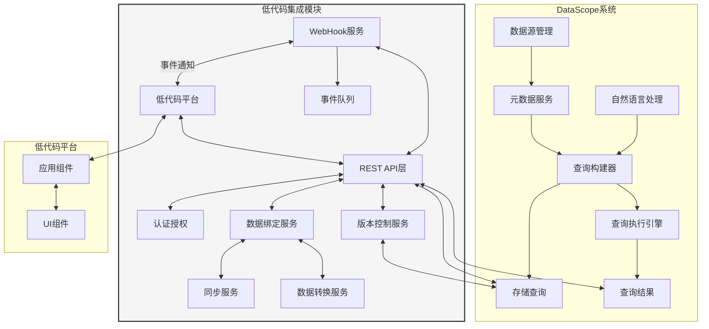
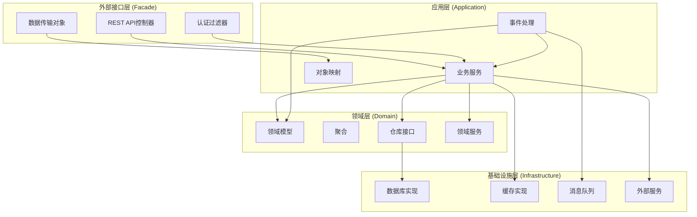
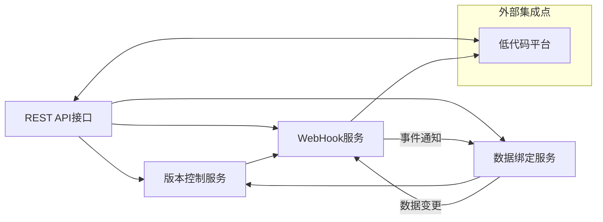
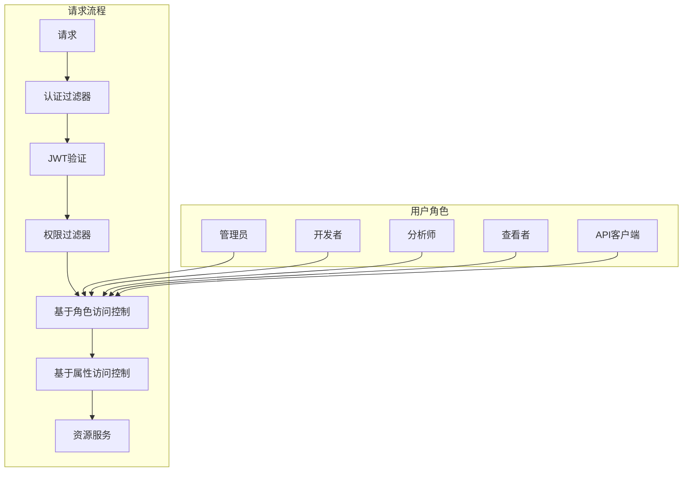
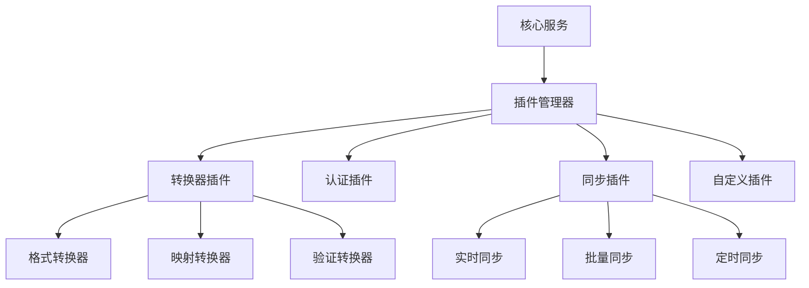
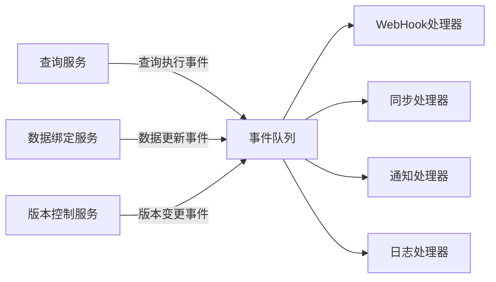
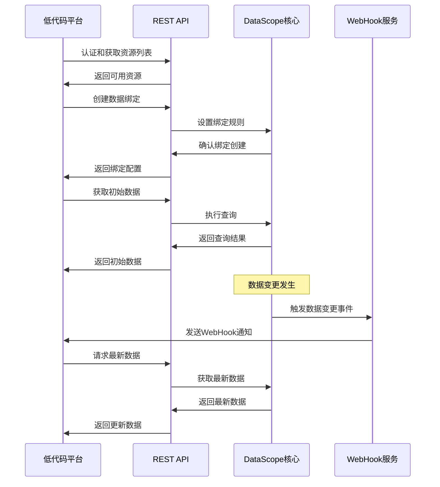

# DataScope低代码集成模块 - 系统总览

本文档提供DataScope低代码集成模块的整体架构、核心组件和设计理念的全面概述，是实施和开发的顶层指南。

## 1. 模块目标

低代码集成模块旨在实现以下目标：

- 提供DataScope系统与低代码开发平台的无缝集成能力
- 支持查询结果和配置的双向同步
- 实现参数化查询和动态数据绑定
- 提供稳定、可扩展、高效的集成接口
- 确保数据一致性和安全性
- 简化开发流程，提高开发效率

## 2. 系统架构

### 2.1 整体架构

### 2.2 分层架构

低代码集成模块采用DDD架构设计，分为以下层次：

## 3. 核心组件

DataScope低代码集成模块由四个核心组件组成，每个组件负责特定的集成功能：

### 3.1 版本控制服务

版本控制服务负责管理查询和API配置的版本历史，支持版本比较、回滚和发布管理。

**主要功能**：
- 查询与API版本管理
- 版本差异比较
- 版本回滚
- 协作编辑支持
- 历史追踪

**详细设计**：[版本控制设计文档](./version-control-design.md)

### 3.2 WebHook机制

WebHook机制提供基于事件的实时通知系统，支持低代码平台与DataScope之间的实时事件通知。

**主要功能**：
- 事件定义与分发
- 可靠的通知机制
- 安全的数据传输
- 自定义事件过滤
- 重试与监控

**详细设计**：[WebHook机制设计文档](./webhook-mechanism-design.md)

### 3.3 REST API接口

REST API接口提供标准化的资源访问方式，支持查询配置、执行和结果获取等功能。

**主要功能**：
- 查询管理API
- 版本控制API
- 数据绑定API
- 元数据访问API
- 认证与授权

**详细设计**：[REST API接口设计文档](./rest-api-design.md)

### 3.4 数据绑定与同步

数据绑定与同步机制提供DataScope数据与低代码组件的映射和同步功能。

**主要功能**：
- 单向/双向数据绑定
- 数据格式转换
- 冲突检测与解决
- 实时数据同步
- 参数化查询绑定

**详细设计**：[数据绑定设计文档](./data-binding-design.md)

## 4. 组件间关系

四个核心组件之间的关系和协作方式：

### 4.1 协作场景

1. **查询创建与版本管理**：
   - REST API接收查询创建请求
   - 版本控制服务创建初始版本
   - WebHook发送创建事件通知
   - 低代码平台接收通知并更新

2. **数据绑定与同步**：
   - 低代码平台通过REST API创建数据绑定
   - 数据绑定服务设置初始映射和转换规则
   - 当数据变更时，WebHook发送通知
   - 低代码平台接收通知并更新UI

3. **查询执行与结果获取**：
   - 低代码平台通过REST API执行查询
   - 执行结果通过REST API返回
   - 如配置了实时同步，WebSocket推送结果更新

## 5. 安全架构

### 5.1 认证与授权

### 5.2 数据安全

- 所有API通信使用HTTPS加密
- 敏感数据（如连接凭证）在传输和存储时加密
- WebHook请求使用HMAC签名验证
- 支持数据过滤和脱敏
- 细粒度访问控制到资源级别

## 6. 性能优化策略

- **缓存机制**：对频繁访问的数据和查询结果实施缓存
- **批量处理**：支持批量操作API减少请求次数
- **增量同步**：只同步发生变化的数据
- **分页与懒加载**：大数据集的优化加载策略
- **异步处理**：使用消息队列处理时间长的操作
- **资源限制**：防止资源滥用的限制策略

## 7. 扩展性设计

### 7.1 插件架构

### 7.2 事件驱动架构

系统采用事件驱动架构，支持松耦合的组件交互：

## 8. 集成模式

### 8.1 支持的集成模式

1. **API集成模式**：
   - 低代码平台通过REST API直接访问DataScope资源
   - 适合简单的查询执行和数据获取场景

2. **WebHook驱动模式**：
   - 通过WebHook实现事件驱动的集成
   - 适合需要实时通知的场景

3. **数据绑定模式**：
   - 通过数据绑定实现组件与数据的映射
   - 适合需要数据同步的场景

4. **混合集成模式**：
   - 综合使用上述三种模式
   - 适合复杂的企业应用场景

### 8.2 集成流程

## 9. 客户端SDK

为简化集成开发，提供多种语言的客户端SDK：

1. **JavaScript SDK**：适用于Web前端开发
2. **Java SDK**：适用于Java后端集成
3. **React组件库**：提供开箱即用的React组件
4. **Vue组件库**：提供开箱即用的Vue组件

SDK提供的核心功能：
- 认证和会话管理
- 资源访问和操作
- 数据绑定配置
- WebSocket连接管理
- 错误处理和重试

## 10. 实施路线图

低代码集成模块的实施计划分为以下阶段：

### 10.1 阶段一：基础架构与核心API（1-2周）
- 实现REST API基础架构
- 设计并实现认证授权机制
- 开发核心数据模型
- 实现基本查询管理API

### 10.2 阶段二：版本控制与WebHook（2-3周）
- 实现版本控制服务
- 开发WebHook注册和管理
- 实现基本事件通知
- 开发重试和监控机制

### 10.3 阶段三：数据绑定与同步（3-4周）
- 实现数据绑定模型
- 开发数据转换服务
- 实现冲突检测和解决
- 开发同步服务和WebSocket支持

### 10.4 阶段四：客户端SDK与文档（2周）
- 开发JavaScript客户端SDK
- 实现React和Vue组件库
- 编写全面的API文档
- 开发示例应用和集成指南

## 11. 总结

DataScope低代码集成模块提供全面的集成能力，实现DataScope系统与低代码平台的无缝对接。通过四个核心组件的协同工作，系统能够支持各种集成场景，满足企业对数据驱动应用的需求。

本设计考虑了系统的性能、安全性、扩展性和可维护性，提供了清晰的实施路线和最佳实践指南，为开发团队提供了实现参考。