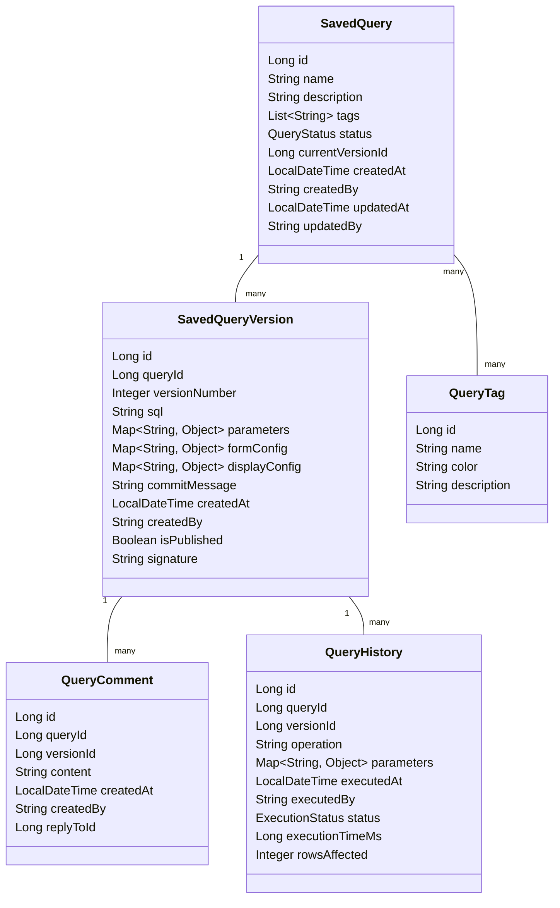

# 低代码集成模块 - 查询版本控制详细设计

本文档详细描述DataScope低代码集成模块中查询版本控制功能的设计，包括数据模型、服务接口、版本比较算法和实施建议。

## 1. 设计目标

查询版本控制功能旨在实现以下目标：

- 管理SQL查询和配置的完整历史记录
- 支持版本间的差异比较和可视化
- 实现快速回滚到历史版本
- 支持版本注释和标签管理
- 提供审计和协作编辑支持

## 2. 数据模型设计

### 2.1 核心实体关系



### 2.2 枚举类型

```java
public enum QueryStatus {
    DRAFT,          // 草稿状态
    PUBLISHED,      // 已发布状态
    ARCHIVED,       // 已归档状态
    DEPRECATED      // 已弃用状态
}

public enum ExecutionStatus {
    SUCCESS,        // 执行成功
    FAILED,         // 执行失败
    TIMEOUT,        // 执行超时
    CANCELLED       // 已取消
}
```

### 2.3 数据库表结构

```sql
-- 保存的查询
CREATE TABLE saved_query (
    id BIGSERIAL PRIMARY KEY,
    name VARCHAR(255) NOT NULL,
    description TEXT,
    status VARCHAR(20) NOT NULL,
    current_version_id BIGINT,
    created_at TIMESTAMP NOT NULL,
    created_by VARCHAR(100) NOT NULL,
    updated_at TIMESTAMP NOT NULL,
    updated_by VARCHAR(100) NOT NULL
);

-- 查询版本
CREATE TABLE saved_query_version (
    id BIGSERIAL PRIMARY KEY,
    query_id BIGINT NOT NULL REFERENCES saved_query(id),
    version_number INTEGER NOT NULL,
    sql TEXT NOT NULL,
    parameters JSONB,
    form_config JSONB,
    display_config JSONB,
    commit_message TEXT,
    created_at TIMESTAMP NOT NULL,
    created_by VARCHAR(100) NOT NULL,
    is_published BOOLEAN NOT NULL DEFAULT FALSE,
    signature VARCHAR(128),
    UNIQUE(query_id, version_number)
);

-- 查询标签
CREATE TABLE query_tag (
    id BIGSERIAL PRIMARY KEY,
    name VARCHAR(50) NOT NULL UNIQUE,
    color VARCHAR(20),
    description TEXT
);

-- 查询与标签关联
CREATE TABLE query_tag_mapping (
    query_id BIGINT NOT NULL REFERENCES saved_query(id),
    tag_id BIGINT NOT NULL REFERENCES query_tag(id),
    PRIMARY KEY (query_id, tag_id)
);

-- 查询评论
CREATE TABLE query_comment (
    id BIGSERIAL PRIMARY KEY,
    query_id BIGINT NOT NULL REFERENCES saved_query(id),
    version_id BIGINT REFERENCES saved_query_version(id),
    content TEXT NOT NULL,
    created_at TIMESTAMP NOT NULL,
    created_by VARCHAR(100) NOT NULL,
    reply_to_id BIGINT REFERENCES query_comment(id)
);

-- 查询执行历史
CREATE TABLE query_history (
    id BIGSERIAL PRIMARY KEY,
    query_id BIGINT NOT NULL REFERENCES saved_query(id),
    version_id BIGINT REFERENCES saved_query_version(id),
    operation VARCHAR(50) NOT NULL,
    parameters JSONB,
    executed_at TIMESTAMP NOT NULL,
    executed_by VARCHAR(100) NOT NULL,
    status VARCHAR(20) NOT NULL,
    execution_time_ms BIGINT,
    rows_affected INTEGER
);
```

## 3. 服务接口设计

### 3.1 查询版本管理服务

```java
/**
 * 查询版本管理服务接口
 * 管理保存的查询及其版本
 */
public interface QueryVersionControlService {
    
    /**
     * 创建新查询
     * @param query 查询信息
     * @return 创建的查询
     */
    SavedQuery createQuery(SavedQueryDTO query);
    
    /**
     * 更新查询信息
     * @param id 查询ID
     * @param query 更新的查询信息
     * @return 更新后的查询
     */
    SavedQuery updateQuery(Long id, SavedQueryDTO query);
    
    /**
     * 获取查询
     * @param id 查询ID
     * @return 查询信息
     */
    Optional<SavedQuery> getQuery(Long id);
    
    /**
     * 获取查询列表
     * @param filter 过滤条件
     * @param pageable 分页信息
     * @return 查询列表
     */
    Page<SavedQuery> getQueries(QueryFilter filter, Pageable pageable);
    
    /**
     * 删除查询
     * @param id 查询ID
     */
    void deleteQuery(Long id);
    
    /**
     * 创建新版本
     * @param queryId 查询ID
     * @param version 版本信息
     * @return 创建的版本
     */
    SavedQueryVersion createVersion(Long queryId, SavedQueryVersionDTO version);
    
    /**
     * 获取版本
     * @param versionId 版本ID
     * @return 版本信息
     */
    Optional<SavedQueryVersion> getVersion(Long versionId);
    
    /**
     * 获取查询的所有版本
     * @param queryId 查询ID
     * @return 版本列表
     */
    List<SavedQueryVersion> getVersions(Long queryId);
    
    /**
     * 获取版本差异
     * @param versionId1 版本1 ID
     * @param versionId2 版本2 ID
     * @return 版本差异
     */
    VersionDiff getVersionDiff(Long versionId1, Long versionId2);
    
    /**
     * 回滚到指定版本
     * @param queryId 查询ID
     * @param versionId 版本ID
     * @param comment 回滚说明
     * @return 新创建的版本
     */
    SavedQueryVersion rollbackToVersion(Long queryId, Long versionId, String comment);
    
    /**
     * 发布版本
     * @param versionId 版本ID
     * @return 发布后的版本
     */
    SavedQueryVersion publishVersion(Long versionId);
    
    /**
     * 添加评论
     * @param comment 评论信息
     * @return 添加的评论
     */
    QueryComment addComment(QueryCommentDTO comment);
    
    /**
     * 获取评论
     * @param queryId 查询ID
     * @param versionId 版本ID
     * @return 评论列表
     */
    List<QueryComment> getComments(Long queryId, Long versionId);
    
    /**
     * 添加查询标签
     * @param queryId 查询ID
     * @param tagIds 标签ID列表
     * @return 更新后的查询
     */
    SavedQuery addTags(Long queryId, List<Long> tagIds);
    
    /**
     * 获取查询执行历史
     * @param queryId 查询ID
     * @param pageable 分页信息
     * @return 执行历史
     */
    Page<QueryHistory> getQueryHistory(Long queryId, Pageable pageable);
}
```

### 3.2 版本差异服务

```java
/**
 * 版本差异服务接口
 * 处理版本之间的差异计算
 */
public interface VersionDiffService {
    
    /**
     * 计算两个版本之间的差异
     * @param version1 版本1
     * @param version2 版本2
     * @return 差异结果
     */
    VersionDiff calculateDiff(SavedQueryVersion version1, SavedQueryVersion version2);
    
    /**
     * 计算SQL差异
     * @param sql1 SQL语句1
     * @param sql2 SQL语句2
     * @return SQL差异
     */
    SqlDiff calculateSqlDiff(String sql1, String sql2);
    
    /**
     * 计算配置差异
     * @param config1 配置1
     * @param config2 配置2
     * @return 配置差异
     */
    ConfigDiff calculateConfigDiff(Map<String, Object> config1, Map<String, Object> config2);
    
    /**
     * 合并差异
     * @param baseVersion 基础版本
     * @param diff 差异
     * @return 合并后的版本
     */
    SavedQueryVersion mergeDiff(SavedQueryVersion baseVersion, VersionDiff diff);
    
    /**
     * 生成版本差异的HTML表示
     * @param diff 差异
     * @return HTML表示
     */
    String generateDiffHtml(VersionDiff diff);
}
```

## 4. 版本比较算法

### 4.1 SQL差异比较

对于SQL语句的差异比较，我们采用以下算法：

1. **分词处理**：将SQL语句分解为标记序列
2. **标准化**：规范化SQL语句（大小写、空格等）
3. **差异计算**：使用最长公共子序列算法计算差异
4. **语义分析**：识别SQL语句的语义变化（如表、列、条件）
5. **差异可视化**：将差异转换为高亮格式

```java
public class SqlDiffCalculator {
    
    public SqlDiff calculate(String sql1, String sql2) {
        // 1. SQL解析
        List<SqlToken> tokens1 = parseSql(sql1);
        List<SqlToken> tokens2 = parseSql(sql2);
        
        // 2. 标准化处理
        tokens1 = normalizeSqlTokens(tokens1);
        tokens2 = normalizeSqlTokens(tokens2);
        
        // 3. 执行差异算法
        DiffResult diffResult = computeDiff(tokens1, tokens2);
        
        // 4. 语义层面分析
        SemanticChanges semanticChanges = analyzeSemanticChanges(diffResult);
        
        // 5. 构建差异结果
        return new SqlDiff(diffResult, semanticChanges);
    }
    
    // 解析SQL为token序列
    private List<SqlToken> parseSql(String sql) {
        // SQL解析实现
        return new ArrayList<>();
    }
    
    // 标准化SQL tokens
    private List<SqlToken> normalizeSqlTokens(List<SqlToken> tokens) {
        // 标准化实现
        return new ArrayList<>();
    }
    
    // 使用最长公共子序列算法计算差异
    private DiffResult computeDiff(List<SqlToken> tokens1, List<SqlToken> tokens2) {
        // 差异计算实现
        return new DiffResult();
    }
    
    // 分析语义变化
    private SemanticChanges analyzeSemanticChanges(DiffResult diffResult) {
        // 语义分析实现
        return new SemanticChanges();
    }
}
```

### 4.2 配置差异比较

对于JSON格式的配置差异比较，采用以下算法：

1. **树结构比较**：将JSON转换为树结构进行递归比较
2. **属性变化检测**：识别添加、删除、修改的属性
3. **值类型变化检测**：检测值类型的变化
4. **数组比较**：使用特定策略比较数组元素
5. **差异路径表示**：使用JSONPath表示差异位置

```java
public class ConfigDiffCalculator {
    
    public ConfigDiff calculate(Map<String, Object> config1, Map<String, Object> config2) {
        // 配置差异计算
        ConfigDiff diff = new ConfigDiff();
        compareObjects("", config1, config2, diff);
        return diff;
    }
    
    private void compareObjects(String path, Map<String, Object> obj1, Map<String, Object> obj2, ConfigDiff diff) {
        // 处理obj1中存在但obj2中不存在的键
        for (String key : obj1.keySet()) {
            if (!obj2.containsKey(key)) {
                diff.addRemoved(path + "/" + key, obj1.get(key));
            }
        }
        
        // 处理obj2中存在但obj1中不存在的键
        for (String key : obj2.keySet()) {
            if (!obj1.containsKey(key)) {
                diff.addAdded(path + "/" + key, obj2.get(key));
            }
        }
        
        // 处理两者都存在的键
        for (String key : obj1.keySet()) {
            if (obj2.containsKey(key)) {
                String currentPath = path + "/" + key;
                compareValues(currentPath, obj1.get(key), obj2.get(key), diff);
            }
        }
    }
    
    private void compareValues(String path, Object val1, Object val2, ConfigDiff diff) {
        // 如果类型不同
        if (val1.getClass() != val2.getClass()) {
            diff.addChanged(path, val1, val2, "TYPE_CHANGED");
            return;
        }
        
        // 处理不同类型的值
        if (val1 instanceof Map) {
            compareObjects(path, (Map<String, Object>)val1, (Map<String, Object>)val2, diff);
        } else if (val1 instanceof List) {
            compareLists(path, (List<Object>)val1, (List<Object>)val2, diff);
        } else if (!val1.equals(val2)) {
            diff.addChanged(path, val1, val2, "VALUE_CHANGED");
        }
    }
    
    private void compareLists(String path, List<Object> list1, List<Object> list2, ConfigDiff diff) {
        // 数组比较实现
        // 该实现可能基于位置比较或基于标识符比较
    }
}
```

## 5. API接口设计

### 5.1 查询管理API

```
# 查询管理API
GET    /api/v1/lowcode/queries                      # 获取查询列表
POST   /api/v1/lowcode/queries                      # 创建查询
GET    /api/v1/lowcode/queries/{id}                 # 获取查询详情
PUT    /api/v1/lowcode/queries/{id}                 # 更新查询
DELETE /api/v1/lowcode/queries/{id}                 # 删除查询

# 标签管理API
GET    /api/v1/lowcode/tags                         # 获取标签列表
POST   /api/v1/lowcode/tags                         # 创建标签
PUT    /api/v1/lowcode/queries/{id}/tags            # 更新查询标签
```

### 5.2 版本管理API

```
# 版本管理API
GET    /api/v1/lowcode/queries/{id}/versions        # 获取版本列表
POST   /api/v1/lowcode/queries/{id}/versions        # 创建新版本
GET    /api/v1/lowcode/versions/{id}                # 获取版本详情
POST   /api/v1/lowcode/versions/{id}/publish        # 发布版本

# 版本比较API
GET    /api/v1/lowcode/versions/compare            # 比较两个版本
GET    /api/v1/lowcode/versions/{id}/diff/{targetId} # 获取与目标版本的差异

# 版本回滚API
POST   /api/v1/lowcode/queries/{id}/rollback/{versionId} # 回滚到指定版本
```

### 5.3 评论API

```
# 评论API
GET    /api/v1/lowcode/queries/{id}/comments        # 获取查询评论
POST   /api/v1/lowcode/comments                     # 添加评论
GET    /api/v1/lowcode/versions/{id}/comments       # 获取版本评论
```

## 6. 实现建议

### 6.1 存储考虑

1. **版本存储效率**：
   - 对于大量版本，考虑只存储差异而非完整副本
   - 对于配置部分，使用JSON差异格式存储
   - 定期归档旧版本以提高性能

2. **版本签名**：
   - 使用SHA-256等算法生成版本签名
   - 签名应包含SQL、参数和配置内容
   - 用于版本完整性验证

### 6.2 性能优化

1. **缓存策略**：
   - 缓存常用查询和最新版本
   - 缓存已计算的版本差异
   - 使用多级缓存策略（内存、分布式缓存）

2. **版本对比优化**：
   - 预计算热门版本的差异
   - 对大型SQL进行分块比较
   - 限制差异比较的深度和复杂度

### 6.3 协作编辑支持

1. **锁定机制**：
   - 支持乐观锁或悲观锁
   - 实现编辑锁定通知
   - 提供锁定超时和强制解锁

2. **合并策略**：
   - 支持自动合并非冲突更改
   - 提供冲突解决界面
   - 记录合并历史

## 7. 测试策略

### 7.1 单元测试

关键测试点：
- 版本创建和管理功能
- 差异计算算法
- SQL解析和比较
- 配置对比逻辑

### 7.2 集成测试

关键测试点：
- 版本管理与差异服务的集成
- 版本回滚功能
- 并发版本创建场景
- 大型SQL和配置的处理

### 7.3 性能测试

关键测试点：
- 大量版本的管理性能
- 复杂SQL差异计算性能
- 大型配置的比较性能
- 缓存有效性测试

## 8. 安全考虑

1. **访问控制**：
   - 实施细粒度的版本访问权限
   - 版本操作的审计日志
   - 敏感SQL查询的内容检查

2. **数据安全**：
   - 敏感参数值的加密存储
   - SQL注入预防
   - 配置中敏感信息的处理

## 9. 未来扩展

1. **高级版本功能**：
   - 分支管理功能
   - 版本合并与冲突解决
   - 版本依赖跟踪

2. **协作增强**：
   - 实时协作编辑
   - 变更请求和审核工作流
   - 集成通知系统

3. **AI辅助**：
   - SQL优化建议
   - 版本变更智能总结
   - 重构建议

## 10. 实施路线图

### 10.1 阶段一：基本版本控制

- 实现基本版本存储和检索
- 简单版本比较功能
- 基本版本回滚能力

### 10.2 阶段二：高级比较和协作

- 实现完整的差异计算
- 添加评论和协作功能
- 实现标签管理

### 10.3 阶段三：优化和扩展

- 性能优化和缓存策略
- 高级版本管理功能
- 集成通知和工作流

## 11. 总结

查询版本控制功能是DataScope低代码集成模块的核心组件，通过全面的版本管理、差异比较和协作功能，使低代码平台能够更加高效地管理和使用SQL查询。本设计文档详细描述了数据模型、服务接口、算法和实施建议，为开发团队提供了清晰的路线图和指导。