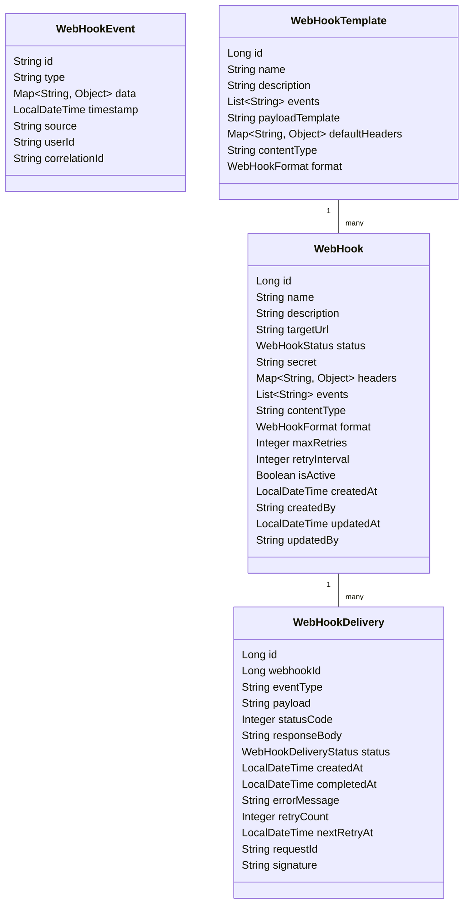
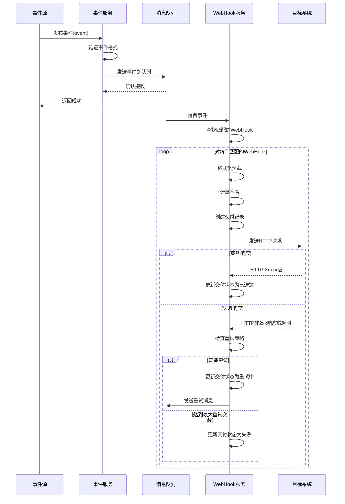
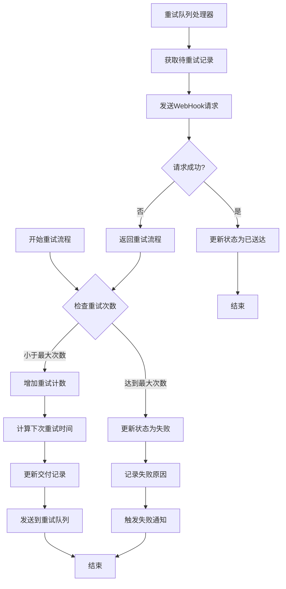

# 低代码集成模块 - WebHook机制详细设计

本文档详细描述DataScope低代码集成模块中WebHook机制的设计，包括数据模型、服务接口、事件处理流程和安全考虑等。

## 1. 设计目标

WebHook机制旨在实现以下目标：

- 提供基于事件的实时通知机制，支持低代码平台与DataScope系统间的实时集成
- 确保通知可靠性，处理网络故障和目标系统不可用的情况
- 提供安全的数据传输，确保事件数据完整性和机密性
- 支持自定义事件过滤和负载格式，满足不同集成场景需求
- 提供全面的监控和管理功能，便于问题排查和优化

## 2. 数据模型设计

### 2.1 核心实体关系



### 2.2 枚举类型

```java
public enum WebHookStatus {
    ACTIVE,         // 活跃状态
    INACTIVE,       // 未激活状态
    FAILED,         // 失败状态（多次失败后）
    SUSPENDED       // 管理员暂停
}

public enum WebHookDeliveryStatus {
    PENDING,        // 等待发送
    IN_PROGRESS,    // 发送中
    DELIVERED,      // 已送达
    FAILED,         // 发送失败
    RETRYING,       // 重试中
    CANCELLED       // 已取消
}

public enum WebHookFormat {
    JSON,           // JSON格式
    XML,            // XML格式
    FORM,           // 表单格式
    CUSTOM          // 自定义格式
}
```

### 2.3 数据库表结构

```sql
-- WebHook定义
CREATE TABLE webhook (
    id BIGSERIAL PRIMARY KEY,
    name VARCHAR(255) NOT NULL,
    description TEXT,
    target_url VARCHAR(1024) NOT NULL,
    status VARCHAR(20) NOT NULL,
    secret VARCHAR(255),
    headers JSONB,
    events JSONB NOT NULL,
    content_type VARCHAR(100) DEFAULT 'application/json',
    format VARCHAR(20) DEFAULT 'JSON',
    max_retries INTEGER DEFAULT 3,
    retry_interval INTEGER DEFAULT 60,
    is_active BOOLEAN DEFAULT TRUE,
    created_at TIMESTAMP NOT NULL,
    created_by VARCHAR(100) NOT NULL,
    updated_at TIMESTAMP NOT NULL,
    updated_by VARCHAR(100) NOT NULL
);

-- WebHook交付记录
CREATE TABLE webhook_delivery (
    id BIGSERIAL PRIMARY KEY,
    webhook_id BIGINT NOT NULL REFERENCES webhook(id),
    event_type VARCHAR(100) NOT NULL,
    payload TEXT NOT NULL,
    status_code INTEGER,
    response_body TEXT,
    status VARCHAR(20) NOT NULL,
    created_at TIMESTAMP NOT NULL,
    completed_at TIMESTAMP,
    error_message TEXT,
    retry_count INTEGER DEFAULT 0,
    next_retry_at TIMESTAMP,
    request_id VARCHAR(100) NOT NULL,
    signature VARCHAR(255)
);

-- WebHook模板
CREATE TABLE webhook_template (
    id BIGSERIAL PRIMARY KEY,
    name VARCHAR(255) NOT NULL,
    description TEXT,
    events JSONB NOT NULL,
    payload_template TEXT,
    default_headers JSONB,
    content_type VARCHAR(100) DEFAULT 'application/json',
    format VARCHAR(20) DEFAULT 'JSON'
);
```

## 3. 事件类型定义

DataScope系统支持以下核心事件类型：

| 事件类型 | 描述 | 触发时机 |
|---------|------|---------|
| `query.created` | 查询已创建 | 新查询创建时 |
| `query.updated` | 查询已更新 | 查询信息更新时 |
| `query.deleted` | 查询已删除 | 查询被删除时 |
| `query.executed` | 查询已执行 | 查询执行完成时 |
| `version.created` | 版本已创建 | 新版本创建时 |
| `version.published` | 版本已发布 | 版本被发布时 |
| `version.rollback` | 版本已回滚 | 版本回滚操作完成时 |
| `datasource.connected` | 数据源已连接 | 数据源连接成功时 |
| `datasource.disconnected` | 数据源已断开 | 数据源连接断开时 |
| `datasource.sync.completed` | 数据源同步已完成 | 元数据同步完成时 |
| `binding.created` | 数据绑定已创建 | 新数据绑定创建时 |
| `binding.updated` | 数据绑定已更新 | 数据绑定更新时 |
| `binding.deleted` | 数据绑定已删除 | 数据绑定删除时 |
| `binding.sync.completed` | 数据绑定同步已完成 | 数据同步完成时 |

事件类型可以使用通配符进行订阅，例如：
- `query.*` - 订阅所有查询相关事件
- `*.created` - 订阅所有创建类型事件
- `*` - 订阅所有事件

## 4. 服务接口设计

### 4.1 WebHook管理服务

```java
/**
 * WebHook管理服务接口
 * 管理WebHook配置和模板
 */
public interface WebHookManagementService {
    
    /**
     * 创建WebHook
     * @param webhook WebHook信息
     * @return 创建的WebHook
     */
    WebHook createWebHook(WebHookDTO webhook);
    
    /**
     * 更新WebHook
     * @param id WebHook ID
     * @param webhook 更新的WebHook信息
     * @return 更新后的WebHook
     */
    WebHook updateWebHook(Long id, WebHookDTO webhook);
    
    /**
     * 获取WebHook
     * @param id WebHook ID
     * @return WebHook信息
     */
    Optional<WebHook> getWebHook(Long id);
    
    /**
     * 获取WebHook列表
     * @param filter 过滤条件
     * @param pageable 分页信息
     * @return WebHook列表
     */
    Page<WebHook> getWebHooks(WebHookFilter filter, Pageable pageable);
    
    /**
     * 删除WebHook
     * @param id WebHook ID
     */
    void deleteWebHook(Long id);
    
    /**
     * 激活WebHook
     * @param id WebHook ID
     * @return 更新后的WebHook
     */
    WebHook activateWebHook(Long id);
    
    /**
     * 停用WebHook
     * @param id WebHook ID
     * @return 更新后的WebHook
     */
    WebHook deactivateWebHook(Long id);
    
    /**
     * 测试WebHook
     * @param id WebHook ID
     * @return 测试结果
     */
    WebHookTestResult testWebHook(Long id);
    
    /**
     * 创建WebHook模板
     * @param template 模板信息
     * @return 创建的模板
     */
    WebHookTemplate createTemplate(WebHookTemplateDTO template);
    
    /**
     * 获取模板列表
     * @return 模板列表
     */
    List<WebHookTemplate> getTemplates();
    
    /**
     * 从模板创建WebHook
     * @param templateId 模板ID
     * @param webhook 基本WebHook信息
     * @return 创建的WebHook
     */
    WebHook createFromTemplate(Long templateId, WebHookDTO webhook);
    
    /**
     * 获取WebHook交付记录
     * @param webhookId WebHook ID
     * @param pageable 分页信息
     * @return 交付记录
     */
    Page<WebHookDelivery> getDeliveries(Long webhookId, Pageable pageable);
    
    /**
     * 重试失败的交付
     * @param deliveryId 交付ID
     * @return 重试结果
     */
    WebHookDelivery retryDelivery(Long deliveryId);
}
```

### 4.2 WebHook事件处理服务

```java
/**
 * WebHook事件处理服务接口
 * 处理事件分发和交付
 */
public interface WebHookEventService {
    
    /**
     * 发布事件
     * @param event 事件信息
     * @return 事件处理结果
     */
    EventPublishResult publishEvent(WebHookEvent event);
    
    /**
     * 处理事件
     * @param event 事件信息
     * @return 处理结果
     */
    EventProcessResult processEvent(WebHookEvent event);
    
    /**
     * 发送WebHook请求
     * @param delivery WebHook交付信息
     * @return 发送结果
     */
    WebHookDelivery sendWebHook(WebHookDelivery delivery);
    
    /**
     * 构建事件负载
     * @param webhook WebHook信息
     * @param event 事件信息
     * @return 构建的负载
     */
    String buildPayload(WebHook webhook, WebHookEvent event);
    
    /**
     * 计算签名
     * @param webhook WebHook信息
     * @param payload 负载内容
     * @return 签名
     */
    String calculateSignature(WebHook webhook, String payload);
    
    /**
     * 查找匹配给定事件的WebHook
     * @param eventType 事件类型
     * @return 匹配的WebHook列表
     */
    List<WebHook> findMatchingWebHooks(String eventType);
}
```

## 5. 事件处理流程

### 5.1 事件发布和处理流程



### 5.2 重试机制流程



## 6. API接口设计

### 6.1 WebHook管理API

```
# WebHook管理API
GET    /api/v1/lowcode/webhooks                     # 获取WebHook列表
POST   /api/v1/lowcode/webhooks                     # 创建WebHook
GET    /api/v1/lowcode/webhooks/{id}                # 获取WebHook详情
PUT    /api/v1/lowcode/webhooks/{id}                # 更新WebHook
DELETE /api/v1/lowcode/webhooks/{id}                # 删除WebHook
POST   /api/v1/lowcode/webhooks/{id}/activate       # 激活WebHook
POST   /api/v1/lowcode/webhooks/{id}/deactivate     # 停用WebHook
POST   /api/v1/lowcode/webhooks/{id}/test           # 测试WebHook

# WebHook模板API
GET    /api/v1/lowcode/webhook-templates            # 获取模板列表
POST   /api/v1/lowcode/webhook-templates            # 创建模板
GET    /api/v1/lowcode/webhook-templates/{id}       # 获取模板详情
POST   /api/v1/lowcode/webhook-templates/{id}/create # 从模板创建WebHook

# WebHook交付API
GET    /api/v1/lowcode/webhooks/{id}/deliveries     # 获取交付记录
GET    /api/v1/lowcode/deliveries/{id}              # 获取交付详情
POST   /api/v1/lowcode/deliveries/{id}/retry        # 重试失败的交付
```

### 6.2 WebHook事件API

```
# 事件发布API (内部使用)
POST   /api/v1/internal/events                      # 发布事件

# 事件订阅管理API
GET    /api/v1/lowcode/events/types                 # 获取支持的事件类型
GET    /api/v1/lowcode/events/samples               # 获取事件样本
```

## 7. 安全设计

### 7.1 签名验证

WebHook请求使用HMAC-SHA256签名算法，确保数据完整性和认证：

```java
// 签名计算示例
public String calculateSignature(WebHook webhook, String payload) {
    try {
        String secret = webhook.getSecret();
        Mac mac = Mac.getInstance("HmacSHA256");
        SecretKeySpec secretKeySpec = new SecretKeySpec(secret.getBytes(), "HmacSHA256");
        mac.init(secretKeySpec);
        byte[] hash = mac.doFinal(payload.getBytes());
        return Base64.getEncoder().encodeToString(hash);
    } catch (Exception e) {
        throw new WebHookSecurityException("Failed to calculate signature", e);
    }
}
```

签名通过HTTP头部发送：

```
X-DataScope-Signature: sha256=base64EncodedSignatureHere
X-DataScope-Event: event.type
X-DataScope-Delivery: uniqueDeliveryId
```

### 7.2 安全最佳实践

1. **HTTPS传输**：
   - 仅支持HTTPS目标URL
   - 验证SSL证书

2. **密钥管理**：
   - 生成强随机密钥
   - 定期轮换密钥
   - 安全存储密钥

3. **请求限制**：
   - 实施速率限制
   - 设置请求超时
   - 限制重试次数

4. **内容验证**：
   - 过滤敏感数据
   - 验证请求内容
   - 限制负载大小

## 8. 监控和管理

### 8.1 监控指标

系统应收集以下关键指标：

- **交付成功率**：成功交付百分比
- **平均响应时间**：目标系统响应时间
- **队列延迟**：从发布到处理的延迟
- **重试率**：需要重试的百分比
- **活跃WebHook数**：按状态分类

### 8.2 告警机制

配置以下告警：

- 高失败率告警（>10%）
- 长队列延迟告警（>30秒）
- 多次重试失败告警
- 特定WebHook持续失败告警

### 8.3 管理界面需求

WebHook管理界面应提供：

- WebHook配置CRUD操作
- 交付历史和详情查看
- 手动重试功能
- 测试WebHook功能
- 状态和健康监控
- 交付统计和图表

## 9. 负载处理优化

### 9.1 异步处理架构

使用消息队列实现异步处理：

```java
@Service
public class AsyncWebHookProcessor {
    
    @Async
    public CompletableFuture<WebHookDelivery> processWebHook(WebHook webhook, WebHookEvent event) {
        // 处理逻辑
        return CompletableFuture.completedFuture(delivery);
    }
    
    @JmsListener(destination = "webhook.retry.queue")
    public void processRetry(WebHookRetryMessage message) {
        // 重试处理逻辑
    }
}
```

### 9.2 批处理策略

对于高频事件，实施批处理策略：

1. **事件聚合**：在短时间窗口内聚合相似事件
2. **批量发送**：将多个事件打包为单个WebHook请求
3. **摘要通知**：对于非关键事件，发送变更摘要

### 9.3 队列配置

```yaml
# 队列配置示例
spring:
  rabbitmq:
    listener:
      simple:
        concurrency: 5
        max-concurrency: 10
    template:
      retry:
        enabled: true
        initial-interval: 1000ms
        max-interval: 10000ms
        multiplier: 2.0
    queues:
      webhook-delivery:
        durable: true
        auto-delete: false
      webhook-retry:
        durable: true
        ttl: 300000 # 5分钟TTL
```

## 10. 测试策略

### 10.1 单元测试

关键测试点：
- 事件匹配逻辑
- 负载构建逻辑
- 签名计算和验证
- 重试策略逻辑

### 10.2 集成测试

关键测试点：
- 端到端事件发布和处理
- 异步队列处理
- 重试机制
- 错误处理和恢复

### 10.3 模拟服务器

实现模拟目标服务器，支持以下测试场景：
- 延迟响应
- 错误响应
- 超时
- 间歇性失败

## 11. 实施路线图

### 11.1 阶段一：基础架构

- 实现基本WebHook数据模型
- 实现WebHook管理API
- 实现简单事件处理
- 基本安全机制

### 11.2 阶段二：增强功能

- 完善重试机制
- 实现模板功能
- 增强安全机制
- 实现管理界面

### 11.3 阶段三：优化与扩展

- 实现批处理和优化
- 增强监控和告警
- 实现高级过滤
- 扩展事件类型

## 12. 未来扩展

1. **动态负载模板**：
   - 支持自定义模板语言
   - 基于事件类型的模板选择
   - 数据转换规则

2. **高级事件路由**：
   - 基于内容的事件路由
   - 条件性WebHook
   - 事件链和复合事件

3. **双向通信**：
   - 支持响应处理
   - 基于响应的动作触发
   - 客户端库包装

## 13. 总结

WebHook机制是DataScope低代码集成模块的核心组件，提供基于事件的实时通知，支持与低代码平台和外部系统的无缝集成。本设计文档详细描述了数据模型、事件类型、服务接口、流程和安全考虑，为开发团队提供了清晰的实施路线图和指导。
