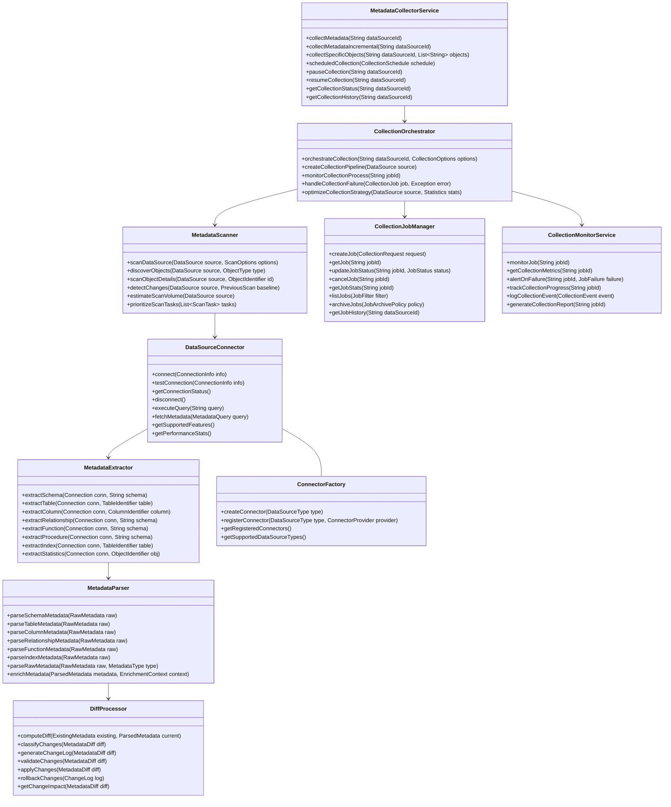

# 元数据收集器设计文档

## 1. 概述

### 1.1 目的
本文档详细描述元数据收集器组件的设计、架构和实现细节。元数据收集器是元数据管理模块的核心组件，负责从各种数据源中提取结构信息，为系统提供准确、完整的元数据基础。

### 1.2 范围
本文档涵盖元数据收集器的核心功能、架构设计、接口定义、数据模型、处理流程、异常处理和扩展机制等方面。

### 1.3 组件定位
元数据收集器位于元数据管理模块的前端，作为连接外部数据源和内部元数据存储的桥梁。它主动从各种数据源提取元数据，处理变更差异，并将结构化的元数据传递给元数据存储组件。

## 2. 架构设计

### 2.1 组件架构


### 2.2 核心类设计


## 3. 功能详细设计

### 3.1 元数据收集调度
- **集中调度机制**: 实现统一的元数据收集调度控制
- **基于时间的计划**: 支持定时、周期性收集计划
- **基于事件的触发**: 响应数据源变更事件触发收集
- **自适应调度**: 根据数据源变更频率动态调整收集间隔
- **批量与单次调度**: 支持批量任务和单次收集任务
- **优先级管理**: 实现收集任务的优先级控制
- **资源感知调度**: 根据系统资源负载调整收集任务执行

### 3.2 数据源连接管理
- **连接池管理**: 实现数据源连接的高效复用
- **多种认证支持**: 支持各种认证方式（密码、密钥、OAuth等）
- **连接监控**: 监控连接状态和性能指标
- **自动重连**: 在连接断开时自动重试和恢复
- **超时控制**: 实现连接和操作超时管理
- **连接加密**: 支持安全的加密连接
- **代理支持**: 通过代理服务器连接远程数据源
- **连接参数优化**: 优化连接参数以提高性能

### 3.3 元数据提取引擎
- **增量提取**: 只提取变更的元数据
- **异步批量提取**: 大批量元数据的异步提取
- **选择性提取**: 根据配置选择性提取特定类型元数据
- **层次化提取**: 按层次提取复杂的元数据结构
- **自定义查询提取**: 支持自定义查询语句提取特定元数据
- **系统表解析**: 从数据库系统表解析元数据
- **反向工程**: 从数据实例推断结构信息
- **元数据缓存**: 缓存频繁访问的元数据以提高性能

### 3.4 适配器机制
- **标准适配器接口**: 定义统一的数据源适配器接口
- **适配器注册与发现**: 动态注册和发现适配器
- **多数据源支持**: 内置支持主流数据库和数据源类型
- **适配器参数化**: 支持适配器的参数化配置
- **适配器隔离**: 适配器故障隔离机制
- **版本兼容性**: 处理不同数据源版本的兼容性
- **功能探测**: 自动探测数据源支持的功能
- **自定义适配器开发**: 提供SDK用于开发自定义适配器

### 3.5 差异分析与合并
- **版本差异比较**: 比较不同版本的元数据差异
- **差异分类**: 将差异分类为新增、修改、删除等
- **变更影响分析**: 分析元数据变更的影响范围
- **智能合并**: 智能合并元数据变更
- **冲突检测与解决**: 自动检测和处理合并冲突
- **变更历史记录**: 保存完整的变更历史
- **审计与追溯**: 支持元数据变更的审计和追溯
- **变更通知**: 向其他组件通知重要变更

### 3.6 任务管理与监控
- **任务生命周期管理**: 管理收集任务的完整生命周期
- **任务状态跟踪**: 实时跟踪任务执行状态
- **任务执行统计**: 收集和呈现任务执行统计信息
- **故障检测与恢复**: 自动检测和恢复失败的任务
- **任务日志管理**: 详细记录任务执行日志
- **资源使用监控**: 监控任务资源使用情况
- **性能基准测试**: 提供性能基准测试功能
- **告警与通知**: 任务异常情况的告警和通知机制

### 3.7 扩展性与集成
- **插件框架**: 提供插件框架扩展功能
- **事件钩子**: 在关键点提供事件钩子
- **自定义处理器**: 支持自定义元数据处理器
- **集成接口**: 与外部系统集成的标准接口
- **导出功能**: 支持元数据的导出和共享
- **批处理API**: 提供批量操作API
- **REST API**: 提供RESTful服务接口
- **消息队列集成**: 集成消息队列实现异步处理

### 3.8 安全与合规
- **访问控制**: 实现元数据收集的访问控制
- **敏感信息处理**: 安全处理连接凭证等敏感信息
- **传输加密**: 确保元数据传输的安全性
- **审计日志**: 详细记录所有操作的审计日志
- **合规性检查**: 确保元数据收集符合法规要求
- **数据脱敏**: 支持敏感元数据的脱敏处理
- **安全扫描**: 安全漏洞的自动检测
- **认证集成**: 与企业身份认证系统集成

## 4. 接口设计

### 4.1 外部接口

| 接口名称 | 类型 | 用途 | 参数 | 返回值 | 异常 |
|---------|------|-----|------|-------|------|
| collectMetadata | REST/内部API | 触发元数据收集 | dataSourceId: 数据源ID, options: 收集选项 | 任务ID | 数据源不存在, 连接失败 |
| getCollectionStatus | REST/内部API | 获取收集状态 | jobId: 任务ID | 收集状态 | 任务不存在 |
| scheduleCollection | REST/内部API | 调度定期收集 | dataSourceId: 数据源ID, schedule: 调度计划 | 调度ID | 数据源不存在, 计划无效 |
| getCollectionHistory | REST/内部API | 获取收集历史 | dataSourceId: 数据源ID, timeRange: 时间范围 | 收集历史记录 | 数据源不存在 |
| pauseCollection | REST/内部API | 暂停收集任务 | jobId: 任务ID | 操作结果 | 任务不存在, 状态无效 |
| resumeCollection | REST/内部API | 恢复收集任务 | jobId: 任务ID | 操作结果 | 任务不存在, 状态无效 |
| getSourceStatistics | REST/内部API | 获取收集统计 | dataSourceId: 数据源ID | 统计信息 | 数据源不存在 |
| testSourceConnection | REST/内部API | 测试数据源连接 | connectionInfo: 连接信息 | 连接测试结果 | 连接参数无效 |

### 4.2 内部接口

```java
// 元数据收集服务接口
public interface MetadataCollectorService {
    // 开始元数据收集任务
    CollectionJob collectMetadata(String dataSourceId, CollectionOptions options) 
        throws DataSourceNotFoundException, ConnectionException;
    
    // 增量收集元数据
    CollectionJob collectIncrementalMetadata(String dataSourceId, IncrementalOptions options) 
        throws DataSourceNotFoundException, ConnectionException;
    
    // 获取收集任务状态
    CollectionStatus getCollectionStatus(String jobId) 
        throws JobNotFoundException;
    
    // 计划周期性收集
    ScheduleId scheduleCollection(String dataSourceId, CollectionSchedule schedule) 
        throws DataSourceNotFoundException, ScheduleException;
    
    // 更新收集计划
    ScheduleId updateSchedule(String scheduleId, CollectionSchedule schedule) 
        throws ScheduleNotFoundException, ScheduleException;
    
    // 删除收集计划
    void deleteSchedule(String scheduleId) 
        throws ScheduleNotFoundException;
    
    // 获取数据源的收集历史
    List<CollectionJobSummary> getCollectionHistory(String dataSourceId, TimeRange range, Pagination pagination) 
        throws DataSourceNotFoundException;
    
    // 暂停收集任务
    void pauseCollection(String jobId) 
        throws JobNotFoundException, IllegalStateException;
    
    // 恢复收集任务
    void resumeCollection(String jobId) 
        throws JobNotFoundException, IllegalStateException;
    
    // 取消收集任务
    void cancelCollection(String jobId) 
        throws JobNotFoundException, IllegalStateException;
    
    // 测试数据源连接
    ConnectionTestResult testConnection(ConnectionInfo connectionInfo);
    
    // 获取数据源统计信息
    SourceStatistics getSourceStatistics(String dataSourceId) 
        throws DataSourceNotFoundException;
}

// 数据源连接器接口
public interface DataSourceConnector {
    // 建立连接
    Connection connect(ConnectionInfo connectionInfo) 
        throws ConnectionException;
    
    // 测试连接
    ConnectionTestResult testConnection(ConnectionInfo connectionInfo);
    
    // 检查连接状态
    ConnectionStatus getConnectionStatus();
    
    // 关闭连接
    void disconnect();
    
    // 执行元数据查询
    <T> T executeMetadataQuery(MetadataQuery<T> query) 
        throws QueryExecutionException;
    
    // 获取支持的功能
    Set<ConnectorFeature> getSupportedFeatures();
    
    // 获取数据源信息
    DataSourceInfo getDataSourceInfo() 
        throws ConnectionException;
    
    // 获取性能统计
    ConnectorPerformanceStats getPerformanceStats();
}

// 元数据提取引擎接口
public interface MetadataExtractor {
    // 提取数据库架构信息
    List<SchemaMetadata> extractSchemas(Connection connection) 
        throws ExtractionException;
    
    // 提取表信息
    List<TableMetadata> extractTables(Connection connection, String schemaName) 
        throws ExtractionException;
    
    // 提取列信息
    List<ColumnMetadata> extractColumns(Connection connection, TableIdentifier tableId) 
        throws ExtractionException;
    
    // 提取主键信息
    List<PrimaryKeyMetadata> extractPrimaryKeys(Connection connection, TableIdentifier tableId) 
        throws ExtractionException;
    
    // 提取外键信息
    List<ForeignKeyMetadata> extractForeignKeys(Connection connection, TableIdentifier tableId) 
        throws ExtractionException;
    
    // 提取索引信息
    List<IndexMetadata> extractIndices(Connection connection, TableIdentifier tableId) 
        throws ExtractionException;
    
    // 提取存储过程信息
    List<ProcedureMetadata> extractProcedures(Connection connection, String schemaName) 
        throws ExtractionException;
    
    // 提取函数信息
    List<FunctionMetadata> extractFunctions(Connection connection, String schemaName) 
        throws ExtractionException;
    
    // 提取视图信息
    List<ViewMetadata> extractViews(Connection connection, String schemaName) 
        throws ExtractionException;
    
    // 提取序列信息
    List<SequenceMetadata> extractSequences(Connection connection, String schemaName) 
        throws ExtractionException;
    
    // 估计提取规模
    ExtractionVolumeEstimate estimateExtractionVolume(Connection connection, ExtractionScope scope) 
        throws ExtractionException;
}

// 差异处理器接口
public interface DiffProcessor {
    // 计算差异
    MetadataDiff computeDiff(ExistingMetadata existing, CollectedMetadata collected);
    
    // 应用变更
    ApplyResult applyChanges(MetadataDiff diff, ApplyOptions options) 
        throws ApplyException;
    
    // 验证变更
    ValidationResult validateChanges(MetadataDiff diff);
    
    // 计算变更影响
    ImpactAnalysis analyzeImpact(MetadataDiff diff);
    
    // 生成变更报告
    ChangeReport generateChangeReport(MetadataDiff diff);
    
    // 合并冲突解决
    ResolvedDiff resolveConflicts(MetadataDiff diff, ConflictResolutionStrategy strategy);
    
    // 变更筛选
    FilteredDiff filterChanges(MetadataDiff diff, ChangeFilter filter);
}
```

### 4.3 数据模型


## 5. 处理流程

### 5.1 全量元数据收集流程


### 5.2 增量收集流程


### 5.3 调度管理流程


## 6. 异常处理

### 6.1 异常类型
- **ConnectionException**: 数据源连接异常
- **AuthenticationException**: 认证失败异常
- **MetadataExtractionException**: 元数据提取异常
- **InvalidMetadataException**: 无效元数据异常
- **TimeoutException**: 操作超时异常
- **ResourceLimitException**: 资源限制异常
- **UnsupportedFeatureException**: 不支持特性异常
- **JobExecutionException**: 任务执行异常
- **DiffProcessingException**: 差异处理异常
- **ConcurrentModificationException**: 并发修改异常

### 6.2 异常处理策略
- **重试机制**: 实现自动重试策略处理临时性错误
- **降级操作**: 针对不可用功能实施降级机制
- **部分完成处理**: 支持任务部分完成的结果处理
- **异常分级**: 区分关键错误和非关键错误
- **上下文保留**: 保留异常发生时的完整上下文
- **恢复检查点**: 实现检查点以支持任务恢复
- **详细诊断信息**: 提供全面的诊断信息
- **用户友好错误**: 转换技术错误为用户友好信息

### 6.3 错误码与描述
| 错误码 | 描述 | 解决方案 |
|------|------|--------|
| CONN-001 | 数据源连接失败 | 检查连接参数和网络可达性 |
| CONN-002 | 认证失败 | 验证用户名和密码 |
| CONN-003 | 连接超时 | 检查网络延迟或增加超时设置 |
| EXTR-001 | 元数据查询失败 | 检查数据源权限设置 |
| EXTR-002 | 不支持的元数据类型 | 检查该数据源是否支持请求的元数据类型 |
| EXTR-003 | 元数据结构不一致 | 手动验证数据源结构 |
| PROC-001 | 差异处理失败 | 检查元数据格式一致性 |
| PROC-002 | 元数据冲突 | 解决冲突然后重试 |
| PROC-003 | 应用变更失败 | 检查存储系统状态 |
| JOB-001 | 任务执行失败 | 查看详细错误日志 |
| JOB-002 | 任务被取消 | 检查取消原因 |
| JOB-003 | 任务超时 | 增加超时限制或优化查询 |

## 7. 性能考量

### 7.1 性能指标
| 指标 | 目标值 | 测试方法 |
|-----|-------|---------|
| 小型数据源全量收集时间 | <2分钟 | 性能测试 |
| 中型数据源全量收集时间 | <10分钟 | 性能测试 |
| 大型数据源全量收集时间 | <30分钟 | 性能测试 |
| 增量收集响应时间 | <30秒 | 性能测试 |
| 并发收集任务数 | >10 | 负载测试 |
| 连接池利用率 | >80% | 资源监控 |
| 处理吞吐量 | >500对象/秒 | 性能测试 |
| 单次收集内存占用 | <1GB | 资源监控 |
| 资源回收时间 | <10秒 | 资源监控 |

### 7.2 优化策略
- **并行处理**: 并行执行独立的收集任务
- **批量操作**: 批量处理元数据以减少网络往返
- **增量扫描算法**: 优化变更检测算法
- **智能调度**: 根据数据源特性优化收集顺序
- **连接池管理**: 高效的连接池复用策略
- **资源限制**: 实施资源限制防止过度消耗
- **查询优化**: 优化元数据查询减少数据源负载
- **预取策略**: 智能预取可能需要的元数据
- **缓存策略**: 缓存频繁访问的元数据信息
- **内存管理**: 优化内存使用减少GC压力
- **I/O优化**: 优化文件和网络I/O操作

## 8. 安全考量

### 8.1 安全风险
- **凭证泄露**: 数据源连接凭证可能泄露
- **权限提升**: 过度收集权限可能导致信息泄露
- **敏感元数据暴露**: 元数据可能包含敏感信息
- **中间人攻击**: 元数据传输可能被截获
- **拒绝服务**: 过度收集可能影响数据源性能
- **不安全连接**: 使用不安全的连接协议
- **审计缺失**: 缺少完整的操作审计
- **信任边界跨越**: 跨越不同安全域的收集

### 8.2 安全措施
- **凭证加密**: 使用强加密保护连接凭证
- **最小权限原则**: 使用最小必要权限访问数据源
- **传输加密**: 确保所有元数据传输加密
- **访问控制**: 实施严格的访问控制策略
- **审计日志**: 详细记录所有收集操作
- **资源限制**: 防止过度收集导致DoS
- **安全性审查**: 定期审查安全策略和实现
- **凭证轮换**: 支持自动凭证轮换机制
- **安全扫描**: 定期进行安全漏洞扫描
- **安全配置模板**: 提供预定义的安全配置模板

## 9. 扩展性设计

### 9.1 扩展点
- **自定义连接器**: 支持添加新的数据源类型连接器
- **提取器扩展**: 自定义元数据提取逻辑
- **解析器扩展**: 扩展元数据解析能力
- **差异处理器**: 自定义差异处理逻辑
- **调度策略**: 自定义收集调度策略
- **监控集成**: 与外部监控系统集成
- **事件处理器**: 自定义事件处理逻辑
- **导出格式**: 添加新的元数据导出格式

### 9.2 插件架构


### 9.3 配置扩展性
- **基于配置的功能开关**: 通过配置启用/禁用特性
- **可配置的处理管道**: 自定义处理流程和组件
- **动态参数配置**: 支持动态参数调整
- **环境特定配置**: 支持不同环境的专用配置
- **配置有效性验证**: 验证配置的有效性和一致性
- **动态重载配置**: 支持运行时重新加载配置
- **配置模板**: 提供常用场景的配置模板
- **层次化配置**: 全局、数据源类型和实例级配置

## 10. 依赖关系

### 10.1 内部依赖
- **元数据存储组件**: 存储和管理收集的元数据
- **数据源管理模块**: 提供数据源连接信息
- **调度系统**: 管理收集任务的调度
- **事件总线**: 发布元数据变更事件
- **安全组件**: 提供凭证管理和访问控制
- **监控子系统**: 监控收集过程和性能
- **日志系统**: 记录详细的操作日志

### 10.2 外部依赖
- **数据库驱动**: 各种数据库的JDBC驱动
- **连接池库**: 如HikariCP或c3p0
- **HTTP客户端**: 如Apache HttpClient
- **加密库**: 用于凭证加密
- **JSON处理**: 如Jackson或Gson
- **XML处理**: 如JAXB或dom4j
- **调度框架**: 如Quartz
- **缓存库**: 如Caffeine或Ehcache
- **度量库**: 如Micrometer
- **配置框架**: 如Apache Commons Configuration

## 11. 测试策略

### 11.1 测试级别
- **单元测试**: 测试各组件的独立功能
- **集成测试**: 测试组件间的交互
- **系统测试**: 测试完整的收集流程
- **性能测试**: 验证性能指标和扩展能力
- **安全测试**: 验证安全措施的有效性

### 11.2 测试场景
- **各种数据源类型**: 测试不同类型数据源
- **大规模元数据**: 测试大量元数据的处理
- **增量变更**: 测试各种增量变更场景
- **错误处理**: 测试各种错误和异常情况
- **并发收集**: 测试并发收集任务
- **重试和恢复**: 测试任务失败后的重试和恢复
- **安全测试**: 测试安全措施和访问控制
- **性能基准**: 建立性能基准并验证性能目标

### 11.3 测试工具
- **测试数据源**: 模拟各种数据源环境
- **模拟器**: 模拟数据源行为和响应
- **负载生成器**: 生成测试负载
- **断言库**: 验证测试结果
- **覆盖率工具**: 测量代码覆盖率
- **性能分析工具**: 分析性能瓶颈
- **安全扫描工具**: 检测安全漏洞
- **模拟网络条件**: 模拟各种网络条件

## 12. 部署考量

### 12.1 部署要求
- **硬件要求**: 8核CPU, 16GB RAM, 100GB存储
- **软件要求**: 
  - Java 17+
  - 支持的数据库驱动
  - 调度系统
  - 消息队列(可选)
- **网络要求**: 
  - 到各数据源的网络连接
  - 带宽和延迟要求
  - 防火墙配置

### 12.2 配置项
- **连接池配置**: 池大小、超时、验证查询等
- **调度配置**: 默认调度策略、并发任务数等
- **性能配置**: 批处理大小、线程池大小等
- **安全配置**: 凭证加密、访问控制策略等
- **监控配置**: 监控频率、阈值、告警设置等
- **日志配置**: 日志级别、轮转策略等
- **容错配置**: 重试策略、超时设置等

### 12.3 监控指标
- **收集任务统计**: 成功/失败率、平均时间等
- **数据源健康状况**: 连接成功率、响应时间等
- **系统资源使用**: CPU、内存、网络使用情况
- **连接池状态**: 活动连接、等待连接数等
- **变更统计**: 新增/修改/删除的元数据对象数
- **处理效率**: 每秒处理的元数据对象数
- **错误和警告**: 错误率、警告类型统计
- **队列状态**: 待处理任务数、队列延迟等

## 13. 文档和示例

### 13.1 开发文档
- **架构概述**: 组件架构和交互说明
- **API参考**: 详细的API文档
- **扩展开发指南**: 如何开发自定义扩展
- **数据模型参考**: 元数据模型详细说明
- **错误码手册**: 完整的错误码和处理建议
- **配置参考**: 配置项详细说明

### 13.2 操作指南
- **安装和部署**: 部署步骤和配置说明
- **管理操作**: 日常管理和维护任务
- **故障排除**: 常见问题和解决方案
- **性能调优**: 性能优化建议
- **安全最佳实践**: 安全配置和操作建议
- **监控指南**: 如何监控系统状态和性能

### 13.3 示例
- **基本收集示例**: 简单数据源收集示例
- **多数据源配置**: 多种数据源的配置示例
- **自定义调度**: 自定义调度策略示例
- **扩展开发示例**: 自定义连接器和提取器示例
- **性能优化示例**: 针对特定场景的优化示例
- **安全配置示例**: 安全部署的配置示例

## 14. 附录

### 14.1 术语表
- **元数据**: 描述数据结构和特性的数据
- **数据源**: 提供数据和元数据的系统
- **收集作业**: 单次执行的元数据收集任务
- **增量收集**: 只提取变更的元数据
- **全量收集**: 提取所有元数据
- **差异分析**: 比较新旧元数据的差异
- **抽取适配器**: 从特定数据源提取元数据的组件
- **连接池**: 管理和重用数据库连接的机制

### 14.2 参考文档
- **数据库系统目录文档**: 各数据库的系统表结构
- **JDBC API文档**: Java数据库连接API
- **元数据标准**: 如CWM、DCAT等元数据标准
- **连接池最佳实践**: 数据库连接池配置指南
- **安全最佳实践**: 数据访问安全指南
- **性能调优指南**: 数据库性能优化指南