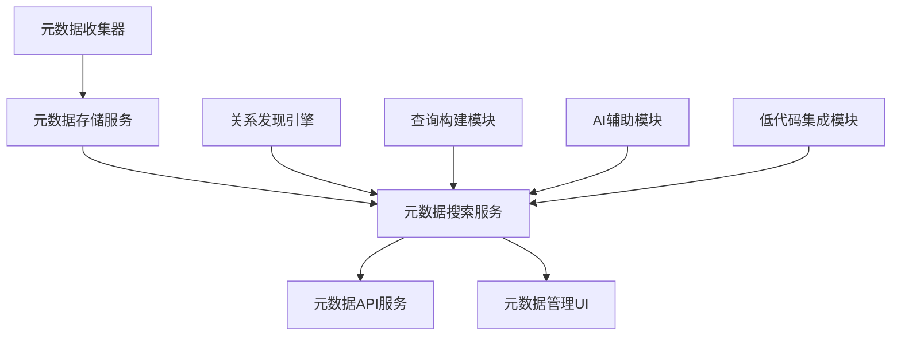
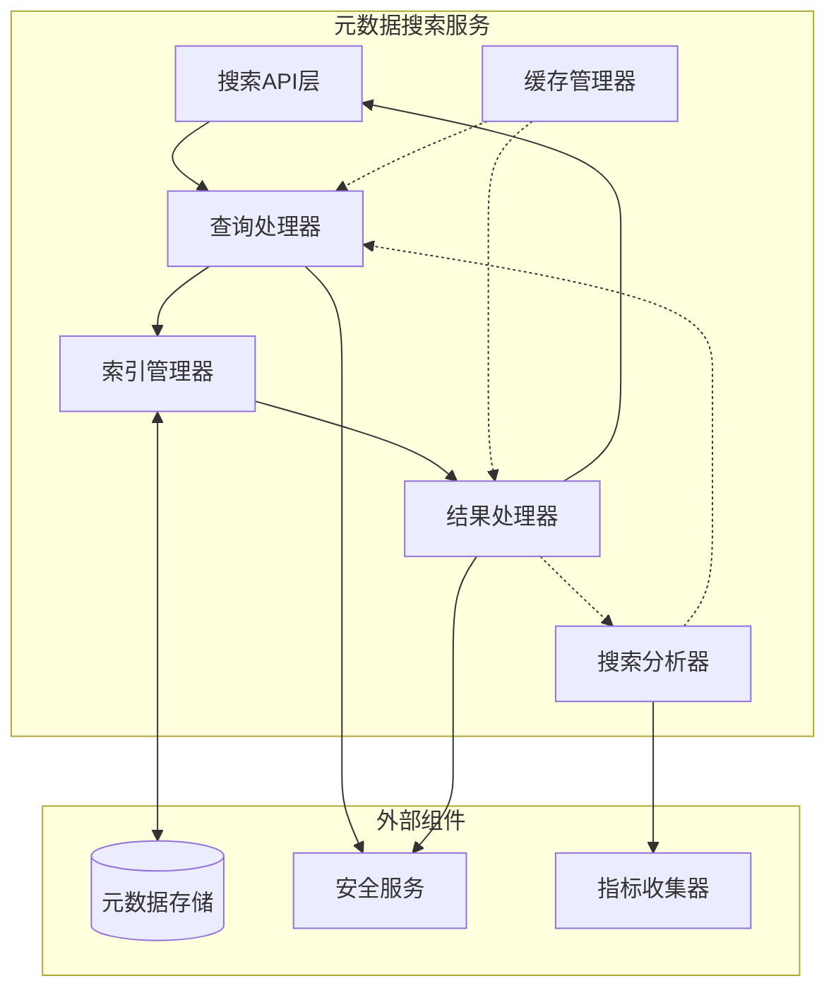
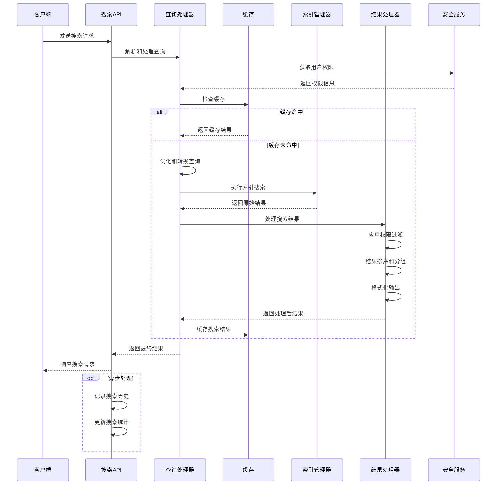
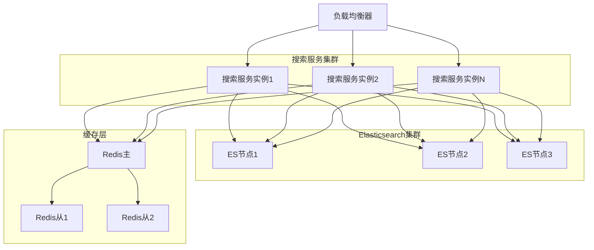

# 元数据搜索服务设计

## 1. 组件概述

### 1.1 目的
元数据搜索服务旨在提供高效、智能的元数据检索和发现能力，使用户和其他系统组件能够快速、准确地找到所需的数据资源。该服务通过多维度搜索、过滤和推荐功能，简化元数据导航体验，提高数据资产利用效率。

### 1.2 范围
本组件负责元数据的索引创建、搜索请求处理、结果排序和过滤、搜索建议生成以及相关性优化等功能，支持从简单关键词查询到复杂的多条件、语义化搜索。

### 1.3 与其他组件的关系


## 2. 功能需求

### 2.1 核心功能
- **全文搜索**：支持对表名、列名、描述、标签等元数据的全文检索
- **高级过滤**：基于数据源、数据类型、更新时间等属性进行多条件组合过滤
- **语义搜索**：支持基于语义理解的相似概念匹配和搜索
- **搜索建议**：根据用户输入和历史行为提供智能搜索建议
- **搜索历史**：记录和利用用户搜索历史提高搜索体验
- **相关性排序**：基于多维度因素对搜索结果进行智能排序
- **分面导航**：提供分类和属性筛选，辅助结果浏览
- **权限感知**：在搜索结果中应用用户权限过滤

### 2.2 非功能需求
- **性能**：
  - 响应时间：简单搜索 < 100ms，复杂搜索 < 300ms
  - 吞吐量：支持每秒 50+ 的并发搜索请求
  - 索引延迟：元数据变更后 < 5s 内可搜索
- **可扩展性**：
  - 支持亿级元数据条目的索引和搜索
  - 支持水平扩展以应对负载增长
- **可用性**：
  - 99.99% 的服务可用性
  - 支持故障自动恢复
- **安全性**：
  - 搜索结果必须遵循权限控制规则
  - 敏感搜索词和结果加密存储

## 3. 架构设计

### 3.1 组件架构


### 3.2 搜索流程


### 3.3 数据模型

#### 3.3.1 搜索索引模型
```json
{
  "metadata_index": {
    "mappings": {
      "properties": {
        "id": { "type": "keyword" },
        "name": { 
          "type": "text",
          "fields": {
            "keyword": { "type": "keyword" },
            "completion": { "type": "completion" }
          }
        },
        "type": { "type": "keyword" },
        "dataSourceId": { "type": "keyword" },
        "schemaName": { "type": "keyword" },
        "description": { "type": "text" },
        "tags": { "type": "keyword" },
        "attributes": { "type": "object" },
        "createdAt": { "type": "date" },
        "updatedAt": { "type": "date" },
        "popularity": { "type": "float" },
        "vector_embedding": { "type": "dense_vector", "dims": 384 }
      }
    }
  }
}
```

#### 3.3.2 搜索请求模型
```typescript
interface SearchRequest {
  query: string;                      // 搜索关键词
  filters?: {                         // 搜索过滤条件
    type?: string[];                  // 元数据类型
    dataSource?: string[];            // 数据源
    schema?: string[];                // 模式
    tags?: string[];                  // 标签
    updatedAfter?: string;            // 更新时间范围
    customAttributes?: Record<string, any>; // 自定义属性
  };
  sort?: {                            // 排序条件
    field: string;                    // 排序字段
    order: 'asc' | 'desc';            // 排序顺序
  }[];
  pagination: {                       // 分页配置
    page: number;                     // 页码
    size: number;                     // 每页大小
  };
  semanticSearch?: boolean;           // 是否启用语义搜索
  highlight?: boolean;                // 是否高亮匹配内容
  facets?: string[];                  // 需要返回的分面
  trackingId?: string;                // 搜索追踪ID
}
```

#### 3.3.3 搜索响应模型
```typescript
interface SearchResponse {
  items: MetadataItem[];              // 搜索结果列表
  total: number;                      // 结果总数
  pagination: {                       // 分页信息
    page: number;
    size: number;
    totalPages: number;
  };
  facets?: {                          // 分面聚合结果
    [facetName: string]: {
      value: string;
      count: number;
    }[];
  };
  suggestions?: string[];             // 搜索建议
  timing: {                           // 性能计时
    took: number;                     // 搜索耗时(ms)
    parseTime: number;                // 解析时间
    searchTime: number;               // 搜索时间
    processTime: number;              // 处理时间
  };
}
```

## 4. 详细设计

### 4.1 查询处理器

查询处理器负责解析用户输入的搜索条件，转换为底层搜索引擎可执行的查询语句，并应用权限过滤、同义词扩展和语义增强等处理。

#### 4.1.1 查询解析
- 支持多种查询模式：关键词、自然语言、高级语法
- 提取实体和关系，识别特殊搜索语法
- 应用语法解析和词法分析

#### 4.1.2 查询优化
- 查询重写：同义词扩展、词干提取、拼写纠正
- 权重优化：基于字段重要性、用户偏好调整权重
- 性能优化：减少低效查询模式，优化查询结构

#### 4.1.3 安全过滤
- 权限检查：集成安全服务，过滤无权访问内容
- 敏感数据处理：特殊处理敏感元数据
- 审计记录：记录敏感搜索操作

### 4.2 索引管理器

索引管理器负责元数据的索引创建、更新、优化和监控，确保索引的性能和可靠性。

#### 4.2.1 索引策略
- 分片与副本：基于元数据量和查询模式设计分片策略
- 索引刷新：实现近实时索引更新机制
- 增量索引：只处理变更元数据，提高索引效率

#### 4.2.2 索引生命周期
- 创建与初始化：新索引的创建和初始数据填充
- 更新与合并：索引增量更新和合并优化
- 归档与删除：历史索引的归档和清理策略

#### 4.2.3 向量索引
- 语义向量生成：使用预训练模型生成文本向量表示
- 向量索引：支持高效的向量相似度搜索
- 混合检索：结合关键词和向量搜索的混合策略

### 4.3 结果处理器

结果处理器负责对搜索引擎返回的原始结果进行后处理，包括过滤、排序、分组、高亮和格式化等处理。

#### 4.3.1 相关性排序
- 多因素排序模型：综合考虑文本相关性、流行度、新鲜度等因素
- 个性化排序：基于用户历史行为和偏好调整排序
- 业务规则调整：支持针对特定场景的自定义排序规则

#### 4.3.2 结果增强
- 结果高亮：突出显示匹配的关键词和片段
- 结果分组：基于元数据类型、数据源等属性分组展示
- 结果摘要：生成简洁的结果摘要帮助快速理解

#### 4.3.3 分面处理
- 动态分面：根据搜索结果动态生成分面项
- 层次分面：支持层次化的分面导航
- 分面计数：计算每个分面值的结果数量

### 4.4 缓存管理器

缓存管理器实现多级缓存策略，提高搜索性能和减轻底层存储系统负担。

#### 4.4.1 缓存策略
- 查询缓存：缓存热门查询的结果集
- 文档缓存：缓存频繁访问的元数据文档
- 片段缓存：缓存部分计算结果和中间状态

#### 4.4.2 缓存一致性
- 失效机制：基于元数据变更触发缓存失效
- 版本控制：使用版本标记确保缓存一致性
- 部分更新：支持缓存项的部分更新减少重建开销

#### 4.4.3 缓存优化
- 预热机制：系统启动或索引更新后预热关键缓存
- 自适应策略：根据访问模式动态调整缓存策略
- 分布式缓存：支持跨节点的缓存共享和同步

### 4.5 搜索分析器

搜索分析器收集和分析搜索行为数据，用于优化搜索体验和提供业务洞察。

#### 4.5.1 行为分析
- 查询分析：热门查询、零结果查询、长尾查询分析
- 交互分析：点击率、会话深度、转化率追踪
- 用户分析：用户偏好、搜索模式识别

#### 4.5.2 性能监控
- 响应时间跟踪：监控各阶段处理耗时
- 资源使用监控：CPU、内存、I/O使用情况
- 错误和异常监控：记录和分析搜索错误

#### 4.5.3 优化反馈
- 相关性反馈：收集用户对结果相关性的反馈
- A/B测试支持：支持不同搜索策略的实验对比
- 自动优化建议：基于分析生成优化建议

## 5. 接口设计

### 5.1 REST API

#### 5.1.1 搜索API
```
POST /api/v1/metadata/search
```
请求体:
```json
{
  "query": "customer transaction",
  "filters": {
    "type": ["table", "column"],
    "dataSource": ["sales_db"],
    "updatedAfter": "2025-01-01T00:00:00Z"
  },
  "sort": [
    {"field": "relevance", "order": "desc"},
    {"field": "updatedAt", "order": "desc"}
  ],
  "pagination": {
    "page": 1,
    "size": 20
  },
  "semanticSearch": true,
  "highlight": true,
  "facets": ["type", "dataSource", "tags"]
}
```

#### 5.1.2 建议API
```
GET /api/v1/metadata/suggestions?query=trans&limit=5
```

#### 5.1.3 热门搜索API
```
GET /api/v1/metadata/popular?days=7&limit=10
```

### 5.2 内部接口

#### 5.2.1 索引更新接口
```typescript
interface IndexUpdateService {
  /**
   * 更新元数据索引
   * @param metadata 需要更新的元数据
   * @param operation 操作类型：新增、更新或删除
   * @returns 更新结果
   */
  updateIndex(
    metadata: MetadataItem | MetadataItem[],
    operation: 'create' | 'update' | 'delete'
  ): Promise<IndexUpdateResult>;
  
  /**
   * 重建指定范围的索引
   * @param options 重建选项，如数据源、模式等
   * @returns 重建结果
   */
  rebuildIndex(options?: RebuildOptions): Promise<RebuildResult>;
}
```

#### 5.2.2 搜索服务接口
```typescript
interface SearchService {
  /**
   * 执行元数据搜索
   * @param request 搜索请求
   * @param context 执行上下文，包含用户信息等
   * @returns 搜索结果
   */
  search(
    request: SearchRequest,
    context: ExecutionContext
  ): Promise<SearchResponse>;
  
  /**
   * 获取搜索建议
   * @param query 部分查询文本
   * @param options 建议选项
   * @returns 建议列表
   */
  getSuggestions(
    query: string,
    options?: SuggestionOptions
  ): Promise<string[]>;
}
```

## 6. 技术选型

### 6.1 搜索引擎
- **主选方案**: Elasticsearch 8.x
  - 优势: 高性能全文搜索、分布式架构、丰富的查询功能、向量搜索支持
  - 考量: 资源消耗较高，需合理规划集群
- **备选方案**: Solr、Meilisearch
  - 适用场景: 元数据规模较小或资源受限环境

### 6.2 向量引擎
- **主选方案**: Elasticsearch with k-NN
  - 优势: 与文本搜索集成、易于管理
- **备选方案**: Milvus、Pinecone、FAISS
  - 适用场景: 超大规模向量或特殊相似度算法需求

### 6.3 缓存技术
- **本地缓存**: Caffeine
  - 优势: 低延迟、高吞吐、内存效率高
- **分布式缓存**: Redis
  - 优势: 跨节点共享、持久化、丰富的数据结构

### 6.4 开发框架
- **后端框架**: Spring Boot
- **搜索客户端**: Elasticsearch Java Client
- **向量处理**: Deeplearning4j / TensorFlow

## 7. 性能考量

### 7.1 性能优化策略
- **索引优化**:
  - 合理设计分片与副本
  - 使用适当的索引刷新间隔
  - 字段类型和分析器优化
- **查询优化**:
  - 查询结构优化(避免深度嵌套)
  - 结果集大小控制
  - 字段加载选择性过滤
- **缓存优化**:
  - 多级缓存架构
  - 热点数据预加载
  - 自适应缓存策略

### 7.2 扩展性设计
- **水平扩展**:
  - 支持搜索服务集群部署
  - 无状态设计便于扩展
  - 分布式缓存策略
- **负载管理**:
  - 搜索请求路由策略
  - 按QPS自动扩缩容
  - 查询复杂度限制

### 7.3 性能指标与监控
- **关键指标**:
  - 查询延迟(平均、95分位、99分位)
  - 索引延迟(元数据变更到可搜索)
  - 缓存命中率
  - CPU、内存、IO使用率
- **监控工具**:
  - Prometheus + Grafana
  - Elasticsearch Monitoring
  - 自定义性能仪表盘

## 8. 安全设计

### 8.1 权限控制
- 集成系统权限框架
- 搜索结果过滤应用ACL规则
- 支持字段级权限控制

### 8.2 数据安全
- 敏感元数据标记与处理
- 搜索历史和日志加密存储
- 传输加密和API认证

### 8.3 审计与合规
- 敏感搜索操作审计
- 搜索行为异常检测
- 合规报告生成

## 9. 测试策略

### 9.1 单元测试
- 查询解析器测试
- 结果处理逻辑测试
- 缓存策略测试

### 9.2 集成测试
- 搜索流程端到端测试
- 索引更新一致性测试
- 权限控制集成测试

### 9.3 性能测试
- 搜索延迟基准测试
- 高并发负载测试
- 大数据量索引性能测试

## 10. 部署与运维

### 10.1 部署架构


### 10.2 运维考量
- **监控与告警**:
  - 建立全面监控，配置关键指标告警
  - 性能异常自动检测
  - 定期健康检查
- **容量规划**:
  - 根据元数据增长预测资源需求
  - 定期评估和调整资源配置
  - 自动扩展策略配置
- **备份恢复**:
  - 索引定期快照备份
  - 定期恢复测试
  - 灾难恢复计划

## 11. 未来扩展

### 11.1 功能扩展
- **语义搜索增强**:
  - 集成更先进的语言模型
  - 查询意图理解
  - 上下文感知搜索
- **个性化搜索**:
  - 用户行为模型
  - 个性化排序算法
  - 协同过滤推荐
- **多模态搜索**:
  - 表结构相似性搜索
  - 数据分布相似性搜索
  - 查询模式相似性搜索

### 11.2 技术演进
- 探索新一代向量数据库集成
- 实时搜索引擎升级
- 分布式协调框架优化