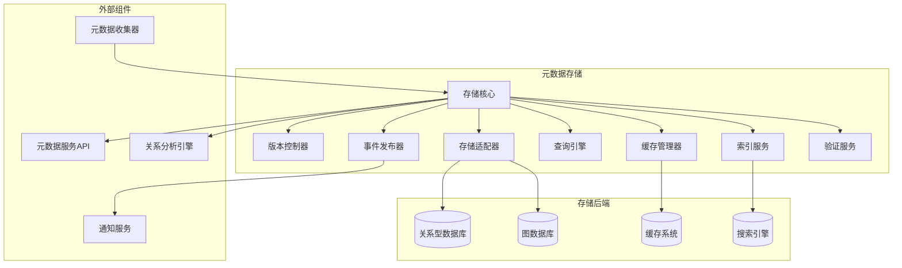
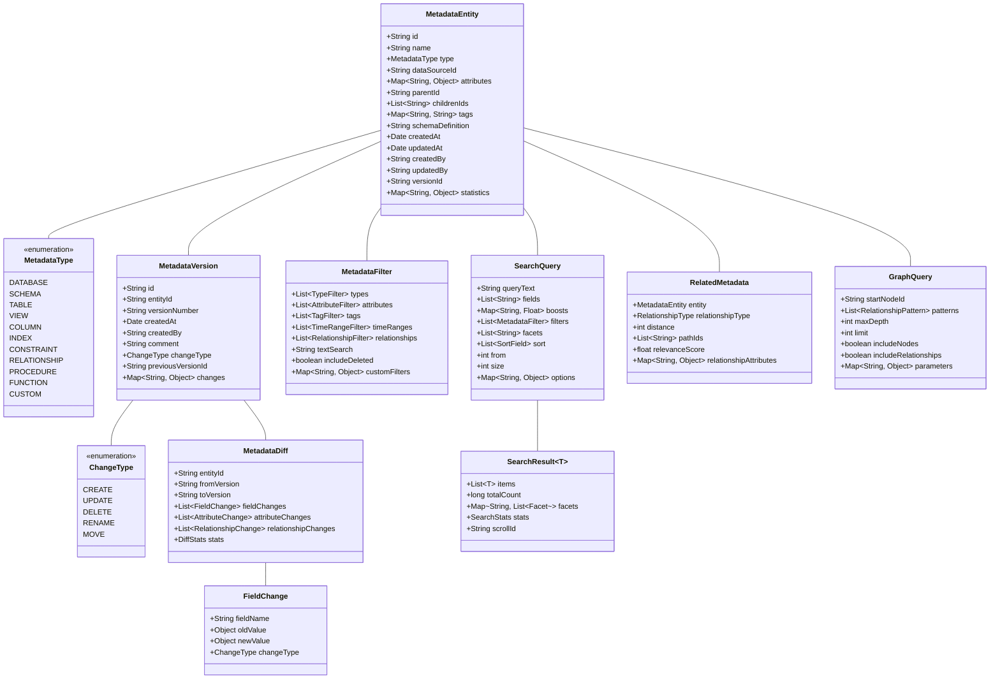
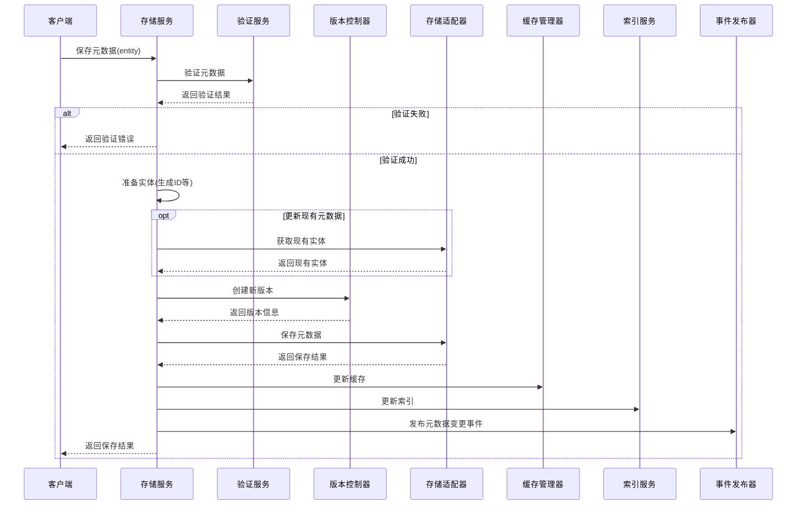
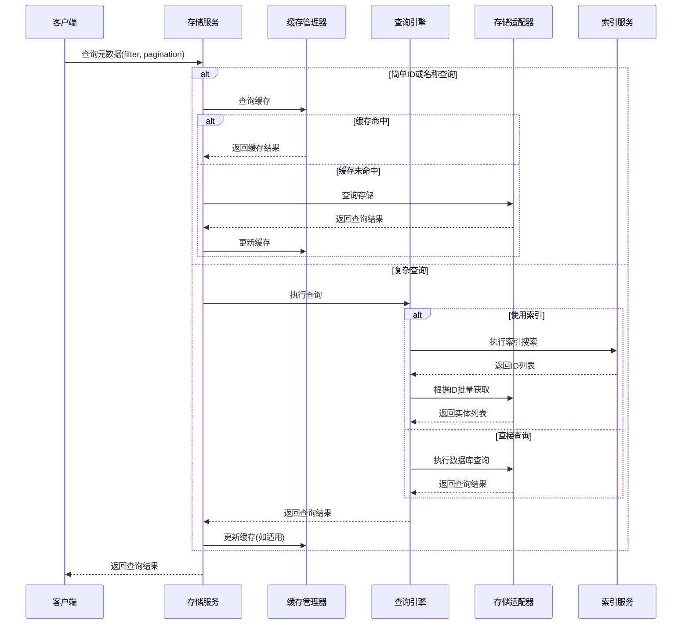
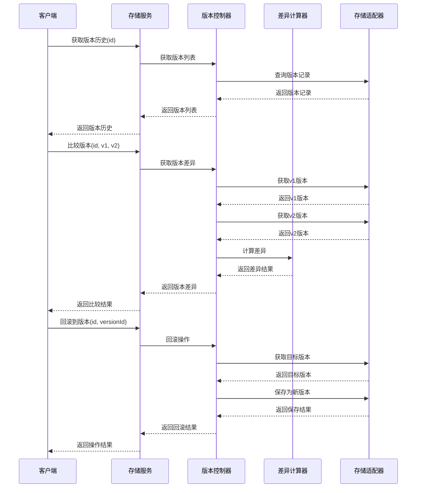
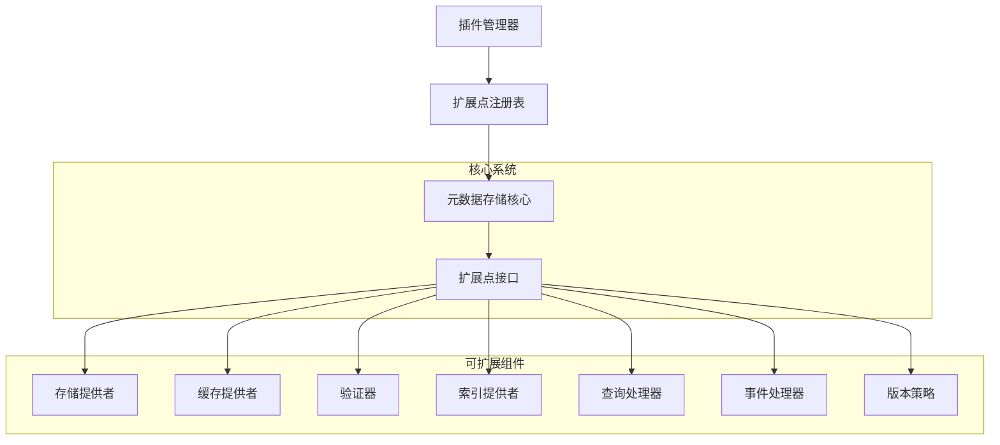

# 元数据存储设计文档

## 1. 概述

### 1.1 目的
本文档详细描述元数据存储组件的设计、架构和实现细节。元数据存储是元数据管理模块的核心组件，负责元数据的持久化、版本控制、检索和缓存，为系统提供高效可靠的元数据服务。

### 1.2 范围
本文档涵盖元数据存储的核心功能、架构设计、接口定义、数据模型、处理流程、异常处理和扩展机制等方面。

### 1.3 组件定位
元数据存储组件位于元数据管理模块的核心位置，接收来自元数据收集器的数据，为元数据服务API、关系分析引擎等组件提供数据支持。它是整个元数据管理体系的基础设施，确保元数据的一致性、完整性和可用性。

## 2. 架构设计

### 2.1 组件架构


### 2.2 核心类设计

```mermaid
classDiagram
    class MetadataStorageService {
        +saveMetadata(MetadataEntity entity)
        +getMetadata(String id, MetadataType type)
        +getMetadataByName(String name, MetadataType type)
        +getMetadataByFilter(MetadataFilter filter)
        +deleteMetadata(String id)
        +getMetadataHistory(String id)
        +getMetadataVersion(String id, String version)
        +compareVersions(String id, String version1, String version2)
        +invalidateCache(String id)
    }
    
    class MetadataEntity {
        +String id
        +String name
        +MetadataType type
        +String dataSourceId
        +Map~String, Object~ attributes
        +String parentId
        +List~String~ childrenIds
        +Map~String, String~ tags
        +String schemaDefinition
        +Date createdAt
        +Date updatedAt
        +String createdBy
        +String updatedBy
        +String versionId
        +Map~String, Object~ statistics
    }
    
    class MetadataVersionController {
        +createVersion(MetadataEntity entity, String comment)
        +getVersion(String entityId, String versionId)
        +listVersions(String entityId)
        +revertToVersion(String entityId, String versionId)
        +getVersionDiff(String entityId, String v1, String v2)
        +getLatestVersion(String entityId)
        +purgeOldVersions(String entityId, VersionPurgePolicy policy)
    }
    
    class MetadataCacheManager {
        +get(String cacheKey)
        +put(String cacheKey, Object value)
        +remove(String cacheKey)
        +invalidateByPattern(String pattern)
        +getStats()
        +warmUp(List~String~ keys)
        +refreshCache(String key)
        +setCachePolicy(CachePolicy policy)
    }
    
    class MetadataIndexService {
        +index(MetadataEntity entity)
        +search(SearchQuery query)
        +deleteIndex(String id)
        +reindex(String id)
        +reindexAll()
        +getIndexStatus()
        +optimizeIndex()
    }
    
    class MetadataQueryEngine {
        +executeQuery(MetadataQuery query)
        +executeGraphQuery(GraphQuery query)
        +countByFilter(MetadataFilter filter)
        +aggregateByField(AggregationQuery query)
        +getRelated(String id, RelationshipType type, int depth)
        +findPathBetween(String sourceId, String targetId)
    }
    
    class MetadataEventPublisher {
        +publishCreate(MetadataEntity entity)
        +publishUpdate(MetadataEntity entity, String prevVersionId)
        +publishDelete(String id, MetadataType type)
        +publishVersionCreate(String entityId, String versionId)
        +registerListener(MetadataEventListener listener)
        +removeListener(String listenerId)
    }
    
    class StorageAdapterFactory {
        +getAdapter(StorageType type)
        +registerAdapter(StorageType type, StorageAdapter adapter)
        +removeAdapter(StorageType type)
        +getDefaultAdapter()
        +setDefaultAdapter(StorageType type)
    }
    
    class MetadataStorageAdapter {
        <<interface>>
        +save(MetadataEntity entity)
        +get(String id, MetadataType type)
        +delete(String id)
        +query(QuerySpec querySpec)
        +update(String id, Map~String, Object~ updates)
        +bulkSave(List~MetadataEntity~ entities)
        +bulkGet(List~String~ ids)
        +beginTransaction()
        +commitTransaction()
        +rollbackTransaction()
    }
    
    class ValidationService {
        +validate(MetadataEntity entity)
        +validateSchema(String schemaDefinition)
        +registerValidator(MetadataType type, MetadataValidator validator)
        +removeValidator(String validatorId)
        +getValidationErrors(MetadataEntity entity)
    }
    
    MetadataStorageService --> MetadataEntity
    MetadataStorageService --> MetadataVersionController
    MetadataStorageService --> MetadataCacheManager
    MetadataStorageService --> MetadataIndexService
    MetadataStorageService --> MetadataQueryEngine
    MetadataStorageService --> MetadataEventPublisher
    MetadataStorageService --> StorageAdapterFactory
    MetadataStorageService --> ValidationService
    StorageAdapterFactory --> MetadataStorageAdapter
```


## 3. 功能详细设计

### 3.1 元数据存储模型
- **分层存储架构**: 实现多层存储架构，包括关系型存储、图式存储和搜索索引
- **统一元数据模型**: 设计统一的元数据对象模型，支持各种元数据类型
- **元数据关系表示**: 实现丰富的元数据关系表示方法
- **扩展属性支持**: 支持灵活的元数据扩展属性
- **分级存储策略**: 根据元数据类型和访问模式实现分级存储
- **统计信息集成**: 在存储模型中集成元数据使用和性能统计
- **元数据模式定义**: 支持JSON Schema等方式定义元数据模式

### 3.2 版本控制与历史
- **版本控制机制**: 实现完整的元数据版本控制
- **变更记录**: 记录每次元数据变更的详细信息
- **差异比较**: 支持不同版本间的元数据差异比较
- **版本回滚**: 提供将元数据回滚到特定版本的能力
- **历史查询**: 允许查询特定时间点的元数据状态
- **版本策略配置**: 可配置的版本保留和清理策略
- **版本标签**: 支持对特定版本添加标签和注释

### 3.3 缓存策略
- **多级缓存**: 实现内存、近内存和分布式缓存的多级架构
- **缓存一致性**: 确保缓存与持久存储的一致性
- **缓存预热**: 支持启动时预加载热点元数据
- **失效策略**: 实现基于时间和事件的缓存失效策略
- **按需加载**: 支持元数据的延迟加载和部分加载
- **访问模式优化**: 根据访问模式自动优化缓存内容
- **缓存统计**: 收集和展示缓存使用和效率的指标

### 3.4 索引与搜索
- **全文索引**: 为元数据实现全文搜索能力
- **多字段索引**: 支持基于多字段的复合索引
- **实时索引更新**: 确保索引与存储同步更新
- **结构化搜索**: 支持结构化和精确匹配搜索
- **相关性排序**: 实现基于相关性的搜索结果排序
- **搜索建议**: 提供搜索建议和自动补全功能
- **高级搜索语法**: 支持布尔运算符和精确匹配等高级搜索

### 3.5 查询与检索
- **通用查询接口**: 提供统一的元数据查询接口
- **复杂查询支持**: 支持多条件、多表达式的复杂查询
- **图式查询**: 支持关系导向的图式查询
- **分页和排序**: 查询结果的分页、排序和限制
- **聚合与统计**: 支持对元数据的聚合和统计操作
- **查询优化**: 实现查询计划优化和执行优化
- **查询扩展**: 支持自定义查询扩展和处理器

### 3.6 事件与通知
- **事件发布**: 在元数据变更时发布事件
- **事件订阅**: 允许外部组件订阅元数据事件
- **实时通知**: 支持实时的元数据变更通知
- **批量事件处理**: 优化批量元数据变更的事件处理
- **事件持久化**: 持久化关键事件用于审计和追溯
- **事件过滤**: 支持细粒度的事件过滤和订阅
- **事件重试**: 实现事件发布的失败重试机制

### 3.7 存储适配与扩展
- **多存储适配**: 支持多种存储后端的适配器
- **统一接口**: 提供统一的存储访问接口
- **存储策略**: 实现可配置的存储策略
- **存储迁移**: 支持元数据在不同存储间的迁移
- **混合存储**: 支持不同元数据类型使用不同的存储后端
- **存储扩展点**: 提供自定义存储实现的扩展机制
- **存储性能监控**: 收集和分析存储性能指标

### 3.8 元数据验证与完整性
- **模式验证**: 验证元数据符合预定义的模式
- **引用完整性**: 确保元数据间引用的完整性
- **约束检查**: 实现元数据约束的检查和验证
- **自定义规则**: 支持自定义的元数据验证规则
- **验证级别**: 实现不同严格程度的验证级别
- **错误修复建议**: 提供元数据错误的修复建议
- **批量验证**: 支持批量元数据的高效验证

## 4. 接口设计

### 4.1 外部接口

| 接口名称 | 类型 | 用途 | 参数 | 返回值 | 异常 |
|---------|------|-----|------|-------|------|
| saveMetadata | REST/内部API | 保存元数据实体 | entity: 元数据实体 | 保存的元数据 | 验证失败, 存储错误 |
| getMetadata | REST/内部API | 获取元数据 | id: 元数据ID, type: 元数据类型 | 元数据实体 | 未找到 |
| getMetadataByName | REST/内部API | 按名称获取元数据 | name: 名称, type: 类型, dataSourceId: 数据源ID | 元数据实体 | 未找到 |
| getMetadataHistory | REST/内部API | 获取元数据版本历史 | id: 元数据ID | 版本列表 | 未找到 |
| searchMetadata | REST/内部API | 搜索元数据 | query: 搜索查询 | 元数据列表 | 查询错误 |
| deleteMetadata | REST/内部API | 删除元数据 | id: 元数据ID | 删除结果 | 未找到, 依赖错误 |
| compareVersions | REST/内部API | 比较元数据版本 | id: 元数据ID, v1: 版本1, v2: 版本2 | 差异结果 | 版本未找到 |
| getRelatedMetadata | REST/内部API | 获取相关元数据 | id: 元数据ID, type: 关系类型, depth: 深度 | 相关元数据 | 未找到 |

### 4.2 内部接口

```java
// 元数据存储服务核心接口
public interface MetadataStorageService {
    // 保存或更新元数据实体
    MetadataEntity saveMetadata(MetadataEntity entity) 
        throws MetadataValidationException, MetadataStorageException;
    
    // 根据ID和类型获取元数据
    MetadataEntity getMetadata(String id, MetadataType type) 
        throws MetadataNotFoundException;
    
    // 根据名称和类型查找元数据
    MetadataEntity getMetadataByName(String name, MetadataType type, String dataSourceId) 
        throws MetadataNotFoundException;
    
    // 根据过滤条件查询元数据
    List<MetadataEntity> findMetadata(MetadataFilter filter, Pagination pagination) 
        throws MetadataQueryException;
    
    // 删除元数据
    void deleteMetadata(String id) 
        throws MetadataNotFoundException, MetadataDependencyException;
    
    // 获取元数据的版本历史
    List<MetadataVersion> getMetadataHistory(String id) 
        throws MetadataNotFoundException;
    
    // 获取指定版本的元数据
    MetadataEntity getMetadataVersion(String id, String versionId) 
        throws MetadataNotFoundException, VersionNotFoundException;
    
    // 获取两个版本间的差异
    MetadataDiff compareVersions(String id, String version1, String version2) 
        throws MetadataNotFoundException, VersionNotFoundException;
    
    // 批量获取元数据
    Map<String, MetadataEntity> batchGetMetadata(List<String> ids, MetadataType type) 
        throws MetadataStorageException;
    
    // 批量保存元数据
    List<MetadataEntity> batchSaveMetadata(List<MetadataEntity> entities) 
        throws MetadataValidationException, MetadataStorageException;
    
    // 搜索元数据
    SearchResult<MetadataEntity> searchMetadata(SearchQuery query) 
        throws MetadataSearchException;
    
    // 重建元数据索引
    void reindexMetadata(String id) 
        throws MetadataNotFoundException, IndexingException;
    
    // 获取相关元数据
    List<RelatedMetadata> getRelatedMetadata(String id, RelationshipType type, int depth) 
        throws MetadataNotFoundException;
}

// 元数据版本控制接口
public interface MetadataVersionController {
    // 创建新版本
    MetadataVersion createVersion(MetadataEntity entity, String comment) 
        throws VersionCreationException;
    
    // 获取特定版本
    MetadataEntity getVersion(String entityId, String versionId) 
        throws EntityNotFoundException, VersionNotFoundException;
    
    // 列出所有版本
    List<MetadataVersion> listVersions(String entityId) 
        throws EntityNotFoundException;
    
    // 回滚到特定版本
    MetadataEntity revertToVersion(String entityId, String versionId) 
        throws EntityNotFoundException, VersionNotFoundException;
    
    // 比较两个版本
    MetadataDiff getVersionDiff(String entityId, String v1, String v2) 
        throws EntityNotFoundException, VersionNotFoundException;
    
    // 设置版本保留策略
    void setRetentionPolicy(String entityId, VersionRetentionPolicy policy) 
        throws EntityNotFoundException;
}

// 元数据缓存管理接口
public interface MetadataCacheManager {
    // 从缓存获取
    <T> T get(String key, Class<T> type);
    
    // 放入缓存
    <T> void put(String key, T value, Duration ttl);
    
    // 从缓存移除
    void remove(String key);
    
    // 使缓存项失效
    void invalidate(String key);
    
    // 按模式使缓存失效
    void invalidateByPattern(String pattern);
    
    // 预热缓存
    void warmUp(List<String> keys);
    
    // 获取缓存统计
    CacheStatistics getStatistics();
    
    // 设置缓存策略
    void setCachePolicy(CachePolicy policy);
}

// 元数据查询引擎接口
public interface MetadataQueryEngine {
    // 执行通用查询
    <T> QueryResult<T> query(MetadataQuery query, Class<T> resultType) 
        throws QueryExecutionException;
    
    // 执行图查询
    GraphQueryResult graphQuery(GraphQuery query) 
        throws QueryExecutionException;
    
    // 执行聚合查询
    <T> AggregationResult<T> aggregate(AggregationQuery query, Class<T> resultType) 
        throws QueryExecutionException;
    
    // 查找路径
    List<MetadataPath> findPaths(String sourceId, String targetId, PathSearchOptions options) 
        throws QueryExecutionException;
    
    // 解释查询计划
    QueryExplanation explainQuery(MetadataQuery query) 
        throws QueryExecutionException;
}
```

### 4.3 数据模型



## 5. 处理流程

### 5.1 元数据保存流程



### 5.2 元数据查询流程



### 5.3 版本管理流程



## 6. 异常处理

### 6.1 异常类型
- **MetadataNotFoundException**: 元数据不存在
- **MetadataValidationException**: 元数据验证失败
- **MetadataStorageException**: 存储操作错误
- **VersionNotFoundException**: 版本不存在
- **VersionCreationException**: 版本创建失败
- **CacheOperationException**: 缓存操作错误
- **IndexingException**: 索引操作错误
- **QueryExecutionException**: 查询执行错误
- **MetadataDependencyException**: 元数据依赖冲突
- **ConcurrentModificationException**: 并发修改冲突

### 6.2 异常处理策略
- **精准错误信息**: 提供详细的错误上下文和原因
- **分级处理**: 区分严重错误、警告和恢复性错误
- **自动重试机制**: 针对临时性故障实现自动重试
- **降级策略**: 当缓存或索引不可用时降级到基本存储
- **事务管理**: 确保操作的原子性和一致性
- **全面日志记录**: 记录异常详情便于问题诊断
- **问题诊断信息**: 包含诊断信息帮助解决问题

### 6.3 错误码与描述
| 错误码 | 描述 | 解决方案 |
|------|------|--------|
| METADATA-001 | 元数据不存在 | 检查元数据ID或名称是否正确 |
| METADATA-002 | 元数据验证失败 | 检查元数据格式和必填字段 |
| METADATA-003 | 存储操作失败 | 检查存储连接和权限 |
| METADATA-004 | 版本不存在 | 检查版本ID是否正确 |
| METADATA-005 | 版本创建失败 | 检查版本系统状态和权限 |
| METADATA-006 | 缓存操作错误 | 检查缓存系统连接和配置 |
| METADATA-007 | 索引操作错误 | 检查索引服务状态和配置 |
| METADATA-008 | 查询执行错误 | 检查查询语法和参数 |
| METADATA-009 | 依赖冲突 | 先处理依赖的元数据 |
| METADATA-010 | 并发修改冲突 | 重新获取最新数据再修改 |

## 7. 性能考量

### 7.1 性能指标
| 指标 | 目标值 | 测试方法 |
|-----|-------|---------|
| 单条元数据读取时间 | <10ms | 性能测试 |
| 单条元数据写入时间 | <30ms | 性能测试 |
| 缓存命中率 | >95% | 监控统计 |
| 复杂查询响应时间 | <100ms | 性能测试 |
| 批量操作吞吐量 | >1000条/秒 | 负载测试 |
| 索引更新延迟 | <100ms | 延迟测试 |
| 内存占用 | <2GB | 资源监控 |
| 并发处理能力 | >100查询/秒 | 负载测试 |

### 7.2 优化策略
- **多级缓存**: 实现内存、近内存和分布式多级缓存
- **批量操作优化**: 优化批量读写操作减少网络往返
- **查询优化**: 实现智能查询计划和执行优化
- **索引策略**: 针对常用查询模式优化索引
- **分区存储**: 根据数据源和元数据类型实现分区存储
- **异步处理**: 非关键路径操作采用异步处理
- **资源池化**: 实现连接池和资源池化管理
- **延迟加载**: 采用延迟加载减少初始数据量
- **压缩策略**: 对大型元数据实现压缩存储

## 8. 安全考量

### 8.1 安全风险
- **未授权访问**: 未经授权访问敏感元数据
- **元数据注入**: 通过注入恶意内容破坏元数据
- **数据泄露**: 敏感元数据泄露给未授权用户
- **完整性破坏**: 元数据被未授权修改
- **历史泄露**: 通过历史版本访问敏感信息
- **拒绝服务**: 过度请求导致服务不可用
- **元数据遍历**: 通过枚举API获取全部元数据

### 8.2 安全措施
- **访问控制**: 实现细粒度的元数据访问控制
- **输入验证**: 严格验证所有元数据输入
- **数据加密**: 对敏感元数据实现存储加密
- **审计日志**: 记录所有元数据操作的审计日志
- **版本权限**: 对历史版本实施同等的访问控制
- **请求限流**: 实现API请求限流防止滥用
- **敏感数据过滤**: 在API响应中过滤敏感字段
- **安全扫描**: 定期扫描元数据存储中的安全问题
- **异常监控**: 监控异常访问模式和尝试

## 9. 扩展性设计

### 9.1 扩展点
- **存储适配器**: 支持添加新的存储后端适配器
- **缓存策略**: 可插拔的缓存策略实现
- **元数据验证器**: 自定义元数据验证规则
- **查询处理器**: 扩展查询语言和处理能力
- **事件监听器**: 自定义元数据事件处理
- **索引提供者**: 支持不同的索引和搜索实现
- **版本控制策略**: 可定制的版本控制策略

### 9.2 插件架构


### 9.3 配置扩展性
- **基于配置的功能开关**: 通过配置启用/禁用功能
- **可配置的处理流程**: 自定义处理步骤和顺序
- **策略注入**: 通过配置注入不同的处理策略
- **属性扩展**: 支持自定义元数据属性和schema
- **动态配置**: 支持运行时修改配置而无需重启
- **环境适配**: 针对不同环境的配置方案
- **多租户支持**: 支持多租户的独立配置

## 10. 依赖关系

### 10.1 内部依赖
- **元数据收集器**: 提供元数据来源
- **元数据服务API**: 使用存储服务提供对外API
- **关系分析引擎**: 使用存储服务分析关系
- **查询执行引擎**: 使用元数据优化查询
- **事件通知系统**: 订阅元数据变更事件

### 10.2 外部依赖
- **关系型数据库**: 存储结构化元数据
- **图数据库**: 存储关系和网络结构
- **搜索引擎**: 提供全文和高级搜索能力
- **缓存系统**: 提供高速缓存服务
- **任务调度系统**: 管理异步任务和批处理
- **日志和监控系统**: 记录操作和监控性能
- **身份验证和授权系统**: 提供访问控制

## 11. 测试策略

### 11.1 测试级别
- **单元测试**: 测试各组件的独立功能
- **集成测试**: 测试组件间的交互
- **系统测试**: 测试完整的元数据存储功能
- **性能测试**: 验证性能指标和扩展能力
- **安全测试**: 验证安全措施的有效性

### 11.2 测试场景
- **基本CRUD操作**: 测试基本的元数据操作
- **并发读写**: 测试并发场景下的正确性
- **版本管理**: 测试版本控制和历史管理
- **故障恢复**: 测试系统故障恢复能力
- **缓存一致性**: 验证缓存和存储的一致性
- **查询功能**: 测试复杂查询和搜索功能
- **扩展性**: 测试扩展点和插件机制
- **数据迁移**: 测试元数据迁移和升级

### 11.3 测试工具
- **JUnit/TestNG**: 单元测试框架
- **Mockito**: 模拟依赖组件
- **JMeter/Gatling**: 性能和负载测试
- **DBUnit**: 数据库测试
- **Cucumber**: 行为驱动测试
- **SonarQube**: 代码质量分析
- **OWASP ZAP**: 安全测试工具

## 12. 部署考量

### 12.1 部署要求
- **硬件需求**: 8核CPU, 16GB RAM, 100GB存储
- **软件需求**: 
  - Java 17+
  - PostgreSQL 14+
  - Neo4j 4.4+
  - Elasticsearch 7.10+
  - Redis 6+
- **网络要求**: 
  - 组件间低延迟连接
  - 足够的带宽支持元数据传输
  - 安全的内部网络

### 12.2 配置项
- **存储配置**: 数据库连接、池大小、超时设置
- **缓存配置**: 缓存大小、过期策略、刷新间隔
- **索引配置**: 索引刷新策略、分片设置、副本数
- **性能配置**: 线程池大小、批处理大小、超时设置
- **安全配置**: 加密设置、访问控制策略、审计级别
- **版本控制配置**: 版本保留策略、差异计算策略
- **事件配置**: 事件分发模式、重试策略、队列大小

### 12.3 监控指标
- **吞吐量**: 每秒处理的元数据操作数
- **延迟**: 各类操作的响应时间分布
- **错误率**: 操作失败率和异常统计
- **缓存效率**: 缓存命中率和使用情况
- **资源使用**: CPU、内存、磁盘使用情况
- **连接状态**: 数据库和外部系统连接状态
- **队列状态**: 事件队列长度和处理延迟

## 13. 文档和示例

### 13.1 开发文档
- **API参考**: 详细的API文档和使用说明
- **架构指南**: 系统架构和设计原则
- **扩展开发**: 如何开发和集成自定义扩展
- **最佳实践**: 元数据存储使用的最佳实践
- **故障排除**: 常见问题和解决方案

### 13.2 操作指南
- **部署指南**: 系统部署和配置说明
- **管理手册**: 日常管理和维护操作
- **性能调优**: 性能优化和调整建议
- **灾难恢复**: 备份和恢复流程
- **监控指南**: 系统监控和告警设置

### 13.3 示例
- **基本使用示例**: 常见元数据操作示例
- **高级查询示例**: 复杂查询和搜索示例
- **扩展开发示例**: 自定义适配器和验证器示例
- **集成示例**: 与其他系统集成的示例
- **迁移示例**: 元数据迁移和转换示例

## 14. 附录

### 14.1 术语表
- **元数据**: 描述数据的数据，如表结构、字段定义等
- **元数据实体**: 存储系统中的基本元数据单元，如表、列等
- **版本控制**: 管理元数据变更历史的机制
- **缓存**: 提高访问速度的临时数据存储机制
- **索引**: 加速搜索和查询的数据结构
- **存储适配器**: 连接不同存储后端的组件
- **事件发布-订阅**: 通知元数据变更的机制

### 14.2 参考文档
- **元数据标准规范**: 如Common Warehouse Metamodel (CWM)
- **设计模式指南**: 元数据管理相关设计模式
- **数据库文档**: PostgreSQL、Neo4j等存储系统文档
- **缓存最佳实践**: Redis等缓存系统使用指南
- **索引和搜索文档**: Elasticsearch最佳实践
- **版本控制模式**: 版本控制系统设计原则