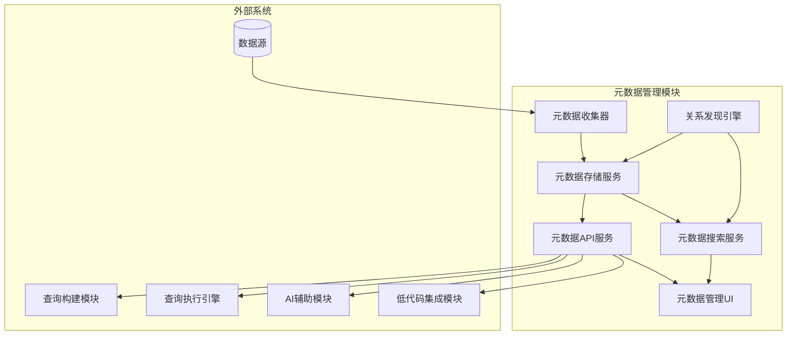
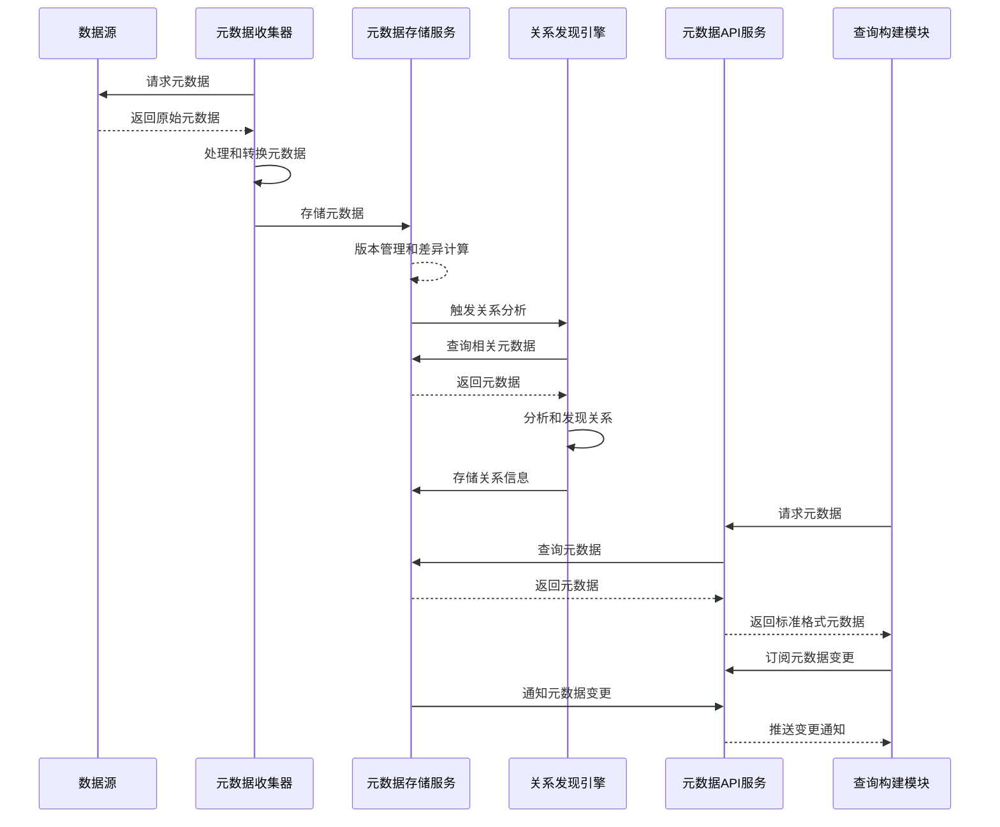

# 元数据管理模块概述

## 1. 模块简介

### 1.1 目的
元数据管理模块旨在构建和维护系统的核心知识库，通过收集、存储、管理和共享关于各种数据源的结构化信息，为查询构建、数据关系理解和AI辅助分析提供基础，使得整个系统能够智能地理解和操作异构数据源。

### 1.2 范围
元数据管理模块负责从各种数据源收集和管理表结构、字段定义、关系约束、索引信息等元数据，包括元数据收集、存储、版本控制、搜索、关系发现和变更管理等核心功能。

### 1.3 核心价值
- 构建统一的全局数据资产视图
- 智能发现和维护数据之间的关系
- 为查询构建提供准确的结构参考
- 减少数据访问错误和不一致性
- 支持数据治理和血缘分析
- 加速AI辅助分析的上下文理解

## 2. 核心功能

### 2.1 元数据收集与同步
- 自动化元数据提取和同步
- 增量元数据更新机制
- 多种数据源适配和转换
- 元数据采集调度管理
- 变更检测和冲突解决
- 元数据质量检查

### 2.2 元数据存储与版本控制
- 高性能元数据存储架构
- 元数据历史版本管理
- 变更审计和追踪
- 回滚和恢复机制
- 分布式元数据缓存
- 大规模元数据管理

### 2.3 关系发现与管理
- 自动表关系推断
- 外键和引用完整性管理
- 关系可视化和编辑
- 关系验证和质量评估
- 复杂关系模式识别
- 语义关系标注

### 2.4 元数据搜索与浏览
- 全文搜索和筛选能力
- 层次化元数据导航
- 智能元数据推荐
- 元数据标签和分类
- 个性化视图和收藏
- 高级过滤和排序

### 2.5 访问控制与安全
- 元数据级别权限管理
- 敏感元数据保护
- 访问审计和合规
- 元数据脱敏规则
- 多租户隔离
- 安全策略执行

## 3. 核心组件

### 3.1 [元数据收集器](./metadata-collector-design.md)
元数据收集器负责从各种数据源自动提取结构信息，包括表、列、关系等核心元数据，支持增量收集和变更检测，确保元数据的及时性和准确性。

### 3.2 [元数据存储服务](./metadata-storage-design.md)
元数据存储服务提供高性能、可扩展的元数据存储和检索能力，实现元数据版本控制、变更管理和历史追踪，支持大规模元数据集中管理。

### 3.3 [关系发现引擎](./relationship-discovery-design.md)
关系发现引擎通过名称匹配、数据采样分析、统计特征等多种算法自动发现并维护数据对象之间的关系，构建完整的数据关系网络。

### 3.4 [元数据搜索服务](./metadata-search-design.md)
元数据搜索服务提供高效、智能的元数据查询和发现功能，支持多维度搜索、过滤和推荐，帮助用户快速找到所需的数据资源。

### 3.5 [元数据API服务](./metadata-api-design.md)
元数据API服务为其他模块提供统一的元数据访问接口，封装元数据操作的复杂性，提供标准化的服务契约和交互模式。

### 3.6 [元数据管理UI](./metadata-ui-design.md)
元数据管理UI提供直观的可视化界面，用于浏览、搜索、编辑和管理元数据，支持关系可视化、血缘分析和变更审核。

## 4. 架构设计

### 4.1 模块架构

### 4.2 数据流

## 5. 关键技术

### 5.1 元数据提取技术
- 数据库系统表查询技术
- JDBC/ODBC元数据API
- ORM映射反向工程
- DDL解析技术
- NoSQL架构发现
- API规范解析(OpenAPI/Swagger)

### 5.2 存储与索引技术
- 图数据库存储模型
- 时态数据管理
- 分布式一致性算法
- 高性能全文索引
- 内存缓存技术
- JSON文档存储

### 5.3 关系发现技术
- 名称相似度算法
- 统计相关性分析
- 数据采样与特征匹配
- 机器学习分类模型
- 图模式识别
- 约束推理算法

## 6. 与其他模块的关系

### 6.1 与数据源管理模块的关系
- 使用数据源连接信息进行元数据采集
- 提供元数据变更通知以触发同步
- 共享数据源可用性和状态信息
- 配合管理数据源访问权限

### 6.2 与查询构建模块的关系
- 提供表、字段和关系信息
- 支持字段属性和约束验证
- 提供查询相关的智能推荐
- 共享元数据搜索能力

### 6.3 与查询执行引擎的关系
- 提供查询计划生成所需的统计信息
- 支持数据类型映射和转换
- 共享索引和性能优化信息
- 记录查询模式与元数据使用关系

### 6.4 与AI辅助模块的关系
- 提供语义理解的元数据上下文
- 支持关系网络的图分析
- 共享领域术语和概念映射
- 提供元数据学习的训练数据

### 6.5 与低代码集成模块的关系
- 提供实体和字段的可视化组件
- 支持数据模型的动态构建
- 实现关系可视化和编辑
- 共享元数据变更的事件通知

## 7. 技术选型与实现考量

### 7.1 存储技术
- PostgreSQL (关系型存储)
- Neo4j (图关系存储)
- Elasticsearch (搜索与索引)
- Redis (缓存层)
- MinIO (附件存储)

### 7.2 后端技术
- Spring Boot (微服务框架)
- GraphQL (API查询语言)
- Apache Kafka (事件流处理)
- Quartz (调度框架)
- Spring Data (数据访问)

### 7.3 前端技术
- React (UI库)
- D3.js (关系可视化)
- Apollo Client (GraphQL客户端)
- Ant Design (组件库)
- React Flow (图形化编辑)

## 8. 安全与合规

### 8.1 数据安全
- 元数据加密存储
- 敏感字段标记与管理
- 元数据访问控制
- 元数据导出保护
- 脱敏规则管理

### 8.2 访问控制
- 基于角色的权限体系
- 细粒度对象权限
- 操作审计日志
- 用户认证与授权
- 权限组管理

### 8.3 合规考量
- GDPR合规处理
- 数据分类与标签
- 元数据保留策略
- 元数据血缘跟踪
- 监管报告支持

## 9. 扩展性设计

### 9.1 扩展点
- 自定义元数据收集器
- 可插拔存储后端
- 自定义关系发现算法
- 元数据模型扩展
- 定制化元数据呈现

### 9.2 适配策略
- 多数据源类型适配
- 开放式API集成
- 模式扩展机制
- 版本兼容策略
- 插件化架构

## 10. 性能与可靠性

### 10.1 性能目标
- 百万级表元数据管理
- 元数据查询响应 < 100ms
- 全文搜索响应 < 300ms
- 关系分析计算 < 1s
- 支持每秒100+API请求

### 10.2 可靠性保障
- 元数据多副本存储
- 增量同步与校验
- 自动恢复机制
- 缓存容错设计
- 性能监控与告警

## 11. 未来发展

### 11.1 短期路线图
- 增强自动关系发现能力
- 改进元数据变更管理
- 扩展支持更多数据源类型
- 优化元数据搜索体验
- 增强元数据可视化功能

### 11.2 长期规划
- AI驱动的元数据质量管理
- 语义化元数据模型
- 跨组织元数据交换标准
- 复杂数据血缘分析
- 知识图谱集成与增强