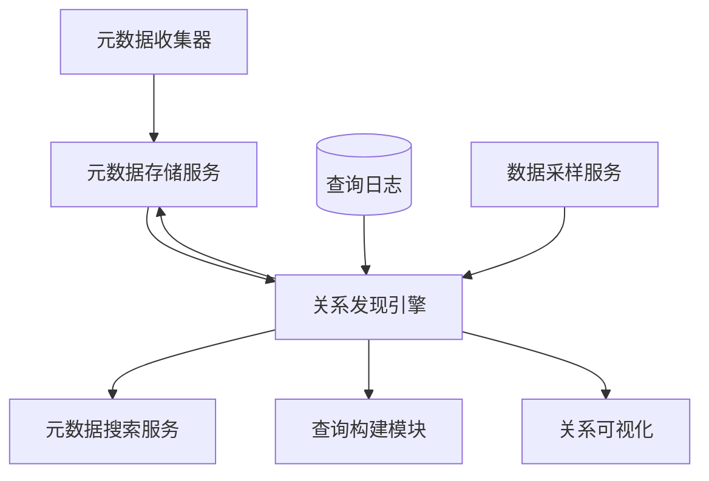
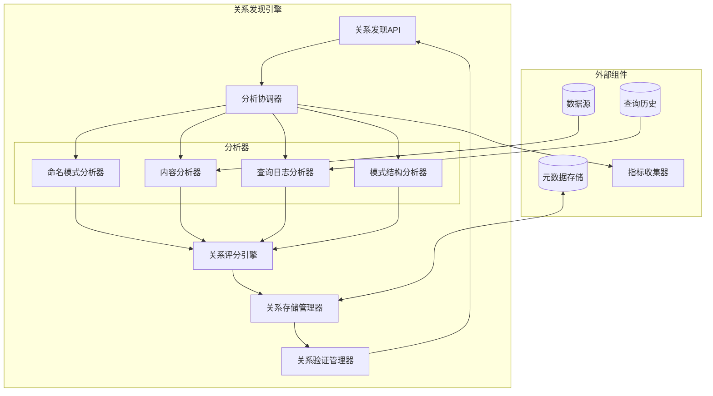
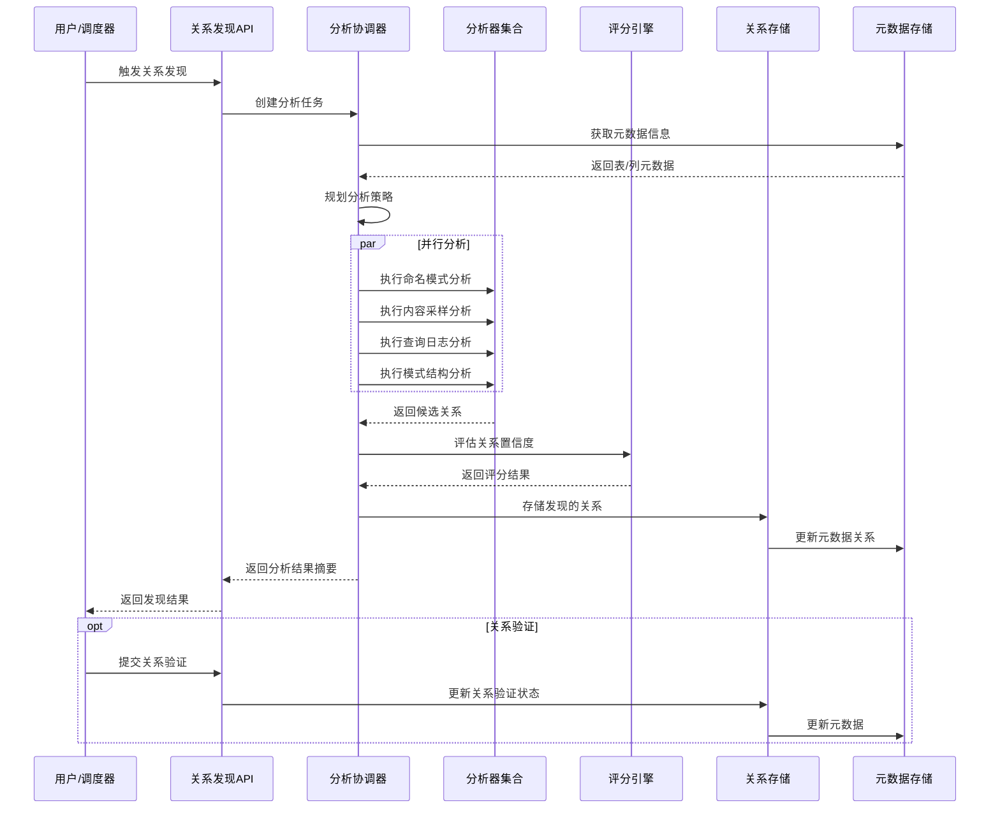

# 关系发现引擎设计

## 1. 组件概述

### 1.1 目的
关系发现引擎旨在自动分析和发现数据库中的表/视图之间的潜在关系，无需依赖现有的外键约束。该引擎通过多种技术手段发现数据之间的逻辑关联，构建更加完整的数据结构图谱，为查询构建、数据血缘分析和数据质量评估提供基础支持。

### 1.2 范围
本组件负责关系检测算法的实现、关系评分与验证、关系元数据的存储和维护、关系可视化支持以及与元数据管理其他组件的集成。包括名称模式分析、数据内容分析、查询日志分析等多种关系发现技术的实现。

### 1.3 与其他组件的关系


## 2. 功能需求

### 2.1 核心功能
- **模式识别分析**：基于命名规范和模式识别表之间的潜在关系
- **内容分析**：通过数据内容采样和分析发现不同表间的值关联
- **查询日志分析**：从历史SQL查询中提取连接条件和关系模式
- **字段相似度分析**：基于字段名称、类型、描述等计算相似度
- **关系评分**：为发现的每个关系提供置信度评分和相关性评分
- **关系验证**：提供关系验证机制，支持人工确认和反馈
- **关系元数据管理**：维护发现的关系信息，包括来源、类型和参与实体
- **增量关系更新**：支持增量方式更新关系，无需完全重建
- **关系导出**：支持向其他模块和系统导出发现的关系

### 2.2 非功能需求
- **性能**：
  - 关系检测时间：百万行级表 < 10分钟
  - 关系查询响应时间 < 200ms
  - 支持增量和按需计算，减少全量分析开销
- **准确性**：
  - 关系发现准确率目标 > 85%
  - 支持设置最小置信度阈值，减少误报
- **可扩展性**：
  - 支持插件式扩展分析算法
  - 适应不同规模和类型的数据源
- **资源利用**：
  - 限制分析过程中的资源消耗
  - 支持配置资源限制和分析深度

## 3. 架构设计

### 3.1 组件架构


### 3.2 关系发现流程


### 3.3 数据模型

#### 3.3.1 关系元数据模型
```json
{
  "relationship": {
    "id": "uuid-string",
    "name": "自动生成或用户指定的关系名称",
    "source": {
      "dataSourceId": "源数据源ID",
      "schemaName": "源模式名",
      "tableName": "源表名",
      "columnName": "源列名"
    },
    "target": {
      "dataSourceId": "目标数据源ID",
      "schemaName": "目标模式名",
      "tableName": "目标表名",
      "columnName": "目标列名"
    },
    "type": "ONE_TO_ONE|ONE_TO_MANY|MANY_TO_ONE|MANY_TO_MANY",
    "cardinality": {
      "sourceMin": 0,
      "sourceMax": "N",
      "targetMin": 1,
      "targetMax": 1
    },
    "confidence": 0.95,
    "discoveryMethod": "NAME_PATTERN|CONTENT_ANALYSIS|QUERY_LOG|SCHEMA_ANALYSIS|MANUAL",
    "discoveryDetails": {
      "matchPattern": "匹配的模式",
      "sampleSize": 1000,
      "matchRate": 0.98,
      "usageFrequency": 245
    },
    "status": "SUGGESTED|CONFIRMED|REJECTED",
    "createdAt": "ISO时间戳",
    "updatedAt": "ISO时间戳",
    "confirmedBy": "用户ID",
    "tags": ["标签1", "标签2"],
    "notes": "关系的相关说明"
  }
}
```

#### 3.3.2 分析任务模型
```typescript
interface RelationshipAnalysisTask {
  id: string;                      // 任务ID
  name: string;                    // 任务名称
  scope: {                         // 分析范围
    dataSources?: string[];        // 数据源范围
    schemas?: string[];            // 模式范围
    tables?: string[];             // 表范围
    excludedTables?: string[];     // 排除的表
  };
  analysisOptions: {               // 分析选项
    methods: (                     // 分析方法
      'NAME_PATTERN' |
      'CONTENT_ANALYSIS' |
      'QUERY_LOG' |
      'SCHEMA_ANALYSIS'
    )[];
    minConfidence: number;         // 最小置信度
    maxRelationships: number;      // 最大关系数量
    contentSampleSize?: number;    // 内容分析样本大小
    queryLogTimeRange?: {          // 查询日志时间范围
      start: string;
      end: string;
    };
  };
  priority: 'HIGH' | 'MEDIUM' | 'LOW'; // 任务优先级
  status: 'PENDING' | 'RUNNING' | 'COMPLETED' | 'FAILED'; // 任务状态
  progress: number;                // 进度百分比
  startTime?: string;              // 开始时间
  endTime?: string;                // 结束时间
  result?: {                       // 结果统计
    totalRelationships: number;    // 发现的关系总数
    highConfidenceCount: number;   // 高置信度关系数
    byMethod: Record<string, number>; // 各方法发现的关系数
  };
  error?: string;                  // 错误信息
}
```

## 4. 详细设计

### 4.1 命名模式分析器

