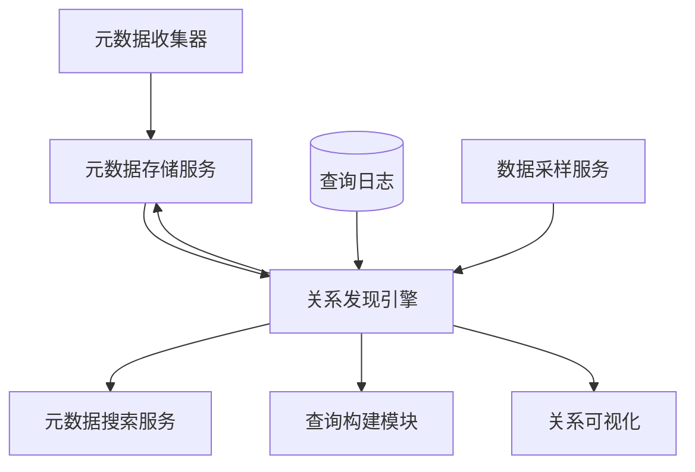
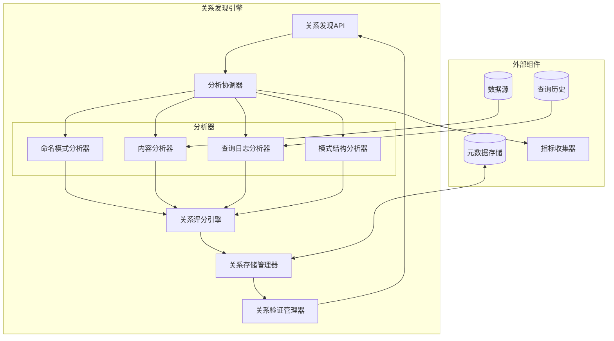
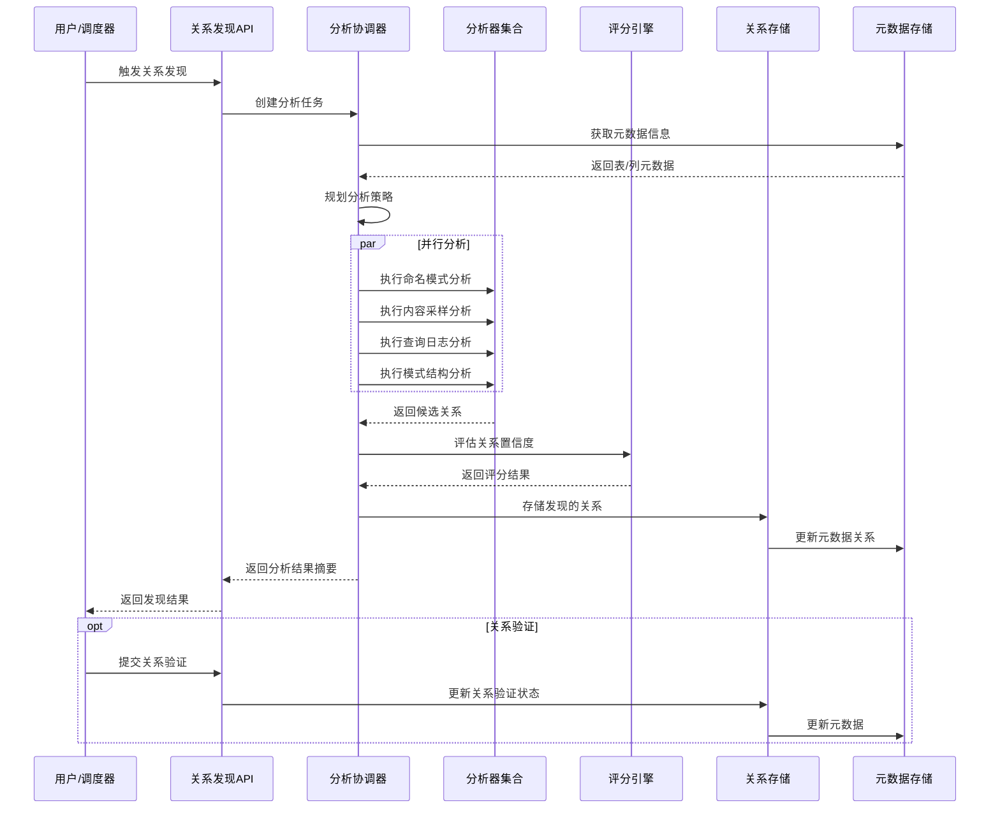
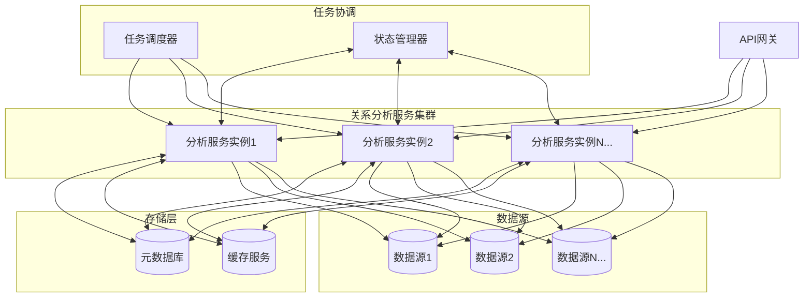

# 关系发现引擎设计

## 1. 组件概述

### 1.1 目的
关系发现引擎旨在自动分析和发现数据库中的表/视图之间的潜在关系，无需依赖现有的外键约束。该引擎通过多种技术手段发现数据之间的逻辑关联，构建更加完整的数据结构图谱，为查询构建、数据血缘分析和数据质量评估提供基础支持。

### 1.2 范围
本组件负责关系检测算法的实现、关系评分与验证、关系元数据的存储和维护、关系可视化支持以及与元数据管理其他组件的集成。包括名称模式分析、数据内容分析、查询日志分析等多种关系发现技术的实现。

### 1.3 与其他组件的关系


## 2. 功能需求

### 2.1 核心功能
- **模式识别分析**：基于命名规范和模式识别表之间的潜在关系
- **内容分析**：通过数据内容采样和分析发现不同表间的值关联
- **查询日志分析**：从历史SQL查询中提取连接条件和关系模式
- **字段相似度分析**：基于字段名称、类型、描述等计算相似度
- **关系评分**：为发现的每个关系提供置信度评分和相关性评分
- **关系验证**：提供关系验证机制，支持人工确认和反馈
- **关系元数据管理**：维护发现的关系信息，包括来源、类型和参与实体
- **增量关系更新**：支持增量方式更新关系，无需完全重建
- **关系导出**：支持向其他模块和系统导出发现的关系

### 2.2 非功能需求
- **性能**：
  - 关系检测时间：百万行级表 < 10分钟
  - 关系查询响应时间 < 200ms
  - 支持增量和按需计算，减少全量分析开销
- **准确性**：
  - 关系发现准确率目标 > 85%
  - 支持设置最小置信度阈值，减少误报
- **可扩展性**：
  - 支持插件式扩展分析算法
  - 适应不同规模和类型的数据源
- **资源利用**：
  - 限制分析过程中的资源消耗
  - 支持配置资源限制和分析深度

## 3. 架构设计

### 3.1 组件架构


### 3.2 关系发现流程


### 3.3 数据模型

#### 3.3.1 关系元数据模型
```json
{
  "relationship": {
    "id": "uuid-string",
    "name": "自动生成或用户指定的关系名称",
    "source": {
      "dataSourceId": "源数据源ID",
      "schemaName": "源模式名",
      "tableName": "源表名",
      "columnName": "源列名"
    },
    "target": {
      "dataSourceId": "目标数据源ID",
      "schemaName": "目标模式名",
      "tableName": "目标表名",
      "columnName": "目标列名"
    },
    "type": "ONE_TO_ONE|ONE_TO_MANY|MANY_TO_ONE|MANY_TO_MANY",
    "cardinality": {
      "sourceMin": 0,
      "sourceMax": "N",
      "targetMin": 1,
      "targetMax": 1
    },
    "confidence": 0.95,
    "discoveryMethod": "NAME_PATTERN|CONTENT_ANALYSIS|QUERY_LOG|SCHEMA_ANALYSIS|MANUAL",
    "discoveryDetails": {
      "matchPattern": "匹配的模式",
      "sampleSize": 1000,
      "matchRate": 0.98,
      "usageFrequency": 245
    },
    "status": "SUGGESTED|CONFIRMED|REJECTED",
    "createdAt": "ISO时间戳",
    "updatedAt": "ISO时间戳",
    "confirmedBy": "用户ID",
    "tags": ["标签1", "标签2"],
    "notes": "关系的相关说明"
  }
}
```

#### 3.3.2 分析任务模型
```typescript
interface RelationshipAnalysisTask {
  id: string;                      // 任务ID
  name: string;                    // 任务名称
  scope: {                         // 分析范围
    dataSources?: string[];        // 数据源范围
    schemas?: string[];            // 模式范围
    tables?: string[];             // 表范围
    excludedTables?: string[];     // 排除的表
  };
  analysisOptions: {               // 分析选项
    methods: (                     // 分析方法
      'NAME_PATTERN' |
      'CONTENT_ANALYSIS' |
      'QUERY_LOG' |
      'SCHEMA_ANALYSIS'
    )[];
    minConfidence: number;         // 最小置信度
    maxRelationships: number;      // 最大关系数量
    contentSampleSize?: number;    // 内容分析样本大小
    queryLogTimeRange?: {          // 查询日志时间范围
      start: string;
      end: string;
    };
  };
  priority: 'HIGH' | 'MEDIUM' | 'LOW'; // 任务优先级
  status: 'PENDING' | 'RUNNING' | 'COMPLETED' | 'FAILED'; // 任务状态
  progress: number;                // 进度百分比
  startTime?: string;              // 开始时间
  endTime?: string;                // 结束时间
  result?: {                       // 结果统计
    totalRelationships: number;    // 发现的关系总数
    highConfidenceCount: number;   // 高置信度关系数
    byMethod: Record<string, number>; // 各方法发现的关系数
  };
  error?: string;                  // 错误信息
}
```

## 4. 详细设计

### 4.1 命名模式分析器

命名模式分析器基于表和列的命名约定识别潜在关系，利用命名规则、前缀/后缀模式和通用键名称惯例进行匹配。

#### 4.1.1 分析规则
- **常见主键/外键命名模式**：
  - id, {table}_id, {table}Id
  - 支持复合前缀：例如 customer_order_id
  - 支持常见缩写：例如 cust_id 对应 customer
- **命名相似度算法**：
  - 使用编辑距离算法
  - 词干提取和标准化
  - 同义词映射
- **自定义规则支持**：
  - 支持用户定义的命名规则
  - 项目级规则配置
  - 数据源特定规则

#### 4.1.2 优先级和权重
- 精确名称匹配：高权重
- 部分/缩写匹配：中权重
- 语义相似匹配：低权重
- 综合列类型、是否索引等因素

#### 4.1.3 实现策略
```java
public class NamePatternAnalyzer implements RelationshipAnalyzer {
    
    // 分析入口点
    public List<RelationshipCandidate> analyze(AnalysisContext context) {
        List<TableMetadata> tables = context.getTables();
        List<RelationshipCandidate> candidates = new ArrayList<>();
        
        // 1. 提取所有表的主键信息
        Map<String, List<ColumnMetadata>> primaryKeyMap = extractPrimaryKeys(tables);
        
        // 2. 识别潜在外键
        for (TableMetadata table : tables) {
            List<ColumnMetadata> columns = table.getColumns();
            for (ColumnMetadata column : columns) {
                // 应用命名模式规则
                List<RelationshipMatch> matches = findMatchingTables(
                    column, 
                    tables, 
                    primaryKeyMap, 
                    context.getNamingRules()
                );
                
                // 创建关系候选
                for (RelationshipMatch match : matches) {
                    candidates.add(new RelationshipCandidate(
                        column,
                        match.getPrimaryKeyColumn(),
                        match.getConfidence(),
                        "NAME_PATTERN",
                        buildMatchDetails(match)
                    ));
                }
            }
        }
        
        return candidates;
    }
    
    // 其他辅助方法...
}
```

### 4.2 内容分析器

内容分析器通过采样和分析表中的实际数据内容来发现潜在关系，特别适用于没有遵循命名约定的场景。

#### 4.2.1 采样策略
- **智能采样**：
  - 自适应样本大小：基于表规模和数据分布
  - 分层采样：覆盖不同数据分布区域
  - 增量采样：根据初始结果动态调整
- **数据质量过滤**：
  - 过滤空值和异常值
  - 处理重复值
  - 识别和排除测试数据

#### 4.2.2 匹配分析
- **值分布匹配**：
  - 统计值分布特征
  - 值域重叠分析
  - 相似度计算
- **值频率分析**：
  - 识别频率模式
  - 关键值识别
  - 关联频率计算
- **类型兼容性**：
  - 处理类型转换
  - 格式兼容性检查
  - 二级类型匹配

#### 4.2.3 实现策略
```java
public class ContentAnalyzer implements RelationshipAnalyzer {
    
    // 分析入口点
    public List<RelationshipCandidate> analyze(AnalysisContext context) {
        // 获取分析配置
        ContentAnalysisConfig config = context.getContentAnalysisConfig();
        List<TableMetadata> tables = context.getTables();
        List<RelationshipCandidate> candidates = new ArrayList<>();
        
        // 1. 确定需要采样的列
        List<ColumnSamplingTask> samplingTasks = determineSamplingTargets(tables, config);
        
        // 2. 执行采样
        Map<String, ColumnSample> samples = performSampling(samplingTasks, context.getDataSourceManager());
        
        // 3. 分析采样数据寻找匹配
        for (ColumnSample sourceSample : samples.values()) {
            for (ColumnSample targetSample : samples.values()) {
                // 跳过相同列的比较
                if (sourceSample.equals(targetSample)) continue;
                
                // 计算内容匹配度
                ContentMatchResult match = analyzeContentMatch(sourceSample, targetSample);
                
                // 如果匹配度超过阈值，创建关系候选
                if (match.getMatchRate() >= config.getMinMatchRate()) {
                    candidates.add(new RelationshipCandidate(
                        sourceSample.getColumn(),
                        targetSample.getColumn(),
                        calculateConfidence(match),
                        "CONTENT_ANALYSIS",
                        buildMatchDetails(match)
                    ));
                }
            }
        }
        
        return candidates;
    }
    
    // 其他辅助方法...
}
```

### 4.3 查询日志分析器

查询日志分析器通过分析历史SQL查询中的连接条件和引用模式来发现关系，利用实际使用模式提高关系识别的准确性。

#### 4.3.1 日志来源
- 数据库查询日志
- 应用层SQL日志
- 系统监控捕获的查询
- 查询历史记录

#### 4.3.2 分析方法
- **SQL解析**：
  - JOIN条件提取
  - WHERE子句关联分析
  - 子查询引用分析
- **使用频率分析**：
  - 连接条件频率统计
  - 时间序列趋势分析
  - 应用上下文关联
- **查询模式挖掘**：
  - 识别常见查询模式
  - 表使用组合分析
  - 多表关系链路分析

#### 4.3.3 实现策略
```java
public class QueryLogAnalyzer implements RelationshipAnalyzer {
    
    // 分析入口点
    public List<RelationshipCandidate> analyze(AnalysisContext context) {
        QueryLogAnalysisConfig config = context.getQueryLogConfig();
        List<RelationshipCandidate> candidates = new ArrayList<>();
        
        // 1. 获取查询日志
        List<QueryLogEntry> queryLogs = fetchQueryLogs(
            context.getQueryLogProvider(),
            config.getTimeRange(),
            config.getMinQueryCount()
        );
        
        // 2. 解析查询提取关系
        Map<RelationshipKey, RelationshipUsage> usageMap = new HashMap<>();
        
        for (QueryLogEntry log : queryLogs) {
            // 解析SQL语句
            List<JoinCondition> joins = extractJoinConditions(log.getQueryText());
            
            // 更新关系使用统计
            for (JoinCondition join : joins) {
                RelationshipKey key = new RelationshipKey(
                    join.getSourceTable(), join.getSourceColumn(),
                    join.getTargetTable(), join.getTargetColumn()
                );
                
                usageMap.computeIfAbsent(key, k -> new RelationshipUsage())
                       .incrementUsage(log.getTimestamp(), log.getUserId());
            }
        }
        
        // 3. 生成关系候选
        for (Map.Entry<RelationshipKey, RelationshipUsage> entry : usageMap.entrySet()) {
            RelationshipKey key = entry.getKey();
            RelationshipUsage usage = entry.getValue();
            
            // 检查使用频率是否达到阈值
            if (usage.getTotalUsage() >= config.getMinUsageCount()) {
                // 查找对应的元数据对象
                ColumnMetadata sourceColumn = findColumn(context, key.getSourceTable(), key.getSourceColumn());
                ColumnMetadata targetColumn = findColumn(context, key.getTargetTable(), key.getTargetColumn());
                
                if (sourceColumn != null && targetColumn != null) {
                    candidates.add(new RelationshipCandidate(
                        sourceColumn,
                        targetColumn,
                        calculateConfidence(usage),
                        "QUERY_LOG",
                        buildUsageDetails(usage)
                    ));
                }
            }
        }
        
        return candidates;
    }
    
    // 其他辅助方法...
}
```

### 4.4 模式结构分析器

模式结构分析器通过分析表的结构特征（如主键、索引、唯一约束等）和数据类型兼容性来推断潜在关系。

#### 4.4.1 结构特征
- **主键/索引分析**：
  - 识别主键字段
  - 分析索引列组合
  - 二级索引和复合索引解析
- **约束分析**：
  - 唯一约束
  - 检查约束
  - 值域约束
- **字段元数据分析**：
  - 数据类型兼容性
  - 长度和精度匹配
  - 非空属性一致性

#### 4.4.2 关系评估
- 结构相似度计算
- 统计的类型分布和实体比例
- 基于领域知识的结构模式

#### 4.4.3 实现策略
```java
public class SchemaAnalyzer implements RelationshipAnalyzer {
    
    // 分析入口点
    public List<RelationshipCandidate> analyze(AnalysisContext context) {
        SchemaAnalysisConfig config = context.getSchemaAnalysisConfig();
        List<TableMetadata> tables = context.getTables();
        List<RelationshipCandidate> candidates = new ArrayList<>();
        
        // 1. 提取表结构特征
        Map<TableMetadata, TableStructure> tableStructures = 
            extractTableStructures(tables);
        
        // 2. 分析主键和索引
        Map<ColumnMetadata, KeyType> keyColumns = identifyKeyColumns(tables);
        
        // 3. 查找结构匹配
        for (TableMetadata sourceTable : tables) {
            for (ColumnMetadata sourceColumn : sourceTable.getColumns()) {
                // 跳过非潜在外键列
                if (!isPotentialForeignKey(sourceColumn, keyColumns, config)) continue;
                
                for (TableMetadata targetTable : tables) {
                    // 跳过自引用
                    if (sourceTable.equals(targetTable)) continue;
                    
                    for (ColumnMetadata targetColumn : targetTable.getColumns()) {
                        // 检查是否为主键或唯一键
                        if (!isKeyColumn(targetColumn, keyColumns)) continue;
                        
                        // 检查类型兼容性
                        if (!areTypesCompatible(sourceColumn, targetColumn)) continue;
                        
                        // 计算结构匹配度
                        StructureMatchResult match = calculateStructureMatch(
                            sourceColumn, 
                            targetColumn,
                            tableStructures.get(sourceTable),
                            tableStructures.get(targetTable)
                        );
                        
                        // 创建关系候选
                        if (match.getMatchScore() >= config.getMinStructureScore()) {
                            candidates.add(new RelationshipCandidate(
                                sourceColumn,
                                targetColumn,
                                calculateConfidence(match),
                                "SCHEMA_ANALYSIS",
                                buildMatchDetails(match)
                            ));
                        }
                    }
                }
            }
        }
        
        return candidates;
    }
    
    // 其他辅助方法...
}
```

### 4.5 关系评分引擎

关系评分引擎整合来自不同分析器的结果，综合评估关系的置信度和重要性，并对发现的关系进行排序和过滤。

#### 4.5.1 评分模型
- **置信度计算**：
  - 基础置信度：各分析器的原始置信度
  - 证据权重：基于发现方法的可靠性
  - 多方法验证：多个方法发现同一关系时提升置信度
- **重要性评分**：
  - 使用频率：在查询中的使用频次
  - 数据覆盖率：关系涉及的数据比例
  - 表重要性：表的核心程度和使用广泛性
- **关系质量评估**：
  - 数据完整性：空值和异常值的比例
  - 基数匹配：关系两端的基数特征
  - 更新频率：数据更新模式匹配度

#### 4.5.2 竞争关系处理
- 识别和处理冲突关系（同一列存在多个候选关系）
- 基于证据强度和置信度的优先级排序
- 提供备选关系建议

#### 4.5.3 实现策略
```java
public class RelationshipScoreEngine {
    
    // 评分配置
    private final ScoringConfig config;
    
    // 评估关系候选
    public List<ScoredRelationship> evaluateRelationships(
            List<RelationshipCandidate> candidates,
            ScoringContext context) {
        
        // 1. 按关系键分组（处理来自不同分析器的相同关系）
        Map<RelationshipKey, List<RelationshipCandidate>> groupedCandidates = 
            groupCandidatesByKey(candidates);
        
        List<ScoredRelationship> scoredRelationships = new ArrayList<>();
        
        // 2. 对每组候选关系进行评分
        for (Map.Entry<RelationshipKey, List<RelationshipCandidate>> entry : 
                groupedCandidates.entrySet()) {
            
            RelationshipKey key = entry.getKey();
            List<RelationshipCandidate> relCandidates = entry.getValue();
            
            // 计算综合置信度
            double confidence = calculateCombinedConfidence(relCandidates);
            
            // 计算重要性分数
            double importance = calculateImportance(key, relCandidates, context);
            
            // 计算质量分数
            double quality = calculateQualityScore(key, relCandidates, context);
            
            // 创建评分关系对象
            ScoredRelationship scoredRel = new ScoredRelationship(
                key.getSourceColumn(),
                key.getTargetColumn(),
                confidence,
                importance,
                quality,
                determineRelationshipType(relCandidates, context),
                aggregateDiscoveryMethods(relCandidates),
                buildCombinedDetails(relCandidates)
            );
            
            scoredRelationships.add(scoredRel);
        }
        
        // 3. 处理竞争关系
        List<ScoredRelationship> resolvedRelationships = 
            resolveCompetingRelationships(scoredRelationships, config);
        
        // 4. 应用最小置信度过滤
        return filterByMinConfidence(resolvedRelationships, config.getMinConfidence());
    }
    
    // 其他辅助方法...
}
```

### 4.6 关系存储管理器

关系存储管理器负责保存和管理发现的关系数据，提供关系的增删改查接口，以及关系的版本管理和变更追踪。

#### 4.6.1 存储模型
- 关系表设计和索引优化
- 版本控制和变更历史
- 缓存策略和失效机制

#### 4.6.2 接口功能
- 关系查询接口：按表、列、类型等条件查询
- 关系管理接口：新增、更新、删除关系
- 验证状态接口：更新和查询验证状态
- 批量操作接口：支持大量关系的批处理

#### 4.6.3 实现策略
```java
public class RelationshipStorageManager {
    
    private final MetadataRepository repository;
    private final CacheManager cacheManager;
    
    // 保存发现的关系
    public void saveRelationships(List<ScoredRelationship> relationships, String taskId) {
        // 开始事务
        TransactionContext tx = repository.beginTransaction();
        try {
            for (ScoredRelationship rel : relationships) {
                // 检查关系是否已存在
                Optional<RelationshipEntity> existing = 
                    repository.findRelationship(
                        rel.getSourceColumn().getId(),
                        rel.getTargetColumn().getId()
                    );
                
                if (existing.isPresent()) {
                    // 更新现有关系
                    updateRelationship(existing.get(), rel, taskId);
                } else {
                    // 创建新关系
                    createRelationship(rel, taskId);
                }
            }
            
            // 提交事务
            tx.commit();
            
            // 清除相关缓存
            invalidateRelatedCaches(relationships);
            
        } catch (Exception e) {
            // 回滚事务
            tx.rollback();
            throw new RelationshipStorageException("Failed to save relationships", e);
        }
    }
    
    // 查询关系
    public List<RelationshipEntity> queryRelationships(RelationshipQuery query) {
        // 检查缓存
        String cacheKey = buildCacheKey(query);
        List<RelationshipEntity> cached = cacheManager.get(cacheKey);
        
        if (cached != null) {
            return cached;
        }
        
        // 构建查询条件
        QueryBuilder queryBuilder = buildQueryConditions(query);
        
        // 执行查询
        List<RelationshipEntity> results = repository.findRelationships(queryBuilder);
        
        // 缓存结果
        cacheManager.put(cacheKey, results, getCacheTTL(query));
        
        return results;
    }
    
    // 其他接口方法...
}
```

### 4.7 关系验证管理器

关系验证管理器提供机制让用户确认或拒绝发现的关系，处理用户反馈并利用反馈改进关系发现流程。

#### 4.7.1 验证流程
- 用户验证界面设计
- 批量验证和快速操作
- 验证建议和辅助信息

#### 4.7.2 反馈学习
- 用户反馈收集和分析
- 基于反馈调整算法参数
- 识别模式和改进启发式规则

#### 4.7.3 实现策略
```java
public class RelationshipValidationManager {
    
    private final RelationshipStorageManager storageManager;
    private final FeedbackLearningEngine learningEngine;
    
    // 处理用户验证
    public ValidateRelationshipResult validateRelationship(
            String relationshipId, 
            ValidationAction action,
            String userId,
            String comment) {
        
        // 获取关系实体
        RelationshipEntity relationship = 
            storageManager.getRelationshipById(relationshipId);
        
        if (relationship == null) {
            throw new EntityNotFoundException("Relationship not found: " + relationshipId);
        }
        
        // 更新验证状态
        RelationshipStatus oldStatus = relationship.getStatus();
        RelationshipStatus newStatus;
        
        switch (action) {
            case CONFIRM:
                newStatus = RelationshipStatus.CONFIRMED;
                break;
            case REJECT:
                newStatus = RelationshipStatus.REJECTED;
                break;
            case RESET:
                newStatus = RelationshipStatus.SUGGESTED;
                break;
            default:
                throw new IllegalArgumentException("Invalid action: " + action);
        }
        
        // 应用更新
        relationship.setStatus(newStatus);
        relationship.setConfirmedBy(userId);
        relationship.setComments(comment);
        relationship.setUpdatedAt(LocalDateTime.now());
        
        storageManager.updateRelationship(relationship);
        
        // 发送到学习引擎进行分析
        learningEngine.processFeedback(
            relationship, 
            oldStatus, 
            newStatus, 
            userId
        );
        
        return new ValidateRelationshipResult(
            relationshipId,
            newStatus,
            relationship.getUpdatedAt()
        );
    }
    
    // 获取验证建议
    public List<ValidationSuggestion> getValidationSuggestions(
            String tableId, 
            int limit) {
        
        // 获取相关未验证关系
        List<RelationshipEntity> unvalidatedRelationships = 
            storageManager.queryRelationships(
                RelationshipQuery.builder()
                    .withTableId(tableId)
                    .withStatus(RelationshipStatus.SUGGESTED)
                    .withLimit(limit * 2) // 获取更多，用于过滤
                    .withOrderBy("confidence", "DESC")
                    .build()
            );
        
        // 应用智能推荐策略选择最佳候选
        List<ValidationSuggestion> suggestions = 
            buildSuggestions(unvalidatedRelationships);
        
        // 限制结果数量
        return suggestions.stream()
                .limit(limit)
                .collect(Collectors.toList());
    }
    
    // 其他方法...
}
```

## 5. 接口设计

### 5.1 REST API

#### 5.1.1 关系发现API
```
POST /api/v1/metadata/relationships/discovery/tasks
```
请求体:
```json
{
  "name": "全量关系发现任务",
  "scope": {
    "dataSources": ["sales_db", "crm_db"],
    "excludedTables": ["temp_", "log_"]
  },
  "analysisOptions": {
    "methods": ["NAME_PATTERN", "CONTENT_ANALYSIS", "QUERY_LOG"],
    "minConfidence": 0.75,
    "maxRelationships": 1000,
    "contentSampleSize": 5000
  },
  "priority": "HIGH"
}
```

#### 5.1.2 关系查询API
```
GET /api/v1/metadata/relationships?table=customers&status=CONFIRMED&limit=100
```

#### 5.1.3 关系验证API
```
PUT /api/v1/metadata/relationships/{id}/validation
```
请求体:
```json
{
  "action": "CONFIRM",
  "comment": "确认此关系，用于客户订单分析"
}
```

### 5.2 内部接口

#### 5.2.1 分析服务接口
```typescript
interface RelationshipAnalysisService {
  /**
   * 创建并提交关系分析任务
   * @param task 分析任务配置
   * @returns 创建的任务信息
   */
  createAnalysisTask(
    task: RelationshipAnalysisTask
  ): Promise<RelationshipAnalysisTask>;
  
  /**
   * 获取任务状态和进度
   * @param taskId 任务ID
   * @returns 任务状态信息
   */
  getTaskStatus(
    taskId: string
  ): Promise<RelationshipAnalysisTask>;
  
  /**
   * 取消正在进行的任务
   * @param taskId 任务ID
   * @returns 操作结果
   */
  cancelTask(
    taskId: string
  ): Promise<boolean>;
}
```

#### 5.2.2 关系管理接口
```typescript
interface RelationshipManagementService {
  /**
   * 查询关系
   * @param query 查询条件
   * @returns 符合条件的关系列表
   */
  queryRelationships(
    query: RelationshipQuery
  ): Promise<PagedResult<Relationship>>;
  
  /**
   * 获取特定关系的详情
   * @param relationshipId 关系ID
   * @returns 关系详情
   */
  getRelationshipById(
    relationshipId: string
  ): Promise<Relationship>;
  
  /**
   * 创建或更新关系
   * @param relationship 关系数据
   * @returns 保存后的关系
   */
  saveRelationship(
    relationship: Relationship
  ): Promise<Relationship>;
  
  /**
   * 删除关系
   * @param relationshipId 关系ID
   * @returns 操作结果
   */
  deleteRelationship(
    relationshipId: string
  ): Promise<boolean>;
}
```

## 6. 技术选型

### 6.1 关系发现算法
- **主选方案**: 基于规则+机器学习的混合方法
  - 优势: 结合领域知识和数据驱动，适应性强
  - 考量: 需要训练数据和算法调优
- **备选方案**: 纯规则引擎
  - 适用场景: 系统初期或数据量较小时

### 6.2 数据采样工具
- **主选方案**: 自定义采样框架+JDBC
  - 优势: 灵活性高，可定制采样策略
  - 考量: 需确保性能和数据源兼容性
- **备选方案**: Apache DataSketches
  - 适用场景: 大规模数据近似分析

### 6.3 SQL解析
- **主选方案**: JSqlParser
  - 优势: 功能完整，支持多种SQL方言
  - 考量: 解析复杂SQL的性能消耗
- **备选方案**: Druid SQL Parser
  - 适用场景: 性能要求高且SQL复杂度可控

### 6.4 开发框架
- **后端框架**: Spring Boot
- **并行处理**: Project Reactor / CompletableFuture
- **缓存**: Caffeine + Redis

## 7. 性能考量

### 7.1 性能优化策略
- **增量分析**：
  - 仅处理新增或变更的元数据
  - 维护分析状态避免重复计算
  - 智能识别需要重新分析的范围
- **并行处理**：
  - 分析器级并行：多个分析器同时执行
  - 任务级并行：单个分析器内部并行处理
  - 资源自适应：根据系统负载调整并行度
- **资源限制**：
  - 数据采样大小限制
  - 查询日志时间窗口控制
  - 处理超时机制和资源监控

### 7.2 扩展性设计
- **模块化架构**：
  - 分析器插件系统
  - 可配置的评分规则
  - 可扩展的存储适配器
- **分布式处理**：
  - 支持任务分片和分布式执行
  - 集群协调和状态同步
  - 结果合并和一致性保证

### 7.3 性能指标与监控
- **关键指标**:
  - 发现速率（每分钟处理的表/关系数）
  - 资源使用率（CPU、内存、I/O）
  - 准确率和召回率（通过采样评估）
  - 查询响应时间
- **监控方案**:
  - Prometheus + Grafana
  - 自定义性能仪表盘
  - 任务进度实时跟踪

## 8. 安全设计

### 8.1 数据访问控制
- 采样数据的权限检查
- 遵循数据访问规则
- 敏感数据过滤和掩码

### 8.2 操作安全
- 分析任务资源限制
- 长时间运行任务的监控和中断
- 用户操作审计跟踪

### 8.3 隐私保护
- 避免在分析过程中暴露敏感数据
- 关系元数据的权限控制
- 遵循数据治理策略

## 9. 测试策略

### 9.1 单元测试
- 分析器核心算法测试
- 评分引擎逻辑测试
- 关系存储和查询功能测试

### 9.2 集成测试
- 端到端关系发现流程测试
- 多数据源集成测试
- 性能和负载测试
- 准确性评估测试

### 9.3 测试数据集
- 合成数据集（具有已知关系）
- 实际数据子集（匿名化）
- 边缘情况和异常数据集

## 10. 部署与运维

### 10.1 部署架构


### 10.2 运维考量
- **监控与告警**:
  - 分析任务状态监控
  - 性能指标跟踪
  - 错误率和成功率监控
  - 资源使用告警
- **日志管理**:
  - 详细的分析过程日志
  - 错误和异常记录
  - 性能瓶颈识别日志
- **备份与恢复**:
  - 关系元数据定期备份
  - 分析状态和配置备份
  - 快速恢复机制

## 11. 未来扩展

### 11.1 功能扩展
- **机器学习增强**:
  - 自动学习最佳分析参数
  - 基于历史数据的关系预测
  - 智能异常关系检测
- **跨数据源关系发现**:
  - 支持不同数据源间的关系识别
  - 跨域数据映射和关联
  - 数据集成和数据血缘支持
- **业务语义增强**:
  - 集成业务术语表和数据字典
  - 业务规则感知的关系分析
  - 领域特定关系模板

### 11.2 技术演进
- **图数据库集成**:
  - 使用图数据库存储和分析复杂关系网络
  - 复杂关系路径查询优化
  - 图算法应用于关系分析
- **流式分析支持**:
  - 实时监控数据变化
  - 增量关系更新
  - 变更事件驱动的关系评估
- **联邦元数据分析**:
  - 跨平台元数据整合
  - 统一关系视图
  - 全局数据映射