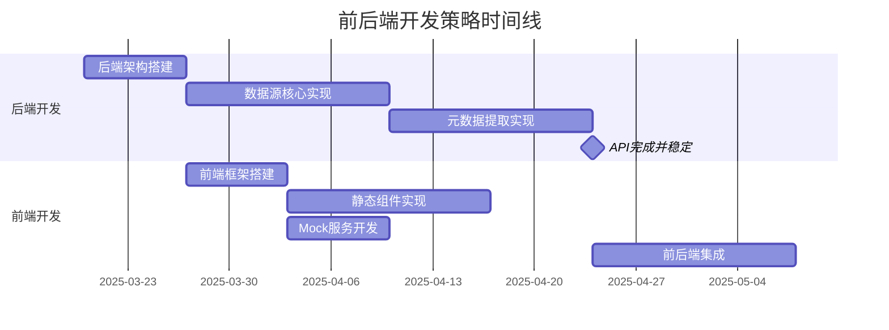
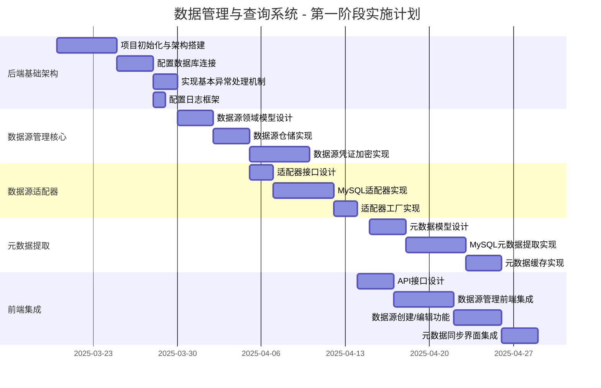

# DataScope系统 - 综合开发计划

本文档整合了DataScope系统的多个开发计划文档，提供全面的开发实施路线图，包括前后端开发计划、前后端联调计划、组件设计计划以及详细的任务分解和优先级排序。

## 1. 开发概述与策略

### 1.1 系统概述

DataScope是一个全面的数据管理和查询系统，旨在提供数据源管理、元数据提取、查询构建、自然语言查询和低代码集成等功能，为用户提供全面的数据分析能力。

### 1.2 前后端开发策略

基于项目特点和已有信息，我们采用**先实现后端核心功能，然后进行前端集成**的策略，原因如下：

1. **功能依赖性**：前端功能高度依赖后端API的稳定性和完整性，特别是数据源管理、元数据提取等核心功能
   
2. **风险控制**：核心后端功能（如数据源适配器、元数据提取、安全加密机制）包含较多技术风险点，应优先攻克

3. **接口稳定性**：提前完成后端API设计并实现核心功能后，可以提供稳定的API契约，减少后期接口变更导致的前端返工

4. **并行开发准备**：后端核心功能开发的同时，前端团队可以：
   - 搭建前端项目框架
   - 基于已完成的UI原型和API文档实现静态页面和组件
   - 开发Mock服务以模拟后端API响应



## 2. 开发阶段划分

DataScope系统开发分为以下五个主要阶段：

### 阶段1：系统基础设施和数据源管理（4周）
- 构建项目基础架构
- 实现数据源连接管理
- 实现元数据提取和管理
- 建立基本UI框架

### 阶段2：查询构建和执行功能（4周）
- 实现查询构建器核心功能
- 开发查询执行引擎
- 实现查询结果管理
- 完善查询UI组件

### 阶段3：自然语言查询和AI功能（3周）
- 实现NL2SQL转换功能
- 集成OpenRouter LLM API
- 开发用户反馈和学习机制
- 构建自然语言查询界面

### 阶段4：低代码集成平台（3周）
- 设计和实现低代码集成协议
- 开发表单生成器和展示配置
- 实现JSON协议和Webhook
- 构建低代码集成UI

### 阶段5：版本控制和系统完善（2周）
- 实现查询和API版本控制
- 开发协作编辑功能
- 系统性能优化和安全强化
- 完成文档和测试

## 3. 前端开发计划

### 3.1 概述

本部分详细规划了DataScope系统前端开发的实施计划，重点关注数据源管理和查询构建器模块的完善，以便尽快实现系统的基本功能。

### 3.2 优先级任务

#### 3.2.1 数据源管理前端完善（高优先级）

**任务3.2.1.1: 数据源列表页面完善（复杂度：5/10，预计时间：3天）**
- 实现数据源分页列表展示
- 添加搜索、筛选和排序功能
- 集成数据源状态指示器
- 添加快捷操作（查看详情、编辑、删除、测试连接）
- 实现与后端API对接

**任务3.2.1.2: 数据源表单优化（复杂度：6/10，预计时间：4天）**
- 完善数据源创建和编辑表单
- 添加动态表单验证
- 实现不同数据库类型的特定配置项
- 添加测试连接功能
- 实现表单提交与后端API对接

**任务3.2.1.3: 数据源详情页面（复杂度：5/10，预计时间：3天）**
- 设计并实现数据源详情页布局
- 展示基本信息、连接信息和统计信息
- 显示元数据同步状态和历史记录
- 添加关联操作（浏览模式/表、管理表关系等）
- 实现与后端API对接

**任务3.2.1.4: 元数据浏览组件（复杂度：7/10，预计时间：5天）**
- 实现模式/表/列层级浏览
- 添加元数据搜索功能
- 显示表结构和关系信息
- 添加数据预览功能
- 实现与后端API对接

#### 3.2.2 查询构建器实现（高优先级）

**任务3.2.2.1: 查询构建器基础界面（复杂度：8/10，预计时间：5天）**
- 设计查询构建器页面布局
- 实现数据源和模式选择器
- 添加表和列选择组件
- 创建基本的拖放界面框架
- 实现布局的保存和恢复

**任务3.2.2.2: 查询条件编辑器（复杂度：7/10，预计时间：4天）**
- 实现条件表达式构建器
- 添加不同数据类型的条件编辑器
- 支持AND/OR组合条件
- 添加条件模板和快捷方式
- 实现条件验证

**任务3.2.2.3: 查询结果和预览（复杂度：6/10，预计时间：4天）**
- 设计查询结果显示组件
- 实现分页和排序功能
- 添加数据导出选项
- 创建SQL预览和编辑功能
- 实现与后端查询执行API对接

**任务3.2.2.4: 查询管理功能（复杂度：5/10，预计时间：3天）**
- 实现查询保存和加载
- 添加查询历史记录
- 创建查询收藏功能
- 设计查询分享选项
- 实现与后端API对接

#### 3.2.3 前后端联调基础设施（中优先级）

**任务3.2.3.1: API服务层（复杂度：6/10，预计时间：3天）**
- 创建统一的API请求服务
- 实现请求拦截器和响应处理
- 添加认证令牌管理
- 设置请求超时和重试机制
- 实现API错误处理

**任务3.2.3.2: 状态管理（复杂度：5/10，预计时间：2天）**
- 设计状态管理方案
- 实现应用全局状态
- 创建模块化状态管理
- 添加持久化状态功能
- 实现状态变更监听

**任务3.2.3.3: 错误处理和通知（复杂度：4/10，预计时间：2天）**
- 设计全局错误处理机制
- 实现用户友好的错误提示
- 添加通知和消息系统
- 创建操作成功反馈机制
- 实现日志记录

#### 3.2.4 基础UI/UX改进（中优先级）

**任务3.2.4.1: 统一布局和导航（复杂度：4/10，预计时间：2天）**
- 优化应用整体布局
- 改进导航菜单结构
- 添加面包屑导航
- 实现响应式布局调整
- 优化页面加载过渡

**任务3.2.4.2: 数据可视化增强（复杂度：6/10，预计时间：3天）**
- 改进仪表盘数据展示
- 添加图表和统计组件
- 实现数据趋势可视化
- 创建交互式数据视图
- 添加仪表盘自定义选项

### 3.3 技术选择和架构决策

#### 3.3.1 前端架构

现有架构基于Vue 2.x和Ant Design Vue组件库，建议保持这一技术栈不变，但进行以下优化：

1. **API请求层**：创建统一的API服务层，采用axios实例封装，实现请求拦截、响应处理和错误处理。

2. **状态管理**：考虑到应用规模和复杂度，建议引入Vuex进行状态管理，将状态分为全局状态和模块状态。

3. **组件复用**：建立基础组件库，提取公共组件（如列表、表单、详情页等），提高代码复用率和一致性。

4. **路由管理**：优化路由结构，实现路由懒加载，并添加路由守卫进行权限控制。

#### 3.3.2 前后端交互

1. **数据交互格式**：统一使用JSON格式进行数据交互，遵循RESTful API设计原则。

2. **异步请求处理**：使用Promise和async/await处理异步请求，提高代码可读性和维护性。

3. **缓存策略**：对频繁访问且较少变化的数据（如字典数据、元数据等）实施前端缓存策略。

4. **分页处理**：统一分页参数和响应格式，前端实现分页控件与后端分页参数的对接。

#### 3.3.3 开发规范

1. **代码规范**：遵循ESLint规范，统一代码风格。

2. **命名规范**：组件采用PascalCase命名，文件采用kebab-case命名，变量和方法采用camelCase命名。

3. **注释规范**：关键方法和复杂逻辑添加注释，组件添加用途和Props说明。

4. **版本控制**：使用Git Flow工作流，feature分支进行开发，合并到develop分支，最终发布到master分支。

## 4. 前后端联调计划

### 4.1 概述

本部分详细规划了DataScope系统前后端联调的实施方案，确保前端和后端能够无缝协作，快速实现系统功能。联调计划专注于数据源管理和查询构建器两个优先模块，提供了明确的接口约定、测试策略和协作流程。

### 4.2 联调优先级

根据项目目标和资源限制，前后端联调将按以下优先级进行：

#### 4.2.1 第一阶段：数据源管理模块联调（优先级：高）

1. 数据源CRUD操作接口
2. 数据源连接测试接口
3. 元数据提取和同步接口
4. 元数据浏览接口

#### 4.2.2 第二阶段：查询构建器模块联调（优先级：高）

1. 数据源和元数据获取接口
2. SQL生成和验证接口
3. 查询执行和结果处理接口
4. 查询保存和加载接口

#### 4.2.3 第三阶段：性能优化和高级功能（优先级：中）

1. 查询结果缓存机制
2. 大数据量查询处理
3. 表关系推断功能
4. 查询历史和统计功能

### 4.3 前后端接口约定和规范

#### 4.3.1 API路径规范

1. **基础路径**：`/api`
2. **版本控制**：`/api/v1`
3. **资源命名**：使用复数形式和连字符，如 `/api/v1/data-sources`
4. **子资源**：通过资源ID访问，如 `/api/v1/data-sources/{id}/schemas`
5. **操作**：通过HTTP方法表示，如 `GET`, `POST`, `PUT`, `DELETE`
6. **控制动作**：通过动词表示，如 `/api/v1/data-sources/{id}/test-connection`

#### 4.3.2 请求规范

1. **内容类型**：`application/json`
2. **字符编码**：`UTF-8`
3. **日期时间格式**：ISO 8601 格式 (`YYYY-MM-DDThh:mm:ss.sssZ`)
4. **布尔值**：使用 `true` 和 `false`，不使用 `1` 和 `0`
5. **空值**：使用 `null`，不使用空字符串或 `undefined`
6. **分页参数**：
   - `page`: 页码（从0开始）
   - `size`: 每页大小
   - `sort`: 排序字段和方向（如 `name,asc`）

#### 4.3.3 响应规范

1. **成功响应**：
   - `GET`: 状态码 200，返回资源
   - `POST`: 状态码 201，返回创建的资源
   - `PUT`: 状态码 200，返回更新后的资源
   - `DELETE`: 状态码 204，无响应体

2. **错误响应**：
   ```json
   {
     "status": 400,
     "code": "VALIDATION_ERROR",
     "message": "请求验证失败",
     "details": [
       {
         "field": "username",
         "error": "用户名不能为空"
       }
     ],
     "timestamp": "2025-03-15T12:34:56.789Z",
     "path": "/api/users"
   }
   ```

3. **分页响应**：
   ```json
   {
     "content": [
       {
         "id": "1",
         "name": "示例"
       }
     ],
     "pageable": {
       "page": 0,
       "size": 10,
       "sort": "name,asc",
       "totalElements": 100,
       "totalPages": 10
     }
   }
   ```

#### 4.3.4 安全规范

1. **认证方式**：JWT Token，在请求头中通过 `Authorization: Bearer {token}` 提供
2. **授权控制**：基于角色的访问控制（RBAC）
3. **输入验证**：所有输入都必须经过验证，防止注入攻击
4. **敏感数据**：敏感数据在传输中加密，如密码不明文传输

### 4.4 核心接口联调计划

#### 4.4.1 数据源列表接口联调

**接口规范**
- **路径**：`GET /api/v1/data-sources`
- **参数**：
  - `page`: 页码（默认0）
  - `size`: 每页大小（默认10）
  - `sort`: 排序字段和方向（如 `name,asc`）
  - `filter`: 筛选条件（JSON格式）
- **响应**：
  - 成功：状态码 200，返回数据源列表
  - 失败：状态码 4xx/5xx，返回错误信息

**联调步骤**
1. **后端准备**：
   - 实现数据源列表接口
   - 准备测试数据
   - 实现分页、排序和筛选功能

2. **前端准备**：
   - 实现数据源列表组件
   - 实现分页、排序和筛选UI
   - 实现API调用逻辑

3. **联调测试**：
   - 测试基本列表加载
   - 测试分页功能
   - 测试排序功能
   - 测试筛选功能
   - 测试边界条件（空列表、大列表）
   - 测试错误处理

#### 4.4.2 数据源创建接口联调

**接口规范**
- **路径**：`POST /api/v1/data-sources`
- **请求体**：数据源创建请求
- **响应**：
  - 成功：状态码 201，返回创建的数据源
  - 失败：状态码 4xx/5xx，返回错误信息

**联调步骤**
1. **后端准备**：
   - 实现数据源创建接口
   - 实现请求验证
   - 实现错误处理

2. **前端准备**：
   - 实现数据源创建表单
   - 实现表单验证
   - 实现API调用逻辑

3. **联调测试**：
   - 测试成功创建
   - 测试表单验证
   - 测试后端验证错误处理
   - 测试服务器错误处理
   - 测试唯一性约束（如重名）

#### 4.4.3 数据源测试连接接口联调

**接口规范**
- **路径**：`POST /api/v1/data-sources/test-connection`
- **请求体**：数据源连接参数
- **响应**：
  - 成功：状态码 200，返回连接测试结果
  - 失败：状态码 4xx/5xx，返回错误信息

**联调步骤**
1. **后端准备**：
   - 实现测试连接接口
   - 实现各种数据库类型的连接测试
   - 实现错误处理和超时控制

2. **前端准备**：
   - 实现测试连接按钮
   - 实现加载状态显示
   - 实现结果展示

3. **联调测试**：
   - 测试成功连接
   - 测试连接失败（错误凭据）
   - 测试连接超时
   - 测试不可达服务器
   - 测试各种数据库类型

#### 4.4.4 元数据同步接口联调

**接口规范**
- **路径**：`POST /api/v1/data-sources/{id}/sync-metadata`
- **请求体**：同步选项
- **响应**：
  - 成功：状态码 200，返回同步任务ID
  - 失败：状态码 4xx/5xx，返回错误信息

**联调步骤**
1. **后端准备**：
   - 实现元数据同步接口
   - 实现异步任务处理
   - 实现任务状态查询接口

2. **前端准备**：
   - 实现同步按钮
   - 实现任务进度显示
   - 实现定时查询任务状态

3. **联调测试**：
   - 测试成功同步
   - 测试同步失败
   - 测试同步进度更新
   - 测试取消同步
   - 测试大量数据同步
   - 测试任务恢复（如页面刷新）

### 4.5 测试环境搭建和配置

#### 4.5.1 开发环境配置

1. **后端服务**：
   - 本地运行SpringBoot应用
   - 配置H2内存数据库或本地MySQL
   - 配置开发环境属性（application-dev.yml）
   - 启用API文档（Swagger/OpenAPI）

2. **前端服务**：
   - 本地运行Vue开发服务器
   - 配置API代理，避免跨域问题
   - 配置热重载
   - 配置环境变量

3. **数据库**：
   - 配置测试数据库
   - 准备测试数据脚本
   - 自动初始化测试数据

4. **认证服务**：
   - 配置简化的认证机制
   - 提供测试用户账号
   - 配置开发环境跳过部分安全检查

### 4.6 联调会议和沟通机制

#### 4.6.1 定期会议

1. **每日站会**：
   - 时间：每工作日上午10:00
   - 内容：进度汇报、问题讨论、计划调整
   - 参与者：前后端开发人员

2. **联调专题会议**：
   - 时间：每周三下午14:00
   - 内容：联调进展、问题解决、接口调整
   - 参与者：前后端开发人员、项目经理

3. **阶段评审会议**：
   - 时间：每个阶段结束前
   - 内容：阶段成果验收、问题总结、下阶段计划
   - 参与者：前后端开发人员、项目经理、产品经理

#### 4.6.2 沟通工具和渠道

1. **即时通讯**：
   - 企业微信：日常沟通
   - 专项群聊：联调专用群

2. **文档共享**：
   - Confluence：接口文档、会议记录
   - Git仓库：代码和配置文件

3. **问题跟踪**：
   - JIRA：问题记录和跟踪
   - 每日问题清单：重点问题跟踪

## 5. 后端开发实施计划

### 5.1 第一阶段开发实施计划

根据项目总体规划，第一阶段应专注于基础架构与数据源管理的实施。以下是具体的开发实施建议：



#### 5.1.1 后端基础架构实现（优先级：高）

1. **项目初始化与架构搭建**
   - 创建Spring Boot Maven项目
   - 配置项目结构，实现DDD四层架构（domain、application、infrastructure、facade）
   - 设置基础配置文件

2. **数据访问层设计**
   - 配置MySQL连接（系统数据库）
   - 配置MyBatis映射
   - 创建数据库迁移脚本（使用Flyway或Liquibase）

3. **安全框架实现**
   - 实现AES-256加密工具类
   - 设计密钥管理策略
   - 实现数据源凭证加密

4. **公共组件开发**
   - 异常处理框架
   - 日志记录机制
   - 缓存管理（Redis配置）

#### 5.1.2 数据源管理模块（优先级：高）

1. **数据源域模型实现**
   - 设计`DataSource`领域模型
   - 实现数据源值对象和实体
   - 设计数据源仓储接口

2. **数据源适配器框架**
   - 设计适配器接口
   - 实现MySQL适配器
   - 实现适配器工厂

3. **数据源服务层**
   - 实现数据源注册服务
   - 实现数据源测试连接功能
   - 实现数据源管理服务

4. **元数据提取功能**
   - 实现元数据模型
   - 实现MySQL元数据提取
   - 实现元数据缓存策略
   - 支持增量更新机制

#### 5.1.3 API层设计与实现（优先级：中）

1. **RESTful API设计**
   - 设计数据源管理API
   - 设计元数据访问API
   - 实现API版本控制

2. **API接口实现**

3. **API文档生成**
   - 配置Springdoc-OpenAPI
   - 编写API注释

### 5.2 关键决策与建议

1. **优先实现MySQL适配器**
   - 优先完成MySQL适配器，并确保架构设计的灵活性
   - DB2适配器在架构验证后再实现，分配有经验的开发人员负责

2. **凭证安全管理**
   - 实现独立的密钥管理服务，避免在配置文件中存储敏感信息
   - 考虑使用Spring Vault或集成外部密钥管理系统

3. **元数据管理策略**
   - 设计元数据增量更新机制，避免全量同步带来的性能问题
   - 实现元数据缓存策略，提高查询性能

4. **前端开发建议**
   - 优先使用第三方组件库，减少自定义组件开发时间
   - 实现状态管理和API调用

## 6. 组件设计文档开发计划

### 6.1 文档开发现状

#### 已完成的文档

1. **模块概览文档**
   - [x] 数据源管理模块概览 (`docs/datasource-management/overview.md`)
   - [x] 元数据管理模块概览 (`docs/metadata-management/overview.md`)
   - [x] 查询构建模块概览 (`docs/query-builder/overview.md`)
   - [x] 查询执行引擎模块概览 (`docs/query-execution-engine/overview.md`)
   - [x] AI辅助模块概览 (`docs/ai-assistant/overview.md`)
   - [x] 低代码集成模块概览 (`docs/lowcode-integration/overview.md`)

2. **组件详细设计文档**
   - [x] 元数据存储组件设计 (`docs/metadata-management/metadata-storage-design.md`)
   - [x] 元数据同步设计 (`docs/datasource-management/metadata-sync-design.md`)
   - [x] 连接池管理设计 (`docs/datasource-management/connection-pool-design.md`)
   - [x] 驱动适配器管理设计 (`docs/datasource-management/driver-adapter-design.md`)

### 6.2 需要开发的详细组件设计文档

以下是基于各模块概览中提到的组件，需要开发的详细设计文档清单：

#### 数据源管理模块
- [ ] 数据源配置管理设计文档 (`docs/datasource-management/datasource-configuration-design.md`)
- [x] 连接池管理设计文档 (`docs/datasource-management/connection-pool-design.md`)
- [x] 驱动适配器管理设计文档 (`docs/datasource-management/driver-adapter-design.md`)
- [x] 元数据同步设计文档 (`docs/datasource-management/metadata-sync-design.md`)
- [ ] 数据源路由设计文档 (`docs/datasource-management/datasource-routing-design.md`)
- [ ] 健康监控设计文档 (`docs/datasource-management/health-monitoring-design.md`)
- [ ] 安全管理设计文档 (`docs/datasource-management/security-management-design.md`)

#### 元数据管理模块
- [ ] 元数据采集连接器设计文档 (`docs/metadata-management/metadata-collector-design.md`)
- [ ] 元数据处理器设计文档 (`docs/metadata-management/metadata-processor-design.md`)
- [x] 元数据存储设计文档 (`docs/metadata-management/metadata-storage-design.md`)
- [ ] 元数据关系服务设计文档 (`docs/metadata-management/metadata-relationship-design.md`)
- [ ] 元数据查询服务设计文档 (`docs/metadata-management/metadata-query-design.md`)
- [ ] 元数据版本控制设计文档 (`docs/metadata-management/metadata-version-control-design.md`)

#### 查询构建模块
- [ ] 查询模型管理设计文档 (`docs/query-builder/query-model-design.md`)
- [ ] 条件构建服务设计文档 (`docs/query-builder/condition-builder-design.md`)
- [ ] 参数化服务设计文档 (`docs/query-builder/parameterization-design.md`)
- [ ] SQL生成器设计文档 (`docs/query-builder/sql-generator-design.md`)
- [ ] 查询验证与优化设计文档 (`docs/query-builder/query-validation-design.md`)
- [ ] 查询存储服务设计文档 (`docs/query-builder/query-storage-design.md`)
- [ ] 查询分析器设计文档 (`docs/query-builder/query-analyzer-design.md`)

#### 查询执行引擎模块
- [ ] 查询处理器设计文档 (`docs/query-execution-engine/query-processor-design.md`)
- [ ] 查询调度器设计文档 (`docs/query-execution-engine/query-scheduler-design.md`)
- [ ] 查询优化器设计文档 (`docs/query-execution-engine/query-optimizer-design.md`)
- [ ] 查询执行器设计文档 (`docs/query-execution-engine/query-executor-design.md`)
- [ ] 驱动适配器设计文档 (`docs/query-execution-engine/driver-adapter-design.md`)
- [ ] 联邦查询设计文档 (`docs/query-execution-engine/federated-query-design.md`)
- [ ] 缓存控制器设计文档 (`docs/query-execution-engine/cache-controller-design.md`)
- [ ] 资源管理器设计文档 (`docs/query-execution-engine/resource-manager-design.md`)

#### AI辅助模块
- [ ] 自然语言处理器设计文档 (`docs/ai-assistant/nlp-design.md`)
- [ ] 意图识别器设计文档 (`docs/ai-assistant/intent-recognition-design.md`)
- [ ] 上下文管理器设计文档 (`docs/ai-assistant/context-manager-design.md`)
- [ ] NL转SQL转换器设计文档 (`docs/ai-assistant/nl2sql-converter-design.md`)
- [ ] 查询验证器设计文档 (`docs/ai-assistant/query-validator-design.md`)
- [ ] 知识图谱设计文档 (`docs/ai-assistant/knowledge-graph-design.md`)
- [ ] 学习模型设计文档 (`docs/ai-assistant/learning-model-design.md`)
- [ ] 推荐引擎设计文档 (`docs/ai-assistant/recommendation-engine-design.md`)

#### 低代码集成模块
- [x] 版本控制设计文档 (`docs/lowcode-integration/version-control-design.md`)
- [x] WebHook机制设计文档 (`docs/lowcode-integration/webhook-mechanism-design.md`)
- [x] REST API设计文档 (`docs/lowcode-integration/rest-api-design.md`)
- [x] 数据绑定设计文档 (`docs/lowcode-integration/data-binding-design.md`)

### 6.3 文档开发优先级

1. **高优先级**（先开发）
   - 数据源配置管理设计文档
   - 元数据采集连接器设计文档
   - 查询模型管理设计文档
   - 查询处理器设计文档
   - 自然语言处理器设计文档

2. **中优先级**（已完成部分）
   - [x] 连接池管理设计文档
   - [x] 驱动适配器管理设计文档
   - [x] 元数据同步设计文档
   - [ ] 元数据处理器设计文档
   - [ ] 条件构建服务设计文档
   - [ ] 查询调度器设计文档
   - [ ] 意图识别器设计文档

3. **低优先级**（后开发）
   - 健康监控设计文档
   - 安全管理设计文档
   - 元数据版本控制设计文档
   - 资源管理器设计文档
   - 推荐引擎设计文档

### 6.4 文档开发时间表

| 阶段 | 时间范围 | 计划完成文档 |
|------|----------|--------------|
| 阶段1 | 2周 | 所有高优先级文档 |
| 阶段2 | 3周 | 所有中优先级文档 |
| 阶段3 | 3周 | 所有低优先级文档 |

## 7. 团队分工

### 7.1 后端团队分工

1. **后端开发者A（架构师兼开发者）**：
   - 负责项目整体架构设计
   - 实现核心框架和公共组件
   - 负责安全框架和数据源凭证加密实现
   - 技术决策把关和代码审查

2. **后端开发者B（数据源与适配器专家）**：
   - 实现数据源域模型和服务
   - 开发适配器框架和MySQL适配器
   - 实现数据源连接池管理
   - 后期负责DB2适配器开发

3. **后端开发者C（元数据与API专家）**：
   - 实现元数据提取和管理
   - 负责API层设计和实现
   - 实现缓存策略
   - 负责API文档生成

### 7.2 前端团队分工

1. **前端开发者A（前端架构师）**：
   - 负责前端项目架构
   - 实现状态管理和API调用框架
   - 设计组件库和公共样式
   - 负责数据源管理和数据浏览页面

2. **前端开发者B（UI/UX专家）**：
   - 实现UI组件和布局
   - 负责查询构建器页面
   - 实现数据可视化组件
   - 负责前端单元测试

### 7.3 测试团队分工

1. **测试工程师A（API测试专家）**：
   - 设计API测试用例
   - 实现自动化API测试
   - 负责核心功能测试
   - 执行性能测试

2. **测试工程师B（UI测试专家）**：
   - 设计UI测试用例
   - 实现UI自动化测试
   - 执行集成测试
   - 负责用户体验测试

## 8. 实施时间表

### 8.1 前端开发实施时间表

| 阶段 | 任务 | 预计时间 | 开始日期 | 结束日期 |
|------|------|-----------|-----------|-----------|
| 1 | 数据源管理前端完善 | 15天 | 2025-03-20 | 2025-04-03 |
| 2 | 查询构建器实现 | 16天 | 2025-04-04 | 2025-04-19 |
| 3 | 前后端联调基础设施 | 7天 | 2025-04-20 | 2025-04-26 |
| 4 | 基础UI/UX改进 | 5天 | 2025-04-27 | 2025-05-01 |

### 8.2 前后端联调实施时间表

| 阶段 | 任务 | 开始日期 | 结束日期 | 前端负责人 | 后端负责人 |
|------|------|----------|----------|-----------|-----------|
| 准备阶段 | 环境搭建和接口约定 | 2025-03-18 | 2025-03-19 | 前端开发 | 后端开发 |
| 第一阶段 | 数据源列表接口联调 | 2025-03-20 | 2025-03-21 | 前端开发 | 后端开发 |
| 第一阶段 | 数据源创建接口联调 | 2025-03-22 | 2025-03-23 | 前端开发 | 后端开发 |
| 第一阶段 | 数据源测试连接接口联调 | 2025-03-24 | 2025-03-25 | 前端开发 | 后端开发 |
| 第一阶段 | 元数据同步接口联调 | 2025-03-26 | 2025-03-28 | 前端开发 | 后端开发 |
| 第一阶段 | 元数据浏览接口联调 | 2025-03-29 | 2025-03-31 | 前端开发 | 后端开发 |
| 第一阶段 | 数据源管理集成测试 | 2025-04-01 | 2025-04-03 | 前端开发 | 后端开发 |
| 第二阶段 | SQL生成接口联调 | 2025-04-04 | 2025-04-06 | 前端开发 | 后端开发 |
| 第二阶段 | 查询执行接口联调 | 2025-04-07 | 2025-04-09 | 前端开发 | 后端开发 |
| 第二阶段 | 查询结果接口联调 | 2025-04-10 | 2025-04-12 | 前端开发 | 后端开发 |
| 第二阶段 | 查询保存和加载接口联调 | 2025-04-13 | 2025-04-15 | 前端开发 | 后端开发 |
| 第二阶段 | 查询构建器集成测试 | 2025-04-16 | 2025-04-19 | 前端开发 | 后端开发 |
| 优化阶段 | 性能优化和问题修复 | 2025-04-20 | 2025-04-26 | 前端开发 | 后端开发 |
| 验收阶段 | 系统测试和验收 | 2025-04-27 | 2025-05-01 | 前端开发 | 后端开发 |

## 9. 重要里程碑

| 里程碑 | 完成时间 | 关键交付物 |
|-------|---------|-----------|
| 项目启动 | 第1周末 | 项目架构设计、基础框架 |
| 数据源管理MVP | 第4周末 | 数据源CRUD、元数据提取、基础UI |
| 查询构建器发布 | 第8周末 | 完整查询构建和执行功能 |
| NL查询功能发布 | 第11周末 | 自然语言处理和AI辅助功能 |
| 低代码集成平台 | 第14周末 | 低代码配置和集成功能 |
| 系统完整发布 | 第16周末 | 版本控制、协作功能、完整系统 |

## 10. 风险评估和缓解策略

### 10.1 开发风险

| 风险 | 可能性 | 影响 | 缓解策略 |
|------|--------|------|---------|
| 前后端接口不一致 | 高 | 高 | 1. 提前确定API规范<br>2. 使用Swagger进行接口文档管理<br>3. 建立前后端联调机制 |
| 复杂组件性能问题 | 中 | 高 | 1. 进行性能测试<br>2. 实现虚拟滚动<br>3. 优化渲染逻辑 |
| 浏览器兼容性问题 | 中 | 中 | 1. 明确支持的浏览器范围<br>2. 使用Babel和Polyfill<br>3. 进行跨浏览器测试 |
| 开发时间不足 | 高 | 高 | 1. 优先级管理<br>2. 增量式交付<br>3. 适当简化非核心功能 |
| LLM API集成复杂度超预期 | 高 | 中 | 先实现基本功能，采用适配器模式允许更换LLM提供商 |
| 表关系推断准确率不足 | 中 | 高 | 采用多种推断算法组合，增加手动调整机制，收集用户反馈优化 |
| 查询执行性能不符合预期 | 高 | 中 | 早期进行性能测试，实施分页和流式处理，优化查询执行计划 |
| 跨数据库SQL兼容性问题 | 中 | 高 | 实现特定数据库方言适配器，建立全面的SQL兼容性测试集 |
| 用户界面复杂度超预期 | 中 | 中 | 先实现核心功能，采用增量开发方法，收集用户反馈迭代优化 |
| 安全加密实现漏洞 | 高 | 低 | 采用经过验证的加密库，进行安全代码审查，执行渗透测试 |

### 10.2 问题跟踪和解决流程

#### 问题分类

1. **接口问题**：
   - 接口规范不一致
   - 请求/响应格式错误
   - 接口逻辑错误

2. **前端问题**：
   - UI渲染问题
   - 状态管理问题
   - 前端逻辑问题

3. **后端问题**：
   - 业务逻辑错误
   - 数据处理错误
   - 性能问题

4. **环境问题**：
   - 配置错误
   - 网络问题
   - 依赖问题

#### 问题解决流程

1. **问题报告**：
   - 描述问题现象
   - 提供复现步骤
   - 提供环境信息
   - 提供日志和截图

2. **问题分析**：
   - 确定问题类型
   - 定位问题来源
   - 分析根本原因

3. **问题解决**：
   - 制定解决方案
   - 实施修复
   - 验证解决结果

4. **经验总结**：
   - 记录解决方案
   - 更新文档
   - 分享经验教训

## 11. 质量保障计划

### 11.1 测试策略

- **单元测试**：每个模块的核心组件达到80%代码覆盖率
- **集成测试**：所有API端点和服务集成测试
- **UI测试**：核心页面和工作流的自动化测试
- **性能测试**：关键查询功能满足性能要求
- **安全测试**：加密和认证功能的安全审查

### 11.2 质量指标

- 代码质量：SonarQube评分>85分
- 测试覆盖率：总体>80%
- 性能指标：简单查询<5秒，复杂查询<30秒
- 安全合规：无高风险安全漏洞
- 文档完整性：API文档100%覆盖

### 11.3 联调测试策略

#### 11.3.1 接口测试

1. **正向测试**：
   - 验证成功场景
   - 验证预期结果
   - 验证数据完整性

2. **异常测试**：
   - 验证输入验证
   - 验证错误处理
   - 验证异常恢复

3. **边界测试**：
   - 验证最小/最大值
   - 验证空值处理
   - 验证大数据量处理

4. **性能测试**：
   - 验证响应时间
   - 验证并发处理
   - 验证资源使用

#### 11.3.2 端到端测试

1. **用户流程测试**：
   - 验证完整业务流程
   - 验证跨页面交互
   - 验证数据持久化

2. **交互测试**：
   - 验证UI响应
   - 验证状态转换
   - 验证反馈信息

3. **兼容性测试**：
   - 验证浏览器兼容性
   - 验证设备兼容性
   - 验证分辨率适配

#### 11.3.3 自动化测试

1. **接口自动化测试**：
   - 使用Postman或JUnit编写接口测试
   - 配置测试数据
   - 设置断言验证

2. **前端自动化测试**：
   - 使用Jest编写单元测试
   - 使用Vue Test Utils测试组件
   - 使用Cypress编写端到端测试

3. **CI/CD集成**：
   - 配置自动化测试流水线
   - 配置代码质量检查
   - 配置自动部署

## 12. 开发环境和工具

### 12.1 开发环境
- JDK 17
- Maven 3.8+
- MySQL 8.0
- Redis 6.0+
- Node.js 16+
- Vue.js 3.x

### 12.2 开发工具
- IntelliJ IDEA / VS Code
- Git版本控制
- Docker容器
- MySQL Workbench
- Postman/Insomnia API测试工具
- SonarQube代码质量检查
- JUnit 5 + Mockito测试框架

## 13. 交付物清单

### 13.1 数据源管理模块
- 数据源列表页面
- 数据源创建/编辑表单
- 数据源详情页面
- 元数据浏览组件

### 13.2 查询构建器模块
- 查询构建器界面
- 条件编辑器组件
- 查询结果展示组件
- 查询管理功能

### 13.3 基础设施组件
- API服务层
- 状态管理实现
- 错误处理和通知系统
- 统一UI组件和布局

### 13.4 文档和资料
- OpenAPI规范文档
- 接口变更日志
- 前后端开发指南
- 测试用例和测试数据

## 14. 部署和发布计划

### 14.1 开发环境
- 本地开发机器
- 每日构建和单元测试

### 14.2 测试环境
- Docker Compose部署
- 每周集成测试
- 自动化测试套件运行

### 14.3 生产环境
- Docker/Kubernetes部署
- 蓝绿部署或金丝雀发布
- 性能和安全监控

### 14.4 发布流程
1. 代码提交和审查
2. CI管道自动构建和测试
3. 测试环境部署和QA验证
4. 发布审批
5. 生产环境部署
6. 发布后监控和验证

## 15. 成功标准

1. **功能完整性**：完成所有计划任务，实现预期功能。
2. **用户体验**：操作流畅，界面友好，反馈及时。
3. **性能指标**：页面加载时间<3秒，操作响应时间<1秒。
4. **质量标准**：无阻断性bug，代码符合规范，测试覆盖率>80%。
5. **前后端集成**：成功集成所有后端API，数据流转正常。

## 16. 总结

DataScope系统的开发计划涵盖了前端开发、后端实施、前后端联调和组件设计等多个维度，提供了全面而详细的开发路线图。通过清晰的阶段划分、优先级排序和详细的任务分解，为项目的成功实施提供了坚实的基础。

该计划特别强调了前后端协作的重要性，通过明确的接口约定、测试策略和沟通机制，确保开发过程高效顺畅。同时，计划还纳入了组件设计文档的开发，确保系统架构的一致性和可维护性。

通过遵循本计划，结合有效的团队协作和严格的质量控制，将能够按时交付满足所有功能和非功能需求的高质量系统，为用户提供强大而易用的数据管理和查询平台。