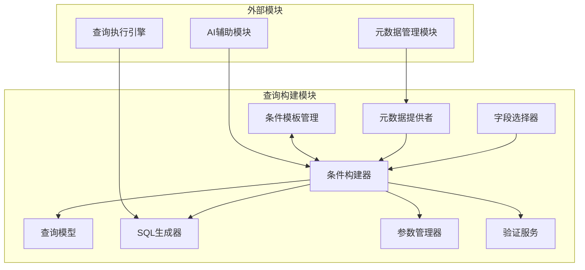
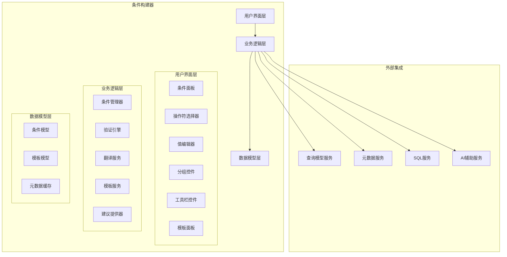
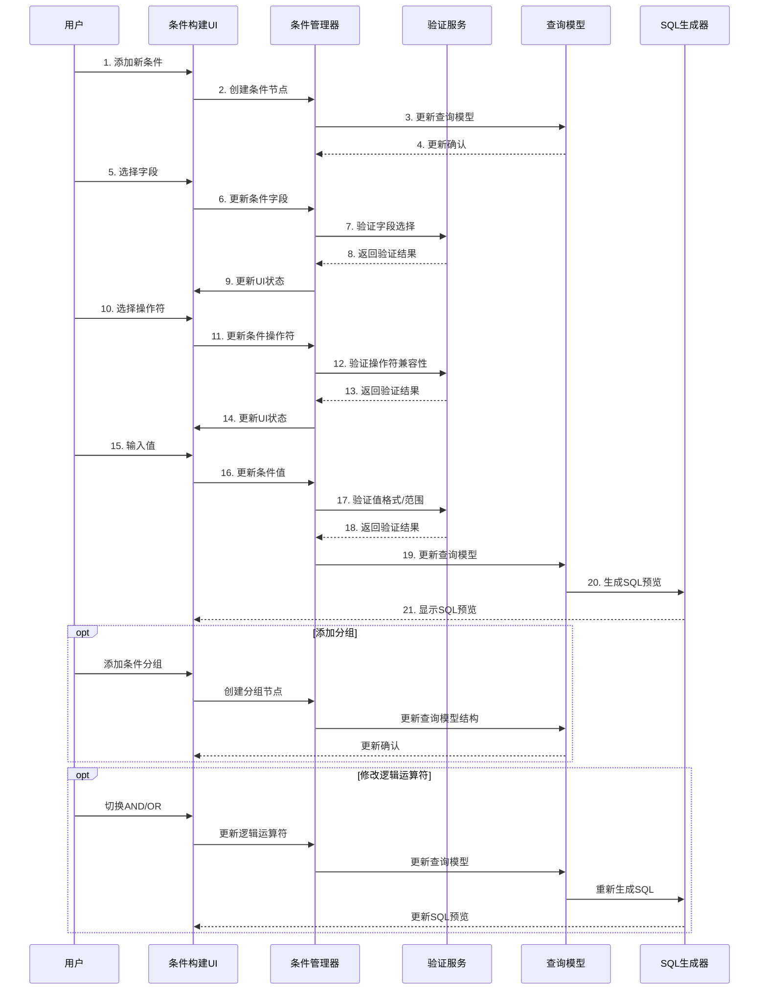

# 条件构建器设计

## 1. 组件概述

### 1.1 目的
条件构建器是查询构建模块的核心组件，旨在提供直观、灵活且功能强大的用户界面，帮助用户以可视化方式构建SQL查询中的条件表达式（WHERE子句）。它使非技术用户能够轻松创建从简单到复杂的查询条件，而无需直接编写SQL代码，同时确保生成的条件语法正确且性能优化。

### 1.2 范围
本组件负责查询条件的创建、编辑、验证、预览和持久化，支持简单条件、复合条件、分组条件、参数化条件等多种条件类型，并提供条件模板管理功能。同时，支持与查询构建器的其他组件（如字段选择器、连接面板、排序构建器等）的集成，形成完整的查询构建体验。

### 1.3 与其他组件的关系


## 2. 功能需求

### 2.1 核心功能
- **条件创建与编辑**：
  - 支持创建和编辑简单条件（字段 运算符 值）
  - 支持使用AND/OR逻辑运算符组合多个条件
  - 支持条件分组和嵌套（支持任意层级的条件嵌套）
  - 支持排序条件的优先级调整
- **条件类型支持**：
  - 比较条件（=, !=, >, <, >=, <=）
  - 范围条件（BETWEEN, NOT BETWEEN）
  - 包含条件（IN, NOT IN）
  - 模糊匹配（LIKE, NOT LIKE）
  - 空值检查（IS NULL, IS NOT NULL）
  - 存在性检查（EXISTS, NOT EXISTS）
  - 自定义SQL条件（支持高级用户输入自定义SQL片段）
- **参数化支持**：
  - 支持创建参数化条件（使用变量替代硬编码值）
  - 参数默认值定义和测试
  - 参数类型推断和验证
- **条件模板**：
  - 保存和重用常用条件模板
  - 支持个人和共享模板库
  - 模板参数化和自定义
- **辅助功能**：
  - 智能字段/值建议（基于元数据和历史使用）
  - 条件表达式验证和错误提示
  - 自然语言转条件助手（集成AI辅助）
  - 条件复制、粘贴和重置

### 2.2 非功能需求
- **可用性**：
  - 直观的拖放和点击操作
  - 适合非技术用户的界面设计
  - 清晰的视觉反馈和提示
  - 支持键盘操作和快捷键
- **性能**：
  - 支持大量条件（50+）的流畅操作
  - 条件变更实时反映到SQL预览（<100ms）
  - 复杂条件树的高效渲染
- **可扩展性**：
  - 支持自定义操作符和函数
  - 可扩展的条件类型系统
  - 数据库方言适配
- **可测试性**：
  - 条件生成结果可预览和测试
  - 支持条件调试和解释

## 3. 架构设计

### 3.1 组件架构


### 3.2 条件构建流程


### 3.3 数据模型

#### 3.3.1 条件模型
```typescript
// 条件节点基类
interface ConditionNode {
  id: string;               // 节点唯一标识
  type: 'SIMPLE' | 'GROUP'; // 节点类型：简单条件或分组
  parent?: string;          // 父节点ID
}

// 简单条件节点
interface SimpleCondition extends ConditionNode {
  type: 'SIMPLE';
  field: {                  // 字段信息
    id: string;
    name: string;
    tableName: string;
    dataType: string;
  };
  operator: {               // 操作符
    id: string;
    symbol: string;         // 如 =, >, LIKE 等
    requiresValue: boolean; // 是否需要值
    multipleValues: boolean; // 是否接受多个值（如 IN）
  };
  value: {                  // 条件值
    type: 'LITERAL' | 'PARAMETER' | 'SUBQUERY' | 'FIELD'; // 值类型
    value: any;             // 实际值或参数引用
    dataType: string;       // 值的数据类型
  } | null;                 // 对于不需要值的操作符（如IS NULL）为null
  isNegated: boolean;       // 是否对条件取反
}

// 条件分组节点
interface GroupCondition extends ConditionNode {
  type: 'GROUP';
  logicalOperator: 'AND' | 'OR'; // 组内条件的逻辑关系
  children: string[];            // 子节点ID列表
  isNegated: boolean;            // 是否对整个组取反
}

// 完整的条件树模型
interface ConditionTree {
  rootId: string;                      // 根节点ID
  nodes: Record<string, ConditionNode>; // 节点映射表
  order: string[];                     // 节点顺序（用于渲染）
}
```

#### 3.3.2 条件模板模型
```typescript
interface ConditionTemplate {
  id: string;               // 模板唯一标识
  name: string;             // 模板名称
  description: string;      // 模板描述
  conditionTree: ConditionTree; // 条件树
  parameters: Array<{       // 参数定义
    id: string;
    name: string;
    dataType: string;
    defaultValue?: any;
    required: boolean;
  }>;
  tags: string[];           // 分类标签
  createdBy: string;        // 创建者
  createdAt: string;        // 创建时间
  isPublic: boolean;        // 是否公开共享
  usage: number;            // 使用次数统计
}
```

## 4. 详细设计

### 4.1 用户界面设计

#### 4.1.1 条件面板
条件面板是条件构建器的主要交互区域，负责可视化展示和编辑条件树。

- **视觉设计**：
  - 树形结构展示条件层次关系
  - 清晰的分组边界和嵌套层次
  - 条件组件（字段、操作符、值）的视觉区分
  - 逻辑运算符的突出显示
- **交互设计**：
  - 拖放支持（调整条件顺序和分组）
  - 上下文菜单提供常用操作
  - 双击编辑、点击展开/折叠
  - 键盘快捷键支持

**界面布局**:
```
+-------------------------------------------+
| [添加条件] [添加分组] [保存模板] [更多选项] |  <- 工具栏
+-------------------------------------------+
|                                           |
| ┌─────────────────────────────────────┐   |
| │ [AND] ▼                             │   |  <- 根分组
| │                                     │   |
| │ ┌─────────────────────────────────┐ │   |
| │ │ 客户.名称 [=] [John Smith]  [×]  │ │   |  <- 简单条件
| │ └─────────────────────────────────┘ │   |
| │                                     │   |
| │ ┌─────────────────────────────────┐ │   |
| │ │ 订单.创建日期 [>] [2025-01-01] [×]│ │   |  <- 简单条件
| │ └─────────────────────────────────┘ │   |
| │                                     │   |
| │ ┌─────────────────────────────────┐ │   |
| │ │ [OR] ▼                          │ │   |  <- 嵌套分组
| │ │                                 │ │   |
| │ │ ┌─────────────────────────────┐ │ │   |
| │ │ │ 状态 [IN] [活跃,暂停]    [×] │ │ │   |  <- 嵌套条件
| │ │ └─────────────────────────────┘ │ │   |
| │ │                                 │ │   |
| │ │ ┌─────────────────────────────┐ │ │   |
| │ │ │ 类型 [=] [企业]          [×] │ │ │   |  <- 嵌套条件
| │ │ └─────────────────────────────┘ │ │   |
| │ │                                 │ │   |
| │ │ [+ 添加条件]                    │ │   |
| │ └─────────────────────────────────┘ │   |
| │                                     │   |
| │ [+ 添加条件]                        │   |
| └─────────────────────────────────────┘   |
|                                           |
+-------------------------------------------+
| WHERE customer.name = 'John Smith' AND    |  <- SQL预览
| order_date > '2025-01-01' AND            |
| (status IN ('active','paused') OR        |
|  type = 'enterprise')                     |
+-------------------------------------------+
```

#### 4.1.2 字段选择器
字段选择器允许用户浏览和选择数据源中的字段，支持搜索、过滤和最近使用记录。

- **功能特点**：
  - 树形展示数据表和字段结构
  - 搜索和过滤功能
  - 字段元数据显示（数据类型、描述等）
  - 常用/最近使用字段快速访问
  - 支持拖放到条件面板

#### 4.1.3 操作符选择器
为所选字段类型提供适当的操作符选择，确保类型兼容性。

- **主要操作符分类**：
  - 文本类：=, !=, LIKE, NOT LIKE, IN, NOT IN, IS NULL, IS NOT NULL
  - 数值类：=, !=, >, <, >=, <=, BETWEEN, NOT BETWEEN, IN, NOT IN, IS NULL, IS NOT NULL
  - 日期类：=, !=, >, <, >=, <=, BETWEEN, NOT BETWEEN, IS NULL, IS NOT NULL
  - 布尔类：=, IS NULL, IS NOT NULL
  - 自定义类：支持扩展操作符

#### 4.1.4 值编辑器
根据字段类型和选择的操作符提供适当的值输入界面。

- **输入类型**：
  - 文本输入（单行/多行）
  - 数值输入（带验证）
  - 日期/时间选择器
  - 下拉选择（枚举值）
  - 多值输入（IN条件）
  - 范围输入（BETWEEN条件）
  - 参数引用选择器
  - 子查询构建器

#### 4.1.5 模板面板
管理和应用条件模板，包括浏览、搜索、应用和保存模板功能。

- **功能特点**：
  - 模板分类和标签过滤
  - 预览模板效果
  - 模板参数化配置
  - 权限管理（私有/共享）

### 4.2 业务逻辑设计

#### 4.2.1 条件管理器
条件管理器是核心业务逻辑组件，负责创建、更新、删除和组织条件节点。

- **主要功能**：
  - 条件树的CRUD操作
  - 条件分组和嵌套管理
  - 条件序列化和反序列化
  - 与查询模型的同步

**代码示例**：
```typescript
class ConditionManager {
  private conditionTree: ConditionTree;
  private queryModelService: QueryModelService;
  private validationEngine: ValidationEngine;
  
  constructor(
    initialTree: ConditionTree | null,
    queryModelService: QueryModelService,
    validationEngine: ValidationEngine
  ) {
    this.conditionTree = initialTree || this.createDefaultTree();
    this.queryModelService = queryModelService;
    this.validationEngine = validationEngine;
  }
  
  // 创建默认的空条件树
  private createDefaultTree(): ConditionTree {
    const rootId = generateUniqueId();
    return {
      rootId,
      nodes: {
        [rootId]: {
          id: rootId,
          type: 'GROUP',
          logicalOperator: 'AND',
          children: [],
          isNegated: false
        }
      },
      order: [rootId]
    };
  }
  
  // 添加简单条件
  public addSimpleCondition(
    parentId: string, 
    field?: FieldMetadata,
    operator?: OperatorInfo,
    value?: any
  ): string {
    // 创建新条件节点
    const conditionId = generateUniqueId();
    const newCondition: SimpleCondition = {
      id: conditionId,
      type: 'SIMPLE',
      parent: parentId,
      field: field || null,
      operator: operator || null,
      value: value || null,
      isNegated: false
    };
    
    // 更新条件树
    this.conditionTree.nodes[conditionId] = newCondition;
    
    // 更新父节点
    const parentNode = this.conditionTree.nodes[parentId] as GroupCondition;
    parentNode.children.push(conditionId);
    
    // 更新节点顺序
    this.updateNodeOrder();
    
    // 同步到查询模型
    this.syncWithQueryModel();
    
    return conditionId;
  }
  
  // 添加条件分组
  public addGroup(
    parentId: string,
    logicalOperator: 'AND' | 'OR' = 'AND'
  ): string {
    // 创建新分组节点
    const groupId = generateUniqueId();
    const newGroup: GroupCondition = {
      id: groupId,
      type: 'GROUP',
      parent: parentId,
      logicalOperator,
      children: [],
      isNegated: false
    };
    
    // 更新条件树
    this.conditionTree.nodes[groupId] = newGroup;
    
    // 更新父节点
    const parentNode = this.conditionTree.nodes[parentId] as GroupCondition;
    parentNode.children.push(groupId);
    
    // 更新节点顺序
    this.updateNodeOrder();
    
    // 同步到查询模型
    this.syncWithQueryModel();
    
    return groupId;
  }
  
  // 更新简单条件
  public updateSimpleCondition(
    conditionId: string,
    updates: Partial<SimpleCondition>
  ): void {
    const condition = this.conditionTree.nodes[conditionId] as SimpleCondition;
    
    // 应用更新
    Object.assign(condition, updates);
    
    // 验证更新
    const validationResult = this.validationEngine.validateCondition(condition);
    
    // 同步到查询模型
    this.syncWithQueryModel();
    
    return validationResult;
  }
  
  // 更新分组
  public updateGroup(
    groupId: string,
    updates: Partial<GroupCondition>
  ): void {
    const group = this.conditionTree.nodes[groupId] as GroupCondition;
    
    // 应用更新
    Object.assign(group, updates);
    
    // 同步到查询模型
    this.syncWithQueryModel();
  }
  
  // 删除条件或分组
  public deleteNode(nodeId: string): void {
    const node = this.conditionTree.nodes[nodeId];
    
    // 不能删除根节点
    if (nodeId === this.conditionTree.rootId) {
      throw new Error("Cannot delete root node");
    }
    
    // 从父节点中移除
    const parentNode = this.conditionTree.nodes[node.parent] as GroupCondition;
    const childIndex = parentNode.children.indexOf(nodeId);
    if (childIndex !== -1) {
      parentNode.children.splice(childIndex, 1);
    }
    
    // 如果是分组，需要递归删除所有子节点
    if (node.type === 'GROUP') {
      this.recursiveDeleteChildren(nodeId);
    }
    
    // 从节点映射中移除
    delete this.conditionTree.nodes[nodeId];
    
    // 更新节点顺序
    this.updateNodeOrder();
    
    // 同步到查询模型
    this.syncWithQueryModel();
  }
  
  // 递归删除子节点
  private recursiveDeleteChildren(groupId: string): void {
    const group = this.conditionTree.nodes[groupId] as GroupCondition;
    
    // 复制子节点数组，避免在迭代过程中修改
    const children = [...group.children];
    
    for (const childId of children) {
      const child = this.conditionTree.nodes[childId];
      
      if (child.type === 'GROUP') {
        this.recursiveDeleteChildren(childId);
      }
      
      delete this.conditionTree.nodes[childId];
    }
    
    // 清空子节点列表
    group.children = [];
  }
  
  // 更新节点顺序（用于UI渲染）
  private updateNodeOrder(): void {
    // 通过深度优先遍历重建节点顺序
    this.conditionTree.order = this.depthFirstTraversal(this.conditionTree.rootId);
  }
  
  // 深度优先遍历获取节点顺序
  private depthFirstTraversal(nodeId: string): string[] {
    const result = [nodeId];
    const node = this.conditionTree.nodes[nodeId];
    
    if (node.type === 'GROUP') {
      const group = node as GroupCondition;
      for (const childId of group.children) {
        result.push(...this.depthFirstTraversal(childId));
      }
    }
    
    return result;
  }
  
  // 同步到查询模型
  private syncWithQueryModel(): void {
    this.queryModelService.updateConditions(this.conditionTree);
  }
  
  // 获取当前条件树
  public getConditionTree(): ConditionTree {
    return this.conditionTree;
  }
  
  // 设置条件树（用于加载保存的查询或应用模板）
  public setConditionTree(tree: ConditionTree): void {
    this.conditionTree = tree;
    this.syncWithQueryModel();
  }
}
```

#### 4.2.2 验证引擎
验证引擎负责验证条件的语法、语义和性能，确保生成的条件是有效且高效的。

- **验证类型**：
  - 字段-操作符兼容性检查
  - 值类型和格式验证
  - 条件结构和逻辑验证
  - 潜在性能问题检测
- **错误处理**：
  - 错误分类（语法错误、逻辑错误等）
  - 错误位置标记
  - 改进建议提供

**验证规则示例**：
```typescript
// 验证规则接口
interface ValidationRule {
  validate(node: ConditionNode, context: ValidationContext): ValidationResult;
}

// 字段-操作符兼容性规则
class OperatorCompatibilityRule implements ValidationRule {
  validate(node: ConditionNode, context: ValidationContext): ValidationResult {
    if (node.type !== 'SIMPLE') return { isValid: true };
    
    const condition = node as SimpleCondition;
    if (!condition.field || !condition.operator) {
      return { isValid: false, errorType: 'INCOMPLETE', message: '字段或操作符未设置' };
    }
    
    // 检查字段类型和操作符的兼容性
    const fieldType = condition.field.dataType;
    const operatorId = condition.operator.id;
    
    const isCompatible = context.operatorRegistry.isCompatible(operatorId, fieldType);
    
    if (!isCompatible) {
      return {
        isValid: false,
        errorType: 'TYPE_MISMATCH',
        message: `操作符 "${condition.operator.symbol}" 不适用于 ${fieldType} 类型字段`,
        suggestion: '请选择兼容的操作符'
      };
    }
    
    return { isValid: true };
  }
}

// 值验证规则
class ValueValidationRule implements ValidationRule {
  validate(node: ConditionNode, context: ValidationContext): ValidationResult {
    if (node.type !== 'SIMPLE') return { isValid: true };
    
    const condition = node as SimpleCondition;
    if (!condition.operator) return { isValid: true };
    
    // 检查是否需要值但值为空
    if (condition.operator.requiresValue && !condition.value) {
      return {
        isValid: false,
        errorType: 'MISSING_VALUE',
        message: '此操作符需要一个值'
      };
    }
    
    // 检查值是否为正确类型
    if (condition.value && condition.field) {
      const isTypeValid = context.typeValidator.validateValueType(
        condition.value,
        condition.field.dataType
      );
      
      if (!isTypeValid) {
        return {
          isValid: false,
          errorType: 'VALUE_TYPE_ERROR',
          message: `值类型与字段类型不匹配`
        };
      }
    }
    
    return { isValid: true };
  }
}
```

#### 4.2.3 翻译服务
翻译服务负责将条件树转换为SQL条件语句，并提供转换过程的调试信息。

- **主要职责**：
  - 条件树到SQL的转换
  - 支持不同SQL方言
  - 处理特殊操作符和函数转换
  - 参数化查询支持

**SQL生成示例**：
```typescript
class SQLTranslationService {
  private dialectProvider: SQLDialectProvider;
  
  constructor(dialectProvider: SQLDialectProvider) {
    this.dialectProvider = dialectProvider;
  }
  
  // 将条件树转换为SQL WHERE子句
  public translateToSQL(
    conditionTree: ConditionTree, 
    parameters?: Record<string, any>
  ): SQLTranslationResult {
    const context: TranslationContext = {
      dialect: this.dialectProvider.getCurrentDialect(),
      parameters: parameters || {},
      parameterIndex: 1,
      errors: []
    };
    
    try {
      // 从根节点开始转换
      const sqlCondition = this.translateNode(
        conditionTree.nodes[conditionTree.rootId],
        conditionTree.nodes,
        context
      );
      
      return {
        sql: sqlCondition ? `WHERE ${sqlCondition}` : '',
        parameters: context.parameters,
        parameterNames: Object.keys(context.parameters),
        errors: context.errors
      };
    } catch (error) {
      return {
        sql: '',
        parameters: {},
        parameterNames: [],
        errors: [{
          message: error.message,
          nodeId: null,
          severity: 'ERROR'
        }]
      };
    }
  }
  
  // 递归转换节点
  private translateNode(
    node: ConditionNode,
    allNodes: Record<string, ConditionNode>,
    context: TranslationContext
  ): string {
    if (node.type === 'SIMPLE') {
      return this.translateSimpleCondition(node as SimpleCondition, context);
    } else {
      return this.translateGroupCondition(node as GroupCondition, allNodes, context);
    }
  }
  
  // 转换简单条件
  private translateSimpleCondition(
    condition: SimpleCondition,
    context: TranslationContext
  ): string {
    // 检查条件是否完整
    if (!condition.field || !condition.operator) {
      context.errors.push({
        message: '条件不完整',
        nodeId: condition.id,
        severity: 'ERROR'
      });
      return '';
    }
    
    // 获取字段标识符
    const fieldIdentifier = this.getFieldIdentifier(condition.field, context);
    
    // 特殊处理不需要值的操作符（如 IS NULL）
    if (!condition.operator.requiresValue) {
      const operatorSQL = context.dialect.getOperatorSyntax(condition.operator.id);
      return `${fieldIdentifier} ${operatorSQL}`;
    }
    
    // 检查值是否存在
    if (!condition.value) {
      context.errors.push({
        message: '缺少条件值',
        nodeId: condition.id,
        severity: 'ERROR'
      });
      return '';
    }
    
    // 基于值类型生成SQL
    let valueSQL = '';
    
    switch(condition.value.type) {
      case 'LITERAL':
        valueSQL = this.formatLiteralValue(
          condition.value.value, 
          condition.value.dataType, 
          context
        );
        break;
      
      case 'PARAMETER':
        valueSQL = this.formatParameterReference(
          condition.value.value,
          context
        );
        break;
      
      case 'FIELD':
        valueSQL = this.getFieldIdentifier(condition.value.value, context);
        break;
      
      case 'SUBQUERY':
        valueSQL = `(${condition.value.value})`;
        break;
    }
    
    // 获取操作符SQL表示
    const operatorSQL = context.dialect.getOperatorSyntax(condition.operator.id);
    
    // 组合完整的条件表达式
    let conditionSQL = `${fieldIdentifier} ${operatorSQL} ${valueSQL}`;
    
    // 处理条件取反
    if (condition.isNegated) {
      conditionSQL = `NOT (${conditionSQL})`;
    }
    
    return conditionSQL;
  }
  
  // 转换分组条件
  private translateGroupCondition(
    group: GroupCondition,
    allNodes: Record<string, ConditionNode>,
    context: TranslationContext
  ): string {
    // 空组返回空字符串
    if (group.children.length === 0) {
      return '';
    }
    
    // 转换所有子节点
    const childConditions = group.children.map(childId => {
      const childNode = allNodes[childId];
      return this.translateNode(childNode, allNodes, context);
    }).filter(sql => sql !== ''); // 过滤掉空结果
    
    // 如果没有有效子条件，返回空字符串
    if (childConditions.length === 0) {
      return '';
    }
    
    // 只有一个子条件，不需要括号
    if (childConditions.length === 1) {
      let result = childConditions[0];
      
      // 处理分组取反
      if (group.isNegated) {
        result = `NOT (${result})`;
      }
      
      return result;
    }
    
    // 使用适当的逻辑运算符连接子条件
    const joinOperator = group.logicalOperator;
    let groupSQL = childConditions.join(` ${joinOperator} `);
    
    // 添加括号确保正确的操作符优先级
    groupSQL = `(${groupSQL})`;
    
    // 处理分组取反
    if (group.isNegated) {
      groupSQL = `NOT ${groupSQL}`;
    }
    
    return groupSQL;
  }
  
  // 辅助方法...
}
```

#### 4.2.4 模板服务
模板服务管理条件模板的保存、加载和应用，支持参数化和模板继承。

- **主要功能**：
  - 模板CRUD操作
  - 模板参数解析和替换
  - 用户权限检查
  - 模板版本管理

**模板应用逻辑**：
```typescript
class TemplateService {
  private repository: TemplateRepository;
  private conditionManager: ConditionManager;
  
  constructor(repository: TemplateRepository, conditionManager: ConditionManager) {
    this.repository = repository;
    this.conditionManager = conditionManager;
  }
  
  // 保存当前条件为模板
  public async saveAsTemplate(
    name: string,
    description: string,
    isPublic: boolean,
    tags: string[] = [],
    userId: string
  ): Promise<ConditionTemplate> {
    // 获取当前条件树
    const currentTree = this.conditionManager.getConditionTree();
    
    // 提取条件中使用的参数
    const parameters = this.extractParametersFromTree(currentTree);
    
    // 创建模板对象
    const template: ConditionTemplate = {
      id: generateUniqueId(),
      name,
      description,
      conditionTree: JSON.parse(JSON.stringify(currentTree)), // 深拷贝
      parameters,
      tags,
      createdBy: userId,
      createdAt: new Date().toISOString(),
      isPublic,
      usage: 0
    };
    
    // 保存模板
    return this.repository.saveTemplate(template);
  }
  
  // 应用模板到当前条件
  public async applyTemplate(
    templateId: string,
    parameterValues?: Record<string, any>
  ): Promise<void> {
    // 加载模板
    const template = await this.repository.getTemplateById(templateId);
    
    if (!template) {
      throw new Error(`Template not found: ${templateId}`);
    }
    
    // 检查必填参数
    this.validateRequiredParameters(template, parameterValues);
    
    // 创建模板树的副本
    const treeClone = JSON.parse(JSON.stringify(template.conditionTree));
    
    // 应用参数值
    if (parameterValues) {
      this.applyParameterValues(treeClone, parameterValues);
    }
    
    // 更新使用计数
    this.repository.incrementTemplateUsage(templateId);
    
    // 应用到条件管理器
    this.conditionManager.setConditionTree(treeClone);
  }
  
  // 从条件树中提取参数
  private extractParametersFromTree(tree: ConditionTree): TemplateParameter[] {
    const parameters: TemplateParameter[] = [];
    const parameterMap = new Map<string, boolean>();
    
    // 遍历所有节点寻找参数引用
    for (const nodeId in tree.nodes) {
      const node = tree.nodes[nodeId];
      
      if (node.type === 'SIMPLE') {
        const condition = node as SimpleCondition;
        
        if (condition.value && condition.value.type === 'PARAMETER') {
          const paramName = condition.value.value;
          
          if (!parameterMap.has(paramName)) {
            parameterMap.set(paramName, true);
            
            parameters.push({
              id: generateUniqueId(),
              name: paramName,
              dataType: condition.field.dataType,
              required: true,
              defaultValue: null
            });
          }
        }
      }
    }
    
    return parameters;
  }
  
  // 验证必填参数
  private validateRequiredParameters(
    template: ConditionTemplate,
    parameterValues?: Record<string, any>
  ): void {
    if (!parameterValues) parameterValues = {};
    
    for (const param of template.parameters) {
      if (param.required && 
          !parameterValues.hasOwnProperty(param.name) && 
          param.defaultValue === null) {
        throw new Error(`Required parameter not provided: ${param.name}`);
      }
    }
  }
  
  // 应用参数值到条件树
  private applyParameterValues(
    tree: ConditionTree,
    parameterValues: Record<string, any>
  ): void {
    // 遍历所有节点替换参数引用
    for (const nodeId in tree.nodes) {
      const node = tree.nodes[nodeId];
      
      if (node.type === 'SIMPLE') {
        const condition = node as SimpleCondition;
        
        if (condition.value && condition.value.type === 'PARAMETER') {
          const paramName = condition.value.value;
          
          if (parameterValues.hasOwnProperty(paramName)) {
            // 替换为字面值
            condition.value = {
              type: 'LITERAL',
              value: parameterValues[paramName],
              dataType: condition.value.dataType
            };
          }
        }
      }
    }
  }
  
  // 其他方法...
}
```

#### 4.2.5 建议提供器
建议提供器为用户提供智能建议，包括字段建议、值建议和条件模板建议，提高用户效率。

- **建议类型**：
  - 基于上下文的字段建议
  - 基于字段的值建议（从历史数据或元数据获取）
  - 基于当前查询的条件模板建议
  - 自然语言到条件的转换建议（集成AI）

**智能建议实现**：
```typescript
class SuggestionProvider {
  private metadataService: MetadataService;
  private templateService: TemplateService;
  private aiService: AIAssistantService;
  private usageAnalytics: UsageAnalyticsService;
  
  constructor(
    metadataService: MetadataService,
    templateService: TemplateService,
    aiService: AIAssistantService,
    usageAnalytics: UsageAnalyticsService
  ) {
    this.metadataService = metadataService;
    this.templateService = templateService;
    this.aiService = aiService;
    this.usageAnalytics = usageAnalytics;
  }
  
  // 获取字段建议
  public async getFieldSuggestions(
    query: string,
    context: FieldSuggestionContext
  ): Promise<FieldSuggestion[]> {
    // 结合多种来源的建议
    const suggestions: FieldSuggestion[] = [];
    
    // 1. 从元数据获取匹配字段
    const metadataFields = await this.metadataService.searchFields(
      query,
      context.selectedTables,
      { limit: 20 }
    );
    
    suggestions.push(...metadataFields.map(field => ({
      field,
      source: 'METADATA',
      score: this.calculateFieldRelevance(field, query, context)
    })));
    
    // 2. 从使用历史获取常用字段
    if (context.includeHistory) {
      const historicalFields = await this.usageAnalytics.getRecentlyUsedFields(
        context.userId,
        context.selectedTables,
        { limit: 10 }
      );
      
      suggestions.push(...historicalFields.map(usage => ({
        field: usage.field,
        source: 'HISTORY',
        score: usage.frequency * 0.8, // 降低历史权重
        lastUsed: usage.lastUsed
      })));
    }
    
    // 3. 从当前查询上下文智能推荐
    if (context.currentConditions && context.currentConditions.length > 0) {
      const contextualFields = await this.getContextualFieldSuggestions(
        context.currentConditions,
        context.selectedTables
      );
      
      suggestions.push(...contextualFields.map(suggestion => ({
        ...suggestion,
        source: 'CONTEXT'
      })));
    }
    
    // 合并、去重和排序建议
    return this.mergeAndRankSuggestions(suggestions);
  }
  
  // 获取值建议
  public async getValueSuggestions(
    field: FieldMetadata,
    query: string,
    context: ValueSuggestionContext
  ): Promise<ValueSuggestion[]> {
    const suggestions: ValueSuggestion[] = [];
    
    // 1. 如果字段有枚举值，直接使用
    if (field.enumValues && field.enumValues.length > 0) {
      const matchingEnums = field.enumValues.filter(
        value => value.toString().toLowerCase().includes(query.toLowerCase())
      );
      
      suggestions.push(...matchingEnums.map(value => ({
        value,
        displayText: value.toString(),
        source: 'ENUM',
        score: 1.0
      })));
    }
    
    // 2. 从样本数据获取常见值
    const sampleValues = await this.metadataService.getSampleValues(
      field.id,
      query,
      { limit: 10 }
    );
    
    suggestions.push(...sampleValues.map(sample => ({
      value: sample.value,
      displayText: sample.value.toString(),
      source: 'SAMPLE',
      score: sample.frequency,
      count: sample.count
    })));
    
    // 3. 从使用历史获取常用值
    if (context.includeHistory) {
      const historicalValues = await this.usageAnalytics.getRecentlyUsedValues(
        field.id,
        context.userId,
        { limit: 10 }
      );
      
      suggestions.push(...historicalValues.map(usage => ({
        value: usage.value,
        displayText: usage.value.toString(),
        source: 'HISTORY',
        score: usage.frequency * 0.7,
        lastUsed: usage.lastUsed
      })));
    }
    
    // 4. 对于特殊字段类型的智能建议
    if (field.dataType === 'DATE' || field.dataType === 'TIMESTAMP') {
      suggestions.push(...this.getDateValueSuggestions(query));
    }
    
    // 合并、去重和排序建议
    return this.mergeAndRankValueSuggestions(suggestions);
  }
  
  // 获取模板建议
  public async getTemplateSuggestions(
    currentConditions: ConditionTree,
    context: TemplateSuggestionContext
  ): Promise<TemplateSuggestion[]> {
    // 获取与当前条件结构相似的模板
    const similarTemplates = await this.templateService.findSimilarTemplates(
      currentConditions,
      {
        limit: 5,
        userId: context.userId,
        includePublic: true,
        minSimilarity: 0.6
      }
    );
    
    // 如果当前条件为空，建议最常用的模板
    if (!currentConditions || Object.keys(currentConditions.nodes).length <= 1) {
      const popularTemplates = await this.templateService.getPopularTemplates({
        limit: 5,
        userId: context.userId,
        includePublic: true
      });
      
      return popularTemplates.map(template => ({
        template,
        source: 'POPULAR',
        score: template.usage / 100, // 归一化分数
        matchedFields: []
      }));
    }
    
    return similarTemplates.map(match => ({
      template: match.template,
      source: 'SIMILAR',
      score: match.similarity,
      matchedFields: match.matchedFields
    }));
  }
  
  // 从自然语言获取条件建议
  public async getConditionSuggestionsFromText(
    text: string,
    context: NLSuggestionContext
  ): Promise<ConditionSuggestion[]> {
    // 使用AI助手服务转换自然语言为条件结构
    const aiSuggestions = await this.aiService.textToConditions(
      text,
      {
        availableTables: context.availableTables,
        availableFields: context.availableFields,
        maxResults: 3
      }
    );
    
    return aiSuggestions.map(suggestion => ({
      conditionTree: suggestion.conditionTree,
      confidence: suggestion.confidence,
      highlightedText: suggestion.highlightedText,
      explanation: suggestion.explanation
    }));
  }
  
  // 其他辅助方法...
}
```

### 4.3 数据模型设计

#### 4.3.1 条件模型设计
条件模型采用组合模式设计，使用树形结构表示复杂的条件层次，便于递归处理和转换。

- **设计特点**：
  - 清晰的类型区分（简单条件 vs. 分组）
  - 统一的节点接口（id和类型）
  - 引用关系使用ID而非对象引用（便于序列化）
  - 支持嵌套和递归操作

#### 4.3.2 序列化与存储
条件树需要能够序列化为JSON格式进行存储和传输，同时支持反序列化恢复条件结构。

- **设计考量**：
  - JSON兼容性（避免循环引用）
  - 版本控制（支持模型升级）
  - 存储优化（减少冗余数据）
  - 兼容性策略（优雅处理未知属性）

**序列化实现**：
```typescript
class ConditionSerializer {
  // 序列化条件树
  public serialize(tree: ConditionTree): string {
    // 添加版本信息
    const serializableTree = {
      version: '1.0',
      meta: {
        createdAt: new Date().toISOString()
      },
      data: tree
    };
    
    return JSON.stringify(serializableTree);
  }
  
  // 反序列化条件树
  public deserialize(jsonString: string): ConditionTree {
    const parsed = JSON.parse(jsonString);
    
    // 验证版本兼容性
    if (!parsed.version || !this.isVersionCompatible(parsed.version)) {
      throw new Error(`Unsupported condition tree version: ${parsed.version}`);
    }
    
    // 处理版本差异
    const migrated = this.migrateIfNeeded(parsed);
    
    // 验证数据结构
    this.validateStructure(migrated.data);
    
    return migrated.data;
  }
  
  // 检查版本兼容性
  private isVersionCompatible(version: string): boolean {
    const currentVersion = [1, 0]; // 当前支持的版本
    const parsedVersion = version.split('.').map(Number);
    
    // 主版本必须匹配
    return parsedVersion[0] === currentVersion[0];
  }
  
  // 迁移旧版本数据到当前版本
  private migrateIfNeeded(parsed: any): any {
    const version = parsed.version;
    
    // 无需迁移的情况
    if (version === '1.0') {
      return parsed;
    }
    
    // 版本0.9升级到1.0
    if (version === '0.9') {
      return this.migrateFrom09To10(parsed);
    }
    
    // 其他版本迁移...
    
    throw new Error(`No migration path from version ${version} to 1.0`);
  }
  
  // 从0.9版本迁移到1.0
  private migrateFrom09To10(parsed: any): any {
    // 复制原数据
    const migrated = { ...parsed, version: '1.0' };
    
    // 处理数据结构变化
    // 例如: 在0.9中字段可能没有tableName属性
    for (const nodeId in migrated.data.nodes) {
      const node = migrated.data.nodes[nodeId];
      
      if (node.type === 'SIMPLE' && node.field) {
        if (!node.field.tableName) {
          node.field.tableName = '';
        }
      }
    }
    
    return migrated;
  }
  
  // 验证数据结构
  private validateStructure(tree: any): void {
    // 检查必要的属性
    if (!tree.rootId || !tree.nodes || typeof tree.nodes !== 'object') {
      throw new Error('Invalid condition tree structure');
    }
    
    // 检查根节点存在
    if (!tree.nodes[tree.rootId]) {
      throw new Error('Root node not found in nodes map');
    }
    
    // 检查节点引用完整性
    for (const nodeId in tree.nodes) {
      const node = tree.nodes[nodeId];
      
      // 检查节点必要属性
      if (!node.id || !node.type) {
        throw new Error(`Node ${nodeId} missing required properties`);
      }
      
      // 检查ID一致性
      if (node.id !== nodeId) {
        throw new Error(`Node ID mismatch: ${node.id} vs ${nodeId}`);
      }
      
      // 检查分组节点的子节点引用
      if (node.type === 'GROUP') {
        for (const childId of node.children) {
          if (!tree.nodes[childId]) {
            throw new Error(`Group ${nodeId} references non-existent child ${childId}`);
          }
        }
      }
      
      // 检查父节点引用
      if (node.parent && !tree.nodes[node.parent]) {
        throw new Error(`Node ${nodeId} references non-existent parent ${node.parent}`);
      }
    }
  }
}
```

#### 4.3.3 参数化模型
参数化模型支持动态条件，允许在运行时替换条件中的参数值。

- **设计特点**：
  - 参数类型与字段类型匹配
  - 支持默认值和必填标记
  - 参数引用的唯一标识
  - 运行时参数解析和替换机制

## 5. 接口设计

### 5.1 前端组件接口

#### 5.1.1 条件构建器组件
```typescript
interface ConditionBuilderProps {
  // 初始条件树，可选
  initialConditionTree?: ConditionTree;
  
  // 可用的数据源和字段
  availableTables: TableMetadata[];
  
  // 条件变更事件处理
  onChange?: (conditionTree: ConditionTree) => void;
  
  // SQL预览变更事件
  onSQLChange?: (sql: string, parameters: Record<string, any>) => void;
  
  // 条件验证事件
  onValidation?: (validationResults: ValidationResult[]) => void;
  
  // 模式和配置选项
  options?: {
    allowCustomSQL?: boolean;          // 是否允许自定义SQL
    maxNestedLevel?: number;           // 最大嵌套层级
    defaultLogicalOperator?: 'AND' | 'OR'; // 默认逻辑操作符
    showSQLPreview?: boolean;          // 是否显示SQL预览
    sqlDialect?: string;               // SQL方言
  };
  
  // 组件模式
  mode?: 'standard' | 'compact' | 'readonly';
  
  // 样式和主题
  className?: string;
  style?: React.CSSProperties;
  theme?: 'light' | 'dark' | 'auto';
}
```

#### 5.1.2 条件节点组件
```typescript
interface ConditionNodeProps {
  // 节点ID
  nodeId: string;
  
  // 节点级别（用于缩进和样式）
  level: number;
  
  // 是否为最后一个子节点
  isLast: boolean;
  
  // 是否处于拖动状态
  isDragging: boolean;
  
  // 节点操作事件
  onDelete: (nodeId: string) => void;
  onAddCondition: (parentId: string) => void;
  onAddGroup: (parentId: string) => void;
  
  // 拖拽事件处理
  onDragStart: (nodeId: string) => void;
  onDragOver: (nodeId: string) => void;
  onDrop: (sourceId: string, targetId: string) => void;
}
```

#### 5.1.3 操作符选择器组件
```typescript
interface OperatorSelectorProps {
  // 当前字段
  field: FieldMetadata;
  
  // 当前选中的操作符
  selectedOperator?: OperatorInfo;
  
  // 操作符变更处理
  onChange: (operator: OperatorInfo) => void;
  
  // 禁用特定操作符
  disabledOperators?: string[];
  
  // 组件尺寸
  size?: 'small' | 'medium' | 'large';
}
```

### 5.2 内部服务接口

#### 5.2.1 条件管理服务
```typescript
interface ConditionManagerService {
  // 获取当前条件树
  getConditionTree(): ConditionTree;
  
  // 设置完整条件树
  setConditionTree(tree: ConditionTree): void;
  
  // 添加简单条件
  addSimpleCondition(
    parentId: string,
    field?: FieldMetadata,
    operator?: OperatorInfo,
    value?: any
  ): string;
  
  // 添加条件分组
  addGroup(
    parentId: string,
    logicalOperator?: 'AND' | 'OR'
  ): string;
  
  // 更新条件
  updateCondition(
    conditionId: string,
    updates: Partial<SimpleCondition>
  ): ValidationResult;
  
  // 更新分组
  updateGroup(
    groupId: string,
    updates: Partial<GroupCondition>
  ): void;
  
  // 删除节点
  deleteNode(nodeId: string): void;
  
  // 移动节点
  moveNode(
    nodeId: string,
    newParentId: string,
    position?: number
  ): void;
  
  // 复制节点
  copyNode(
    nodeId: string,
    newParentId: string
  ): string;
  
  // 条件验证
  validateTree(): ValidationResult[];
  
  // 转换为SQL
  toSQL(dialect?: string): SQLResult;
  
  // 注册变更监听器
  onChange(callback: (tree: ConditionTree) => void): () => void;
}
```

#### 5.2.2 模板管理服务
```typescript
interface TemplateService {
  // 获取模板列表
  getTemplates(options?: {
    userId?: string;
    includePublic?: boolean;
    tags?: string[];
    search?: string;
    limit?: number;
    offset?: number;
  }): Promise<{
    templates: ConditionTemplate[];
    total: number;
  }>;
  
  // 获取单个模板
  getTemplateById(id: string): Promise<ConditionTemplate>;
  
  // 保存模板
  saveTemplate(template: ConditionTemplate): Promise<ConditionTemplate>;
  
  // 更新模板
  updateTemplate(
    id: string,
    updates: Partial<ConditionTemplate>
  ): Promise<ConditionTemplate>;
  
  // 删除模板
  deleteTemplate(id: string): Promise<boolean>;
  
  // 应用模板到条件树
  applyTemplate(
    templateId: string,
    parameters?: Record<string, any>
  ): Promise<ConditionTree>;
  
  // 查找相似模板
  findSimilarTemplates(
    conditionTree: ConditionTree,
    options?: {
      limit?: number;
      userId?: string;
      includePublic?: boolean;
      minSimilarity?: number;
    }
  ): Promise<Array<{
    template: ConditionTemplate;
    similarity: number;
    matchedFields: string[];
  }>>;
}
```

### 5.3 外部集成接口

#### 5.3.1 查询构建模块集成
```typescript
interface QueryBuilderIntegration {
  // 更新查询模型中的条件部分
  updateQueryConditions(conditionTree: ConditionTree): void;
  
  // 从查询模型中获取条件部分
  getQueryConditions(): ConditionTree;
  
  // 注册条件变更监听器
  onConditionsChange(
    callback: (conditionTree: ConditionTree) => void
  ): () => void;
  
  // 获取查询上下文信息（选中的表等）
  getQueryContext(): QueryContext;
  
  // 更新SQL预览
  updateSQLPreview(sql: string, section: 'WHERE'): void;
}
```

#### 5.3.2 AI辅助集成
```typescript
interface AIAssistantIntegration {
  // 自然语言转条件
  textToConditions(
    text: string,
    context: {
      availableTables: TableMetadata[];
      availableFields: FieldMetadata[];
      existingConditions?: ConditionTree;
      maxResults?: number;
    }
  ): Promise<Array<{
    conditionTree: ConditionTree;
    confidence: number;
    highlightedText: string;
    explanation: string;
  }>>;
  
  // 条件优化建议
  getConditionOptimizationSuggestions(
    conditionTree: ConditionTree
  ): Promise<Array<{
    suggestion: string;
    impact: 'PERFORMANCE' | 'READABILITY' | 'CORRECTNESS';
    severity: 'HIGH' | 'MEDIUM' | 'LOW';
    optimizedTree?: ConditionTree;
  }>>;
  
  // 条件解释
  explainCondition(
    conditionTree: ConditionTree
  ): Promise<string>;
}
```

## 6. 技术选型

### 6.1 前端技术
- **框架**: React 18+ (TypeScript)
- **状态管理**: React Context API + Hooks
- **UI组件库**: Ant Design / Material-UI
- **拖放实现**: react-dnd
- **表单处理**: Formik / React Hook Form
- **代码编辑器**: Monaco Editor (用于自定义SQL)

### 6.2 核心库
- **SQL解析与生成**: sql-formatter, sqlparser
- **数据验证**: Joi / Yup
- **日期处理**: date-fns / Luxon
- **树形结构操作**: immer (不可变数据处理)
- **序列化**: JSON + 自定义序列化处理

### 6.3 性能优化
- **虚拟滚动**: react-window (处理大量条件)
- **组件记忆化**: React.memo, useMemo, useCallback
- **延迟加载**: 动态导入和代码分割
- **计算缓存**: reselect / useMemoizedSelector

## 7. 安全设计

### 7.1 SQL注入防护
- 使用参数化查询而非字符串拼接
- 输入验证和过滤
- 限制自定义SQL的使用范围和权限

### 7.2 数据安全
- 权限控制：限制可见字段和可操作范围
- 敏感数据处理：掩码和限制显示
- 审计跟踪：记录条件变更和使用情况

### 7.3 错误处理
- 友好的错误提示
- 防止错误信息泄露敏感信息
- 弹性设计：部分错误不影响整体功能

## 8. 测试策略

### 8.1 单元测试
- 组件渲染测试
- 条件模型操作测试
- SQL生成测试
- 验证逻辑测试
- 参数处理测试

### 8.2 集成测试
- 条件构建流程测试
- 与查询构建器集成测试
- API交互测试
- 模板应用测试

### 8.3 UI/UX测试
- 可用性测试
- 性能测试
- 响应式设计测试
- 无障碍性测试

## 9. 部署与集成

### 9.1 打包与分发
- 模块化打包，支持按需加载
- 独立样式和主题支持
- 多环境配置

### 9.2 集成方式
- 作为查询构建器子模块集成
- 可独立使用的条件构建器组件
- 支持在不同容器中使用

## 10. 未来扩展

### 10.1 功能扩展
- **高级条件类型**：
  - 时间窗口条件
  - 地理空间条件
  - 统计条件
  - 复杂正则表达式支持
- **增强的模板系统**：
  - 模板继承和组合
  - 模板参数的高级验证
  - 条件片段库
- **AI辅助增强**：
  - 自然语言对话式条件构建
  - 条件优化建议
  - 上下文感知建议

### 10.2 集成扩展
- **数据可视化集成**：条件与可视化联动
- **数据血缘分析**：跟踪条件影响范围
- **ETL流程集成**：作为数据过滤条件
- **自定义函数注册**：支持调用用户自定义函数