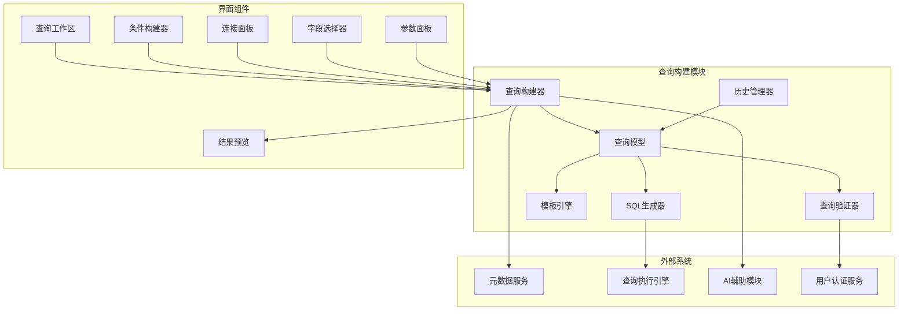
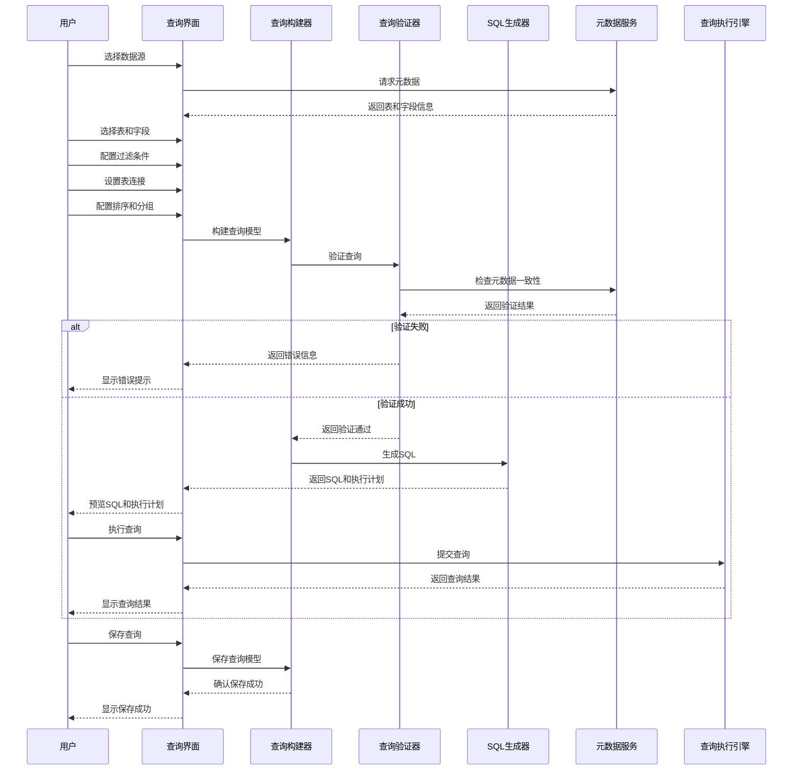

# 查询构建模块概述

## 1. 模块简介

### 1.1 目的
查询构建模块旨在提供直观、灵活且强大的查询设计体验，使不同技术水平的用户都能高效构建复杂查询，包括可视化界面和编程接口，降低数据分析门槛，同时确保查询的正确性和性能。

### 1.2 范围
查询构建模块涵盖查询模型定义、交互式查询设计器、查询验证引擎、模板管理、参数化查询支持、可视化组件和SQL生成器等核心功能，支持从简单过滤到复杂多表关联的全方位查询构建需求。

### 1.3 核心价值
- 降低SQL编写技术门槛
- 加速复杂查询设计过程
- 减少查询错误和数据问题
- 标准化查询设计模式
- 促进查询复用与协作
- 实现业务人员自助式数据分析

## 2. 核心功能

### 2.1 可视化查询设计
- 拖拽式表和字段选择
- 直观的条件构建界面
- 可视化联接配置
- 分组和聚合设计
- 排序和分页控制
- 结果字段映射与计算

### 2.2 查询模型管理
- 标准化查询模型定义
- 查询模板创建与管理
- 参数化查询支持
- 查询版本控制
- 查询分类与组织
- 跨环境查询移植

### 2.3 查询验证与优化
- 实时语法和语义验证
- 数据类型检查
- 性能影响评估
- 自动查询优化建议
- 业务规则合规检查
- 权限与安全验证

### 2.4 高级查询特性
- 子查询与嵌套查询
- 复杂条件表达式
- 联接类型与策略
- 动态参数处理
- 条件逻辑分支
- 数据转换函数

### 2.5 查询历史与分析
- 查询执行历史记录
- 使用频率与模式分析
- 查询性能追踪
- 个人收藏与最近使用
- 查询对比与差异分析
- 结果集标注与共享

## 3. 核心组件

### 3.1 [查询模型](./query-model-design.md)
查询模型定义了系统中查询的标准结构和表示方式，作为各种查询操作的基础，支持序列化、验证和转换，确保查询定义的一致性和可移植性。

### 3.2 [条件构建器](./condition-builder-design.md)
条件构建器提供直观的界面用于创建和管理查询条件，支持简单过滤到复杂逻辑表达式，帮助用户无需编写SQL就能精确定义数据过滤规则。

### 3.3 [连接面板](./join-panel-design.md)
连接面板专注于表关系的可视化管理，使用户能轻松设计和维护多表联接，包括内连接、外连接和复杂连接条件，确保数据关系的正确表达。

### 3.4 [字段选择器](./field-selector-design.md)
字段选择器帮助用户从可用数据源中浏览和选择查询字段，支持搜索、过滤和分类，提供字段属性预览和使用建议，简化字段选择过程。

### 3.5 [SQL生成器](./sql-generator-design.md)
SQL生成器负责将可视化查询定义或查询模型转换为目标数据库方言的SQL语句，处理语法差异和优化，确保生成的SQL既正确又高效。

### 3.6 [查询工作区](./query-workspace-design.md)
查询工作区是用户构建和管理查询的主界面，整合了各种查询组件，提供统一的查询设计体验，包括查询开发、测试、保存和执行功能。

## 4. 架构设计

### 4.1 模块架构

### 4.2 操作流程

## 5. 关键技术

### 5.1 查询建模技术
- 声明式查询模型
- JSON Schema验证
- 查询模式设计模式
- 模型转换和映射
- 可序列化查询表示
- 表达式树结构

### 5.2 UI交互技术
- 响应式组件设计
- 拖拽交互框架
- 可视化表达式编辑
- 实时验证反馈
- 自适应布局
- 渐进式表单设计

### 5.3 SQL生成技术
- SQL抽象语法树
- 方言适配模式
- 查询重写优化
- 参数化查询处理
- 动态SQL构建
- 安全转义处理

## 6. 与其他模块的关系

### 6.1 与元数据管理模块的关系
- 获取表和字段元数据
- 利用关系信息辅助连接设计
- 使用数据类型信息验证条件
- 配合处理元数据变更影响

### 6.2 与查询执行引擎的关系
- 向引擎提交查询请求
- 接收和处理执行结果
- 获取查询执行计划和分析
- 调整查询以提高性能

### 6.3 与AI辅助模块的关系
- 接收查询构建建议
- 利用自然语言描述生成查询
- 提供查询历史数据训练AI
- 融合AI对查询的优化建议

### 6.4 与低代码集成模块的关系
- 提供查询组件的嵌入能力
- 支持外部参数绑定机制
- 与可视化组件集成
- 实现低代码环境下的查询定制

## 7. 技术选型与实现考量

### 7.1 前端技术
- React (UI库)
- Redux/MobX (状态管理)
- React Flow/D3.js (可视化设计)
- CodeMirror/Monaco (SQL编辑器)
- Formik/React Hook Form (表单管理)
- TypeScript (类型安全)

### 7.2 后端技术
- Spring Boot (服务框架)
- JSQLParser/ANTLR (SQL解析)
- Hibernate/MyBatis (ORM框架)
- Jackson/Gson (序列化)
- Quartz (调度任务)
- Apache Commons (通用工具)

### 7.3 通信技术
- RESTful API
- WebSocket (实时更新)
- GraphQL (灵活查询)
- JSON Schema (数据验证)
- JWT (认证授权)
- gRPC (高性能RPC)

## 8. 安全与合规

### 8.1 查询安全
- SQL注入防护
- 数据访问权限控制
- 敏感操作审计
- 查询资源限制
- 字段级权限检查
- 行级安全策略

### 8.2 合规考量
- 数据使用合规性
- 隐私保护机制
- 数据治理集成
- 审计日志记录
- 合规性报告支持
- 数据来源追踪

## 9. 扩展性设计

### 9.1 扩展点
- 自定义函数注册
- 专业领域查询模板
- 自定义验证规则
- UI组件扩展机制
- 数据源适配器
- 第三方集成插件

### 9.2 适配策略
- 数据库方言适配
- 多种SQL标准支持
- 查询模型版本兼容
- 界面主题和风格适配
- 移动设备响应式设计
- 国际化与本地化支持

## 10. 性能与可靠性

### 10.1 性能目标
- 查询构建界面加载 < 2秒
- 查询模型保存 < 500ms
- SQL生成响应 < 100ms
- 支持百万级元数据浏览
- 查询验证反馈 < 200ms
- 大型查询模型处理不阻塞UI

### 10.2 可靠性保障
- 查询状态自动保存
- 断线重连机制
- 查询构建历史记录
- 操作撤销/重做支持
- 错误边界与隔离
- 性能监控与问题诊断

## 11. 未来发展

### 11.1 短期路线图
- 增强可视化查询分析功能
- 优化复杂查询构建体验
- 扩展模板库和示例集
- 改进多表关联智能建议
- 增强移动设备支持

### 11.2 长期规划
- AI驱动的自动查询构建
- 自然语言查询界面增强
- 协作式查询设计功能
- 跨数据源混合查询支持
- 查询流程与工作流集成