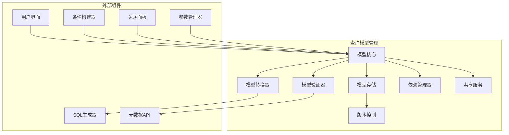
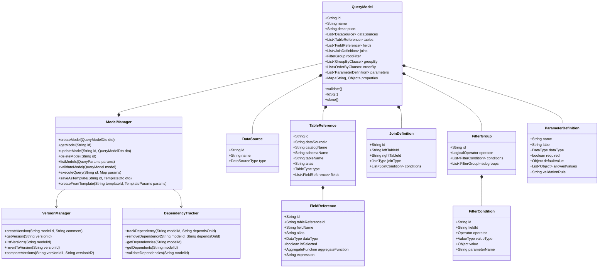
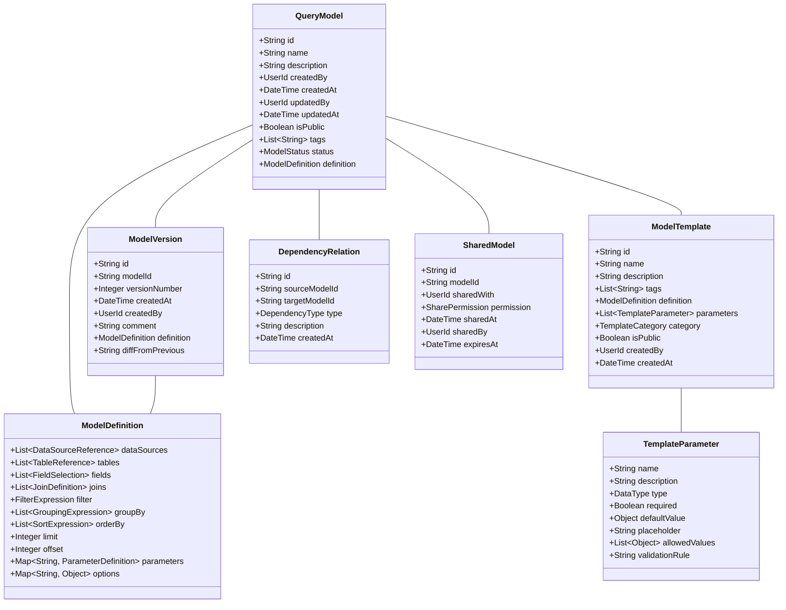
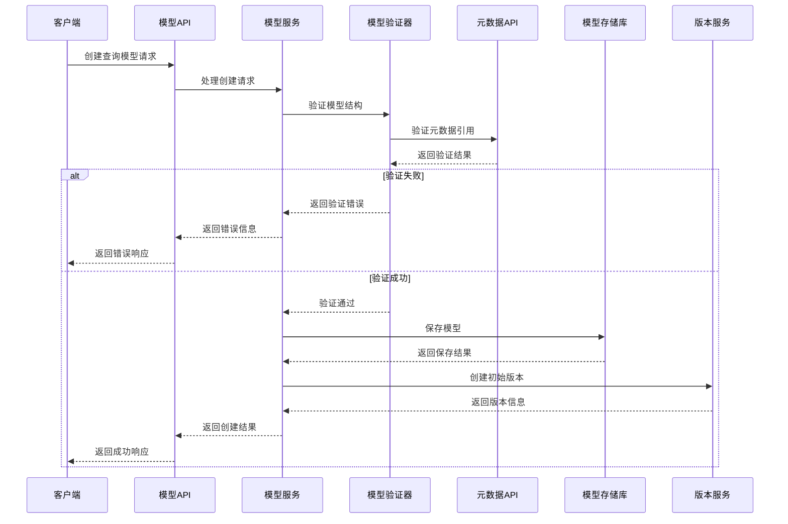
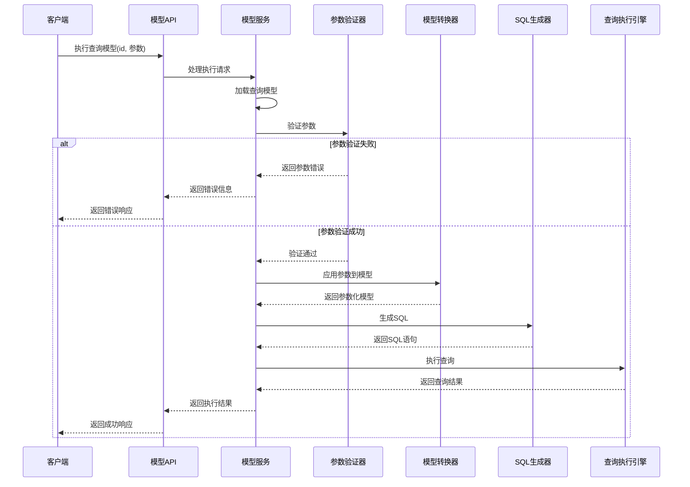
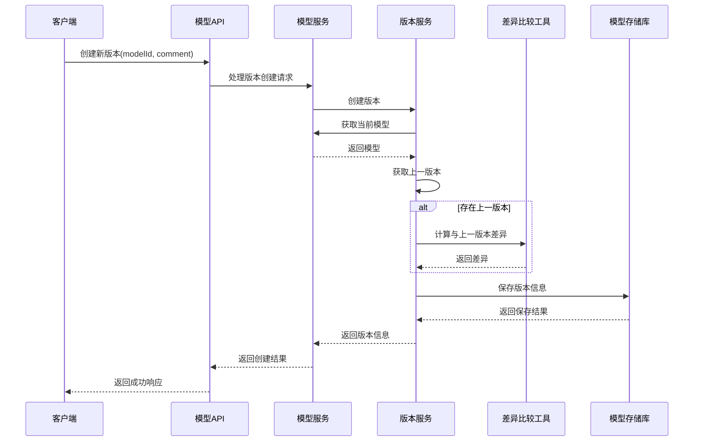
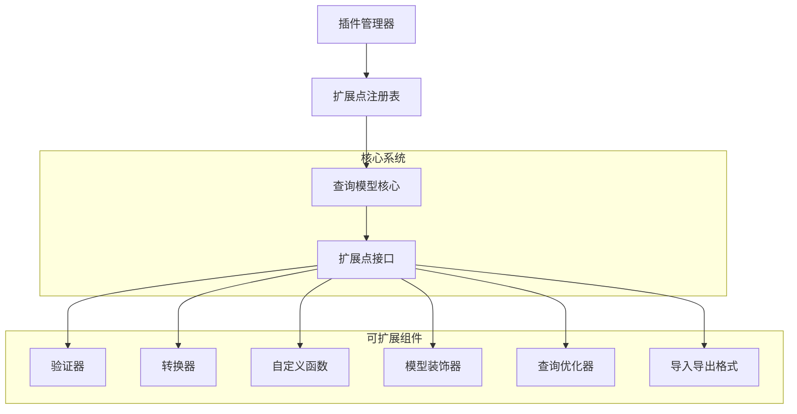

# 查询模型管理设计文档

## 1. 概述

### 1.1 目的
本文档详细描述查询模型管理组件的设计、架构和实现细节。查询模型是整个查询构建过程的核心数据模型，定义了查询的结构化表示，为可视化查询构建提供基础。

### 1.2 范围
本文档涵盖查询模型管理组件的核心功能、架构设计、接口定义、数据模型、处理流程、异常处理和扩展机制等方面。

### 1.3 组件定位
查询模型管理组件是查询构建模块的核心组件，负责查询模型的定义、存储、版本控制和共享。它将用户的可视化操作转换为结构化的查询模型，并支持模型的保存、加载、修改和重用，是连接用户界面和SQL生成器的桥梁。

## 2. 架构设计

### 2.1 组件架构

### 2.2 核心类设计

## 3. 功能详细设计

### 3.1 查询模型定义
- **查询模型核心结构**：定义包含数据源、表、字段、条件、关联等元素的完整查询模型
- **模型标识与元数据**：包含唯一标识、名称、描述、创建信息、标签等
- **查询组件表示**：定义表达查询各组件（选择字段、条件、关联、分组等）的标准结构
- **参数化支持**：在模型中集成参数定义和引用
- **表达式支持**：支持在模型中使用复杂表达式和计算字段

### 3.2 模型存储与版本控制
- **模型持久化**：支持将查询模型保存到数据库
- **版本历史**：记录模型的变更历史和版本信息
- **差异比较**：支持比较不同版本间的模型差异
- **回滚功能**：支持将模型回滚到之前的版本
- **变更注释**：支持为版本变更添加注释说明

### 3.3 模型模板与重用
- **模板定义**：支持将查询模型保存为可重用模板
- **参数化模板**：模板中的参数化设置
- **模板继承**：基于现有模板创建新模型
- **模板库管理**：组织和分类模板
- **模板版本控制**：管理模板的版本和兼容性

### 3.4 查询依赖管理
- **依赖关系跟踪**：识别和记录模型间的依赖关系
- **依赖分析**：分析依赖图和依赖链
- **影响分析**：评估变更对依赖模型的影响
- **依赖校验**：验证依赖的完整性和有效性
- **循环依赖检测**：发现和处理循环依赖问题

### 3.5 跨数据源查询支持
- **多数据源模型**：支持在单个查询模型中引用多个数据源
- **跨源关联**：定义跨不同数据源的表关联
- **数据源兼容性**：处理不同数据源间的类型和功能兼容性
- **联合查询模型**：支持UNION、INTERSECT等集合操作
- **查询拆分与合并**：处理需要拆分执行的跨源查询

### 3.6 模型验证与优化
- **结构验证**：验证模型结构的完整性和一致性
- **语义验证**：根据元数据验证查询的语义正确性
- **性能评估**：评估查询模型的潜在性能问题
- **优化建议**：生成查询优化建议
- **兼容性检查**：检查与目标数据源的兼容性

## 4. 接口设计

### 4.1 外部接口

| 接口名称 | 类型 | 用途 | 参数 | 返回值 | 异常 |
|---------|------|-----|------|-------|------|
| createQueryModel | REST/内部API | 创建新查询模型 | QueryModelDto | 创建的QueryModel | 验证失败, 数据源不存在 |
| getQueryModel | REST/内部API | 获取查询模型 | id: 模型ID | QueryModel | 模型不存在 |
| updateQueryModel | REST/内部API | 更新查询模型 | id: 模型ID, QueryModelDto | 更新后的QueryModel | 模型不存在, 验证失败 |
| deleteQueryModel | REST/内部API | 删除查询模型 | id: 模型ID | 删除结果 | 模型不存在, 存在依赖 |
| listQueryModels | REST/内部API | 获取查询模型列表 | 查询参数(分页、过滤) | QueryModel列表 | 参数无效 |
| executeQueryModel | REST/内部API | 执行查询模型 | id: 模型ID, params: 参数值 | 查询结果 | 模型不存在, 参数无效, 执行错误 |
| saveAsTemplate | REST/内部API | 将模型保存为模板 | id: 模型ID, 模板信息 | 创建的模板 | 模型不存在, 验证失败 |
| createFromTemplate | REST/内部API | 基于模板创建模型 | templateId: 模板ID, params: 参数 | 创建的QueryModel | 模板不存在, 参数无效 |
| getModelVersions | REST/内部API | 获取模型版本历史 | id: 模型ID | 版本列表 | 模型不存在 |
| revertToVersion | REST/内部API | 回滚到指定版本 | versionId: 版本ID | 回滚后的QueryModel | 版本不存在 |

### 4.2 内部接口

- **QueryModelService**：提供查询模型的核心管理功能
  - `createModel(QueryModelDto dto)`
  - `getModel(String id)`
  - `updateModel(String id, QueryModelDto dto)`
  - `deleteModel(String id)`
  - `listModels(QueryParams params)`
  - `validateModel(QueryModel model)`
  - `executeQuery(String id, Map<String, Object> params)`

- **VersionControlService**：管理查询模型的版本控制
  - `createVersion(String modelId, String comment)`
  - `getVersion(String versionId)`
  - `listVersions(String modelId)`
  - `revertToVersion(String versionId)`
  - `compareVersions(String versionId1, String versionId2)`

- **TemplateService**：管理查询模板
  - `createTemplate(String modelId, TemplateDto dto)`
  - `getTemplate(String templateId)`
  - `updateTemplate(String templateId, TemplateDto dto)`
  - `deleteTemplate(String templateId)`
  - `listTemplates(QueryParams params)`
  - `createModelFromTemplate(String templateId, Map<String, Object> params)`

- **DependencyService**：管理查询模型间的依赖关系
  - `addDependency(String modelId, String dependsOnId)`
  - `removeDependency(String modelId, String dependsOnId)`
  - `getDependencies(String modelId)`
  - `getDependents(String modelId)`
  - `checkCircularDependencies(String modelId)`
  - `validateDependencies(String modelId)`

### 4.3 数据模型

## 5. 处理流程

### 5.1 查询模型创建流程

### 5.2 查询模型执行流程

### 5.3 版本管理流程

## 6. 异常处理

### 6.1 异常类型
- **ModelNotFoundException**：查询模型不存在
- **ValidationException**：模型验证失败
- **DependencyException**：依赖关系问题
- **VersionNotFoundException**：版本不存在
- **CircularDependencyException**：循环依赖检测
- **ParameterException**：参数验证或绑定错误
- **ExecutionException**：查询执行过程中的错误
- **PermissionException**：权限不足
- **TemplateException**：模板操作相关错误

### 6.2 异常处理策略
- 所有API接口提供一致的错误响应格式
- 详细记录异常上下文和状态
- 对可恢复的异常实现自动重试机制
- 提供用户友好的错误信息
- 记录详细的错误日志用于诊断
- 实现事务管理确保数据一致性

### 6.3 错误码与描述
| 错误码 | 描述 | 解决方案 |
|------|------|--------|
| MODEL_001 | 查询模型不存在 | 检查模型ID是否正确 |
| MODEL_002 | 模型验证失败 | 检查模型结构和引用 |
| MODEL_003 | 模型依赖关系错误 | 检查依赖的模型 |
| MODEL_004 | 循环依赖检测 | 重新设计依赖关系 |
| MODEL_005 | 参数验证失败 | 检查参数类型和值 |
| MODEL_006 | 查询执行错误 | 查看详细错误日志 |
| MODEL_007 | 版本操作错误 | 检查版本ID和操作 |
| MODEL_008 | 模板操作错误 | 检查模板定义 |
| MODEL_009 | 权限不足 | 申请必要权限 |

## 7. 性能考量

### 7.1 性能指标
| 指标 | 目标值 | 测试方法 |
|-----|-------|---------|
| 模型加载时间 | <50ms | 性能测试 |
| 模型保存时间 | <100ms | 性能测试 |
| 简单查询生成时间 | <50ms | 性能测试 |
| 复杂查询生成时间 | <200ms | 性能测试 |
| 版本比较操作 | <100ms | 性能测试 |
| 并发模型操作 | 支持50+ | 负载测试 |

### 7.2 优化策略
- 实现模型缓存机制
- 使用索引优化模型查询
- 异步处理版本历史记录
- 优化模型序列化和反序列化
- 增量保存模型变更
- 并行处理复杂模型验证
- 预计算常用依赖分析结果

## 8. 安全考量

### 8.1 安全风险
- 未授权访问模型数据
- 敏感查询模型泄露
- 模型注入和篡改
- 执行权限提升
- 模型共享的安全风险

### 8.2 安全措施
- 基于角色的访问控制(RBAC)
- 模型操作审计日志
- 模型加密存储选项
- 敏感字段和条件的脱敏
- 共享模型的精细权限控制
- 模型验证防注入检查
- 执行权限与数据权限分离

## 9. 扩展性设计

### 9.1 扩展点
- **自定义验证规则**：支持自定义模型验证规则的插件机制
- **转换器扩展**：可扩展的模型转换框架
- **自定义函数支持**：在查询模型中支持自定义函数
- **模型装饰器**：允许动态增强模型功能
- **查询优化器插件**：可插拔的查询优化策略
- **模型导入/导出格式**：支持多种格式的导入导出

### 9.2 插件架构

### 9.3 版本兼容性策略
- 实现API版本控制
- 支持模型结构的向后兼容
- 模型迁移工具和API
- 弃用策略和过渡期支持
- 兼容性测试框架

## 10. 依赖关系

### 10.1 内部依赖
- **元数据管理模块**：提供表结构和关系信息
- **SQL生成器组件**：转换查询模型为SQL
- **参数管理器**：处理参数定义和绑定
- **查询执行引擎**：执行生成的查询
- **权限管理系统**：控制模型访问权限

### 10.2 外部依赖
- **持久化存储**：保存查询模型和版本历史
- **缓存系统**：缓存常用查询模型
- **用户认证系统**：用户身份验证
- **审计日志系统**：记录模型操作
- **通知系统**：模型变更通知

## 11. 测试策略

### 11.1 测试级别
- **单元测试**：测试核心组件和功能
- **集成测试**：测试组件间的交互
- **系统测试**：测试端到端流程
- **性能测试**：验证性能指标
- **安全测试**：验证安全措施有效性

### 11.2 测试场景
- 创建、读取、更新、删除查询模型
- 模型验证和错误处理
- 版本管理和回滚操作
- 依赖关系管理
- 模板创建和使用
- 权限控制和共享功能
- 复杂查询模型的处理
- 跨数据源查询模型
- 异常情况和边界条件

### 11.3 测试数据
- 样例查询模型库
- 模型验证测试集
- 性能测试模型集
- 兼容性测试数据

## 12. 部署考量

### 12.1 部署要求
- Java 17或更高版本
- 关系型数据库(PostgreSQL)
- 缓存系统(Redis)
- 足够的存储空间用于版本历史
- 适当的内存配置以支持模型缓存

### 12.2 配置项
- 数据库连接配置
- 缓存配置
- 版本历史保留策略
- 模型缓存策略
- 性能相关参数调整
- 日志级别配置
- 安全配置选项

## 13. 文档和样例

### 13.1 开发文档
- 组件API文档
- 集成指南
- 扩展开发指南
- 数据模型规范

### 13.2 用户指南
- 基本操作指南
- 高级功能教程
- 最佳实践建议
- 常见问题解答

### 13.3 示例
- 简单查询模型示例
- 复杂查询模型示例
- 参数化查询示例
- 模板使用示例
- 自定义扩展示例

## 14. 附录

### 14.1 术语表
- **查询模型**：查询的结构化表示
- **模型模板**：可重用的查询模型基础
- **版本控制**：管理模型变更历史
- **依赖关系**：模型间的引用关系
- **参数绑定**：将参数值应用到查询模型

### 14.2 参考文档
- 查询建模最佳实践
- SQL标准规范
- JSON Schema规范
- 版本控制系统设计模式