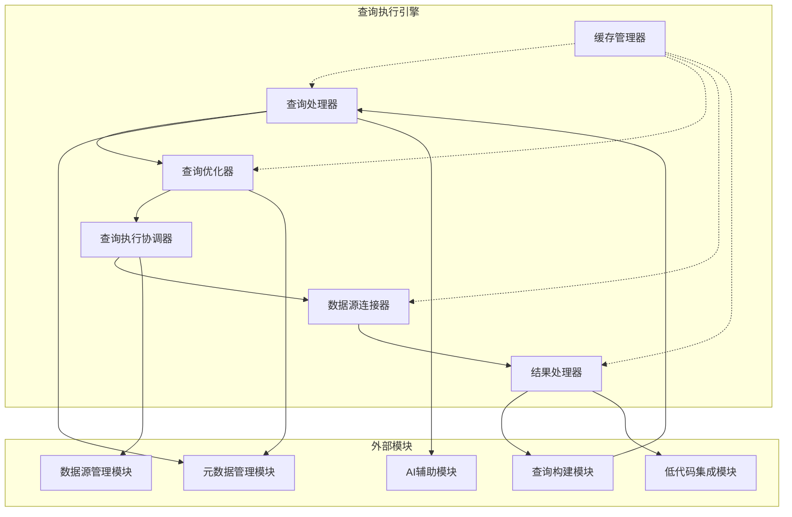
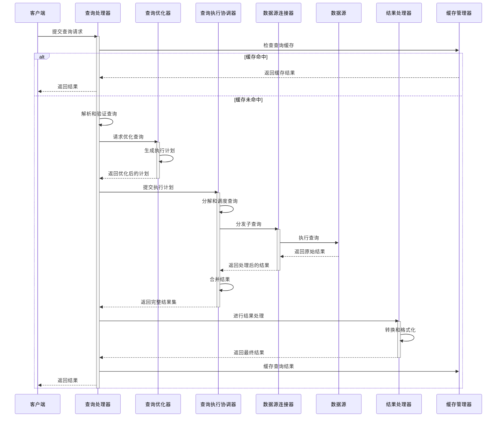

# 查询执行引擎概述

## 1. 模块简介

### 1.1 目的
查询执行引擎旨在提供高性能、可扩展的查询处理能力，负责接收、解析、优化和执行各种来源的查询请求，支持多种数据源类型，确保查询结果的准确性、一致性和及时性，同时优化资源利用和查询性能。

### 1.2 范围
查询执行引擎覆盖从接收查询到返回结果的全流程，包括查询解析、验证、优化、路由、执行、结果处理和缓存等核心功能，支持SQL、NoSQL和自定义查询语言，为用户提供统一的查询执行体验。

### 1.3 核心价值
- 提供统一的查询执行入口
- 智能优化查询执行计划
- 确保查询结果的一致性和准确性
- 最大化查询执行性能
- 管理和优化资源使用
- 支持跨数据源查询能力
- 提供实时和异步查询模式
- 确保查询执行的安全和合规

## 2. 核心功能

### 2.1 查询处理
- 查询解析和语法分析
- 语义验证和类型检查
- 查询重写和规范化
- 参数绑定和值处理
- 动态SQL生成和处理
- 批处理查询支持

### 2.2 查询优化
- 基于规则的查询重写
- 基于成本的执行计划选择
- 统计信息收集和利用
- 索引使用优化建议
- 分布式查询优化
- 子查询和连接优化

### 2.3 查询路由和执行
- 数据源选择和路由
- 查询拆分和分发
- 并行执行管理
- 事务管理和隔离级别
- 查询超时和中断处理
- 资源分配和限制

### 2.4 结果处理
- 结果集合并和转换
- 分页和流式处理
- 数据类型映射和转换
- 结果过滤和后处理
- 格式化输出和序列化
- 大结果集处理策略

### 2.5 缓存和性能优化
- 查询结果缓存
- 执行计划缓存
- 数据块缓存
- 预计算和物化视图
- 缓存失效策略
- 性能统计和分析

## 3. 核心组件

### 3.1 [查询处理器](./query-processor-design.md)
查询处理器负责接收、解析和验证查询请求，将原始查询转换为标准化的查询模型，并进行初步的语法和语义分析，为后续优化和执行做准备。

### 3.2 [查询优化器](./query-optimizer-design.md)
查询优化器基于查询模型、统计信息和优化规则，生成和评估多种可能的执行计划，选择最优计划，并应用各种优化技术提高查询性能。

### 3.3 [查询执行协调器](./query-executor-design.md)
查询执行协调器负责协调和管理查询执行过程，包括资源分配、并行度控制、执行进度监控、错误处理和结果收集等。

### 3.4 [数据源连接器](./datasource-connector-design.md)
数据源连接器提供与不同类型数据源交互的统一接口，负责建立连接、发送查询、接收结果，并处理数据源特定的语法和特性。

### 3.5 [结果处理器](./result-processor-design.md)
结果处理器负责对查询结果进行处理，包括类型转换、格式化、分页、排序、过滤和聚合，确保返回符合预期的结果集。

### 3.6 [缓存管理器](./cache-manager-design.md)
缓存管理器实现多级缓存策略，优化频繁查询和重复数据访问，提供缓存命中率监控、失效策略和内存管理。

## 4. 架构设计

### 4.1 模块架构

### 4.2 数据流

## 5. 关键技术

### 5.1 查询解析和处理
- SQL解析器技术
- 抽象语法树(AST)构建
- 语义分析算法
- 查询规范化技术
- 动态代码生成
- 参数化查询处理

### 5.2 查询优化
- 统计信息收集和管理
- 成本模型和评估
- 连接顺序优化
- 谓词下推
- 分区裁剪
- 并行执行规划

### 5.3 分布式查询执行
- 查询分解和重组
- 数据分片和路由
- 分布式事务协议
- 跨节点数据移动最小化
- 容错和恢复机制
- 负载均衡策略

### 5.4 缓存技术
- 多级缓存架构
- 缓存一致性协议
- 缓存替换算法
- 自适应缓存管理
- 分布式缓存协调
- 内存压缩技术

## 6. 与其他模块的关系

### 6.1 与查询构建模块的关系
- 接收结构化查询定义
- 提供查询验证反馈
- 返回执行结果和统计
- 共享执行计划和建议
- 提供查询预览功能

### 6.2 与数据源管理模块的关系
- 使用数据源连接信息
- 通过连接池获取连接
- 协调查询路由策略
- 处理数据源特定优化
- 共享数据源健康信息

### 6.3 与元数据管理模块的关系
- 获取表和字段信息
- 使用统计数据优化查询
- 验证查询中的对象引用
- 利用关系信息优化连接
- 共享查询模式分析结果

### 6.4 与AI辅助模块的关系
- 提供查询性能数据
- 接收查询优化建议
- 共享查询模式信息
- 支持自然语言查询转换
- 反馈执行结果用于学习

### 6.5 与低代码集成模块的关系
- 提供查询执行服务
- 支持结果格式化和转换
- 实现事件触发查询执行
- 处理动态参数绑定
- 提供异步查询状态更新

## 7. 技术选型与实现考量

### 7.1 查询解析和优化
- Apache Calcite (SQL解析和优化)
- ANTLR (语法解析)
- JSqlParser (SQL解析)
- Presto/Trino (分布式SQL引擎)
- Apache Spark SQL (大数据查询)

### 7.2 执行引擎
- JDBC/ODBC连接器
- HikariCP (连接池)
- Spring JDBC (数据访问)
- Reactor/RxJava (响应式处理)
- Netty (异步通信)

### 7.3 缓存和性能
- Caffeine (内存缓存)
- Redis (分布式缓存)
- Ehcache (多级缓存)
- Prometheus/Micrometer (性能监控)
- Apache Arrow (内存列式处理)

## 8. 安全与合规

### 8.1 查询安全
- SQL注入防护
- 查询复杂度限制
- 资源使用控制
- 敏感操作拦截
- 数据访问权限验证
- 行级安全过滤

### 8.2 数据保护
- 结果脱敏处理
- 敏感数据标记
- 数据使用审计
- 传输加密
- 合规标签处理
- 数据导出控制

### 8.3 审计与合规
- 查询执行日志
- 操作审计记录
- 错误和异常跟踪
- 性能和资源监控
- 合规性报告生成
- 查询来源跟踪

## 9. 扩展性设计

### 9.1 扩展点
- 自定义解析器插件
- 优化规则扩展
- 数据源适配器
- 结果转换处理器
- 缓存策略实现
- 监控指标收集器

### 9.2 适配策略
- 数据库方言适配
- 异构数据源集成
- 查询语言扩展
- 新数据类型支持
- 结果格式扩展
- 事务模型适配

## 10. 性能与可靠性

### 10.1 性能目标
- 简单查询响应 < 100ms
- 复杂查询平均响应 < 5s
- 缓存查询响应 < 10ms
- 每秒查询处理能力 > 1000
- 并发查询处理 > 500
- 大结果集分页延迟 < 200ms

### 10.2 可靠性保障
- 查询超时机制
- 资源隔离策略
- 熔断和限流控制
- 错误重试机制
- 部分失败处理
- 查询监控和告警

### 10.3 资源管理
- 动态资源分配
- 查询优先级队列
- 内存使用限制
- 长时间查询检测
- 连接池管理
- CPU使用率控制

## 11. 未来发展

### 11.1 短期路线图
- 增强跨数据源查询能力
- 改进查询优化器性能
- 扩展支持更多数据库方言
- 优化大结果集处理
- 增强缓存管理策略

### 11.2 长期规划
- AI驱动的自适应查询优化
- 实时流查询处理
- 混合事务/分析处理支持
- 向量和图查询支持
- 全联邦查询架构
- 端到端查询加密