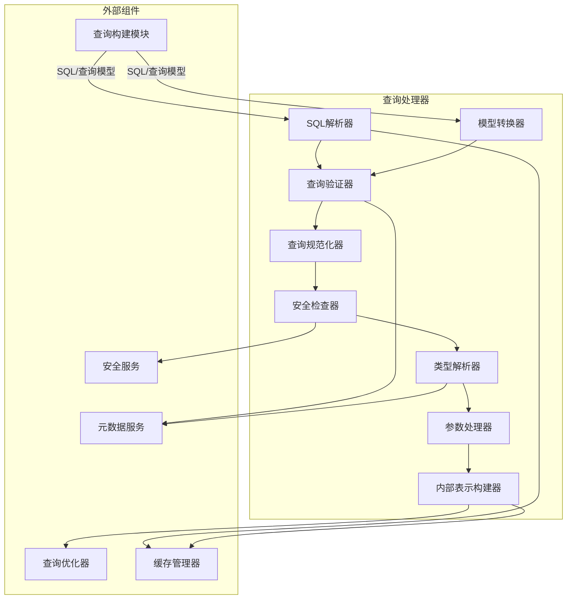
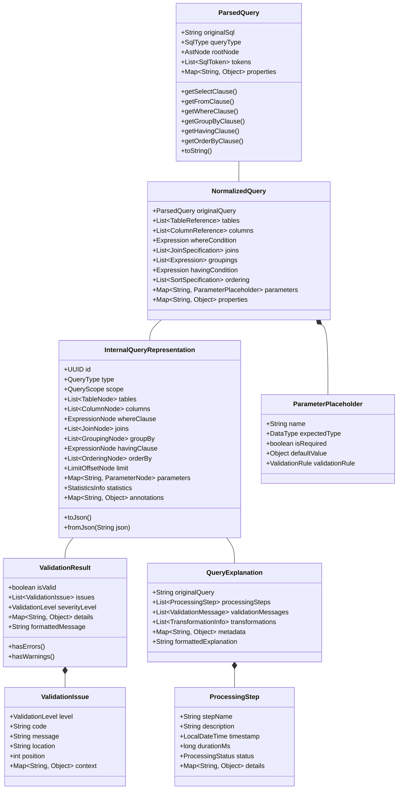
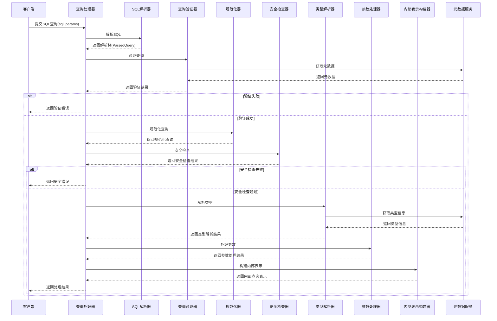
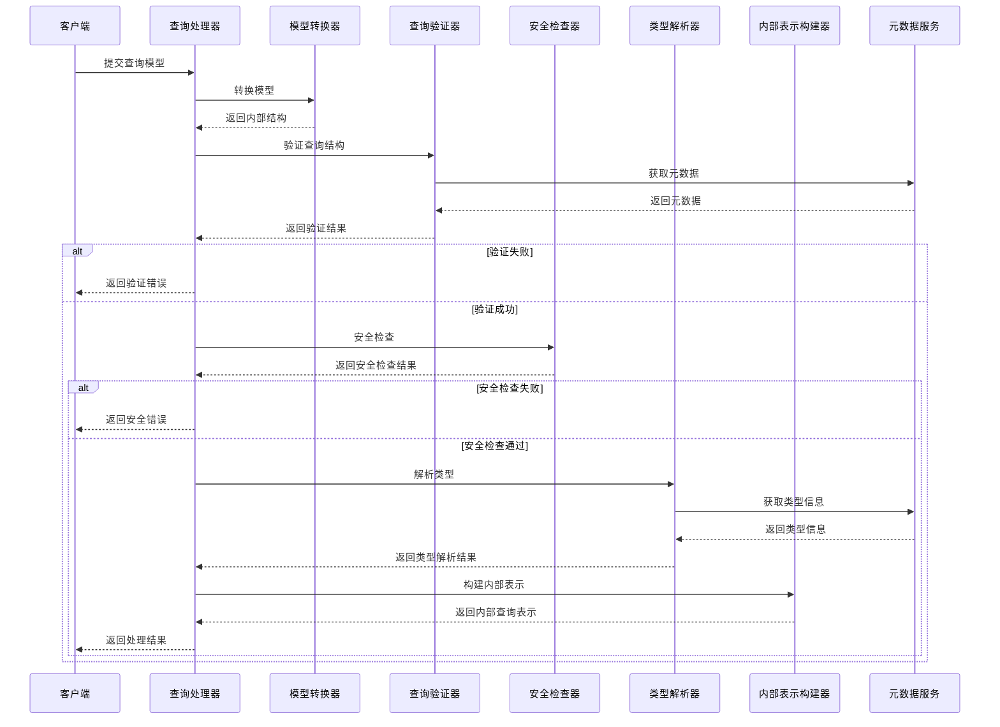
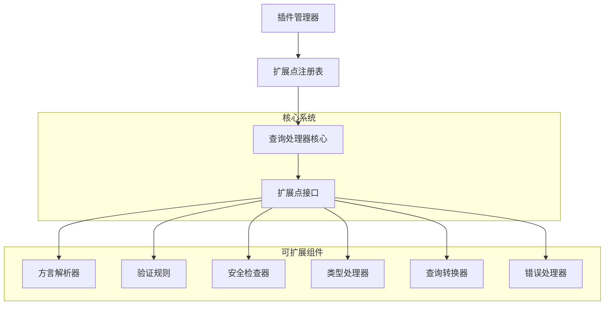

# 查询处理器设计文档

## 1. 概述

### 1.1 目的
本文档详细描述查询处理器组件的设计、架构和实现细节。查询处理器是查询执行引擎的入口组件，负责接收、解析、验证和转换查询请求，为后续的查询优化和执行奠定基础。

### 1.2 范围
本文档涵盖查询处理器的核心功能、架构设计、接口定义、数据模型、处理流程、异常处理和扩展机制等方面。

### 1.3 组件定位
查询处理器位于查询执行引擎的前端，承担着将SQL文本或查询模型转换为内部表示形式的关键任务。它是连接查询构建模块与查询执行引擎内部其他组件的桥梁，确保输入查询的正确性和安全性，并为后续的优化和执行环节提供标准化的查询表示。

## 2. 架构设计

### 2.1 组件架构


### 2.2 核心类设计

```mermaid
classDiagram
    class QueryProcessor {
        +processQuery(String sql, Map params)
        +processQueryModel(QueryModel model)
        +validateQuery(String sql)
        +parseQuery(String sql)
        +normalizeQuery(ParsedQuery query)
        +createInternalRepresentation(NormalizedQuery query)
    }
    
    class SqlParser {
        +parse(String sql)
        +parseDDL(String sql)
        +parseDML(String sql)
        +parseWithParams(String sql, Map params)
        +getAstRoot(ParsedQuery query)
    }
    
    class QueryValidator {
        +validate(ParsedQuery query)
        +validateSyntax(ParsedQuery query)
        +validateSemantics(ParsedQuery query)
        +validateObjects(ParsedQuery query)
        +validateFields(ParsedQuery query)
        +validateExpressions(ParsedQuery query)
        +validateDataTypes(ParsedQuery query)
    }
    
    class QueryNormalizer {
        +normalize(ParsedQuery query)
        +standardizeNames(ParsedQuery query)
        +expandWildcards(ParsedQuery query)
        +resolveAliases(ParsedQuery query)
        +simplifyExpressions(ParsedQuery query)
        +rewriteSubqueries(ParsedQuery query)
    }
    
    class SecurityChecker {
        +checkSecurity(NormalizedQuery query)
        +validatePermissions(NormalizedQuery query)
        +detectInjectionAttempts(NormalizedQuery query)
        +enforceRowLevelSecurity(NormalizedQuery query)
        +applyColumnMasks(NormalizedQuery query)
        +auditSensitiveAccess(NormalizedQuery query)
    }
    
    class TypeResolver {
        +resolveTypes(NormalizedQuery query)
        +inferExpressionTypes(Expression expr)
        +checkTypeCompatibility(Expression expr)
        +resolveImplicitCasts(Expression expr)
        +validateFunctionArgs(Function func)
    }
    
    class ParameterProcessor {
        +processParameters(NormalizedQuery query, Map params)
        +validateParameterTypes(Map params)
        +bindParameters(NormalizedQuery query, Map params)
        +resolveParameterDefaults(NormalizedQuery query)
        +expandParameterizedIn(NormalizedQuery query, Map params)
    }
    
    class ModelConverter {
        +convertToInternal(QueryModel model)
        +extractSelectList(QueryModel model)
        +extractConditions(QueryModel model)
        +extractJoins(QueryModel model)
        +extractGroupings(QueryModel model)
        +extractOrderings(QueryModel model)
    }
    
    class InternalQueryRepresentation {
        +QueryType type
        +List~TableReference~ tables
        +List~ColumnReference~ columns
        +Expression whereClause
        +List~JoinSpecification~ joins
        +List~Expression~ groupBy
        +Expression havingClause
        +List~OrderByElement~ orderBy
        +Integer limit
        +Integer offset
        +Map~String, ParameterValue~ parameters
        +Map~String, Object~ properties
    }
    
    QueryProcessor *-- SqlParser
    QueryProcessor *-- QueryValidator
    QueryProcessor *-- QueryNormalizer
    QueryProcessor *-- SecurityChecker
    QueryProcessor *-- TypeResolver
    QueryProcessor *-- ParameterProcessor
    QueryProcessor *-- ModelConverter
    QueryProcessor *-- InternalQueryRepresentation
```


## 3. 功能详细设计

### 3.1 SQL解析
- **语法分析**: 将SQL文本转换为语法树，识别SQL语句的类型和结构
- **词法分析**: 识别SQL中的标识符、关键字、操作符和字面量
- **AST构建**: 构建抽象语法树表示查询结构
- **语法错误处理**: 提供详细的语法错误信息和位置
- **注释处理**: 正确处理SQL中的注释信息
- **多语句处理**: 支持批处理中的多条SQL语句解析
- **方言适配**: 支持不同数据库方言的SQL解析

### 3.2 查询验证
- **语法验证**: 确保查询遵循SQL语法规则
- **语义验证**: 检查查询的语义完整性和一致性
- **对象存在性验证**: 验证查询引用的表和视图存在
- **字段验证**: 确保查询使用的字段存在且访问合法
- **表达式验证**: 验证条件表达式、函数调用和运算符使用的正确性
- **数据类型验证**: 检查表达式中的类型兼容性
- **权限验证**: 确保用户有权执行请求的查询
- **依赖性验证**: 检查子查询和视图的依赖关系

### 3.3 查询规范化
- **名称标准化**: 统一表名、字段名的大小写和格式
- **通配符展开**: 将SELECT *展开为具体的字段列表
- **别名解析**: 解析和标准化表别名和字段别名
- **表达式简化**: 简化和规范化WHERE条件和其他表达式
- **子查询重写**: 在可能的情况下重写和简化子查询
- **视图展开**: 选择性地展开视图定义
- **条件标准化**: 将条件表达式转换为标准形式
- **JOIN语法标准化**: 统一不同形式的JOIN语法

### 3.4 安全检查
- **SQL注入检测**: 检测和防止SQL注入攻击
- **权限验证**: 验证用户对查询涉及对象的访问权限
- **敏感操作审计**: 记录敏感数据访问和高风险操作
- **行级安全策略应用**: 应用行级安全策略过滤数据
- **列级安全策略应用**: 实施列级访问控制和数据脱敏
- **查询复杂度控制**: 限制过于复杂或资源密集型的查询
- **黑名单操作检查**: 检测和阻止禁止的操作类型

### 3.5 类型解析
- **字段类型解析**: 从元数据中获取并解析字段类型
- **表达式类型推断**: 推断复杂表达式的结果类型
- **类型兼容性检查**: 确保操作数类型兼容
- **隐式类型转换**: 添加必要的类型转换操作
- **函数参数类型检查**: 验证函数调用的参数类型
- **聚合函数类型处理**: 处理聚合函数的特殊类型规则
- **自定义类型支持**: 支持用户定义类型的解析和检查

### 3.6 参数处理
- **参数绑定**: 将外部参数值绑定到查询中的参数占位符
- **参数类型验证**: 验证参数值类型与期望类型匹配
- **默认值处理**: 为未提供的可选参数应用默认值
- **参数转换**: 在必要时转换参数值类型
- **动态IN子句处理**: 支持动态生成的IN子句参数列表
- **参数安全检查**: 检查参数值中的潜在安全风险
- **参数值规范化**: 统一参数值的格式和表示

### 3.7 查询模型转换
- **模型解析**: 解析查询模型结构
- **SQL生成**: 根据需要从模型生成SQL
- **内部表示转换**: 直接将模型转换为内部查询表示
- **模型验证**: 验证查询模型的完整性和一致性
- **模型与SQL的互转**: 支持模型到SQL、SQL到模型的双向转换
- **参数映射**: 处理模型中的参数定义和引用
- **自定义属性处理**: 处理模型中的扩展属性和标记

### 3.8 内部表示构建
- **统一查询表示**: 构建统一的内部查询表示形式
- **元数据关联**: 关联查询元素与系统元数据
- **执行提示生成**: 生成查询执行的优化提示
- **计划生成准备**: 为执行计划生成准备必要信息
- **序列化支持**: 支持内部表示的序列化和反序列化
- **缓存支持**: 支持内部表示的缓存和重用
- **调试信息**: 保留用于调试的源信息和转换过程

## 4. 接口设计

### 4.1 外部接口

| 接口名称 | 类型 | 用途 | 参数 | 返回值 | 异常 |
|---------|------|-----|------|-------|------|
| processQuery | REST/内部API | 处理SQL查询 | sql: SQL文本, params: 参数Map | 处理结果和内部表示 | 语法错误, 语义错误, 安全违规 |
| processQueryModel | REST/内部API | 处理查询模型 | model: 查询模型对象 | 处理结果和内部表示 | 模型错误, 验证失败 |
| validateQuery | REST/内部API | 验证SQL查询 | sql: SQL文本 | 验证结果 | 语法错误, 语义错误 |
| parseQuery | REST/内部API | 解析SQL查询 | sql: SQL文本 | 解析树 | 语法错误 |
| explainQuery | REST/内部API | 解释查询处理 | sql: SQL文本/model: 查询模型 | 处理说明 | 解析错误 |
| formatQuery | REST/内部API | 格式化SQL | sql: SQL文本 | 格式化的SQL | 语法错误 |

### 4.2 内部接口

```java
// 查询处理器服务接口
public interface QueryProcessorService {
    // 处理SQL查询，返回内部表示
    InternalQueryRepresentation processQuery(String sql, Map<String, Object> parameters) 
        throws QueryProcessingException;
    
    // 处理查询模型，返回内部表示
    InternalQueryRepresentation processQueryModel(QueryModel model) 
        throws QueryProcessingException;
    
    // 验证SQL查询，返回验证结果
    ValidationResult validateQuery(String sql) 
        throws QuerySyntaxException;
    
    // 解析SQL查询，返回解析树
    ParsedQuery parseQuery(String sql) 
        throws QuerySyntaxException;
    
    // 将查询重写为规范形式
    String rewriteQuery(String sql) 
        throws QuerySyntaxException;
    
    // 获取查询处理的详细解释
    QueryExplanation explainQueryProcessing(String sql) 
        throws QueryProcessingException;
}

// SQL解析器接口
public interface SqlParser {
    // 解析SQL文本
    ParsedQuery parse(String sql) throws QuerySyntaxException;
    
    // 解析带参数的SQL
    ParsedQuery parseWithParameters(String sql, Map<String, Object> parameters) 
        throws QuerySyntaxException;
    
    // 解析特定类型的SQL
    ParsedQuery parseByType(String sql, SqlType type) 
        throws QuerySyntaxException;
    
    // 获取语法树
    AstNode getAstRoot(ParsedQuery query);
    
    // 格式化SQL
    String format(String sql) throws QuerySyntaxException;
}

// 查询验证器接口
public interface QueryValidator {
    // 验证已解析的查询
    ValidationResult validate(ParsedQuery query);
    
    // 验证查询语法
    SyntaxValidationResult validateSyntax(ParsedQuery query);
    
    // 验证查询语义
    SemanticValidationResult validateSemantics(ParsedQuery query);
    
    // 验证对象引用
    ObjectValidationResult validateObjects(ParsedQuery query);
    
    // 验证查询表达式
    ExpressionValidationResult validateExpressions(ParsedQuery query);
}
```

### 4.3 数据模型



## 5. 处理流程

### 5.1 SQL查询处理流程



### 5.2 查询模型处理流程



## 6. 异常处理

### 6.1 异常类型
- **QuerySyntaxException**: SQL语法错误
- **QuerySemanticException**: 查询语义错误
- **ObjectNotFoundException**: 引用对象不存在
- **FieldNotFoundException**: 引用字段不存在
- **TypeMismatchException**: 类型不匹配错误
- **ParameterBindingException**: 参数绑定错误
- **SecurityViolationException**: 安全策略违规
- **ValidationException**: 查询验证失败
- **UnsupportedFeatureException**: 不支持的特性

### 6.2 异常处理策略
- **详细错误信息**: 提供准确的错误位置和上下文
- **多级严重性**: 区分错误、警告和信息
- **建议修复**: 为常见错误提供修复建议
- **语法高亮**: 在错误报告中高亮问题部分
- **分类错误代码**: 使用分类错误代码便于诊断
- **上下文保留**: 保留错误发生时的查询上下文
- **审计日志**: 记录严重错误和安全违规

### 6.3 错误码与描述
| 错误码 | 描述 | 解决方案 |
|------|------|--------|
| SYNTAX-001 | SQL语法错误 | 检查SQL语法，特别是错误位置附近 |
| SYNTAX-002 | 不匹配的括号或引号 | 确保所有括号和引号正确配对 |
| SEM-001 | 引用的表不存在 | 检查表名和模式名 |
| SEM-002 | 引用的字段不存在 | 检查字段名和表别名 |
| SEM-003 | 字段引用不明确 | 使用表别名限定字段名 |
| TYPE-001 | 类型不兼容 | 检查表达式中的数据类型 |
| TYPE-002 | 函数参数类型错误 | 检查函数参数的数据类型 |
| PARAM-001 | 缺少必需参数 | 提供所有必需的参数值 |
| PARAM-002 | 参数类型不匹配 | 检查参数类型与期望类型 |
| SEC-001 | 无表访问权限 | 申请必要的表访问权限 |
| SEC-002 | SQL注入检测 | 使用参数化查询代替字符串拼接 |

## 7. 性能考量

### 7.1 性能指标
| 指标 | 目标值 | 测试方法 |
|-----|-------|---------|
| 简单SQL解析时间 | <5ms | 性能测试 |
| 复杂SQL解析时间 | <20ms | 性能测试 |
| 查询验证时间 | <30ms | 性能测试 |
| 参数处理时间 | <10ms | 性能测试 |
| 内部表示构建 | <15ms | 性能测试 |
| 内存占用 | <50MB/查询 | 内存分析 |
| 并发处理能力 | >1000查询/秒 | 负载测试 |

### 7.2 优化策略
- **解析树缓存**: 缓存常用查询的解析树
- **批量元数据加载**: 一次加载查询相关的所有元数据
- **预编译常用查询**: 支持预编译和参数化
- **惰性验证**: 按需执行验证步骤
- **并行验证**: 并行处理独立的验证任务
- **内存池优化**: 使用对象池减少GC压力
- **查询特征识别**: 快速识别查询特征以优化处理路径
- **自适应处理**: 根据查询复杂度调整处理策略

## 8. 安全考量

### 8.1 安全风险
- **SQL注入攻击**: 通过查询参数或动态SQL注入恶意代码
- **权限提升**: 试图访问无权限数据或执行无权限操作
- **敏感数据泄露**: 查询返回敏感或受限数据
- **资源耗尽攻击**: 提交极其复杂的查询消耗系统资源
- **元数据探测**: 利用错误消息推断系统结构
- **批量数据窃取**: 尝试批量提取数据
- **历史查询攻击**: 利用缓存查询获取数据

### 8.2 安全措施
- **参数化查询强制**: 强制使用参数化查询防止SQL注入
- **输入验证**: 严格验证所有查询输入
- **语法树检查**: 分析语法树识别危险模式
- **权限细粒度检查**: 实施字段级和行级安全检查
- **查询复杂度限制**: 限制查询的复杂度和资源使用
- **错误信息过滤**: 避免在错误消息中泄露敏感信息
- **查询审计日志**: 记录敏感操作和可疑查询
- **安全扫描**: 主动扫描查询中的安全问题

## 9. 扩展性设计

### 9.1 扩展点
- **自定义解析器**: 支持扩展SQL方言解析器
- **验证规则插件**: 可插拔的自定义验证规则
- **安全检查扩展**: 自定义安全检查和策略
- **类型处理器**: 扩展支持自定义数据类型
- **查询转换器**: 添加自定义查询转换规则
- **错误处理扩展**: 自定义错误处理和报告
- **元数据提供器**: 支持不同来源的元数据

### 9.2 插件架构


### 9.3 配置扩展性
- **基于配置的特性开关**: 通过配置启用/禁用处理器特性
- **可配置的处理流程**: 自定义处理步骤和顺序
- **处理策略配置**: 配置不同类型查询的处理策略
- **错误处理策略**: 配置错误处理和报告策略
- **性能调优参数**: 配置缓存大小、并行度等参数
- **安全策略配置**: 配置安全检查的严格程度

## 10. 依赖关系

### 10.1 内部依赖
- **元数据管理模块**: 提供表结构和字段信息
- **安全管理组件**: 提供权限检查和安全策略
- **缓存管理器**: 提供查询解析结果缓存
- **查询优化器**: 接收处理结果进行优化
- **执行计划生成器**: 使用内部表示生成执行计划

### 10.2 外部依赖
- **语法解析器库**: ANTLR或JavaCC用于SQL解析
- **表达式计算引擎**: 评估复杂表达式
- **类型转换系统**: 处理数据类型转换
- **JSON处理库**: 处理JSON格式数据
- **日志和监控系统**: 记录处理过程和性能

## 11. 测试策略

### 11.1 测试级别
- **单元测试**: 测试各组件的独立功能
- **集成测试**: 测试组件间的交互
- **系统测试**: 测试完整的查询处理流程
- **性能测试**: 验证性能指标
- **安全测试**: 验证安全措施有效性

### 11.2 测试场景
- **SQL语法变体**: 测试各种SQL语法形式
- **错误处理**: 测试各类错误情况的处理
- **边界条件**: 测试极限情况下的行为
- **参数绑定**: 测试各种参数绑定场景
- **并发处理**: 测试并发查询处理
- **安全检查**: 测试安全策略的执行
- **复杂查询**: 测试复杂查询的处理能力

### 11.3 测试工具
- **SQL测试套件**: 预定义的SQL测试集
- **模糊测试**: 自动生成的随机SQL测试
- **性能基准测试**: 标准性能测试工具
- **内存分析器**: 跟踪内存使用情况
- **代码覆盖工具**: 评估测试覆盖率
- **安全扫描工具**: 检测安全漏洞

## 12. 部署考量

### 12.1 部署要求
- **Java 17或更高版本**
- **最小4GB RAM，推荐8GB以上**
- **多核CPU以支持并行处理**
- **数据库系统用于元数据存储**
- **缓存系统用于解析树缓存**

### 12.2 配置项
- **解析器配置**: SQL方言、语法特性等
- **验证规则配置**: 启用/禁用特定验证规则
- **安全策略配置**: 安全检查级别和策略
- **性能配置**: 缓存大小、并行度等
- **错误处理配置**: 错误报告详细程度
- **审计日志配置**: 日志记录级别和内容

### 12.3 监控指标
- **查询处理时间**: 各处理阶段的耗时
- **错误率**: 不同类型错误的发生率
- **资源使用**: 内存和CPU使用情况
- **缓存命中率**: 解析树缓存的命中率
- **并发处理量**: 同时处理的查询数
- **阻塞/等待时间**: 处理过程中的阻塞时间

## 13. 文档和示例

### 13.1 开发文档
- **API文档**: 详细的接口文档
- **架构指南**: 处理器内部架构说明
- **扩展开发指南**: 扩展点开发说明
- **安全指南**: 查询处理安全建议

### 13.2 用户指南
- **SQL支持说明**: 支持的SQL语法和特性
- **错误排查指南**: 常见错误解决方法
- **最佳实践**: 查询编写最佳实践
- **性能优化指南**: 提高查询处理性能的建议

### 13.3 示例
- **基本查询示例**: 常见查询处理示例
- **高级查询示例**: 复杂查询处理示例
- **错误处理示例**: 常见错误处理示例
- **扩展开发示例**: 扩展点使用示例

## 14. 附录

### 14.1 术语表
- **AST**: 抽象语法树，表示SQL的结构
- **查询解析**: 将SQL文本转换为结构化表示
- **查询规范化**: 将查询转换为标准形式
- **内部查询表示**: 系统内部使用的查询模型
- **参数绑定**: 将参数值应用到查询中

### 14.2 参考文档
- SQL标准规范
- 数据库方言参考
- 查询处理最佳实践
- 安全编码指南
- 性能优化手册